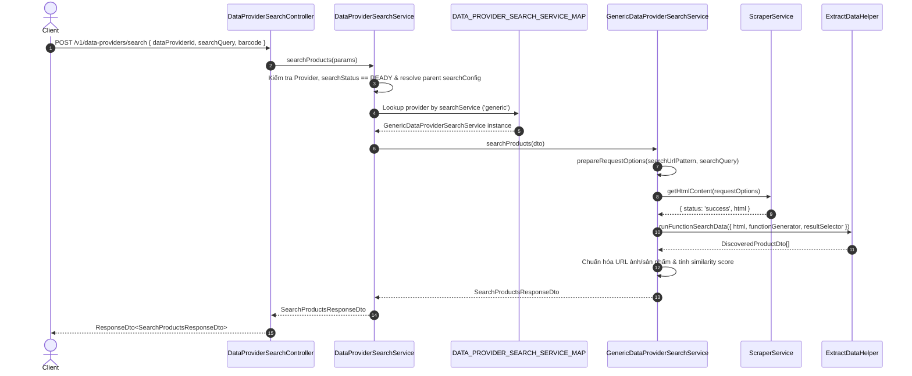

# Implementation Plan - Tính năng Data Provider Search

Tài liệu này chi tiết hóa phương án triển khai tính năng Tìm kiếm Sản phẩm (Search Products) cho `@only-one-be` trong module `data-provider`, dựa trên tham chiếu thiết kế từ dự án `orien-trade-backend`.

## Section 1. Current state

### Hiện trạng thực thi

1. **Thực thể DataProvider (`DataProviderEntity`)**:
   - Đã có các trường dữ liệu phục vụ tìm kiếm: `searchService` (mặc định `'generic'`), `searchStatus` (mặc định `UNCONFIGURED`), `searchConfig` (kiểu `ISearchConfig`) và mối quan hệ cha-con (`parentId`/`parent`).
   - Tham chiếu: [data-provider.entity.ts](file:///d:/Sources/Personal/only-one-be/src/modules/data-provider/entities/data-provider.entity.ts#L36-L58)

2. **Interface Cấu hình Tìm kiếm (`ISearchConfig`)**:
   - Đã khai báo interface `ISearchConfig` trong [search-config.interface.ts](file:///d:/Sources/Personal/only-one-be/src/modules/data-provider/interfaces/search-config.interface.ts#L1-L22) với các tham số: `searchUrlPattern`, `queryPlaceholder`, `mainContentSelector`, `resultSelector`, `maxResults`, `useBrowser`, `functionGenerator`, `isGetParentElement`, `enableBarcodeSearch`.

3. **Cơ chế Scraper & ExtractData**:
   - `ScraperService` ([scraper.service.ts](file:///d:/Sources/Personal/only-one-be/src/modules/data-provider/services/scraper.service.ts)) hỗ trợ lấy HTML content từ URL.
   - `ExtractDataHelper` ([extract-data.helper.ts](file:///d:/Sources/Personal/only-one-be/src/modules/data-provider/helpers/extract-data.helper.ts)) mới chỉ có các method trích xuất dữ liệu chi tiết sản phẩm (`runFunctionExtractData`, `runApiFunctionExtractData`), **chưa có** method chạy hàm tìm kiếm sản phẩm `runFunctionSearchData`.

4. **Thiếu hụt**:
   - Chưa có `DataProviderSearchService` điều phối tìm kiếm.
   - Chưa có `GenericDataProviderSearchService` thực thi logic cào trang kết quả tìm kiếm và trích xuất danh sách sản phẩm.
   - Chưa có `DATA_PROVIDER_SEARCH_SERVICE_MAP` để đăng ký động các Search Service (Generic, Amazon, v.v.).
   - Chưa có các DTO và Controller Endpoints phục vụ API cào kết quả tìm kiếm (`searchProducts`), test cấu hình tìm kiếm (`testSearchFunction`), và cập nhật `searchConfig`.

---

## Section 2. Design

### Các phương án triển khai

#### Phương án 1 (Recommended): Kiến trúc Strategy Pattern kết hợp Dynamic Injection Map
- **Cách hoạt động**:
  - Tạo `IDataProviderSearchService` interface định nghĩa các contract `searchProducts`, `validateSearchConfiguration`, `getSearchResults`, `prepareRequestOptions`, `filterSearchResults`.
  - Triển khai `GenericDataProviderSearchService` trong thư mục `src/modules/data-provider/services/data-provider-search/` cho tìm kiếm qua HTML/Cheerio/Dynamic Function.
  - Sử dụng Token Provider `DATA_PROVIDER_SEARCH_SERVICE_MAP` trong `DataProviderModule` để map tên service (`generic`, `amazon`, ...) tới instance tương ứng.
  - `DataProviderSearchService` đóng vai trò Facade/Dispatcher kiểm tra trạng thái `READY`, fallback cấu hình từ `parent` nếu là child provider, và gọi đúng Search Service.
- **Ưu điểm**:
  - Tuân thủ nguyên lý Single Responsibility & Open/Closed Principle.
  - Dễ dàng mở rộng thêm các Search Engine mới (ví dụ Amazon Search, Serper Search, API Search) trong tương lai nằm trong thư mục `data-provider-search/`.
  - Khớp với kiến trúc mô-đun của hệ thống.
- **Nhược điểm**: Cần tạo mới nhiều file interface, dto, service.
- **Đánh giá rủi ro**: Rất thấp, không ảnh hưởng đến các API cào dữ liệu chi tiết hiện có.

#### Phương án 2: Tích hợp trực tiếp logic Search vào `DataProviderScraperService`
- **Cách hoạt động**: Viết trực tiếp logic search trong `DataProviderScraperService` hoặc `DataProviderService`.
- **Ưu điểm**: Tạo ít file mới hơn.
- **Nhược điểm**: Vi phạm Single Responsibility Principle, làm file `DataProviderService` phình to, khó mở rộng khi cần hỗ trợ provider đặc thù như Amazon/API search.

### Lựa chọn đề xuất
Ưu tiên chọn **Phương án 1** vì giữ cho codebase sạch sẽ, phân tách rõ ràng trách nhiệm, nhóm các search service cụ thể vào thư mục `services/data-provider-search/`.

---

## Section 3. Implementation architecture

### Cấu trúc thư mục & các file thay đổi

```text
src/modules/data-provider/
├── constants/
│   ├── [MODIFY] index.ts
│   └── [NEW] data-provider-search-service-map.ts
├── controllers/
│   ├── [MODIFY] data-provider.controller.ts
│   ├── [MODIFY] parser.controller.ts
│   └── [NEW] data-provider-search.controller.ts
├── dtos/
│   ├── requests/
│   │   ├── [MODIFY] index.ts
│   │   └── [NEW] search-products-request.dto.ts
│   └── responses/
│       ├── [MODIFY] index.ts
│       └── [NEW] search-products-response.dto.ts
├── helpers/
│   └── [MODIFY] extract-data.helper.ts
├── interfaces/
│   ├── [MODIFY] index.ts
│   └── [NEW] data-provider-search-service.interface.ts
├── services/
│   ├── data-provider-search/
│   │   └── [NEW] generic-data-provider-search.service.ts
│   ├── [MODIFY] data-provider.service.ts
│   └── [NEW] data-provider-search.service.ts
└── [MODIFY] data-provider.module.ts
```

### Luồng dữ liệu (Data Flow)



---

## Section 4. Implementation code examples

#### [NEW] `src/modules/data-provider/constants/data-provider-search-service-map.ts`

**Overview:** Định nghĩa token injection và key map cho các service tìm kiếm.

**Symbols:** `DATA_PROVIDER_SEARCH_SERVICE_MAP`, `DATA_PROVIDER_SEARCH_SERVICE_MAP_KEY`

```ts
export const DATA_PROVIDER_SEARCH_SERVICE_MAP = 'DataProviderSearchServiceMap';

export const DATA_PROVIDER_SEARCH_SERVICE_MAP_KEY = {
    GENERIC: 'generic',
    AMAZON: 'amazon',
} as const;
```

---

#### [NEW] `src/modules/data-provider/dtos/responses/search-products-response.dto.ts`

**Overview:** Định nghĩa DTO phản hồi cho kết quả tìm kiếm sản phẩm và kết quả kiểm thử cấu hình tìm kiếm.

**Symbols:** `DiscoveredProductDto`, `SearchProductsResponseDto`, `ValidateSearchConfigurationResponseDto`, `ExtractSearchResultsResponse`

```ts
import { ApiProperty, ApiPropertyOptional } from '@nestjs/swagger';
import { IScraperRequest } from '../../interfaces/scraper.interface';

export class DiscoveredProductDto {
    @ApiProperty({ description: 'URL sản phẩm' })
    url: string;

    @ApiProperty({ description: 'Tiêu đề sản phẩm' })
    title: string;

    @ApiProperty({ description: 'Độ tin cậy khớp tên (0-1)' })
    confidence: number;

    @ApiPropertyOptional({ description: 'Giá sản phẩm' })
    price?: string;

    @ApiPropertyOptional({ description: 'Đơn vị tiền tệ' })
    currency?: string;

    @ApiPropertyOptional({ description: 'URL hình ảnh' })
    imageUrl?: string;

    @ApiPropertyOptional({ description: 'URL tương đối' })
    relativeUrl?: string;

    constructor(data?: Partial<DiscoveredProductDto>) {
        if (data) Object.assign(this, data);
    }
}

export class SearchProductsResponseDto {
    @ApiProperty() searchQuery: string;
    @ApiProperty() dataProviderId: string;
    @ApiProperty() status: 'success' | 'error';
    @ApiPropertyOptional() html?: string;
    @ApiPropertyOptional() searchUrl?: string;
    @ApiPropertyOptional() totalResults?: number;
    @ApiPropertyOptional() executionTime?: number;
    @ApiPropertyOptional() request?: IScraperRequest;
    @ApiPropertyOptional({ type: [DiscoveredProductDto] }) discoveredProducts?: DiscoveredProductDto[];
    @ApiPropertyOptional() error?: string;

    constructor(data?: Partial<SearchProductsResponseDto>) {
        if (data) Object.assign(this, data);
    }
}

export class ValidateSearchConfigurationResponseDto {
    @ApiProperty() status: 'success' | 'error';
    @ApiPropertyOptional() resultCount?: number;
    @ApiPropertyOptional() executionTime?: number;
    @ApiPropertyOptional({ type: [DiscoveredProductDto] }) sampleResults?: DiscoveredProductDto[];
    @ApiPropertyOptional() error?: string;

    constructor(data?: Partial<ValidateSearchConfigurationResponseDto>) {
        if (data) Object.assign(this, data);
    }
}

export class ExtractSearchResultsResponse {
    html?: string;
    error?: string;
    discoveredProducts?: DiscoveredProductDto[];

    constructor(data?: Partial<ExtractSearchResultsResponse>) {
        if (data) Object.assign(this, data);
    }
}
```

---

#### [NEW] `src/modules/data-provider/dtos/requests/search-products-request.dto.ts`

**Overview:** DTO nhận request cho các thao tác tìm kiếm, test cấu hình search và cập nhật search config.

**Symbols:** `SearchProductsRequestDto`, `TestSearchFunctionRequestDto`, `UpdateSearchConfigRequestDto`

```ts
import { ApiProperty, ApiPropertyOptional } from '@nestjs/swagger';
import { IsBoolean, IsNotEmpty, IsObject, IsOptional, IsString, IsUUID } from 'class-validator';
import { ISearchConfig, SearchOptions } from '../../interfaces/search-config.interface';

export class SearchProductsRequestDto {
    @ApiProperty({ description: 'ID của Data Provider' })
    @IsUUID()
    @IsNotEmpty()
    dataProviderId: string;

    @ApiProperty({ description: 'Từ khóa tìm kiếm' })
    @IsString()
    @IsNotEmpty()
    searchQuery: string;

    @ApiPropertyOptional({ description: 'Mã vạch sản phẩm (nếu có)' })
    @IsString()
    @IsOptional()
    barcode?: string;

    @ApiPropertyOptional({ description: 'Tùy chọn tìm kiếm' })
    @IsObject()
    @IsOptional()
    options?: SearchOptions;
}

export class TestSearchFunctionRequestDto {
    @ApiProperty({ description: 'Tên service search (ví dụ: generic)' })
    @IsString()
    @IsNotEmpty()
    searchService: string;

    @ApiProperty({ description: 'Base URL' })
    @IsString()
    @IsNotEmpty()
    baseUrl: string;

    @ApiProperty({ description: 'Từ khóa tìm kiếm mẫu' })
    @IsString()
    @IsNotEmpty()
    searchQuery: string;

    @ApiProperty({ description: 'Cấu hình search' })
    @IsObject()
    @IsNotEmpty()
    searchConfig: ISearchConfig;
}

export class UpdateSearchConfigRequestDto {
    @ApiProperty({ description: 'Cấu hình tìm kiếm mới' })
    @IsObject()
    @IsNotEmpty()
    searchConfig: ISearchConfig;

    @ApiPropertyOptional({ description: 'Bật/tắt trạng thái search' })
    @IsBoolean()
    @IsOptional()
    enableSearch?: boolean;
}
```

---

#### [NEW] `src/modules/data-provider/interfaces/data-provider-search-service.interface.ts`

**Overview:** Định nghĩa interface chuẩn cho các Search Service.

**Symbols:** `IDataProviderSearchService`, `ISearchProductsDto`, `IValidateSearchConfigurationDto`, `IGetSearchResultsDto`, `IFilterSearchResultsDto`, `IPrepareRequestOptionsResponse`

```ts
import { DiscoveredProductDto, ExtractSearchResultsResponse, SearchProductsResponseDto, ValidateSearchConfigurationResponseDto } from '../dtos/responses/search-products-response.dto';
import { DataProviderEntity } from '../entities/data-provider.entity';
import { IScraperRequest } from './scraper.interface';
import { ISearchConfig, SearchOptions } from './search-config.interface';

export interface ISearchProductsDto {
    searchQuery: string;
    dataProvider: DataProviderEntity;
    options?: SearchOptions;
    barcode?: string;
}

export interface IValidateSearchConfigurationDto {
    baseUrl: string;
    searchQuery: string;
    searchConfig: ISearchConfig;
}

export interface IGetSearchResultsDto {
    baseUrl: string;
    searchQuery: string;
    searchConfig: ISearchConfig;
    options?: SearchOptions;
    htmlContentString?: string;
    requestOptions?: IScraperRequest;
}

export interface IPrepareRequestOptionsResponse {
    error?: string;
    data?: IScraperRequest;
}

export interface IFilterSearchResultsDto {
    baseUrl: string;
    searchQuery: string;
    searchConfig: ISearchConfig;
    discoveredProducts: DiscoveredProductDto[];
    options?: SearchOptions;
}

export interface IDataProviderSearchService {
    searchProducts(dto: ISearchProductsDto): Promise<SearchProductsResponseDto>;
    validateSearchConfiguration(dto: IValidateSearchConfigurationDto): Promise<ValidateSearchConfigurationResponseDto>;
    getSearchResults(dto: IGetSearchResultsDto): Promise<ExtractSearchResultsResponse>;
    prepareRequestOptions(url: string, searchQuery: string, searchConfig: ISearchConfig): Promise<IPrepareRequestOptionsResponse>;
    filterSearchResults(dto: IFilterSearchResultsDto): Promise<DiscoveredProductDto[]>;
}
```

---

#### [MODIFY] `src/modules/data-provider/helpers/extract-data.helper.ts`

**Overview:** Thêm method `runFunctionSearchData` để chạy hàm trích xuất dữ liệu danh sách sản phẩm từ HTML.

**Symbols:** `ExtractDataHelper.runFunctionSearchData`

```ts
// Thêm method trong ExtractDataHelper
async runFunctionSearchData(dto: IRunFunctionSearchData): Promise<DiscoveredProductDto[]> {
    const { functionGenerator, htmlContent, mainContentSelector, isGetParentElement } = dto;

    try {
        const searchData = new Function(
            'cheerio',
            `return (html) => {
                ${this.transformFunction(functionGenerator)}
                return searchData(html);
            }`,
        )(cheerio);

        const htmlContentTransformed = this.transformHtmlContent(htmlContent);
        const mainContent = this.getMainContent({
            html: htmlContentTransformed,
            options: { mainContentSelector, isChildren: isGetParentElement },
        });
        if (!mainContent) throw new Error('Main content not found');

        const result = searchData(mainContent);
        return result || [];
    } catch (error) {
        console.error('Error run function search data:', error?.message);
        throw new Error(`Error run function search data: ${error?.message}`);
    }
}
```

---

#### [NEW] `src/modules/data-provider/services/data-provider-search/generic-data-provider-search.service.ts`

**Overview:** Thực thi việc cào dữ liệu trang tìm kiếm cho loại provider dạng generic HTML web scraping. Đặt trong thư mục `services/data-provider-search/`.

**Symbols:** `GenericDataProviderSearchService`

```ts
import { Injectable, Logger } from '@nestjs/common';
import { isEmpty } from 'lodash';

import { DiscoveredProductDto, ExtractSearchResultsResponse, SearchProductsResponseDto, ValidateSearchConfigurationResponseDto } from '../../dtos/responses/search-products-response.dto';
import { ExtractDataHelper } from '../../helpers/extract-data.helper';
import { IDataProviderSearchService, IFilterSearchResultsDto, IGetSearchResultsDto, IPrepareRequestOptionsResponse, ISearchProductsDto, IValidateSearchConfigurationDto } from '../../interfaces/data-provider-search-service.interface';
import { IScraperRequest } from '../../interfaces/scraper.interface';
import { ISearchConfig } from '../../interfaces/search-config.interface';
import { ScraperService } from '../scraper.service';

@Injectable()
export class GenericDataProviderSearchService implements IDataProviderSearchService {
    private readonly logger = new Logger(GenericDataProviderSearchService.name);

    constructor(
        private readonly scraperService: ScraperService,
        private readonly extractDataHelper: ExtractDataHelper,
    ) {}

    async searchProducts(dto: ISearchProductsDto): Promise<SearchProductsResponseDto> {
        const { dataProvider, searchQuery, options, barcode } = dto;
        const searchConfig: ISearchConfig = dataProvider?.parent?.searchConfig ?? dataProvider?.searchConfig;

        if (isEmpty(searchConfig)) {
            const errRes = new SearchProductsResponseDto({
                searchQuery,
                status: 'error',
                dataProviderId: dataProvider.id,
                error: 'Search config is missing',
            });
            return errRes;
        }

        const finalSearchQuery = searchConfig?.enableBarcodeSearch && barcode ? barcode : searchQuery;
        const defaultResponse = new SearchProductsResponseDto({
            searchQuery: finalSearchQuery,
            status: 'error',
            dataProviderId: dataProvider.id,
        });

        const requestOptions = await this.prepareRequestOptions(dataProvider.baseUrl, finalSearchQuery, searchConfig);
        if (requestOptions?.error) {
            const errRes = new SearchProductsResponseDto({ ...defaultResponse, error: requestOptions.error });
            return errRes;
        }

        try {
            const searchResults = await this.getSearchResults({
                options,
                searchQuery: finalSearchQuery,
                searchConfig,
                baseUrl: dataProvider.baseUrl,
                requestOptions: requestOptions.data,
            });

            if (searchResults?.error) {
                const errRes = new SearchProductsResponseDto({ ...defaultResponse, error: searchResults.error, request: requestOptions.data });
                return errRes;
            }

            const successRes = new SearchProductsResponseDto({
                ...defaultResponse,
                status: 'success',
                html: searchResults.html,
                request: requestOptions.data,
                searchUrl: requestOptions.data?.url,
                discoveredProducts: searchResults.discoveredProducts,
                totalResults: searchResults.discoveredProducts?.length || 0,
            });
            return successRes;
        } catch (error) {
            this.logger.error(`Error search products: ${error?.message}`);
            const errRes = new SearchProductsResponseDto({ ...defaultResponse, error: error?.message || 'Unknown error' });
            return errRes;
        }
    }

    async validateSearchConfiguration(dto: IValidateSearchConfigurationDto): Promise<ValidateSearchConfigurationResponseDto> {
        const { searchQuery, searchConfig, baseUrl } = dto;
        const requestOptions = await this.prepareRequestOptions(baseUrl, searchQuery, searchConfig);
        if (requestOptions?.error) {
            const errRes = new ValidateSearchConfigurationResponseDto({ status: 'error', error: requestOptions.error });
            return errRes;
        }

        try {
            const searchResults = await this.getSearchResults({
                baseUrl,
                searchQuery,
                searchConfig,
                requestOptions: requestOptions.data,
            });

            if (searchResults?.error) {
                const errRes = new ValidateSearchConfigurationResponseDto({ status: 'error', error: searchResults.error });
                return errRes;
            }

            const successRes = new ValidateSearchConfigurationResponseDto({
                status: 'success',
                resultCount: searchResults.discoveredProducts?.length || 0,
                sampleResults: (searchResults.discoveredProducts || []).slice(0, 5),
            });
            return successRes;
        } catch (error) {
            this.logger.error(`Error validate search configuration: ${error?.message}`);
            const errRes = new ValidateSearchConfigurationResponseDto({ status: 'error', error: error?.message || 'Unknown error' });
            return errRes;
        }
    }

    async getSearchResults(dto: IGetSearchResultsDto): Promise<ExtractSearchResultsResponse> {
        const { baseUrl, requestOptions, searchConfig, htmlContentString } = dto;
        let html = htmlContentString;

        if (!html) {
            const htmlContent = await this.scraperService.getHtmlContent(requestOptions);
            if (htmlContent.status !== 'success') {
                if (htmlContent?.error_code === '404' || htmlContent?.error_code === '400') {
                    const emptyRes = new ExtractSearchResultsResponse({ html: '', discoveredProducts: [] });
                    return emptyRes;
                }
                const errRes = new ExtractSearchResultsResponse({ error: htmlContent.error_message || `Failed to get search results` });
                return errRes;
            }
            html = htmlContent.html;
        }

        try {
            const discoveredProducts = await this.extractDataHelper.runFunctionSearchData({
                htmlContent: html,
                functionGenerator: searchConfig.functionGenerator,
                isGetParentElement: searchConfig.isGetParentElement,
                mainContentSelector: searchConfig.mainContentSelector,
            });

            const filteredResults = await this.filterSearchResults({ ...dto, baseUrl, discoveredProducts: discoveredProducts || [] });

            for (const item of filteredResults) {
                if (item?.imageUrl && !(item.imageUrl.startsWith('http://') || item.imageUrl.startsWith('https://'))) {
                    item.imageUrl = this.normalizeUrl(item.imageUrl, baseUrl);
                }
                if (item?.url && !(item.url.startsWith('http://') || item.url.startsWith('https://'))) {
                    item.url = this.normalizeUrl(item.url, baseUrl);
                }
            }

            const res = new ExtractSearchResultsResponse({ html, discoveredProducts: filteredResults });
            return res;
        } catch (error) {
            this.logger.error(`Error get search results: ${error?.message}`);
            const errRes = new ExtractSearchResultsResponse({ html, error: error?.message || 'Unknown error' });
            return errRes;
        }
    }

    async prepareRequestOptions(url: string, searchQuery: string, searchConfig: ISearchConfig): Promise<IPrepareRequestOptionsResponse> {
        const searchUrl = this.buildSearchUrl(searchConfig, searchQuery, url);
        const requestOptions: IScraperRequest = {
            url: searchUrl,
            use_browser: searchConfig.useBrowser,
        };
        const res: IPrepareRequestOptionsResponse = { data: requestOptions };
        return res;
    }

    async filterSearchResults(dto: IFilterSearchResultsDto): Promise<DiscoveredProductDto[]> {
        const { discoveredProducts } = dto;
        const maxResults = dto.options?.maxResults || dto.searchConfig?.maxResults || 20;
        const res = discoveredProducts.slice(0, maxResults);
        return res;
    }

    private buildSearchUrl(searchConfig: ISearchConfig, searchQuery: string, baseUrl: string): string {
        const pattern = searchConfig.searchUrlPattern || '/search?q={query}';
        const placeholder = searchConfig.queryPlaceholder || '{query}';
        const encodedQuery = encodeURIComponent(searchQuery);
        const relativeUrl = pattern.replace(placeholder, encodedQuery);
        const fullUrl = relativeUrl.startsWith('http') ? relativeUrl : `${baseUrl.replace(/\/$/, '')}/${relativeUrl.replace(/^\//, '')}`;
        return fullUrl;
    }

    private normalizeUrl(url: string, baseUrl: string): string {
        if (!url) return '';
        if (url.startsWith('http://') || url.startsWith('https://')) return url;
        const cleanBaseUrl = baseUrl.replace(/\/$/, '');
        const cleanUrl = url.replace(/^\//, '');
        return `${cleanBaseUrl}/${cleanUrl}`;
    }
}
```

---

#### [NEW] `src/modules/data-provider/services/data-provider-search.service.ts`

**Overview:** Service điều phối chính cho tìm kiếm sản phẩm.

**Symbols:** `DataProviderSearchService`

```ts
import { Inject, Injectable } from '@nestjs/common';
import { InjectRepository } from '@nestjs/typeorm';
import { Repository } from 'typeorm';

import { DATA_PROVIDER_SEARCH_SERVICE_MAP } from '../constants/data-provider-search-service-map';
import { SearchProductsResponseDto, ValidateSearchConfigurationResponseDto } from '../dtos/responses/search-products-response.dto';
import { DataProviderEntity } from '../entities/data-provider.entity';
import { DataProviderSearchStatus } from '../enums';
import { IDataProviderSearchService, IValidateSearchConfigurationDto } from '../interfaces/data-provider-search-service.interface';
import { SearchOptions } from '../interfaces/search-config.interface';

export interface ISearchProductsParams {
    dataProviderId: string;
    searchQuery: string;
    barcode?: string;
    options?: SearchOptions;
}

@Injectable()
export class DataProviderSearchService {
    constructor(
        @InjectRepository(DataProviderEntity)
        private readonly dataProviderRepository: Repository<DataProviderEntity>,
        @Inject(DATA_PROVIDER_SEARCH_SERVICE_MAP)
        private readonly dataProviderSearchServiceMap: Record<string, IDataProviderSearchService>,
    ) {}

    async searchProducts(params: ISearchProductsParams): Promise<SearchProductsResponseDto> {
        const { dataProviderId, searchQuery, barcode, options } = params;
        const dataProvider = await this.dataProviderRepository.findOne({
            where: { id: dataProviderId },
            relations: ['parent'],
        });

        if (!dataProvider) {
            const errRes = new SearchProductsResponseDto({
                searchQuery,
                dataProviderId,
                status: 'error',
                error: `Data provider id ${dataProviderId} not found`,
            });
            return errRes;
        }

        if (dataProvider.searchStatus !== DataProviderSearchStatus.READY) {
            const errRes = new SearchProductsResponseDto({
                searchQuery,
                dataProviderId,
                status: 'error',
                error: `Search is not enabled for data provider ${dataProviderId}`,
            });
            return errRes;
        }

        const searchService = this.dataProviderSearchServiceMap[dataProvider.searchService];
        if (!searchService) {
            const errRes = new SearchProductsResponseDto({
                searchQuery,
                dataProviderId,
                status: 'error',
                error: `Search service '${dataProvider.searchService}' not found`,
            });
            return errRes;
        }

        const searchConfig = dataProvider?.parent?.searchConfig ?? dataProvider?.searchConfig;
        const finalSearchQuery = searchConfig?.enableBarcodeSearch && barcode ? barcode : searchQuery;

        const result = await searchService.searchProducts({
            options,
            searchQuery: finalSearchQuery,
            dataProvider,
            barcode,
        });
        return result;
    }

    async validateSearchFunction(
        searchService: string,
        dto: IValidateSearchConfigurationDto,
    ): Promise<ValidateSearchConfigurationResponseDto> {
        const dataProviderSearchService = this.dataProviderSearchServiceMap[searchService];
        if (!dataProviderSearchService) {
            const errRes = new ValidateSearchConfigurationResponseDto({
                status: 'error',
                error: `Search service '${searchService}' not found`,
            });
            return errRes;
        }

        const result = await dataProviderSearchService.validateSearchConfiguration(dto);
        return result;
    }
}
```

---

#### [MODIFY] `src/modules/data-provider/services/data-provider.service.ts`

**Overview:** Thêm method `updateSearchConfig` vào `DataProviderService` để cập nhật cấu hình tìm kiếm và tự động chuyển `searchStatus` sang `READY` hoặc `UNCONFIGURED`.

**Symbols:** `DataProviderService.updateSearchConfig`

```ts
// Thêm method trong DataProviderService
async updateSearchConfig(id: string, request: UpdateSearchConfigRequestDto): Promise<boolean> {
    const dataProvider = await this.findById(id);
    if (!dataProvider) {
        throw new NotFoundException(`Data provider with ID ${id} not found`);
    }

    const searchStatus = request.enableSearch !== false && request.searchConfig
        ? DataProviderSearchStatus.READY
        : DataProviderSearchStatus.UNCONFIGURED;

    const result = await this.updatePartial(id, {
        searchConfig: request.searchConfig,
        searchStatus,
    });
    return result;
}
```

---

#### [NEW] `src/modules/data-provider/controllers/data-provider-search.controller.ts`

**Overview:** Controller cung cấp các endpoint API cho việc tìm kiếm sản phẩm và test cấu hình tìm kiếm.

**Symbols:** `DataProviderSearchController`

```ts
import { Body, Controller, HttpCode, HttpStatus, Post, Put, Param, ParseUUIDPipe, UseGuards, Version } from '@nestjs/common';
import { ApiBearerAuth, ApiOperation, ApiTags } from '@nestjs/swagger';

import { BaseController } from '../../../common/base.controller';
import { BaseApiOkResponse } from '../../../decorators/base-response.decorator';
import { JwtAuthGuard } from '../../../guards/jwt-auth.guard';
import { SearchProductsRequestDto, TestSearchFunctionRequestDto, UpdateSearchConfigRequestDto } from '../dtos/requests/search-products-request.dto';
import { SearchProductsResponseDto, ValidateSearchConfigurationResponseDto } from '../dtos/responses/search-products-response.dto';
import { DataProviderSearchService } from '../services/data-provider-search.service';
import { DataProviderService } from '../services/data-provider.service';

@Controller('data-providers')
@ApiTags('Data Providers Search')
@ApiBearerAuth()
@UseGuards(JwtAuthGuard)
export class DataProviderSearchController extends BaseController {
    constructor(
        private readonly dataProviderSearchService: DataProviderSearchService,
        private readonly dataProviderService: DataProviderService,
    ) {
        super();
    }

    @ApiOperation({ summary: 'Search products by data provider' })
    @HttpCode(HttpStatus.OK)
    @Version('1')
    @Post('search')
    @BaseApiOkResponse(SearchProductsResponseDto)
    public async searchProducts(@Body() request: SearchProductsRequestDto): Promise<SearchProductsResponseDto> {
        const result = await this.dataProviderSearchService.searchProducts(request);
        return result;
    }

    @ApiOperation({ summary: 'Test search function configuration' })
    @HttpCode(HttpStatus.OK)
    @Version('1')
    @Post('test-search-function')
    @BaseApiOkResponse(ValidateSearchConfigurationResponseDto)
    public async testSearchFunction(@Body() request: TestSearchFunctionRequestDto): Promise<ValidateSearchConfigurationResponseDto> {
        const result = await this.dataProviderSearchService.validateSearchFunction(request.searchService, request);
        return result;
    }

    @ApiOperation({ summary: 'Update search config of data provider' })
    @HttpCode(HttpStatus.OK)
    @Version('1')
    @Put(':id/search-config')
    @BaseApiOkResponse(Boolean)
    public async updateSearchConfig(
        @Param('id', new ParseUUIDPipe()) id: string,
        @Body() request: UpdateSearchConfigRequestDto,
    ): Promise<boolean> {
        const result = await this.dataProviderService.updateSearchConfig(id, request);
        return result;
    }
}
```

---

#### [MODIFY] `src/modules/data-provider/data-provider.module.ts`

**Overview:** Đăng ký các service, controller và Provider Map mới vào module `DataProviderModule`.

```ts
// Đăng ký DataProviderSearchService, GenericDataProviderSearchService từ ./services/data-provider-search/generic-data-provider-search.service, DataProviderSearchController và DATA_PROVIDER_SEARCH_SERVICE_MAP provider
```

---

## Section 5. Test cases

### Kịch bản Unit Test & Integration Test

1. **Test `DataProviderSearchService.searchProducts`**:
   - **Mục đích**: Kiểm tra logic điều phối khi provider tìm thấy, không tìm thấy, chưa READY, hoặc không hỗ trợ searchService.
   - **Precondition**: Mock `dataProviderRepository.findOne`.
   - **Action**: Gọi `searchProducts({ dataProviderId: 'uuid', searchQuery: 'laptop' })`.
   - **Expected**: Trả về `SearchProductsResponseDto` với status tương ứng (`error` khi chưa ready, `success` khi cào thành công).
   - **File**: `src/modules/data-provider/services/__tests__/data-provider-search.service.spec.ts`

2. **Test `GenericDataProviderSearchService.searchProducts`**:
   - **Mục đích**: Kiểm tra cào HTML và trích xuất danh sách sản phẩm.
   - **Precondition**: Mock `ScraperService.getHtmlContent` trả về HTML mẫu.
   - **Action**: Gọi `searchProducts` với data provider có `searchConfig` hợp lệ.
   - **Expected**: Trả về mảng `discoveredProducts` đã được chuẩn hóa URL và giới hạn theo `maxResults`.
   - **File**: `src/modules/data-provider/services/data-provider-search/__tests__/generic-data-provider-search.service.spec.ts`

3. **Test `ExtractDataHelper.runFunctionSearchData`**:
   - **Mục đích**: Kiểm tra thực thi JavaScript function sinh bởi AI để trích xuất sản phẩm từ HTML.
   - **Precondition**: Đưa vào HTML mẫu và functionGenerator string.
   - **Action**: Gọi `extractDataHelper.runFunctionSearchData(...)`.
   - **Expected**: Trả về danh sách object `DiscoveredProductDto[]`.
   - **File**: `src/modules/data-provider/helpers/__tests__/extract-data.helper.spec.ts`

4. **Test API Endpoints (`DataProviderSearchController`)**:
   - **Mục đích**: Phân quyền JWT, validation DTO request, response format.
   - **Action**: Gọi POST `/v1/data-providers/search`, POST `/v1/data-providers/test-search-function`, PUT `/v1/data-providers/:id/search-config`.
   - **Expected**: HTTP 200 OK với đúng schema response.

### Verification Commands
```bash
npm run typecheck
npm run lint
npm run test
```
