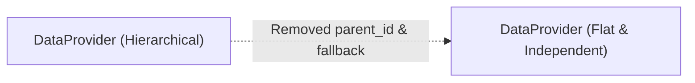

# Archive: Remove Parent-Child Hierarchy from DataProvider

## 1. Problem & Core Value
- **Problem**: `DataProviderEntity` had a self-referencing parent-child hierarchy (`parentId`, `parent`, `children`) which introduced implicit configuration fallback, circular dependencies, and unnecessary coupling.
- **Value**: Transformed `DataProvider` into a flat, independent entity where each provider explicitly owns its identifier, baseUrl, configuration, and status.

## 2. Key Architecture & Decisions
- **Database Schema**: Dropped foreign key `FK_f75e897c7184b7a3455a4ac860a` and column `parent_id` from `data_providers`.
- **Entity & DTOs**: Removed `parentId`, `parent`, and `children` relations from `DataProviderEntity`, `DataProviderDto`, and request DTOs.
- **Service Decoupling**: Removed all fallback logic to `dataProvider.parent` in `DataProviderService`, `ScrapingDataService`, and search services.

## 3. Scope & Key Changes
- [`src/migrations/1765000000000-RemoveParentIdFromDataProviderTable.ts`](file:///Users/kiem/Sources/Personal/only-one-be/src/migrations/1765000000000-RemoveParentIdFromDataProviderTable.ts): Migration to drop `parent_id`.
- [`src/modules/data-provider/entities/data-provider.entity.ts`](file:///Users/kiem/Sources/Personal/only-one-be/src/modules/data-provider/entities/data-provider.entity.ts): Removed parent-child relation declarations.
- [`src/modules/data-provider/services/data-provider.service.ts`](file:///Users/kiem/Sources/Personal/only-one-be/src/modules/data-provider/services/data-provider.service.ts): Removed parent relation loading and fallback logic.
- [`src/modules/data-provider/dtos/`](file:///Users/kiem/Sources/Personal/only-one-be/src/modules/data-provider/dtos): Cleaned DTOs and request contracts.

## 4. Verification Evidence & PR
- **Test Status**: 100% Passed (`npm run build` and `npm run lint:fix` passed with 0 errors).
- **PR URL**: ~
