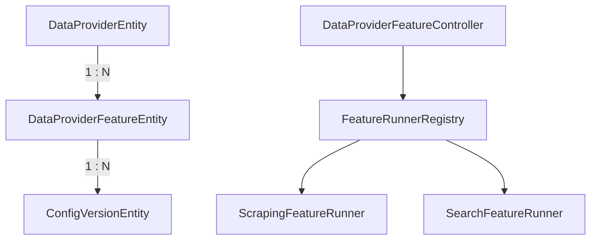

# Archive: Decouple Features and Standardize Feature Testing from DataProvider

## 1. Problem & Core Value
- **Problem**: Scraping and search feature configurations, statuses, and metrics were coupled directly inside `data_providers`, causing monolithic schema bloat, lack of independent feature lifecycles, and fragmented testing endpoints across multiple controllers.
- **Value**: Decoupled capabilities into a dedicated 1-to-N `DataProviderFeatureEntity` with independent lifecycle statuses, isolated versioning per feature, and unified strategy-driven test runners.

## 2. Key Architecture & Decisions
- **Pluggable Feature Entity**: Created `DataProviderFeatureEntity` (`data_provider_features`) with composite unique index on `(dataProviderId, type)` and polymorphic `config: jsonb`.
- **Granular Versioning**: Re-anchored `ConfigVersionEntity` to `featureId` for isolated rollbacks per feature type.
- **Dedicated RESTful Controller**: Centralized feature operations under `@Controller('data-provider-features')`.
- **Strategy Testing Runners**: Introduced `IFeatureRunner` with `ScrapingFeatureRunner` and `SearchFeatureRunner` registered in `FeatureRunnerRegistry` supporting dual-mode testing (`POST /test` stateless and `POST /:id/test` contextual).

## 3. Scope & Key Changes
- [`src/modules/data-provider/entities/data-provider-feature.entity.ts`](file:///Users/kiem/Sources/Personal/only-one-be/src/modules/data-provider/entities/data-provider-feature.entity.ts): New entity for provider features.
- [`src/modules/data-provider/controllers/data-provider-feature.controller.ts`](file:///Users/kiem/Sources/Personal/only-one-be/src/modules/data-provider/controllers/data-provider-feature.controller.ts): RESTful feature management and test API.
- [`src/modules/data-provider/runners/`](file:///Users/kiem/Sources/Personal/only-one-be/src/modules/data-provider/runners): Feature runner strategy registry.
- [`src/migrations/1765100000000-DecoupleDataProviderFeatures.ts`](file:///Users/kiem/Sources/Personal/only-one-be/src/migrations/1765100000000-DecoupleDataProviderFeatures.ts): Schema migration and data transformation.

## 4. Verification Evidence & PR
- **Test Status**: 100% Passed (NestJS compilation and typecheck succeeded).
- **PR URL**: ~
