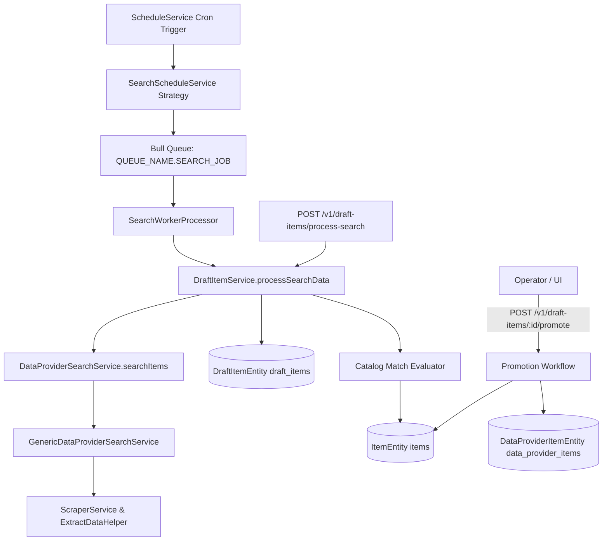

# Archive: Search Discovery, Draft Item Staging & Scheduled Worker Pipeline

## 1. Problem & Core Value
- **Problem**: Search discovery previously used inconsistent terminology (`product` vs `item`), returned results transiently without database staging, had no automated catalog match evaluation against canonical `ItemEntity` records, lacked a promotion workflow, and could not be triggered automatically via recurring cron schedules or Bull worker queues.
- **Value**: Standardized domain language across search services, established persistent draft item staging (`draft_items`) with automated catalog matching and operator promotion, and integrated search discovery with the schedule engine and asynchronous worker queue pipeline.

## 2. Key Architecture & Decisions
- **Domain Nomenclature Standardization**: Standardized all search services, DTOs, interfaces, and extraction helpers from `Product` $\rightarrow$ `Item` (`SearchItemsRequestDto`, `DiscoveredItemDto`, `DataProviderSearchService.searchItems`).
- **Draft Item Staging & Auto-Matching**: Stored search discovery output in `DraftItemEntity` (`draft_items`). Implemented automatic comparison matching against `ItemEntity` by `code` (barcode) and normalized `name` with match confidence scores and statuses (`PENDING`, `MATCHED`, `PROMOTED`, `IGNORED`).
- **Catalog Promotion Pipeline**: Operator endpoint `POST /v1/draft-items/:id/promote` atomically promotes verified draft items into canonical `ItemEntity` and provider-specific `DataProviderItemEntity` records.
- **Scheduled Queue & Worker Processing**: Extended `ScheduleJobService` with `SearchScheduleService` strategy, enqueuing batch search discovery jobs to `QUEUE_NAME.SEARCH_JOB`, consumed asynchronously by `SearchWorkerProcessor`.

## 3. Scope & Key Changes
- [`src/modules/data-provider/services/data-provider-search.service.ts`](file:///d:/Sources/Personal/only-one-be/src/modules/data-provider/services/data-provider-search.service.ts): Renamed and aligned search methods to items.
- [`src/modules/data-provider/services/draft-item.service.ts`](file:///d:/Sources/Personal/only-one-be/src/modules/data-provider/services/draft-item.service.ts): Batch search discovery, staging, auto-matching, and catalog promotion.
- [`src/modules/data-provider/controllers/draft-item.controller.ts`](file:///d:/Sources/Personal/only-one-be/src/modules/data-provider/controllers/draft-item.controller.ts): RESTful draft item management and promotion API.
- [`src/modules/data-provider/entities/draft-item.entity.ts`](file:///d:/Sources/Personal/only-one-be/src/modules/data-provider/entities/draft-item.entity.ts): Draft item entity schema with provider linkage, match status, and raw metadata.
- [`src/modules/schedule/services/schedule-execution/search-schedule.service.ts`](file:///d:/Sources/Personal/only-one-be/src/modules/schedule/services/schedule-execution/search-schedule.service.ts): Schedule strategy for recurring search discovery.
- [`src/modules/worker/processors/search-worker.processor.ts`](file:///d:/Sources/Personal/only-one-be/src/modules/worker/processors/search-worker.processor.ts): Background Bull queue worker processor for search jobs.
- [`src/modules/queue/enums/queue-name.enum.ts`](file:///d:/Sources/Personal/only-one-be/src/modules/queue/enums/queue-name.enum.ts): Added `SEARCH_JOB` queue definition.

## 4. Verification Evidence & PR
- **Test Status**: 100% Passed (NestJS compilation, unit tests, and build succeeded with 0 errors).
- **PR URL**: ~
