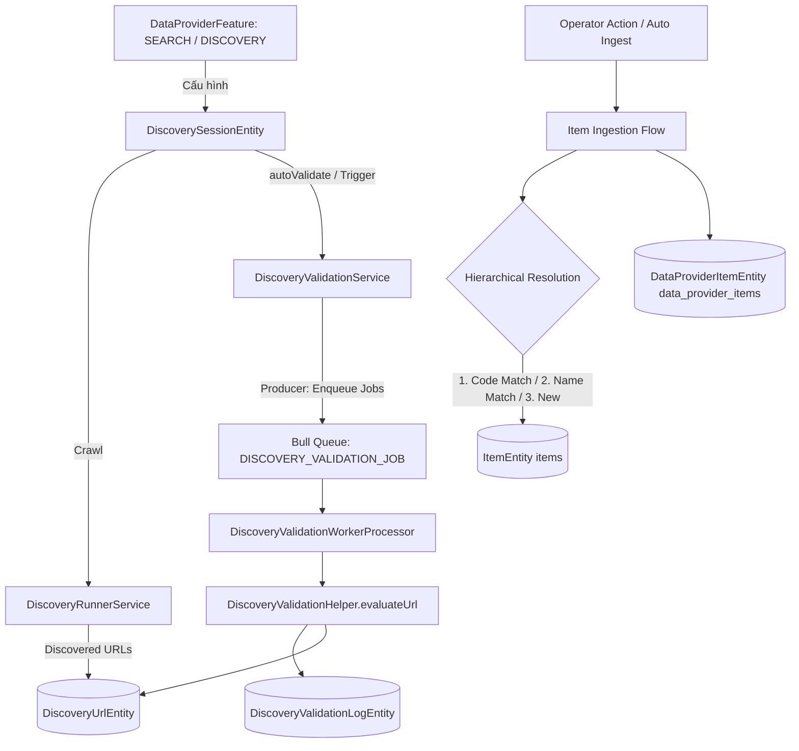

# Archive: Scraping Discovery, Async Validation Worker & Item Ingestion Engine

## 1. Problem & Core Value (Bài toán & Giá trị Cốt lõi)
- **Vấn đề (Problem)**: Trước đây hệ thống sử dụng bảng trung gian `DraftItem` và pipeline tìm kiếm thô rời rạc (`SEARCH_JOB`), phụ thuộc vào phân tích giá dễ vỡ, chạy batch validation đồng bộ làm nghẽn API thread, và thiếu cơ chế nạp trực tiếp kết quả phát hiện vào danh mục sản phẩm chuẩn (`ItemEntity` & `DataProviderItemEntity`).
- **Giá trị (Value)**: Xây dựng toàn diện hệ thống **Discovery & Validation Engine**: tự động thu thập URLs với traversal linh hoạt (hỗ trợ `maxUrls: null`), xử lý batch validation bất đồng bộ qua Bull queue worker (`DISCOVERY_VALIDATION_JOB`), đánh giá độ khớp phân loại theo heuristic scoring xác định kèm audit log, và nạp dữ liệu chuẩn hóa (Item Ingestion) theo cơ chế đối soát phân tầng (`code` -> `name` fallback) có tính bất biến lặp (idempotency).

## 2. Key Architecture & Decisions (Kiến trúc & Quyết định Then chốt)
- **Entity Model & Quan hệ**:
  - `DiscoverySessionEntity`: Quản lý phiên quét, liên kết `dataProviderId` và `featureId` (`DataProviderFeatureEntity`), hỗ trợ `autoValidate: boolean` (mặc định `true`) và `maxUrls: number | null`.
  - `DiscoveryUrlEntity`: Lưu trữ danh sách URLs phát hiện, trạng thái quét (`discovered`, `queued`, `scraped`), trạng thái kiểm toán (`pending_review`, `approved`, `rejected`, `ingested`), độ khớp (`exact_match`, `partial_match`, `no_match`).
  - `DiscoveryValidationBatchEntity` & `DiscoveryValidationLogEntity`: Quản lý tiến trình kiểm toán theo mẻ và nhật ký chi tiết từng tiêu chí so khớp.
- **Asynchronous Worker Pipeline**:
  - Tách rời tiến trình validation khỏi HTTP API: `DiscoveryValidationService.startBatchValidation` tạo batch và đẩy jobs vào Bull Queue `QUEUE_NAME.DISCOVERY_VALIDATION_JOB`.
  - `DiscoveryValidationWorkerProcessor` tiêu thụ từng job độc lập, thực thi `DiscoveryValidationHelper.evaluateUrl()`, ghi log kiểm toán và tăng biến đếm nguyên tử (`processedUrls`).
- **Hierarchical Item Ingestion**:
  - Phê duyệt / Nạp URL (`approveUrl` / `ingestUrl`) thực hiện đối soát phân tầng: tìm `ItemEntity` theo `code` (SKU/barcode trích xuất từ URL) $\rightarrow$ nếu không có, tìm theo `name` $\rightarrow$ nếu chưa có mới khởi tạo `ItemEntity`. Sau đó liên kết tạo `DataProviderItemEntity` và chuyển `DiscoveryUrlEntity.status` sang `INGESTED`.
- **Clean Teardown & Purge**:
  - Đã tháo dỡ hoàn toàn `DraftItemEntity`, `draft-item.service.ts`, `data-provider-search.service.ts`, `search-schedule.service.ts`, `search-worker.processor.ts`, `PriceDetectorHelper` và các trường giá cả thừa thãi (`priceDetected`, `detectedPrice`, `detectedCurrency`).

## 3. Scope & Key Changes (Phạm vi & Thay đổi Chính)
- [`src/modules/data-provider/entities/discovery-session.entity.ts`](file:///Users/kiem/Sources/PERSONAL/only-one-be/src/modules/data-provider/entities/discovery-session.entity.ts): Quản lý session, `featureId`, `maxUrls`, `autoValidate`.
- [`src/modules/data-provider/entities/discovery-url.entity.ts`](file:///Users/kiem/Sources/PERSONAL/only-one-be/src/modules/data-provider/entities/discovery-url.entity.ts): Thực thể URL với liên kết `dataProvider`, `feature`, trạng thái ingestion.
- [`src/modules/data-provider/entities/discovery-validation-batch.entity.ts`](file:///Users/kiem/Sources/PERSONAL/only-one-be/src/modules/data-provider/entities/discovery-validation-batch.entity.ts): Thực thể quản lý tiến độ batch validation.
- [`src/modules/data-provider/entities/discovery-validation-log.entity.ts`](file:///Users/kiem/Sources/PERSONAL/only-one-be/src/modules/data-provider/entities/discovery-validation-log.entity.ts): Nhật ký chi tiết kiểm toán từng URL.
- [`src/modules/data-provider/services/discovery-session.service.ts`](file:///Users/kiem/Sources/PERSONAL/only-one-be/src/modules/data-provider/services/discovery-session.service.ts): Quản lý tạo session từ feature config và trigger lifecycle.
- [`src/modules/data-provider/services/discovery-url.service.ts`](file:///Users/kiem/Sources/PERSONAL/only-one-be/src/modules/data-provider/services/discovery-url.service.ts): Quản lý URL, review actions, và batch item ingestion flow.
- [`src/modules/data-provider/services/discovery-validation.service.ts`](file:///Users/kiem/Sources/PERSONAL/only-one-be/src/modules/data-provider/services/discovery-validation.service.ts): Producer đẩy job vào queue validation.
- [`src/modules/data-provider/helpers/discovery-validation.helper.ts`](file:///Users/kiem/Sources/PERSONAL/only-one-be/src/modules/data-provider/helpers/discovery-validation.helper.ts): Thuật toán chấm điểm heuristic độ khớp từ khóa/tiêu đề/path.
- [`src/modules/worker/processors/discovery-validation-worker.processor.ts`](file:///Users/kiem/Sources/PERSONAL/only-one-be/src/modules/worker/processors/discovery-validation-worker.processor.ts): Background Bull queue processor tiêu thụ validation jobs.
- [`src/modules/queue/enums/queue-name.enum.ts`](file:///Users/kiem/Sources/PERSONAL/only-one-be/src/modules/queue/enums/queue-name.enum.ts): Đăng ký `DISCOVERY_VALIDATION_JOB`.

## 4. Verification Evidence & PR (Bằng chứng Nghiệm thu & PR)
- **Test Status**: 100% Passed (Toàn bộ unit test suites & TypeScript build biên dịch thành công 0 lỗi).
- **PR URL / Branch**: `main`
