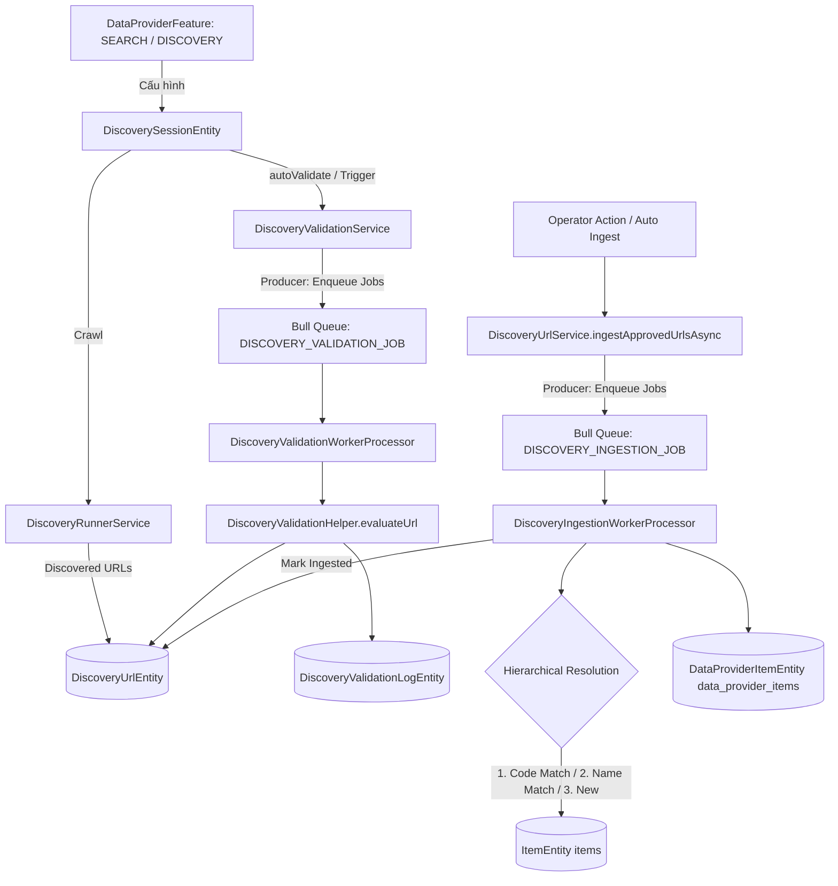

# Archive: Scraping Discovery, Async Validation & Batch Item Ingestion Pipeline

## 1. Problem & Core Value (Bài toán & Giá trị Cốt lõi)
- **Vấn đề (Problem)**: Trước đây hệ thống sử dụng bảng trung gian `DraftItem` và pipeline tìm kiếm thô rời rạc (`SEARCH_JOB`), phụ thuộc vào phân tích giá dễ vỡ, chạy batch validation và item ingestion đồng bộ làm nghẽn API thread, gây timeout (HTTP 504) khi xử lý khối lượng lớn URLs phát hiện.
- **Giá trị (Value)**: Xây dựng toàn diện hệ thống **Discovery, Validation & Ingestion Engine**:
  1. Tự động thu thập URLs với traversal linh hoạt (hỗ trợ `maxUrls: null` cho full-site discovery).
  2. Xử lý batch validation bất đồng bộ qua Bull queue worker (`QUEUE_NAME.DISCOVERY_VALIDATION_JOB`), đánh giá độ khớp phân loại theo heuristic scoring xác định kèm nhật ký kiểm toán.
  3. Xử lý nạp dữ liệu chuẩn hóa (Item Ingestion) bất đồng bộ qua Bull queue worker (`QUEUE_NAME.DISCOVERY_INGESTION_JOB`) theo cơ chế đối soát phân tầng (`code` -> `name` fallback) có tính bất biến lặp (idempotency).

## 2. Key Architecture & Decisions (Kiến trúc & Quyết định Then chốt)
- **Entity Model & Quan hệ**:
  - `DiscoverySessionEntity`: Quản lý phiên quét, liên kết `dataProviderId` và `featureId` (`DataProviderFeatureEntity`), hỗ trợ `autoValidate: boolean` (mặc định `true`) và `maxUrls: number | null`.
  - `DiscoveryUrlEntity`: Lưu trữ danh sách URLs phát hiện, trạng thái quét (`discovered`, `queued`, `scraped`), trạng thái kiểm toán (`pending_review`, `approved`, `rejected`, `ingested`), độ khớp (`exact_match`, `partial_match`, `no_match`).
  - `DiscoveryValidationBatchEntity` & `DiscoveryValidationLogEntity`: Quản lý tiến trình kiểm toán theo mẻ và nhật ký chi tiết từng tiêu chí so khớp.
- **Asynchronous Worker Pipelines**:
  - **Validation Pipeline**: `DiscoveryValidationService.startBatchValidation` tạo batch và đẩy jobs vào Bull Queue `QUEUE_NAME.DISCOVERY_VALIDATION_JOB`. `DiscoveryValidationWorkerProcessor` tiêu thụ từng job độc lập, thực thi `DiscoveryValidationHelper.evaluateUrl()`, ghi log kiểm toán và cập nhật trạng thái URL.
  - **Ingestion Pipeline**: `DiscoveryUrlService.ingestApprovedUrlsAsync` đẩy từng job vào Bull Queue `QUEUE_NAME.DISCOVERY_INGESTION_JOB`. `DiscoveryIngestionWorkerProcessor` tiêu thụ job, thực hiện đối soát phân tầng (tìm theo SKU/code $\rightarrow$ tìm theo tên $\rightarrow$ tạo mới `ItemEntity`), gắn kết `DataProviderItemEntity` và chuyển `DiscoveryUrlEntity.status = INGESTED`.
- **Clean Teardown & Purge**:
  - Đã tháo dỡ hoàn toàn `DraftItemEntity`, `draft-item.service.ts`, `data-provider-search.service.ts`, `search-schedule.service.ts`, `search-worker.processor.ts`, `PriceDetectorHelper` và các trường giá cả thừa thãi (`priceDetected`, `detectedPrice`, `detectedCurrency`).

## 3. Scope & Key Changes (Phạm vi & Thay đổi Chính)
- [`src/modules/data-provider/entities/discovery-session.entity.ts`](file:///d:/Sources/Personal/only-one-be/src/modules/data-provider/entities/discovery-session.entity.ts): Quản lý session, `featureId`, `maxUrls`, `autoValidate`.
- [`src/modules/data-provider/entities/discovery-url.entity.ts`](file:///d:/Sources/Personal/only-one-be/src/modules/data-provider/entities/discovery-url.entity.ts): Thực thể URL với liên kết `dataProvider`, `feature`, trạng thái ingestion.
- [`src/modules/data-provider/entities/discovery-validation-batch.entity.ts`](file:///d:/Sources/Personal/only-one-be/src/modules/data-provider/entities/discovery-validation-batch.entity.ts): Quản lý batch validation.
- [`src/modules/data-provider/entities/discovery-validation-log.entity.ts`](file:///d:/Sources/Personal/only-one-be/src/modules/data-provider/entities/discovery-validation-log.entity.ts): Nhật ký chi tiết kiểm toán.
- [`src/modules/data-provider/services/discovery-url.service.ts`](file:///d:/Sources/Personal/only-one-be/src/modules/data-provider/services/discovery-url.service.ts): Quản lý URLs, review actions, và async ingestion pipeline.
- [`src/modules/data-provider/services/discovery-validation.service.ts`](file:///d:/Sources/Personal/only-one-be/src/modules/data-provider/services/discovery-validation.service.ts): Producer đẩy job validation.
- [`src/modules/worker/processors/discovery-validation-worker.processor.ts`](file:///d:/Sources/Personal/only-one-be/src/modules/worker/processors/discovery-validation-worker.processor.ts): Worker xử lý validation.
- [`src/modules/worker/processors/discovery-ingestion-worker.processor.ts`](file:///d:/Sources/Personal/only-one-be/src/modules/worker/processors/discovery-ingestion-worker.processor.ts): Worker xử lý nạp item.
- [`src/modules/queue/enums/queue-name.enum.ts`](file:///d:/Sources/Personal/only-one-be/src/modules/queue/enums/queue-name.enum.ts): Đăng ký `DISCOVERY_VALIDATION_JOB` và `DISCOVERY_INGESTION_JOB`.
