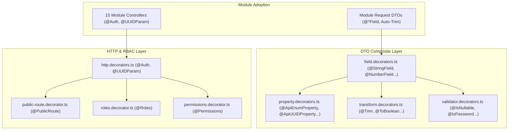

# Archive: Standardized Custom Decorators Suite & Full Modular Refactor

## 1. Problem & Core Value (Bài toán & Giá trị Cốt lõi)
- **Vấn đề (Problem)**: Các DTO và Controller trong hệ thống `only-one-be` trước đây phải khai báo thủ công nhiều decorators rời rạc (`@ApiProperty`, `@IsString`, `@IsNotEmpty`, `@Trim`, `@IsOptional`, `@UseGuards(JwtAuthGuard)`, `@ApiBearerAuth()`, `@Param('id', new ParseUUIDPipe())`). Cách làm này gây trùng lặp boilerplate, không đảm bảo auto-trimming đồng nhất cho chuỗi dữ liệu đầu vào và phân mảnh cơ chế gán metadata xác thực/phân quyền.
- **Giá trị (Value)**: Xây dựng bộ **5 nhóm Decorators Chuẩn Hoá** (`Transform`, `Validator`, `Property`, `Field`, `HTTP & RBAC`) tại `src/decorators/` và tái cấu trúc toàn diện 100% (15/15 modules) của `only-one-be`. Mọi string field đều được tích hợp tự động `@Trim()`, gom gọn logic validation + OpenAPI schema + transformation vào 1 dòng khai báo duy nhất và chuẩn hoá guard/param controller qua `@Auth()` & `@UUIDParam()`.

## 2. Key Architecture & Decisions (Kiến trúc & Quyết định Then chốt)
- **5 Nhóm Decorators Phân tầng (`src/decorators/`)**:
  1. **Transform (`transform.decorators.ts`)**: `@Trim`, `@ToBoolean`, `@ToInt`, `@ToArray`, `@ToLowerCase`, `@ToUpperCase`, `@PhoneNumberSerializer`, `@JSONToObject`, `@JSONToArray`.
  2. **Custom Validator (`validator.decorators.ts`)**: `@IsPhoneNumber` (E.164 / VN format), `@IsTmpKey`, `@IsUndefinable`, `@IsNullable`, `@IsPassword`.
  3. **Property (`property.decorators.ts`)**: OpenAPI/Swagger builders (`@ApiBooleanProperty`, `@ApiUUIDProperty`, `@ApiEnumProperty`).
  4. **Field (`field.decorators.ts`)**: Composite decorators kết hợp Swagger + `class-validator` + `class-transformer` + auto-trim (`@StringField`, `@NumberField`, `@BooleanField`, `@EnumField`, `@DateField`, `@UUIDField`, `@URLField`, `@EmailField`, `@PhoneField`, `@PasswordField`, `@ClassField`, `@ObjectFieldOptional`).
  5. **HTTP & RBAC (`http.decorators.ts`, `public-route.decorator.ts`, `roles.decorator.ts`, `permissions.decorator.ts`)**: `@Auth()`, `@UUIDParam()`, `@PublicRoute()`, `@Roles()`, `@Permissions()`.
- **Barrel Export (`src/decorators/index.ts`)**: Giữ tương thích ngược hoàn toàn với `@BaseResponse`, `@User`, `@ApiFile`.
- **100% Modular Migration**: Refactor toàn bộ DTOs và Controllers trên 15 modules (`auth`, `user`, `setting`, `audit-log`, `data-provider`, `schedule`, `google`, `simulation`, `cloud-data`, `import-data`, `notification`, `queue`, `websocket`, `bull-board`, `worker`) tuân thủ nghiêm ngặt bộ decorator chuẩn.

## 3. Scope & Key Changes (Phạm vi & Thay đổi Chính)
- [`src/decorators/field.decorators.ts`](file:///Users/kiem/Sources/PERSONAL/only-one-be/src/decorators/field.decorators.ts): Toàn bộ composite field decorators.
- [`src/decorators/transform.decorators.ts`](file:///Users/kiem/Sources/PERSONAL/only-one-be/src/decorators/transform.decorators.ts): Các transformer tiện ích và serializers.
- [`src/decorators/validator.decorators.ts`](file:///Users/kiem/Sources/PERSONAL/only-one-be/src/decorators/validator.decorators.ts): Custom validators.
- [`src/decorators/property.decorators.ts`](file:///Users/kiem/Sources/PERSONAL/only-one-be/src/decorators/property.decorators.ts): Swagger property decorators.
- [`src/decorators/http.decorators.ts`](file:///Users/kiem/Sources/PERSONAL/only-one-be/src/decorators/http.decorators.ts): `@Auth` và `@UUIDParam`.
- [`src/decorators/index.ts`](file:///Users/kiem/Sources/PERSONAL/only-one-be/src/decorators/index.ts): Barrel export toàn hệ thống.
- [`src/modules/`](file:///Users/kiem/Sources/PERSONAL/only-one-be/src/modules/): DTOs và Controllers trên toàn bộ 15 modules.

## 4. Verification Evidence & PR (Bằng chứng Nghiệm thu & PR)
- **TypeScript Compilation**: `npm run build` $\rightarrow$ Exit Code 0 (0 errors).
- **ESLint & Prettier**: 100% Clean, tuân thủ nghiêm ngặt code styles.
