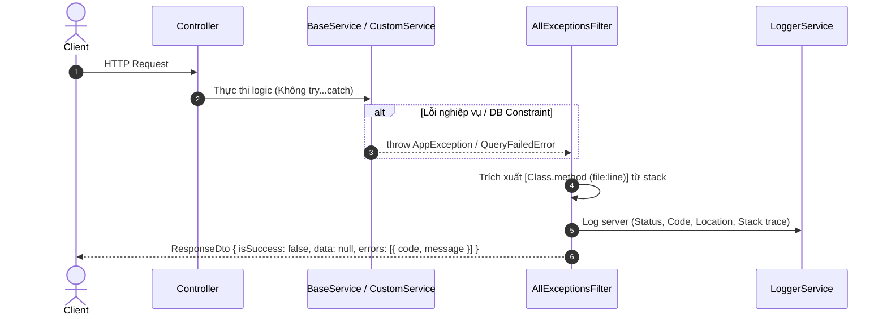

# Archive: Hệ Thống Xử Lý Ngoại Lệ Tập Trung & Chuẩn Hóa Mã Lỗi Domain Error Code

## 1. Problem & Core Value (Bài toán & Giá trị Cốt lõi)
- **Vấn đề (Problem)**: Trước đây các service phải viết khối `try...catch` thủ công và gọi `this.handleError()`, làm sai lệch HTTP status hoặc nuốt lỗi. Thiếu từ điển mã lỗi chuẩn hóa khiến client khó xử lý thông báo lỗi.
- **Giá trị (Value)**: Loại bỏ hoàn toàn boilerplate `try...catch` trong các service methods; tập trung hóa việc bắt ngoại lệ tại `AllExceptionsFilter`. Chuẩn hóa từ điển mã lỗi `AppError` và `AppException` theo phân nhóm domain (`General`, `Auth`, `User`, `DataProvider`, `Catalog`, `File`, `Notification`, `Setting`, `Queue`). Trích xuất call-site location ghi log chi tiết tại server, masking lỗi nhạy cảm và trả về client response chuẩn `ResponseDto` với HTTP status chính xác.

## 2. Key Architecture & Decisions (Kiến trúc & Quyết định Then chốt)
- **Error Code Dictionary (`IAppError` & `AppError`)**: Đặt tại `src/constant/error-code.ts` và export qua `src/constant/index.ts`. Cung cấp mã lỗi snake_case theo domain, message tiếng Việt thân thiện và `statusCode` RESTful chuẩn.
- **Dedicated Exception (`AppException`)**: Kế thừa `HttpException`, tự động bind `statusCode` từ `IAppError`. Cho phép dev chỉ cần gọi `throw new AppException(AppError.RecordNotFound)`.
- **Global Filter (`AllExceptionsFilter`)**: Đăng ký toàn cục tại `main.ts`, tự động:
  - Bóc tách `AppException`, `HttpException`, và mảng validation từ `ValidationPipe`.
  - Ánh xạ lỗi TypeORM: Postgres `23505` (Unique Violation $\rightarrow$ HTTP 409 `duplicate_record`), `23503` (Foreign Key $\rightarrow$ HTTP 400 `foreign_key_violation`), `EntityNotFoundError` $\rightarrow$ HTTP 404 `record_not_found`.
  - Phân tích stack trace trích xuất call-site nội bộ (`ClassName.methodName (file:line)`), ghi server log kèm stack trace qua `LoggerService`.
  - Masking lỗi 500 không xác định thành `unexpected_error` gửi client.
- **BaseService Clean-up**: Dỡ bỏ toàn bộ `try...catch` trong các hàm CRUD, đánh dấu `@deprecated` cho `handleError`.

## 3. Scope & Key Changes (Phạm vi & Thay đổi Chính)
- [error-code.ts](file:///d:/Sources/Personal/only-one-be/src/constant/error-code.ts): Interface `IAppError` và class `AppError`.
- [index.ts](file:///d:/Sources/Personal/only-one-be/src/constant/index.ts): Re-export `./error-code`.
- [app.exception.ts](file:///d:/Sources/Personal/only-one-be/src/exceptions/app.exception.ts): Class `AppException`.
- [all-exception.filter.ts](file:///d:/Sources/Personal/only-one-be/src/filters/all-exception.filter.ts): Phân loại ngoại lệ, extractLocation, server logging và format response.
- [logger.service.ts](file:///d:/Sources/Personal/only-one-be/src/shared/services/logger.service.ts): Hỗ trợ param stack trace cho winston logger.
- [base.service.ts](file:///d:/Sources/Personal/only-one-be/src/common/base.service.ts): Dỡ bỏ `try...catch` trong các CRUD methods.

## 4. Verification Evidence & PR (Bằng chứng Nghiệm thu & PR)
- **TypeScript Compilation**: `npm run build` $\rightarrow$ Pass (Exit code 0).
- **ESLint & Prettier**: 100% Clean.
