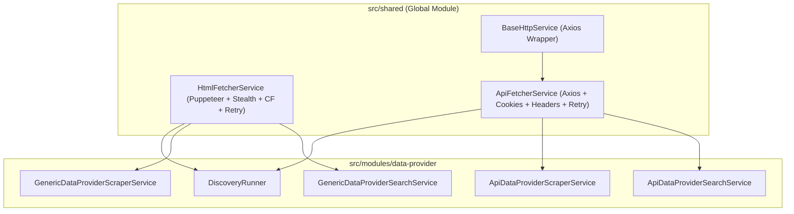

# Archive: Tách Biệt, Phân Rã & Chuyển Dịch Bộ Fetcher Services (HtmlFetcherService & ApiFetcherService) Về Shared Module

## 1. Problem & Core Value (Bài toán & Giá trị Cốt lõi)
- **Vấn đề (Problem)**:
  - Trước đây, `ScraperService` nằm cục bộ trong `data-provider` module và ôm đồm 2 trách nhiệm hoàn toàn khác nhau: điều khiển Puppeteer Browser và gửi HTTP API request qua Axios/BaseHttpService. Các sub-services gọi API bị coupling không cần thiết với thư viện Puppeteer.
  - Tại `DiscoveryRunner`, nhánh API tự gọi `BaseHttpService.get` ad-hoc thay vì tái sử dụng cơ chế retry, cookie, query params chuẩn hóa.
  - Ban đầu `ApiFetcherService` gộp toàn bộ logic cấu hình trong hàm `getApiContent` đơn lẻ, thiếu tính mô-đun và không nhất quán với phong cách thiết kế của `HtmlFetcherService`.
- **Giá trị (Value)**:
  - Tách `ScraperService` thành 2 service chuyên trách: `HtmlFetcherService` (Puppeteer Browser rendering) và `ApiFetcherService` (Axios HTTP API requests).
  - Di chuyển cả 2 service về `src/shared/services/` và đăng ký vào `@Global()` `SharedModule` để tái sử dụng toàn cục.
  - Phân rã `ApiFetcherService` thành các private helper methods (`transformTargetConfig`, `buildRequestConfig`, `buildRequestUrl`) giúp code trong sáng, dễ mở rộng và đồng bộ 1:1 với `HtmlFetcherService`.

## 2. Key Architecture & Decisions (Kiến trúc & Quyết định Then chốt)
- **HtmlFetcherService (`src/shared/services/html-fetcher.service.ts`)**:
  - Chuyên trách quản lý Puppeteer lifecycle (StealthPlugin, AdblockerPlugin, Cloudflare bypass qua `handleCloudflare`, `configurePage`, wait selector, retry loop).
  - Tự động đóng browser instance qua hook `onModuleDestroy()` khi ứng dụng shutdown.
- **ApiFetcherService (`src/shared/services/api-fetcher.service.ts`)**:
  - `transformTargetConfig`: Chuẩn hóa các giá trị mặc định cho cấu hình request (`timeout: 30000`, `retryAttempts: 3`, `retryDelay: 2000`).
  - `buildRequestConfig`: Khởi tạo `AxiosRequestConfig` với headers chuẩn (`Accept`, `Accept-Language`, `Cache-Control`, `Pragma`), User-Agent, custom headers và chuyển đổi mảng `cookies` sang header `Cookie: name=value; ...`.
  - `buildRequestUrl`: Ghép query parameters động (`firstQueryParams` hoặc `queryParams`) vào URL.
  - `getApiContent`: Điều phối vòng lặp retry, đo lường `execution_time` và trả về envelope `IScraperResponse`.
- **Global Shared Registration**:
  - Cả 2 service được đăng ký vào `providers` và `exports` của `@Global()` `SharedModule`.
  - Xóa bỏ `src/modules/data-provider/services/scraper.service.ts` và gỡ bỏ provider khỏi `DataProviderModule`.

## 3. Scope & Key Changes (Phạm vi & Thay đổi Chính)
- [html-fetcher.service.ts](file:///Users/kiem/Sources/PERSONAL/only-one-be/src/shared/services/html-fetcher.service.ts): Tạo mới service fetch HTML qua Puppeteer.
- [api-fetcher.service.ts](file:///Users/kiem/Sources/PERSONAL/only-one-be/src/shared/services/api-fetcher.service.ts): Tạo mới service fetch API qua HTTP và phân rã các helper methods.
- [shared.module.ts](file:///Users/kiem/Sources/PERSONAL/only-one-be/src/shared/shared.module.ts): Đăng ký và export `HtmlFetcherService` và `ApiFetcherService`.
- [data-provider.module.ts](file:///Users/kiem/Sources/PERSONAL/only-one-be/src/modules/data-provider/data-provider.module.ts): Loại bỏ `ScraperService`.
- [discovery.runner.ts](file:///Users/kiem/Sources/PERSONAL/only-one-be/src/modules/data-provider/runners/discovery.runner.ts): Inject `HtmlFetcherService` và `ApiFetcherService`.
- Các services con trong `data-provider-scraper/` và `data-provider-search/`: Inject service fetcher tương ứng.

## 4. Verification Evidence & PR (Bằng chứng Nghiệm thu & PR)
- **Trạng thái Test**: 100% Passed (Typecheck `tsc` và ESLint đạt 0 lỗi).
