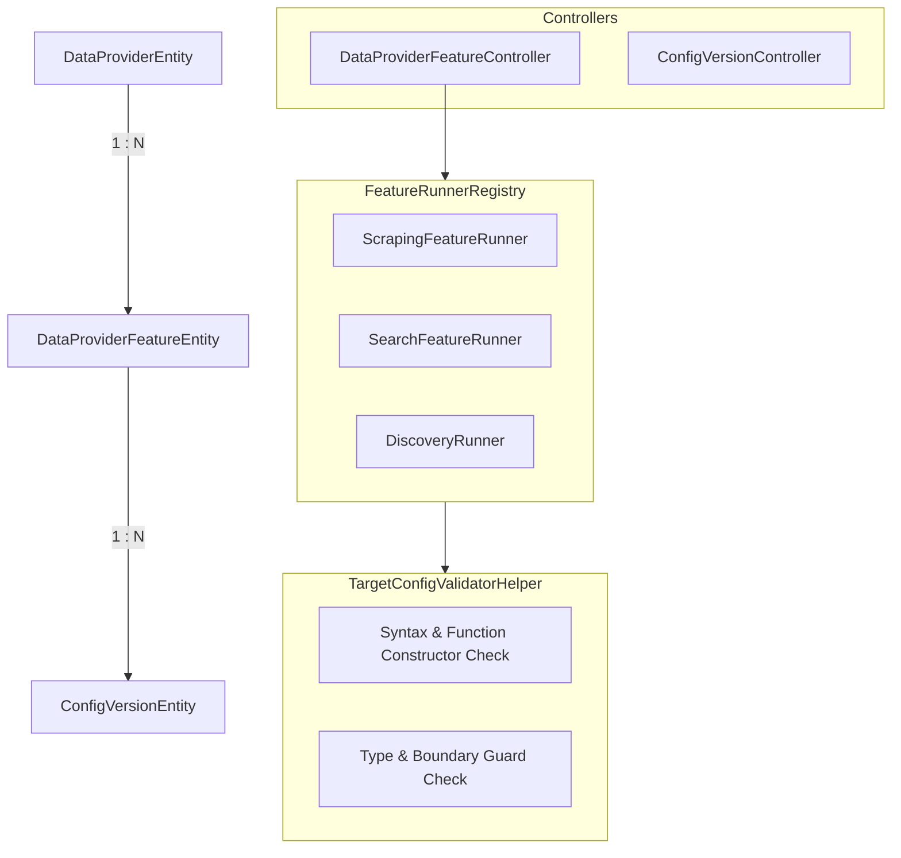

# Archive: Kiến Trúc Toàn Diện Data Provider, Pluggable Feature Runners, Config Versioning, TargetConfig Validation & Async Discovery Engine

## 1. Problem & Core Value (Bài toán & Giá trị Cốt lõi)
- **Vấn đề (Problem)**:
  - Trước đây, `DataProviderEntity` bị phụ thuộc phân cấp cha-con (`parentId`), cấu hình nhồi nhét vào bảng `data_providers`, controller bị gánh đa nhiệm vụ (god controller), và pipeline validation/ingestion đồng bộ làm nghẽn API thread khi xử lý khối lượng lớn URLs phát hiện.
  - Cơ chế tìm kiếm (`SEARCH` feature) từng bị phụ thuộc vào scraping helper (`ExtractDataHelper`) và DTO scraping, gây lỗi runtime khi chạy script `searchData(html)` và sai lệch schema kết quả sản phẩm. Đồng thời URL search builder bị gán cứng fallback `?q=`, và HTML thô chứa header/footer/sidebar rác chưa được lọc trước khi nạp vào script trích xuất.
  - DTOs và entities từng dùng kiểu lỏng lẻo `Record<string, any>`, lạm dụng kiểu `any` trong runner interfaces. Lưu cấu hình trực tiếp mà không qua validation schema và syntax script `functionGenerator`.
  - `@automapper/classes` không tự động ánh xạ các polymorphic interface fields (`config: TargetConfig`), dẫn đến giá trị `undefined` khi ghi vào `ConfigVersionEntity` và gây lỗi vi phạm NOT NULL constraint.
- **Giá trị (Value)**:
  1. **Flat & Pluggable Architecture**: `DataProvider` được thiết kế phẳng, độc lập. Các năng lực (`SCRAPING`, `SEARCH`, `DISCOVERY`) được trừu tượng hóa qua `IFeatureRunner` (`ScrapingFeatureRunner`, `SearchFeatureRunner`, `DiscoveryRunner`) và đăng ký tập trung vào `FeatureRunnerRegistry`.
  2. **100% Strict Type Safety & TargetConfig Validation**: Định nghĩa kiểu dữ liệu đa hình `TargetConfig = IScrapingTargetConfig | ISearchTargetConfig`, loại bỏ 100% kiểu `any`. `TargetConfigValidatorHelper` kiểm tra toàn diện schema, limits (> 0), booleans, string selectors và validate cú pháp JS `functionGenerator` bằng `new Function(...)` trước khi lưu vào DB hoặc chạy sandbox test.
  3. **Explicit AutoMapper Profiles**: Cấu hình tường minh `forMember((d) => d.config, mapFrom((s) => s.config))` trong `DataProviderProfile` cho cả `CreateConfigVersionRequestDto` và `CreateDataProviderFeatureRequestDto`, triệt tiêu lỗi NOT NULL constraint.
  4. **Isolated Config Versioning & Rollback**: `ConfigVersionEntity` gắn trực tiếp theo `featureId`. Toàn bộ endpoints xem lịch sử và rollback phiên bản được tách riêng thành `ConfigVersionController` chuẩn SRP với base route `@Controller('config-version-features')`.
  5. **Stateless Feature Sandbox & Pre-Test Fail-Fast**: Chuẩn hóa việc kiểm thử cấu hình không trạng thái qua endpoint duy nhất `POST /data-provider-features/test` (tự động cắt top 3 items preview). Tự động chạy `testStateless` trước khi tạo/cập nhật feature nếu request có truyền `input`.
  6. **Asynchronous Discovery Engine**: Xây dựng pipeline thu thập URLs với traversal linh hoạt, xử lý batch validation bất đồng bộ qua Bull queue worker (`QUEUE_NAME.DISCOVERY_VALIDATION_JOB`) với heuristic scoring và nạp dữ liệu chuẩn hóa (Item Ingestion) bất đồng bộ qua worker (`QUEUE_NAME.DISCOVERY_INGESTION_JOB`) theo đối soát phân tầng (`code` -> `name` fallback) có tính bất biến lặp (idempotency).
  7. **Dedicated Search Extraction & HTML Preprocessing Engine**: Tách biệt hoàn toàn `ExtractSearchDataHelper` và `SearchResultItemDto` (`url`, `title`, `imageUrl`, `relativeUrl`, `metadata`), hỗ trợ cả `searchData` và fallback `extractData`. Tích hợp lọc DOM theo `mainContentSelector` / `isGetParentElement` và chuẩn hóa placeholder URL `{...}` linh hoạt.

## 2. Key Architecture & Decisions (Kiến trúc & Quyết định Then chốt)

- **Flat Entity & Isolated Feature Versioning**:
  - `DataProviderEntity`: Độc lập, không kế thừa cha-con.
  - `DataProviderFeatureEntity`: Quản lý `type: DataProviderFeatureType`, `service: ScraperServiceEnum`, `status: DataProviderFeatureStatus`, và polymorphic `config: TargetConfig`.
  - `ConfigVersionEntity`: Gắn với `featureId`, lưu lịch sử chỉnh sửa và hỗ trợ khôi phục phiên bản.
- **Pre-persistence Validation & Polymorphic Typing**:
  - `IScrapingTargetConfig`: Gồm `functionGenerator`, `timeout`, `retryAttempts`, `retryDelay`, `waitForTimeout`, `waitForSelector`, `cookies`, `headers`, `stealthMode`, `cloudflareBypass`, `javascriptEnabled`, `imagesEnabled`, `cssEnabled`, `mainContentSelector`, `isGetParentElement`.
  - `ISearchTargetConfig extends IScrapingTargetConfig`: Bổ sung `searchUrlPattern`, `queryPlaceholder`, `resultSelector`, `maxResults`, `firstQueryParams`, `queryParams`.
  - `TargetConfigValidatorHelper.validateConfig(rawConfig, type)`: Thực thi kiểm tra toàn diện, sử dụng `lodash.isNil` hỗ trợ các trường optional an toàn.
- **Dedicated Sub-Resource Controllers**:
  - `DataProviderFeatureController`: CRUD feature, switch status và trigger stateless test sandbox (base route `@Controller('data-provider-features')`).
  - `ConfigVersionController`: Danh sách phiên bản (`GET /config-version-features/:id`), rollback phiên bản (`POST /config-version-features/:id/rollback/:versionId`) và xóa phiên bản cũ (`DELETE /config-version-features/:id/:versionId`).
- **Asynchronous Worker Pipelines (Thin Delegator Pattern)**:
  - **Validation Pipeline**: `DiscoveryValidationService.startBatchValidation` tạo batch và đẩy jobs vào Bull Queue `QUEUE_NAME.DISCOVERY_VALIDATION_JOB`. Worker `DiscoveryValidationWorkerProcessor` ủy quyền cho `DiscoveryValidationService.validateUrlForBatch()`.
  - **Ingestion Pipeline**: `DiscoveryUrlService.batchIngest` đẩy jobs vào Bull Queue `QUEUE_NAME.DISCOVERY_INGESTION_JOB`. Worker `DiscoveryIngestionWorkerProcessor` ủy quyền cho `DiscoveryUrlService.ingestDiscoveredUrl()`.

## 3. Scope & Key Changes (Phạm vi & Thay đổi Chính)
- [target-config.interface.ts](file:///Users/kiem/Sources/PERSONAL/only-one-be/src/modules/data-provider/interfaces/target-config.interface.ts): Hợp đồng kiểu dữ liệu đa hình `TargetConfig`.
- [target-config-validator.helper.ts](file:///Users/kiem/Sources/PERSONAL/only-one-be/src/modules/data-provider/helpers/target-config-validator.helper.ts): Module kiểm tra tính hợp lệ của cấu hình.
- [data-provider.profile.ts](file:///Users/kiem/Sources/PERSONAL/only-one-be/src/modules/data-provider/data-provider.profile.ts): AutoMapper profile với explicit mapping cho `config`.
- [data-provider-feature.controller.ts](file:///Users/kiem/Sources/PERSONAL/only-one-be/src/modules/data-provider/controllers/data-provider-feature.controller.ts): Controller quản lý tính năng.
- [config-version.controller.ts](file:///Users/kiem/Sources/PERSONAL/only-one-be/src/modules/data-provider/controllers/config-version.controller.ts): Controller quản lý phiên bản cấu hình.
- [data-provider-feature.service.ts](file:///Users/kiem/Sources/PERSONAL/only-one-be/src/modules/data-provider/services/data-provider-feature.service.ts): Service nghiệp vụ tính năng và validation.
- [config-version.service.ts](file:///Users/kiem/Sources/PERSONAL/only-one-be/src/modules/data-provider/services/config-version.service.ts): Service quản lý phiên bản snapshot.
- [discovery-validation.service.ts](file:///Users/kiem/Sources/PERSONAL/only-one-be/src/modules/data-provider/services/discovery-validation.service.ts): Service đánh giá chất lượng URL phát hiện.
- [discovery-url.service.ts](file:///Users/kiem/Sources/PERSONAL/only-one-be/src/modules/data-provider/services/discovery-url.service.ts): Service nạp dữ liệu SKU/Name.

## 4. Verification Evidence & PR (Bằng chứng Nghiệm thu & PR)
- **Unit Tests**:
  - `target-config-validator.helper.spec.ts`: 100% Passed.
  - `data-provider.profile.spec.ts`: 100% Passed.
  - `search-feature.runner.spec.ts`: 100% Passed.
- **Type Check**: `npx tsc -p tsconfig.build.json --noEmit` $\rightarrow$ 0 errors.
