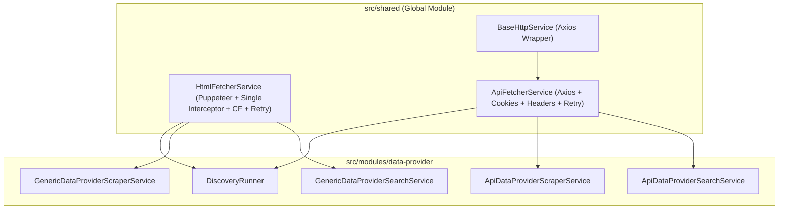

# Archive: Tách Biệt, Phân Rã Bộ Fetcher Services (HtmlFetcherService & ApiFetcherService) & Single Request Interceptor

## 1. Problem & Core Value (Bài toán & Giá trị Cốt lõi)
- **Vấn đề (Problem)**:
  - `ScraperService` trước đây nằm cục bộ trong `data-provider` và ôm đồm 2 trách nhiệm khác nhau: Puppeteer Browser rendering và Axios HTTP API request. Các sub-services gọi API bị coupling không cần thiết với thư viện Puppeteer.
  - Khi chặn đồng thời cả images và stylesheets (`imagesEnabled: false`, `cssEnabled: false`), Puppeteer ném lỗi `Error: Request is already handled!` do đăng ký 2 listener riêng biệt xử lý cùng 1 request hai lần.
- **Giá trị (Value)**:
  - Tách `ScraperService` thành 2 service chuyên trách: `HtmlFetcherService` (Puppeteer browser rendering) và `ApiFetcherService` (Axios HTTP API requests), đặt tại `src/shared/services/` và export qua `@Global()` `SharedModule`.
  - Hợp nhất toàn bộ logic chặn tài nguyên vào một request interceptor duy nhất kèm guard `req.isInterceptResolutionHandled()`, triệt tiêu hoàn toàn lỗi conflict request.
  - Phân rã `ApiFetcherService` thành các private helper methods (`transformTargetConfig`, `buildRequestConfig`, `buildRequestUrl`) giúp cấu hình request rõ ràng và nhất quán.

## 2. Key Architecture & Decisions (Kiến trúc & Quyết định Then chốt)
- **HtmlFetcherService (`src/shared/services/html-fetcher.service.ts`)**:
  - Quản lý vòng đời Puppeteer Browser (StealthPlugin, AdblockerPlugin, Cloudflare bypass qua `handleCloudflare`, `configurePage`, wait selector, retry loop).
  - Tối ưu hóa request interception: Gộp điều kiện `shouldBlockImages || shouldBlockCss` vào 1 listener duy nhất, bảo vệ bằng `req.isInterceptResolutionHandled()`.
  - Tự động đóng browser instance qua hook `onModuleDestroy()`.
- **ApiFetcherService (`src/shared/services/api-fetcher.service.ts`)**:
  - `transformTargetConfig`: Chuẩn hóa các giá trị mặc định cho cấu hình request (`timeout: 30000`, `retryAttempts: 3`, `retryDelay: 2000`).
  - `buildRequestConfig`: Khởi tạo `AxiosRequestConfig` với headers chuẩn, User-Agent, custom headers và chuyển đổi mảng `cookies` sang header `Cookie: name=value; ...`.
  - `buildRequestUrl`: Ghép query parameters động (`firstQueryParams` hoặc `queryParams`) vào URL.
  - `getApiContent`: Điều phối vòng lặp retry, đo lường `execution_time` và trả về envelope `IScraperResponse`.

## 3. Scope & Key Changes (Phạm vi & Thay đổi Chính)
- [html-fetcher.service.ts](file:///d:/Sources/Personal/only-one-be/src/shared/services/html-fetcher.service.ts): Headless browser rendering với single interceptor.
- [api-fetcher.service.ts](file:///d:/Sources/Personal/only-one-be/src/shared/services/api-fetcher.service.ts): HTTP API fetching engine.
- [shared.module.ts](file:///d:/Sources/Personal/only-one-be/src/shared/shared.module.ts): Đăng ký và export `HtmlFetcherService`, `ApiFetcherService`.
- [html-fetcher.service.spec.ts](file:///d:/Sources/Personal/only-one-be/src/shared/services/_tests/html-fetcher.service.spec.ts): Unit tests kiểm tra chặn images/css không bị lỗi request conflict.

## 4. Verification Evidence & PR (Bằng chứng Nghiệm thu & PR)
- **Automated Tests**: Unit test suite `html-fetcher.service.spec.ts` đạt 100% Passed.
- **Type Check**: `npx tsc -p tsconfig.build.json --noEmit` $\rightarrow$ 0 errors.
