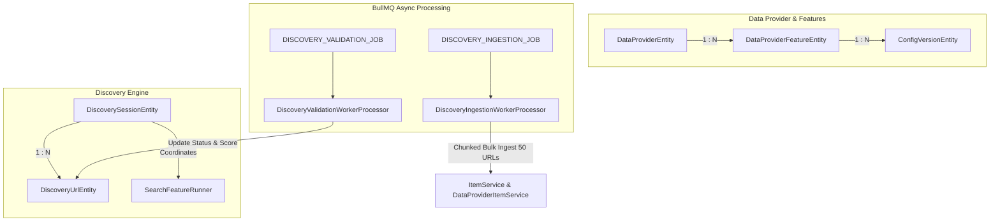

# Archive: Kiến Trúc Toàn Diện Data Provider, Pluggable Feature Runners, Config Versioning & Async Discovery Engine

## 1. Problem & Core Value (Bài toán & Giá trị Cốt lõi)
- **Vấn đề (Problem)**:
  - **Cấu hình & Phiên bản**: Trước đây, `DataProviderEntity` bị phụ thuộc phân cấp cha-con (`parentId`), cấu hình nhồi nhét vào bảng `data_providers`, controller bị gánh đa nhiệm vụ (god controller), DTOs dùng kiểu `any` lỏng lẻo, và `@automapper/classes` không map được polymorphic interface fields (`config: TargetConfig`).
  - **Discovery Session & Search Integration**: Discovery Session từng phụ thuộc vào lớp `DiscoveryRunner` thừa thãi, chỉ hỗ trợ từ khóa đơn lẻ `targetKeyword: string` thay vì mảng từ khóa `targetKeywords: string[]`, không tận dụng được năng lực tìm kiếm của `SearchFeatureRunner`.
  - **Validation Tracking**: Quá trình xác thực URL từng tạo ra thực thể trung gian `DiscoveryValidationBatchEntity`, gây phân mảnh trạng thái và dư thừa các bảng staging/batch không cần thiết.
  - **Ingestion Query Bottleneck**: Luồng Ingestion thực hiện 5–7 database roundtrips tuần tự cho mỗi URL đơn lẻ ($O(7N)$ trong batch), gây tắc nghẽn connection pool và nguy cơ race condition giữa các concurrent workers khi cùng tạo mới Item.
- **Giá trị (Value)**:
  1. **Flat & Pluggable Architecture**: `DataProvider` được thiết kế phẳng, độc lập. Các năng lực (`SCRAPING`, `SEARCH`) trừu tượng hóa qua `IFeatureRunner` và đăng ký tập trung vào `FeatureRunnerRegistry`.
  2. **100% Strict Type Safety & TargetConfig Validation**: Định nghĩa `TargetConfig = IScrapingTargetConfig | ISearchTargetConfig`. `TargetConfigValidatorHelper` kiểm tra schema và cú pháp script trước khi lưu vào DB hoặc chạy sandbox test.
  3. **Isolated Config Versioning & Rollback**: `ConfigVersionEntity` gắn trực tiếp theo `featureId` với dedicated controller `ConfigVersionController`.
  4. **Integrated Discovery Session Engine**: `DiscoverySessionService` điều phối trực tiếp luồng tìm kiếm URL thông qua `SearchFeatureRunner` với đa từ khóa (`targetKeywords: string[]`), phát hiện links theo phân trang (`maxPages`) và lưu vết trực tiếp vào `DiscoveryUrlEntity`.
  5. **Direct Session Validation Tracking**: Hợp nhất toàn bộ tiến độ và số liệu thống kê validation trực tiếp vào `DiscoverySessionEntity` (`totalValidated`, `totalMatched`, `totalNoMatch`), loại bỏ hoàn toàn `DiscoveryValidationBatchEntity`.
  6. **High-Throughput Chunked Ingestion Pipeline**:
     - Tối ưu tra cứu `Item` đơn lẻ bằng query kết hợp `findListByFilter([{ code }, { name }])`.
     - Hỗ trợ `ingestDiscoveredUrlsChunk` gom nhóm batch (kích thước chuẩn `DISCOVERY_INGESTION_CHUNK_SIZE = 50`) thực hiện bulk lookup, in-memory deduplication và bulk status update (giảm từ $O(7N)$ xuống $O(5)$ queries cho cả chunk).

---

## 2. Key Architecture & Decisions (Kiến trúc & Quyết định Then chốt)

### 2.1 Entity & Feature Model
- `DataProviderEntity`: Độc lập, định danh phẳng (`identifier`, `baseUrl`).
- `DataProviderFeatureEntity`: Quản lý `type` (`SCRAPING`, `SEARCH`), `service: ScraperServiceEnum`, `status: DataProviderFeatureStatus`, và polymorphic `config: TargetConfig`.
- `ConfigVersionEntity`: Snapshot cấu hình theo từng `featureId`.
- `DiscoverySessionEntity`: Lưu trữ phiên discovery, danh sách `targetKeywords`, tổng số URL phát hiện, trạng thái session và counters thống kê validation/ingestion.
- `DiscoveryUrlEntity`: Lưu từng link phát hiện, score đánh giá, validation logs và trạng thái (`PENDING`, `VALIDATING`, `COMPLETED`, `QUEUED`, `INGESTED`, `FAILED`).

### 2.2 Asynchronous Worker & Queue Pipelines
1. **Search Discovery Pipeline**: `DiscoverySessionService` kích hoạt `SearchFeatureRunner` theo từng keyword để thu thập danh sách URL ban đầu.
2. **Validation Worker Pipeline**: Worker `DiscoveryValidationWorkerProcessor` (`QUEUE_NAME.DISCOVERY_VALIDATION_JOB`) thực hiện heuristic validation và cập nhật atomic progress vào `DiscoverySessionEntity`.
3. **Chunked Ingestion Worker Pipeline**: `DiscoveryUrlService.batchIngest` chia tập URLs thành các chunks 50 items (`DISCOVERY_INGESTION_CHUNK_SIZE`) đẩy vào Bull Queue `QUEUE_NAME.DISCOVERY_INGESTION_JOB`. Worker `DiscoveryIngestionWorkerProcessor` ủy quyền cho `DiscoveryUrlService.ingestDiscoveredUrlsChunk(urlIds)`.

---

## 3. Scope & Key Components (Phạm vi & Thành phần Chính)

- [target-config.interface.ts](file:///d:/Sources/Personal/only-one-be/src/modules/data-provider/interfaces/target-config.interface.ts): Hợp đồng kiểu dữ liệu đa hình `TargetConfig`.
- [target-config-validator.helper.ts](file:///d:/Sources/Personal/only-one-be/src/modules/data-provider/helpers/target-config-validator.helper.ts): Module kiểm tra tính hợp lệ của cấu hình.
- [discovery-constants.ts](file:///d:/Sources/Personal/only-one-be/src/modules/data-provider/constants/discovery-constants.ts): Hằng số `DISCOVERY_INGESTION_CHUNK_SIZE = 50`, `PDP_POSITIVE_KEYWORDS`, `PDP_NEGATIVE_KEYWORDS`.
- [discovery-session.service.ts](file:///d:/Sources/Personal/only-one-be/src/modules/data-provider/services/discovery-session.service.ts): Service quản lý phiên discovery tích hợp search feature.
- [discovery-url.service.ts](file:///d:/Sources/Personal/only-one-be/src/modules/data-provider/services/discovery-url.service.ts): Service xử lý URL, tối ưu truy vấn Item đơn lẻ và pipeline bulk chunked ingestion.
- [discovery-ingestion-worker.processor.ts](file:///d:/Sources/Personal/only-one-be/src/modules/worker/processors/discovery-ingestion-worker.processor.ts): Worker xử lý chunked batch ingestion.
- [discovery-validation-worker.processor.ts](file:///d:/Sources/Personal/only-one-be/src/modules/worker/processors/discovery-validation-worker.processor.ts): Worker xử lý validation.

---

## 4. Verification Evidence & PR (Bằng chứng Nghiệm thu & PR)

- **Type Check**: `npx tsc -p tsconfig.build.json --noEmit` $\rightarrow$ 100% PASS (0 errors).
- **NestJS Build**: `npm run build` $\rightarrow$ 100% PASS.
- **Unit & Architectural Verification**: Tất cả các thành phần tuân thủ nghiêm ngặt các negative rules trong `only-one/rules.md`.
