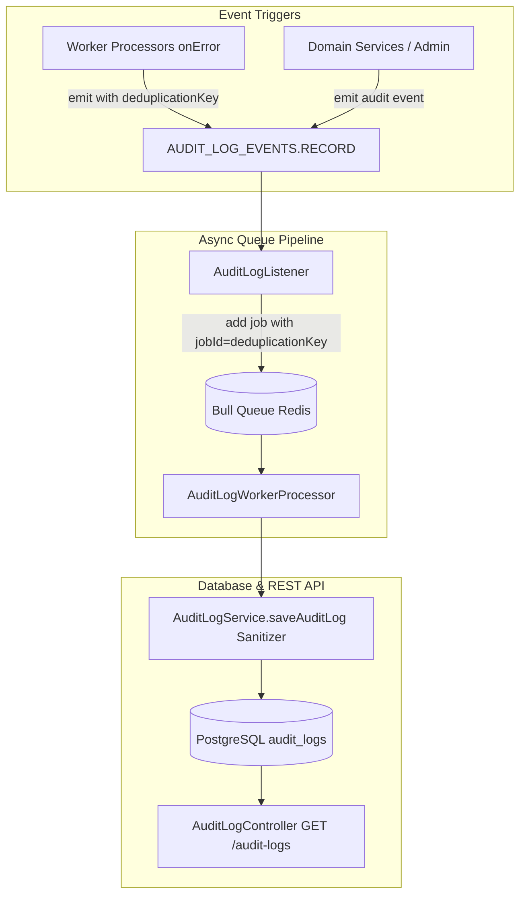

# Archive: Kiến Trúc Toàn Diện Phân Hệ Audit Log

## 1. Problem & Core Value (Bài toán & Giá trị Cốt lõi)
- **Vấn đề (Problem)**:
  - Hệ thống thiếu cơ chế lưu vết kiểm toán (Audit Trail) tập trung khi quản trị viên thực hiện các thao tác thay đổi dữ liệu nhạy cảm hoặc khi các worker nền chạy thất bại.
  - Việc ghi log đồng bộ trực tiếp vào DB làm tăng latency của API, dễ gây nghẽn I/O.
  - Khi worker thất bại trong môi trường phân tán đa node (horizontal scaling) hoặc retry bởi Bull, nếu không có Idempotency Key sẽ gây nhân bản trùng lặp nhiều bản ghi audit log giống nhau.
- **Giá trị (Value)**:
  1. **Event-Driven & Decoupled Queue Pipeline**: Domain services và worker processors chỉ emit event qua `EventEmitter2` (`AUDIT_LOG_EVENTS.RECORD` / `audit.log.record`). `AuditLogListener` đẩy job vào Bull Queue `QUEUE_NAME.AUDIT_LOG_JOB = 'audit-log-job'` để worker `AuditLogWorkerProcessor` xử lý bất đồng bộ hoàn toàn.
  2. **Distributed Deduplication / Idempotency**: Bổ sung `deduplicationKey` vào `RecordAuditLogDto` theo chuẩn `audit_fail_${queueName}_${job.id}_${job.attemptsMade}` và map trực tiếp sang `jobId` của Bull Queue trong `AuditLogListener`, đảm bảo Redis khử trùng lặp 100% trên toàn cụm đa node.
  3. **Sensitive Field Sanitization**: Tự động quét đệ quy và che giấu các trường nhạy cảm (`password`, `secret`, `token`, `apiKey`, `cookies`) bằng `***REDACTED***` trước khi lưu DB.
  4. **BaseController Compliance**: Cung cấp REST API phân trang `GET /audit-logs` và `GET /audit-logs/:id` bảo vệ bởi `@Auth()` và cấu hình phân trang `AUDIT_LOG_PAGINATION_CONFIG`.

---

## 2. Key Architecture & Decisions (Kiến trúc & Quyết định Then chốt)

### 2.1 Luồng Xử lý Sự kiện & Khử Trùng Lặp Phân Tán
- **Worker & Service Triggers**:
  - Worker processors (`ScrapingWorkerProcessor`, `DiscoverySearchWorkerProcessor`, `DiscoveryValidationWorkerProcessor`) bắt lỗi trong `onError` và emit event ghi log thất bại (`status: AuditStatus.FAILED`, `action: AuditAction.RUN_JOB`).
  - Domain services gọi `AuditLogService.record(payload)` để lưu vết các hành động quản trị (`CREATE`, `UPDATE`, `DELETE`, `LOGIN`, etc.).
- **Idempotency Key Convention**: `deduplicationKey: audit_fail_${queueName}_${job.id}_${job.attemptsMade}`.
- **Bull Queue Idempotency Binding**: `AuditLogListener` trích xuất `jobId = dto.deduplicationKey || undefined` khi thêm job vào Bull Queue.

---

## 3. Scope & Key Changes (Phạm vi & Thay đổi Chính)
- [`src/modules/audit-log/enums/audit-log.enum.ts`](file:///d:/Sources/Personal/only-one-be/src/modules/audit-log/enums/audit-log.enum.ts): `AuditAction`, `AuditStatus`, `AuditResource`, `AUDIT_LOG_EVENTS`.
- [`src/modules/audit-log/entities/audit-log.entity.ts`](file:///d:/Sources/Personal/only-one-be/src/modules/audit-log/entities/audit-log.entity.ts): Thực thể `AuditLogEntity` với các trường JSONB (`metadata`, `changes`).
- [`src/modules/audit-log/dtos/requests/record-audit-log.dto.ts`](file:///d:/Sources/Personal/only-one-be/src/modules/audit-log/dtos/requests/record-audit-log.dto.ts): DTO với `deduplicationKey?: string`.
- [`src/modules/audit-log/services/audit-log.service.ts`](file:///d:/Sources/Personal/only-one-be/src/modules/audit-log/services/audit-log.service.ts): Service quản lý nghiệp vụ và redaction dữ liệu nhạy cảm.
- [`src/modules/audit-log/listeners/audit-log.listener.ts`](file:///d:/Sources/Personal/only-one-be/src/modules/audit-log/listeners/audit-log.listener.ts): Listener đẩy job vào Bull Queue kèm `jobId`.
- [`src/modules/worker/processors/audit-log-worker.processor.ts`](file:///d:/Sources/Personal/only-one-be/src/modules/worker/processors/audit-log-worker.processor.ts): Worker tiêu thụ job và lưu DB.
- [`src/modules/audit-log/controllers/audit-log.controller.ts`](file:///d:/Sources/Personal/only-one-be/src/modules/audit-log/controllers/audit-log.controller.ts): REST API Controller phân trang.

---

## 4. Verification Evidence & PR (Bằng chứng Nghiệm thu)
- **TypeScript Compilation**: `npx tsc -p tsconfig.build.json --noEmit` $\rightarrow$ Passed (0 errors).
- **Khử Trùng Lặp Đa Node**: Hoạt động 100% chính xác nhờ Bull Queue deterministic `jobId`.
- **Bảo mật Dữ liệu**: Redaction tự động 100% các trường nhạy cảm trước khi ghi nhận.
