# Archive: Kiến Trúc Toàn Diện Data Provider, Pluggable Feature Runners, Config Versioning, Async Discovery Engine & DB Trigger Progress Sync

## 1. Problem & Core Value (Bài toán & Giá trị Cốt lõi)
- **Vấn đề (Problem)**:
  - **Cấu hình & Phiên bản**: Trước đây, `DataProviderEntity` bị phụ thuộc phân cấp cha-con (`parentId`), cấu hình nhồi nhét vào bảng `data_providers`, controller bị gánh đa nhiệm vụ (god controller), DTOs dùng kiểu `any` lỏng lẻo.
  - **Discovery Session & Validation Bottleneck**: Tầng ứng dụng (`discovery-url.service.ts`) tự thực hiện 2 câu lệnh SQL thủ công (`UPDATE ... total_validated + 1` và `SELECT ... WHERE total_validated >= total_discovered`) trong transaction mỗi khi worker validate xong 1 URL, gây ra Counter Drift và tốn round-trips không cần thiết.
  - **Ingestion Query Bottleneck**: Luồng Ingestion thực hiện 5–7 database roundtrips tuần tự cho mỗi URL đơn lẻ ($O(7N)$ trong batch), gây tắc nghẽn connection pool.
- **Giá trị (Value)**:
  1. **Flat & Pluggable Architecture**: `DataProvider` được thiết kế phẳng, độc lập. Các năng lực (`SCRAPING`, `SEARCH`) trừu tượng hóa qua `IFeatureRunner` và đăng ký tập trung vào `FeatureRunnerRegistry`.
  2. **100% Strict Type Safety & TargetConfig Validation**: Định nghĩa `TargetConfig = IScrapingTargetConfig | ISearchTargetConfig`. `TargetConfigValidatorHelper` kiểm tra schema và cú pháp script trước khi lưu vào DB hoặc chạy sandbox test.
  3. **Isolated Config Versioning & Rollback**: `ConfigVersionEntity` gắn trực tiếp theo `featureId` với dedicated controller `ConfigVersionController`.
  4. **Integrated Discovery Session Engine**: `DiscoverySessionService` điều phối trực tiếp luồng tìm kiếm URL thông qua `SearchFeatureRunner` với đa từ khóa (`targetKeywords: string[]`), phát hiện links theo phân trang và lưu vết trực tiếp vào `DiscoveryUrlEntity`.
  5. **PostgreSQL Trigger Progress Sync**: Chuyển toàn bộ logic tổng hợp tiến độ (`total_discovered`, `total_validated`, `matched_urls`, `no_match_urls`) và tự động chuyển trạng thái `completed` về cấp cơ sở dữ liệu qua PL/pgSQL function `fn_sync_discovery_session_progress` và trigger `trg_sync_discovery_session_progress` kết hợp composite index `IDX_discovery_urls_session_validation`.
  6. **High-Throughput Chunked Ingestion Pipeline**: Hỗ trợ `ingestDiscoveredUrlsChunk` gom nhóm batch (chuẩn `DISCOVERY_INGESTION_CHUNK_SIZE = 50`) thực hiện bulk lookup, in-memory deduplication và bulk status update (giảm từ $O(7N)$ xuống $O(5)$ queries cho cả chunk).

---

## 2. Key Architecture & Decisions (Kiến trúc & Quyết định Then chốt)

### 2.1 Entity & Feature Model
- `DataProviderEntity`: Độc lập, định danh phẳng (`identifier`, `baseUrl`).
- `DataProviderFeatureEntity`: Quản lý `type` (`SCRAPING`, `SEARCH`), `service: ScraperServiceEnum`, `status: DataProviderFeatureStatus`, và polymorphic `config: TargetConfig`.
- `ConfigVersionEntity`: Snapshot cấu hình theo từng `featureId`.
- `DiscoverySessionEntity`: Lưu trữ phiên discovery, danh sách `targetKeywords`, tổng số URL phát hiện, trạng thái session và counters thống kê validation/ingestion.
- `DiscoveryUrlEntity`: Lưu từng link phát hiện, score đánh giá, validation logs và trạng thái (`PENDING`, `VALIDATING`, `COMPLETED`, `QUEUED`, `INGESTED`, `FAILED`).

### 2.2 Asynchronous Worker & DB Trigger Pipelines
1. **Search Discovery Pipeline**: `DiscoverySessionService` kích hoạt `SearchFeatureRunner` theo từng keyword để thu thập danh sách URL ban đầu.
2. **Validation Worker Pipeline**: Worker `DiscoveryValidationWorkerProcessor` (`QUEUE_NAME.DISCOVERY_VALIDATION_JOB`) thực hiện heuristic validation và lưu kết quả vào `discovery_urls`.
3. **Database Trigger Sync**: PostgreSQL Trigger `trg_sync_discovery_session_progress` trên bảng `discovery_urls` tự động kích hoạt `fn_sync_discovery_session_progress` để aggregate số liệu và cập nhật `discovery_sessions` nguyên tử (atomic).
4. **Chunked Ingestion Worker Pipeline**: `DiscoveryUrlService.batchIngest` chia tập URLs thành các chunks 50 items (`DISCOVERY_INGESTION_CHUNK_SIZE`) đẩy vào Bull Queue `QUEUE_NAME.DISCOVERY_INGESTION_JOB`. Worker `DiscoveryIngestionWorkerProcessor` ủy quyền cho `DiscoveryUrlService.ingestDiscoveredUrlsChunk(urlIds)`.

```mermaid
flowchart TD
    subgraph CoreDomain ["Data Provider & Features"]
        DP[DataProviderEntity] -->|1 : N| DPF[DataProviderFeatureEntity]
        DPF -->|1 : N| CV[ConfigVersionEntity]
    end

    subgraph DiscoveryFlow ["Discovery Engine & DB Trigger"]
        Session[DiscoverySessionEntity] -->|1 : N| URLs[DiscoveryUrlEntity]
        Session -->|Coordinates| SearchRunner[SearchFeatureRunner]
        URLs -->|Trigger on status change| DBTrigger[trg_sync_discovery_session_progress]
        DBTrigger -->|Atomic Aggregation Update| Session
    end

    subgraph IngestionFlow ["Chunked Ingestion"]
        URLs -->|Batch Chunk 50| Queue[DISCOVERY_INGESTION_JOB]
        Queue --> IngestionWorker[DiscoveryIngestionWorkerProcessor]
        IngestionWorker --> IngestionMethod[ingestDiscoveredUrlsChunk]
    end
```

---

## 3. Scope & Key Changes (Phạm vi & Thay đổi Chính)
- [`src/migrations/1765900000000-CreateDiscoverySessionProgressTrigger.ts`](file:///d:/Sources/Personal/only-one-be/src/migrations/1765900000000-CreateDiscoverySessionProgressTrigger.ts): Migration tạo trigger function, trigger và composite index.
- [`src/modules/data-provider/entities/`](file:///d:/Sources/Personal/only-one-be/src/modules/data-provider/entities): `DataProviderEntity`, `DataProviderFeatureEntity`, `ConfigVersionEntity`, `DiscoverySessionEntity`, `DiscoveryUrlEntity`, `DiscoveryValidationLogEntity`.
- [`src/modules/data-provider/interfaces/target-config.interface.ts`](file:///d:/Sources/Personal/only-one-be/src/modules/data-provider/interfaces/target-config.interface.ts): `TargetConfig`, `IScrapingTargetConfig`, `ISearchTargetConfig`.
- [`src/modules/data-provider/runners/`](file:///d:/Sources/Personal/only-one-be/src/modules/data-provider/runners): `IFeatureRunner`, `FeatureRunnerRegistry`, `ScrapingFeatureRunner`, `SearchFeatureRunner`.
- [`src/modules/data-provider/services/`](file:///d:/Sources/Personal/only-one-be/src/modules/data-provider/services): `DataProviderService`, `DataProviderFeatureService`, `ConfigVersionService`, `DiscoverySessionService`, `DiscoveryUrlService`.
- [`src/modules/data-provider/controllers/`](file:///d:/Sources/Personal/only-one-be/src/modules/data-provider/controllers): `DataProviderController`, `DataProviderFeatureController`, `ConfigVersionController`, `DiscoverySessionController`, `DiscoveryUrlController`.
- [`src/modules/worker/processors/`](file:///d:/Sources/Personal/only-one-be/src/modules/worker/processors): `DiscoverySearchWorkerProcessor`, `DiscoveryValidationWorkerProcessor`, `DiscoveryIngestionWorkerProcessor`.

---

## 4. Verification Evidence & PR (Bằng chứng Nghiệm thu)
- **TypeScript Compilation**: `npx tsc -p tsconfig.build.json --noEmit` $\rightarrow$ Passed (0 errors).
- **Trạng thái Database**: Trigger tự động đồng bộ 100% metrics session khi có thay đổi trạng thái URL.
