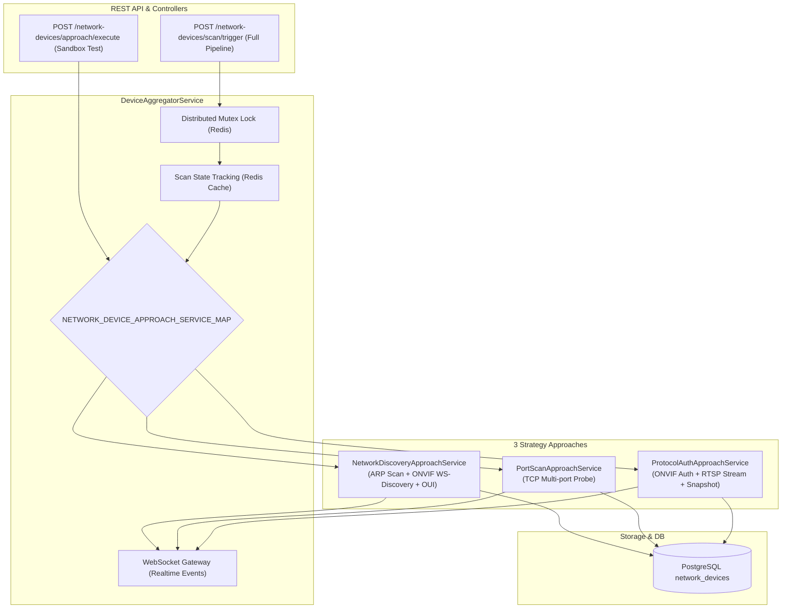

# Archive: Hệ Thống Khám Phá, Quét Cổng & Xác Thực Thiết Bị Mạng Chuẩn Hóa Theo Service Map (Network Device Discovery & Probing Suite)

## 1. Problem & Core Value (Bài toán & Giá trị Cốt lõi)
- **Vấn đề (Problem)**:
  - Hệ thống trước đây thiếu khả năng tự động rà quét subnet mạng nội bộ (LAN/Wi-Fi), yêu cầu người dùng phải cấu hình IP/port tĩnh cho camera và thiết bị ngoại vi.
  - Ban đầu bản tin ONVIF SOAP XML bị sai lệch namespace (`<dn:Probe>` thuộc WSDL namespace thay vì WS-Discovery schema `http://schemas.xmlsoap.org/ws/2005/04/discovery`), bộ lọc `Types` bị gán cứng `dn:NetworkVideoTransmitter`, và chỉ gửi multicast `239.255.255.250` dẫn đến 100% camera/thiết bị mạng drop gói tin.
  - Sau khi quét ra IP, `DeviceAggregatorService` bị liên kết cứng (hard-coupled) với các probe service rời rạc, chưa chuẩn hóa thành 3 Hướng Tiếp Cận (3 Approaches), thiếu khả năng sandbox test độc lập và thiếu dịch vụ xác thực tài khoản camera tự động với dictionary credentials.
- **Giá trị (Value)**:
  - Tổ chức toàn diện phân hệ thiết bị mạng thành **3 Hướng Tiếp Cận (3 Approaches: `NETWORK_DISCOVERY`, `PORT_SCAN`, `PROTOCOL_AUTH`)** thông qua NestJS Provider Factory Map (`NETWORK_DEVICE_APPROACH_SERVICE_MAP`) và generic interface `INetworkDeviceApproachService`.
  - Chuẩn hóa WS-Discovery multi-target broadcast (Multicast `239.255.255.250`, Global Broadcast `255.255.255.255`, Subnet Directed Broadcast trên các active network interfaces), bóc tách metadata và phân loại thông minh (`CAMERA`, `PRINTER`, `ROUTER_AP`, `SMART_IOT`).
  - Cung cấp dịch vụ **`ProtocolAuthApproachService`** tự động xác thực tài khoản camera với từ điển mặc định/tùy chỉnh, trích xuất RTSP stream URI, snapshot preview thumbnail và metadata thiết bị.
  - Cung cấp endpoint sandbox độc lập `POST /network-devices/approach/execute` và pipeline quét tổng hợp phân tán `POST /network-devices/scan/trigger` hỗ trợ Redis Distributed Lock, Scan State Cache, phân trang chuẩn (`nestjs-paginate`) và WebSocket realtime streaming (`DEVICE_SCAN_STARTED`, `DEVICE_DISCOVERED`, `DEVICE_SCAN_COMPLETED`).

## 2. Key Architecture & Decisions (Kiến trúc & Quyết định Then chốt)

### 2.1 Kiến trúc 3 Hướng Tiếp Cận & Service Map
- **Enum `NetworkDeviceApproachEnum`**:
  - `NETWORK_DISCOVERY`: Tầng Mạng (Layer 2/3) - Quét ARP bảng OS & ONVIF WS-Discovery đa tầng kết hợp tra cứu OUI vendor.
  - `PORT_SCAN`: Tầng Cổng (Layer 4) - Thử nghiệm mở cổng TCP đồng thời (80, 443, 554 RTSP, 8000, 8080, 37777...) với concurrency limit và short timeout (300ms).
  - `PROTOCOL_AUTH`: Tầng Ứng dụng & Xác thực (Layer 7) - Thử danh sách credentials mẫu/tùy chỉnh, kết nối ONVIF Device/Media management, trích xuất stream RTSP và snapshot thumbnail.
- **Service Map Pattern (`NETWORK_DEVICE_APPROACH_SERVICE_MAP`)**:
  - Factory Provider ánh xạ trực tiếp `NetworkDeviceApproachEnum` tới các service instance tương ứng (`NetworkDiscoveryApproachService`, `PortScanApproachService`, `ProtocolAuthApproachService`).

### 2.2 Sơ đồ Luồng Hoạt động (Architecture Diagram)

### 2.3 Phân tán Trạng thái Quét & Khử Trùng Lặp
- **Redis Mutex Lock**: Ngăn chặn 2 request quét mạng chạy đồng thời qua `acquireScanLock` (TTL 300s) và `releaseScanLock` (Lua script kiểm tra token).
- **State Tracking**: Quản lý vòng đời trạng thái (`IDLE` $\rightarrow$ `SCANNING` $\rightarrow$ `COMPLETED` / `FAILED`) trên Redis Cache.
- **Realtime Dispatch**: Bắn các sự kiện qua `EventEmitter2` tới `WebsocketGateway` để truyền phát cho client đang kết nối.

## 3. Scope & Key Changes (Phạm vi & Thay đổi Chính)
- [network-device-approach.enum.ts](file:///Users/kiem/Sources/PERSONAL/only-one-be/src/modules/network-device/enums/network-device-approach.enum.ts): Enum 3 hướng tiếp cận (`NETWORK_DISCOVERY`, `PORT_SCAN`, `PROTOCOL_AUTH`).
- [network-device-approach.interface.ts](file:///Users/kiem/Sources/PERSONAL/only-one-be/src/modules/network-device/interfaces/network-device-approach.interface.ts): Interface `INetworkDeviceApproachService`, `INetworkDeviceTarget`, `INetworkDeviceApproachResult`.
- [network-device-approach-service-map.ts](file:///Users/kiem/Sources/PERSONAL/only-one-be/src/modules/network-device/constants/network-device-approach-service-map.ts): Custom Factory Provider Map cho các approach services.
- [camera-credentials.constant.ts](file:///Users/kiem/Sources/PERSONAL/only-one-be/src/modules/network-device/constants/camera-credentials.constant.ts): Bộ từ điển credentials camera mặc định.
- [onvif.constant.ts](file:///Users/kiem/Sources/PERSONAL/only-one-be/src/modules/network-device/constants/onvif.constant.ts): Bản tin WS-Discovery SOAP XML và hằng số mạng.
- [onvif-xml-parser.helper.ts](file:///Users/kiem/Sources/PERSONAL/only-one-be/src/modules/network-device/helpers/onvif-xml-parser.helper.ts): Parser XML bóc tách XAddrs, Scopes, Device Types.
- [arp-parser.helper.ts](file:///Users/kiem/Sources/PERSONAL/only-one-be/src/modules/network-device/helpers/arp-parser.helper.ts): Parser bảng ARP hệ điều hành.
- [network-subnet.helper.ts](file:///Users/kiem/Sources/PERSONAL/only-one-be/src/modules/network-device/helpers/network-subnet.helper.ts): Helper tính toán IP subnet và broadcast interfaces.
- [network-discovery-approach.service.ts](file:///Users/kiem/Sources/PERSONAL/only-one-be/src/modules/network-device/services/network-device-approach/network-discovery-approach.service.ts): Triển khai Hướng Tiếp Cận 1 (ARP & ONVIF WS-Discovery).
- [port-scan-approach.service.ts](file:///Users/kiem/Sources/PERSONAL/only-one-be/src/modules/network-device/services/network-device-approach/port-scan-approach.service.ts): Triển khai Hướng Tiếp Cận 2 (TCP Port Scan).
- [protocol-auth-approach.service.ts](file:///Users/kiem/Sources/PERSONAL/only-one-be/src/modules/network-device/services/network-device-approach/protocol-auth-approach.service.ts): Triển khai Hướng Tiếp Cận 3 (ONVIF & Camera Auth).
- [oui-lookup.service.ts](file:///Users/kiem/Sources/PERSONAL/only-one-be/src/modules/network-device/services/oui-lookup.service.ts): Tra cứu OUI MAC để xác định Vendor phần cứng.
- [device-aggregator.service.ts](file:///Users/kiem/Sources/PERSONAL/only-one-be/src/modules/network-device/services/device-aggregator.service.ts): Service điều phối pipeline quét đa tầng qua Service Map.
- [network-device.service.ts](file:///Users/kiem/Sources/PERSONAL/only-one-be/src/modules/network-device/services/network-device.service.ts): CRUD và upsert thiết bị mạng vào DB.
- [network-device.controller.ts](file:///Users/kiem/Sources/PERSONAL/only-one-be/src/modules/network-device/controllers/network-device.controller.ts): REST API endpoints cho approach sandbox test và scan pipeline.
- [network-device.module.ts](file:///Users/kiem/Sources/PERSONAL/only-one-be/src/modules/network-device/network-device.module.ts): Đăng ký toàn bộ module, services và provider factory map.

## 4. Verification Evidence & PR (Bằng chứng Nghiệm thu & PR)
- **Unit Tests**:
  - `src/modules/network-device/helpers/_tests/onvif-xml-parser.helper.spec.ts` $\rightarrow$ `PASS (100%)`.
  - `src/modules/network-device/services/_tests/protocol-auth-approach.service.spec.ts` $\rightarrow$ `PASS (100%)`.
- **TypeScript Strict Build**: `npm run build` $\rightarrow$ `PASS (0 errors)`.
- **Type Check**: `npx tsc -p tsconfig.build.json --noEmit` $\rightarrow$ `PASS (0 errors)`.
- **ESLint**: `ESLINT_USE_FLAT_CONFIG=false npx eslint src/modules/network-device` $\rightarrow$ `PASS (0 errors)`.
