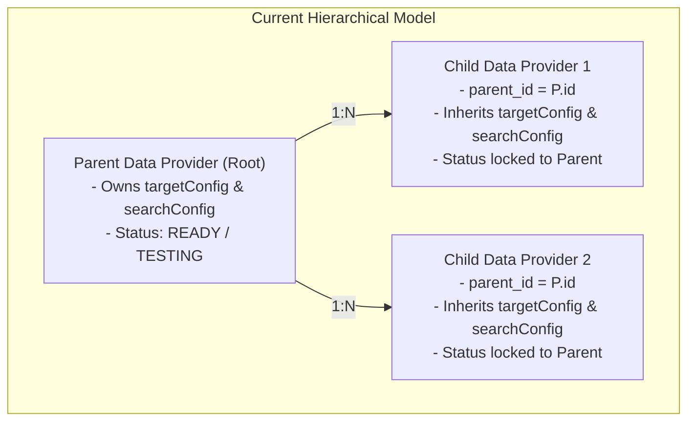
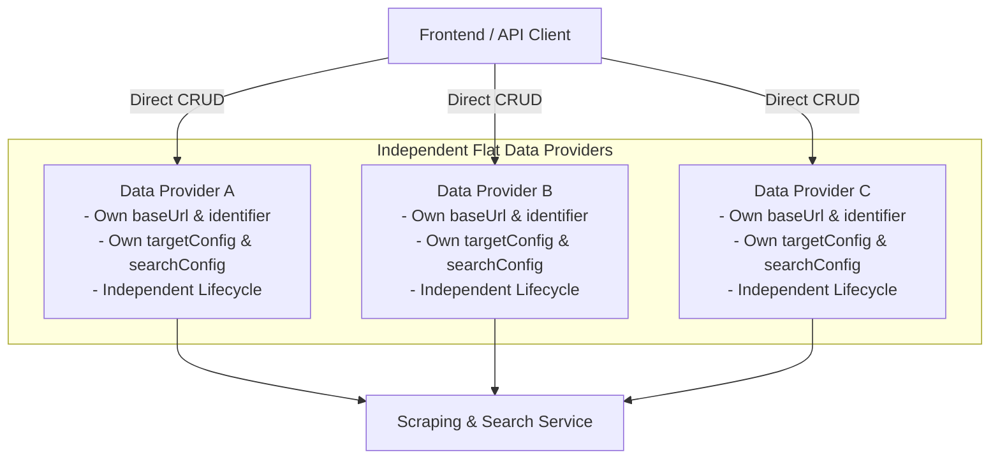

# Technical Proposal: Remove Parent-Child Hierarchy from DataProvider

## 1. Problem Statement & Core Concept

- **Core Business Problem**: Currently, `DataProvider` supports a hierarchical parent-child structure (`parentId`, `parent`, `children`). In practice, this hierarchy causes unnecessary complexity:
  - Implicit inheritance of `targetConfig` and `searchConfig` from parent to child entities.
  - Complex cascading status transitions (`READY`, `TESTING`, `UNCONFIGURED`) tightly coupled to parent state.
  - Complex validation in CRUD operations (checking cyclic dependencies, verifying parent existence, restricting identifier uniqueness conditionally).
  - UI complexity in data provider management (displaying and maintaining parent references).
- **Core Value & Target Audience**: Simplifies data provider architecture, reduces cognitive load, eliminates edge cases in configuration resolution, and provides a clean, flat entity model where every Data Provider independently owns its URL, identifier, configurations, and lifecycle status.
- **Success Metrics (Definition of Done)**:
  - Database schema updated: `parent_id` column and foreign key constraint dropped via TypeORM migration.
  - Clean entities and DTOs: `parentId`, `parent`, and `children` completely removed from backend & frontend type definitions.
  - Simplified CRUD & Service layer: `DataProviderService`, `ScrapingDataService`, `DataProviderSearchService`, `GenericDataProviderScraperService`, and `GenericDataProviderSearchService` directly access provider configurations without parent lookups/fallbacks.
  - Simplified UI: Parent selection removed from Frontend Data Provider forms/modals.
  - Automated tests and build checks pass without regressions.
- **Scope Boundaries**:
  - **In-Scope**:
    - Backend: Remove `parentId`, `parent`, `children` from `DataProviderEntity`, DTOs, Mappers, and Service layer.
    - Database: Create TypeORM migration to drop foreign key constraint and `parent_id` column.
    - Frontend: Remove `parentId` field from types, hooks, and DataProviderFormModal.
  - **Explicit Out-of-Scope**:
    - Altering parser function execution runtime or scraper engine core logic.
    - Modifying data structures of `ITargetConfig` or `ISearchConfig`.
    - Modifying `DataProviderItem` or `ConfigVersion` lifecycle logic.

---

## 2. Current Business Logic (As-is Analysis)

### Current Execution Flow & Coupled Logic
1. **Entity Relationships** ([data-provider.entity.ts](file:///d:/Sources/Personal/only-one-be/src/modules/data-provider/entities/data-provider.entity.ts#L56-L79)):
   - Defines column `parentId` (UUID) with self-referencing `@ManyToOne` relation `parent` and `@OneToMany` relation `children`.
2. **Configuration Fallback in findById & Services** ([data-provider.service.ts](file:///d:/Sources/Personal/only-one-be/src/modules/data-provider/services/data-provider.service.ts#L43-L53)):
   - If `dataProviderDto.parentId` exists, `targetConfig` and `searchConfig` fall back to `parent.targetConfig` and `parent.searchConfig`.
   - Similar fallback logic is duplicated in `generic-data-provider-scraper.service.ts` and `generic-data-provider-search.service.ts`.
3. **Creation & Update Guards** ([data-provider.service.ts](file:///d:/Sources/Personal/only-one-be/src/modules/data-provider/services/data-provider.service.ts#L69-L127)):
   - On `create`: Checks parent existence and copies `parent.identifier` to child.
   - On `update`: Checks parent presence, prevents self-parenting (`parentId === id`), prevents parent change if already a parent (`isParentDataProvider`), and checks unique identifier only where `parentId: IsNull()`.
4. **Status Transitions** ([data-provider.service.ts](file:///d:/Sources/Personal/only-one-be/src/modules/data-provider/services/data-provider.service.ts#L202-L260)):
   - Complex conditional branches based on `dataProvider.parentId` ensuring child can only be `READY` if `parent.status === READY`.

---

## 3. Proposed Solution Alternatives

### Option 1 (Recommended): Complete Flat Entity Model Refactoring

- **Solution Overview & Mechanics**:
  - Completely remove `parentId`, `parent`, and `children` properties from `DataProviderEntity`, DTOs, and mappings.
  - Simplify `DataProviderService`:
    - `findById`: Remove `{ relations: { parent: true } }` and remove configuration inheritance fallback.
    - `create`: Validate unique `baseUrl` and `identifier` globally.
    - `update`: Check unique `identifier` across all providers (`id: Not(id), identifier: data.identifier`).
    - `updateTargetConfig`: Remove `{ parentId: IsNull() }` constraint; allow updating target config for any provider.
    - `switchStatus`: Streamline status transition rules directly for the provider without querying parent.
  - Remove parent joins in `scraping-data.service.ts`, `data-provider-search.service.ts`, `generic-data-provider-search.service.ts`, and `generic-data-provider-scraper.service.ts`.
  - Frontend: Remove `parentId` field from forms, interfaces, and state.
  - Database: Add TypeORM migration dropping foreign key `FK_f75e897c7184b7a3455a4ac860a` and column `parent_id`.

- **Mermaid Diagram**:

- **Pros**:
  - Maximum simplicity and predictability: zero implicit fallback magic.
  - Completely cleans up ~100 lines of complex branching logic in `DataProviderService`.
  - Simplifies database schema and eliminates self-referential cascades.
  - Clean API contract and simpler frontend UI forms.
- **Cons**:
  - If two data providers share the exact same configuration, they must each maintain their own config or duplicate it.
- **Complexity & Risks**:
  - Complexity: Low.
  - Risks: Low. Existing child records in DB without their own `targetConfig` would need configs populated if they are actively in use (a simple data check or migration default can handle this).

---

### Option 2 (Alternative): Soft Deprecation / Retain DB Column but Ignore in Code

- **Solution Overview & Mechanics**:
  - Keep `parent_id` column in database as nullable.
  - Mark `parentId` as `@deprecated` in DTOs and ignore it in business logic.
- **Pros**:
  - Zero database migration risk.
- **Cons**:
  - Leaves dead schema, misleading API contracts, and technical debt in the codebase.
  - Confuses future development.
- **Complexity & Risks**:
  - Complexity: Low.
  - Risks: Moderate (technical debt accumulation).

---

### Comparison Matrix & Recommendation

| Criteria | Option 1: Complete Flat Refactoring (Recommended) | Option 2: Soft Deprecation |
| :--- | :--- | :--- |
| **Simplicity** | High (eliminates all dead code & complex branches) | Low (leaves dormant fields & ambiguity) |
| **Maintainability** | Excellent | Poor (technical debt remains) |
| **Codebase Impact** | Clean, targeted refactor across BE & FE | Partial refactor with lingering fields |
| **Risk Level** | Low (straightforward migration & code cleanup) | Low |

- **Conclusion**: Recommend **Option 1 (Complete Flat Entity Model Refactoring)** for complete cleanliness, consistency across frontend/backend, and permanent removal of unnecessary architectural complexity.

---

## 4. Key Failure Modes & Security Boundaries

- **Database Migration Constraint Handling**:
  - Dropping `parent_id` requires first dropping foreign key constraint `FK_f75e897c7184b7a3455a4ac860a` before dropping the column.
- **Data Integrity & Uniqueness**:
  - `identifier` was previously unique only among root providers (`parentId: IsNull()`). In flat model, each provider's `identifier` must be globally unique across all providers.
- **Authorization Boundary**:
  - Existing role-based access control (RBAC) and permissions for Data Provider management remain unchanged.

---

## 5. High-Level Technical Specifications

### Affected Modules & Files

#### Backend (`only-one-be`):
1. **Entity**:
   - [`src/modules/data-provider/entities/data-provider.entity.ts`](file:///d:/Sources/Personal/only-one-be/src/modules/data-provider/entities/data-provider.entity.ts): Remove `parentId`, `parent`, `children`.
2. **DTOs**:
   - [`src/modules/data-provider/dtos/data-provider.dto.ts`](file:///d:/Sources/Personal/only-one-be/src/modules/data-provider/dtos/data-provider.dto.ts): Remove `parentId`, `parent`, `children`.
   - [`src/modules/data-provider/dtos/requests/data-provider-request.dto.ts`](file:///d:/Sources/Personal/only-one-be/src/modules/data-provider/dtos/requests/data-provider-request.dto.ts): Remove `parentId` from `CreateDataProviderRequestDto` and `UpdateDataProviderRequestDto`.
3. **Services**:
   - [`src/modules/data-provider/services/data-provider.service.ts`](file:///d:/Sources/Personal/only-one-be/src/modules/data-provider/services/data-provider.service.ts): Remove parent checks, simplify `findById`, `create`, `update`, `updateTargetConfig`, `switchStatus`.
   - [`src/modules/data-provider/services/scraping-data.service.ts`](file:///d:/Sources/Personal/only-one-be/src/modules/data-provider/services/scraping-data.service.ts): Remove `.leftJoinAndSelect('dataProvider.parent', 'parent')`.
   - [`src/modules/data-provider/services/data-provider-search.service.ts`](file:///d:/Sources/Personal/only-one-be/src/modules/data-provider/services/data-provider-search.service.ts): Remove relation `parent` and parent searchConfig fallback.
   - [`src/modules/data-provider/services/data-provider-search/generic-data-provider-search.service.ts`](file:///d:/Sources/Personal/only-one-be/src/modules/data-provider/services/data-provider-search/generic-data-provider-search.service.ts): Remove parent searchConfig fallback.
   - [`src/modules/data-provider/services/data-provider-scraper/generic-data-provider-scraper.service.ts`](file:///d:/Sources/Personal/only-one-be/src/modules/data-provider/services/data-provider-scraper/generic-data-provider-scraper.service.ts): Remove parent targetConfig fallback.
4. **Migration**:
   - `src/migrations/<timestamp>-RemoveParentIdFromDataProvider.ts`: Drop FK constraint and `parent_id` column.

#### Frontend (`only-one-fe`):
1. **Types & Interfaces**:
   - [`src/interfaces/data-provider.d.ts`](file:///d:/Sources/Personal/only-one-fe/src/interfaces/data-provider.d.ts): Remove `parentId`.
   - [`src/app/(root)/scraping/data-providers/types.ts`](file:///d:/Sources/Personal/only-one-fe/src/app/\(root\)/scraping/data-providers/types.ts): Remove `parentId`.
2. **Hooks & Form Component**:
   - [`src/app/(root)/scraping/data-providers/hooks.ts`](file:///d:/Sources/Personal/only-one-fe/src/app/\(root\)/scraping/data-providers/hooks.ts): Remove `parentId` mapping.
   - [`src/app/(root)/scraping/data-providers/components/DataProviderFormModal.tsx`](file:///d:/Sources/Personal/only-one-fe/src/app/\(root\)/scraping/data-providers/components/DataProviderFormModal.tsx): Remove `parentId` field from initial values and remove `Parent Data Provider` select input.

---

## 6. Next Steps

- Confirm this technical proposal (`concept.md`).
- Run `/only-one-plan only-one/tasks/20260819-211200-remove-data-provider-parent-child` to generate the detailed implementation plan (`plan.md`).
