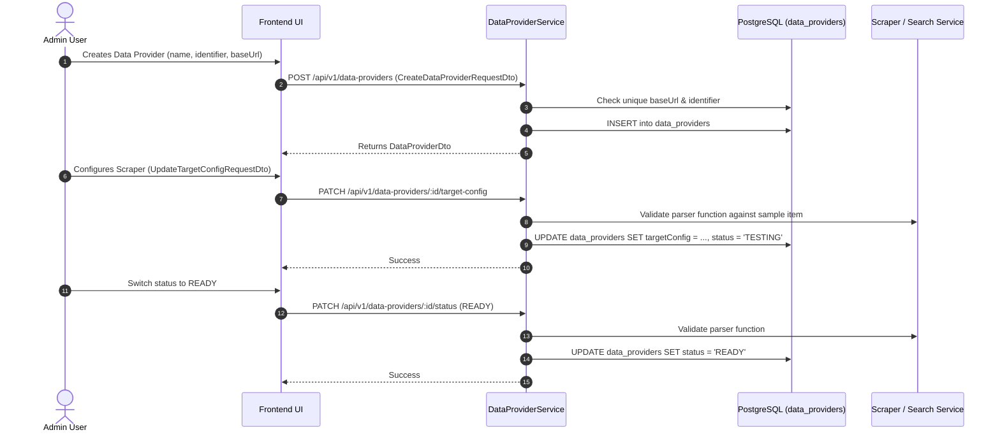

# Implementation Plan: Remove Parent-Child Hierarchy from DataProvider

Remove the parent-child (`parentId`, `parent`, `children`) hierarchical relationship from `DataProvider` across the backend database, TypeORM entities, DTOs, service logic, scrapers, search modules, and frontend UI. Transform `DataProvider` into a flat independent entity where each provider manages its own URL, identifier, scraping configuration (`targetConfig`), search configuration (`searchConfig`), and lifecycle status.

---

## Section 1. Current State

### 1.1 Verified Current Behavior

1. **Database Schema & Entity Declarations**:
   - [`src/modules/data-provider/entities/data-provider.entity.ts`](file:///d:/Sources/Personal/only-one-be/src/modules/data-provider/entities/data-provider.entity.ts#L56-L79): Defines `parentId?: string;`, relation `@OneToMany(() => DataProviderEntity, (entity) => entity.parent) children?: Relation<DataProviderEntity>[];`, and `@ManyToOne(() => DataProviderEntity, { onDelete: 'CASCADE' }) @JoinColumn({ name: 'parent_id' }) parent?: Relation<DataProviderEntity>;`.
   - Migration [`1762166303104-AddParentIdAtDataProviderTable.ts`](file:///d:/Sources/Personal/only-one-be/src/migrations/1762166303104-AddParentIdAtDataProviderTable.ts#L7-L13): Created column `parent_id` and foreign key constraint `FK_f75e897c7184b7a3455a4ac860a`.

2. **DTO & Request Contracts**:
   - [`src/modules/data-provider/dtos/data-provider.dto.ts`](file:///d:/Sources/Personal/only-one-be/src/modules/data-provider/dtos/data-provider.dto.ts#L53-L69): Contains `parentId`, `parent?: DataProviderDto`, and `children?: DataProviderDto[]`.
   - [`src/modules/data-provider/dtos/requests/data-provider-request.dto.ts`](file:///d:/Sources/Personal/only-one-be/src/modules/data-provider/dtos/requests/data-provider-request.dto.ts#L34-L72): Exposes `parentId?: string` in `CreateDataProviderRequestDto` and `UpdateDataProviderRequestDto`.

3. **Coupled Business Logic in Services**:
   - [`DataProviderService.findById`](file:///d:/Sources/Personal/only-one-be/src/modules/data-provider/services/data-provider.service.ts#L43-L53): Always loads relation `{ parent: true }`. If `parentId` exists, implicitly falls back `targetConfig` and `searchConfig` to `parent.targetConfig` and `parent.searchConfig`.
   - [`DataProviderService.create`](file:///d:/Sources/Personal/only-one-be/src/modules/data-provider/services/data-provider.service.ts#L69-L77): Looks up parent and overwrites `data.identifier = parent.identifier`.
   - [`DataProviderService.update`](file:///d:/Sources/Personal/only-one-be/src/modules/data-provider/services/data-provider.service.ts#L84-L127): Enforces parent existence, deletes `identifier` for child providers, prevents self-parenting, prevents changing `parentId` if it has children (`isParentDataProvider`), and queries unique `identifier` scoped only to `parentId: IsNull()`.
   - [`DataProviderService.updateTargetConfig`](file:///d:/Sources/Personal/only-one-be/src/modules/data-provider/services/data-provider.service.ts#L150-L153): Restricts target config update only to root providers (`parentId: IsNull()`).
   - [`DataProviderService.switchStatus`](file:///d:/Sources/Personal/only-one-be/src/modules/data-provider/services/data-provider.service.ts#L202-L260): Branches validation based on `if (!dataProvider.parentId) ... else ...`, forcing child providers' `READY`/`TESTING` status transitions to depend on `parent.status`.
   - [`ScrapingDataService.findAllDataProviderItemScrapingData`](file:///d:/Sources/Personal/only-one-be/src/modules/data-provider/services/scraping-data.service.ts#L178): Explicitly joins `dataProvider.parent`.
   - [`DataProviderSearchService`](file:///d:/Sources/Personal/only-one-be/src/modules/data-provider/services/data-provider-search.service.ts#L35-L69), [`GenericDataProviderSearchService`](file:///d:/Sources/Personal/only-one-be/src/modules/data-provider/services/data-provider-search/generic-data-provider-search.service.ts#L34), and [`GenericDataProviderScraperService`](file:///d:/Sources/Personal/only-one-be/src/modules/data-provider/services/data-provider-scraper/generic-data-provider-scraper.service.ts#L26): Fallback `searchConfig` and `targetConfig` to `dataProvider.parent.*`.

4. **Frontend Form & Types**:
   - [`src/app/(root)/scraping/data-providers/components/DataProviderFormModal.tsx`](file:///d:/Sources/Personal/only-one-fe/src/app/\(root\)/scraping/data-providers/components/DataProviderFormModal.tsx#L35-L118): Contains `parentId` field and `<CustomSelectInput name="parentId" ... />`.
   - [`src/app/(root)/scraping/data-providers/hooks.ts`](file:///d:/Sources/Personal/only-one-fe/src/app/\(root\)/scraping/data-providers/hooks.ts#L59): Maps `parentId` and queries `useSelectDataProvider`.
   - [`src/interfaces/data-provider.d.ts`](file:///d:/Sources/Personal/only-one-fe/src/interfaces/data-provider.d.ts#L112-L117) & [`types.ts`](file:///d:/Sources/Personal/only-one-fe/src/app/\(root\)/scraping/data-providers/types.ts#L7): Define `parentId?: string`, `parent`, `children`.

### 1.2 Unchanged Behaviors (Regression Prevention)
- Core scraping and search execution engines (`GenericDataProviderScraperService`, `GenericDataProviderSearchService`, `DataProviderScraperService`) continue to execute functions against `targetConfig` and `searchConfig`.
- DataProvider CRUD functionality, filtering, pagination, and sorting remain fully operational.
- Validation for lowercase letters, numbers, and dashes in `identifier` remains intact.
- BaseUrl uniqueness checks and automatic `itemUrl` prefix updating on URL change remain intact.
- Versioning and rollback of `targetConfig` via `ConfigVersionService` remain intact.

---

## Section 2. Detailed Design

### 2.1 Architectural Simplification
Every Data Provider becomes a standalone, self-contained record:
1. **Direct Configuration Ownership**: Every `DataProvider` stores and resolves its own `targetConfig` and `searchConfig`.
2. **Simplified CRUD**:
   - `create`: Validates `identifier` format, verifies global `baseUrl` and `identifier` uniqueness, and saves the entity.
   - `update`: Validates unique `identifier` across all records (`{ id: Not(id), identifier: data.identifier }`), validates unique `baseUrl`, and performs standard updates.
   - `updateTargetConfig`: Fetches provider by `id`, validates parser function, sets status to `TESTING` if currently `UNCONFIGURED`, and updates config.
   - `switchStatus`: Validates state transition directly on the provider:
     - To `READY`: Current status must be `TESTING`, and parser function must pass validation.
     - To `TESTING`: Current status must be `READY` or `UNCONFIGURED`.
3. **Database Migration**: Drops foreign key `FK_f75e897c7184b7a3455a4ac860a` and column `parent_id` from table `data_providers`.
4. **Frontend Clean-up**: Eliminates `parentId` input from `DataProviderFormModal` and removes unused `parentOptions` prop.

### 2.2 Frontend UI Form (ASCII Wireframe)

```text
+----------------------------------------------------------------+
| [Thêm mới / Chỉnh sửa nhà cung cấp]                        [X] |
+----------------------------------------------------------------+
| Tên nhà cung cấp *                                             |
| [ Nhập tên nhà cung cấp                                      ] |
|                                                                |
| Mã nhà cung cấp * (disabled when editing)                      |
| [ Nhập mã nhà cung cấp (vd: shopee)                          ] |
|                                                                |
| URL cơ sở *                                                    |
| [ https://shopee.vn                                          ] |
|                                                                |
| (Note: "Nhà cung cấp cha" select input is completely removed)  |
|                                                                |
|                                   [ Hủy ]  [ Lưu thay đổi ]    |
+----------------------------------------------------------------+
```

### 2.3 Risk Mitigation & Red-Team Verification
- **Claim**: Removing `parentId` fallback in scrapers might cause undefined configs if some existing providers were relying on parent configs.
  - **Doubt**: Were existing child records stored without `targetConfig`?
  - **Reconcile**: Check database or migration script. If active records exist, ensure they have valid configs before running migrations in production. The system now enforces direct config assignment for all active providers.
- **Claim**: Dropping `parent_id` column in PostgreSQL might fail if foreign key constraint is not dropped first.
  - **Reconcile**: Migration explicitly issues `DROP CONSTRAINT IF EXISTS "FK_f75e897c7184b7a3455a4ac860a"` before `DROP COLUMN IF EXISTS "parent_id"`.

---

## Section 3. Implementation Architecture

### 3.1 Planned File Changes

```text
[NEW]    only-one-be/src/migrations/1765000000000-RemoveParentIdFromDataProviderTable.ts
[MODIFY] only-one-be/src/modules/data-provider/entities/data-provider.entity.ts
[MODIFY] only-one-be/src/modules/data-provider/dtos/data-provider.dto.ts
[MODIFY] only-one-be/src/modules/data-provider/dtos/requests/data-provider-request.dto.ts
[MODIFY] only-one-be/src/modules/data-provider/services/data-provider.service.ts
[MODIFY] only-one-be/src/modules/data-provider/services/scraping-data.service.ts
[MODIFY] only-one-be/src/modules/data-provider/services/data-provider-search.service.ts
[MODIFY] only-one-be/src/modules/data-provider/services/data-provider-search/generic-data-provider-search.service.ts
[MODIFY] only-one-be/src/modules/data-provider/services/data-provider-scraper/generic-data-provider-scraper.service.ts
[MODIFY] only-one-fe/src/interfaces/data-provider.d.ts
[MODIFY] only-one-fe/src/app/(root)/scraping/data-providers/types.ts
[MODIFY] only-one-fe/src/app/(root)/scraping/data-providers/hooks.ts
[MODIFY] only-one-fe/src/app/(root)/scraping/data-providers/components/DataProviderFormModal.tsx
[MODIFY] only-one-fe/src/app/(root)/scraping/data-providers/page.tsx
```

### 3.2 Sequence Diagram of Simplified Provider Lifecycle



---

## Section 4. Implementation Code Examples

### 4.1 [NEW] `only-one-be/src/migrations/1765000000000-RemoveParentIdFromDataProviderTable.ts`
- **Summary**: Creates migration to remove `FK_f75e897c7184b7a3455a4ac860a` constraint and `parent_id` column from `data_providers`.

```typescript
import { MigrationInterface, QueryRunner } from 'typeorm';

export class RemoveParentIdFromDataProviderTable1765000000000 implements MigrationInterface {
    name = 'RemoveParentIdFromDataProviderTable1765000000000';

    public async up(queryRunner: QueryRunner): Promise<void> {
        await queryRunner.query(`ALTER TABLE "data_providers" DROP CONSTRAINT IF EXISTS "FK_f75e897c7184b7a3455a4ac860a"`);
        await queryRunner.query(`ALTER TABLE "data_providers" DROP COLUMN IF EXISTS "parent_id"`);
    }

    public async down(queryRunner: QueryRunner): Promise<void> {
        await queryRunner.query(`ALTER TABLE "data_providers" ADD "parent_id" uuid`);
        await queryRunner.query(
            `ALTER TABLE "data_providers" ADD CONSTRAINT "FK_f75e897c7184b7a3455a4ac860a" FOREIGN KEY ("parent_id") REFERENCES "data_providers"("id") ON DELETE CASCADE ON UPDATE NO ACTION`,
        );
    }
}
```

---

### 4.2 [MODIFY] `only-one-be/src/modules/data-provider/entities/data-provider.entity.ts`
- **Summary**: Remove `parentId`, `@ManyToOne parent`, and `@OneToMany children`.

```typescript
// Lines 56-80 simplified:
    @Column({ type: 'jsonb', nullable: true })
    @AutoMap()
    searchConfig?: ISearchConfig;

    @OneToMany(() => DataProviderItemEntity, (entity) => entity.dataProvider)
    @AutoMap(() => [DataProviderItemEntity])
    dataProviderItems?: Relation<DataProviderItemEntity>[];

    @OneToMany(() => ConfigVersionEntity, (entity) => entity.dataProvider)
    @AutoMap(() => [ConfigVersionEntity])
    configVersions?: Relation<ConfigVersionEntity>[];

    @OneToMany(() => ScrapingDataEntity, (entity) => entity.dataProvider)
    @AutoMap(() => [ScrapingDataEntity])
    scrapingData?: Relation<ScrapingDataEntity>[];
}
```

---

### 4.3 [MODIFY] `only-one-be/src/modules/data-provider/dtos/data-provider.dto.ts`
- **Summary**: Remove `parentId?: string;`, `parent?: DataProviderDto;`, and `children?: DataProviderDto[];`.

---

### 4.4 [MODIFY] `only-one-be/src/modules/data-provider/dtos/requests/data-provider-request.dto.ts`
- **Summary**: Remove `parentId?: string;` property and its `@IsOptional()` / `@IsUUID()` decorators from `CreateDataProviderRequestDto` and `UpdateDataProviderRequestDto`.

---

### 4.5 [MODIFY] `only-one-be/src/modules/data-provider/services/data-provider.service.ts`
- **Summary**: Remove parent lookups, parent-child validation rules, and configuration fallbacks.

```typescript
    async findById(id: string, options?: IFindOptions<DataProviderEntity>): Promise<DataProviderDto> {
        return await super.findById(id, options);
    }

    async create(data: CreateDataProviderRequestDto): Promise<DataProviderDto> {
        if (data?.identifier && !/^[a-z0-9-]+$/.test(data.identifier)) {
            throw new BadRequestException('Identifier must contain lowercase letters, numbers, and dashes');
        }

        if (data?.baseUrl) {
            const existingDataProviderWithBaseUrl = await this.exists({ baseUrl: data.baseUrl });
            if (existingDataProviderWithBaseUrl) {
                this.loggerService.error(`Data provider with baseUrl ${data.baseUrl} already exists`);
                throw new ConflictException(`Data provider with baseUrl ${data.baseUrl} already exists`);
            }
        }

        if (data?.identifier) {
            const existingDataProviderWithIdentifier = await this.exists({ identifier: data.identifier });
            if (existingDataProviderWithIdentifier) {
                this.loggerService.error(`Data provider with identifier ${data.identifier} already exists`);
                throw new ConflictException(`Data provider with identifier ${data.identifier} already exists`);
            }
        }

        const entity = this.mapper.map(data, CreateDataProviderRequestDto, DataProviderEntity);
        return await super.create(entity);
    }

    async update(id: string, data: UpdateDataProviderRequestDto): Promise<boolean> {
        const existingDataProvider = await this.findById(id);
        if (!existingDataProvider) {
            this.loggerService.error(`Data provider with ID ${id} not found`);
            throw new NotFoundException(`Data provider with ID ${id} not found`);
        }

        // Check if identifier is valid
        if (data?.identifier && !/^[a-z0-9-]+$/.test(data.identifier)) {
            throw new BadRequestException('Identifier must contain lowercase letters, numbers, and dashes');
        }

        // Check unique identifier
        if (data?.identifier) {
            const countExistingDataProvider = await this.exists({
                id: Not(id),
                identifier: data.identifier,
            });

            if (countExistingDataProvider) {
                this.loggerService.error(`Data provider with identifier ${data.identifier} already exists`);
                throw new ConflictException(`Data provider with identifier ${data.identifier} already exists`);
            }
        }

        // Check unique baseUrl
        if (data?.baseUrl) {
            const existingDataProviderWithBaseUrl = await this.exists({
                id: Not(id),
                baseUrl: data.baseUrl,
            });

            if (existingDataProviderWithBaseUrl) {
                this.loggerService.error(`Data provider with baseUrl ${data.baseUrl} already exists`);
                throw new ConflictException(`Data provider with baseUrl ${data.baseUrl} already exists`);
            }

            if (existingDataProvider.baseUrl !== data.baseUrl) {
                await this.dataProviderItemService.updateItemUrlByDataProviderId(id, data.baseUrl);
            }
        }

        return await super.update(id, data);
    }

    async updateTargetConfig(id: string, request: UpdateTargetConfigRequestDto): Promise<boolean> {
        const dataProvider = await this.findById(id);
        if (!dataProvider) throw new NotFoundException(`Data provider with ID ${id} not found`);

        const { scraperService, ...targetConfig } = request;

        const product = await this.getProviderItemRandom(id);
        const validateParserFunction = await this.validateTargetConfig({
            scraperService,
            itemUrl: product.itemUrl,
            targetConfig: targetConfig as ITargetConfig,
        });

        if (validateParserFunction.status !== 'success') {
            throw new BadRequestException(validateParserFunction?.error ?? 'Function parser is not valid');
        }

        const newStatus = dataProvider.status === DataProviderStatus.UNCONFIGURED ? DataProviderStatus.TESTING : dataProvider.status;

        return await super.update(id, {
            targetConfig,
            status: newStatus,
            scraperService: request.scraperService || undefined,
        });
    }

    async switchStatus(id: string, status: DataProviderStatus): Promise<boolean> {
        if (status === DataProviderStatus.UNCONFIGURED) {
            throw new BadRequestException('Not allowed to switch status to UNCONFIGURED');
        }

        const dataProvider = await this.findById(id);
        if (!dataProvider) throw new BadRequestException(`No data provider found with ID ${id}`);

        switch (status) {
            case DataProviderStatus.READY: {
                if (dataProvider.status !== DataProviderStatus.TESTING) {
                    throw new BadRequestException('Not allowed to switch status to READY');
                }

                const product = await this.getProviderItemRandom(id);
                const validateParserFunction = await this.validateTargetConfig({
                    itemUrl: product.itemUrl,
                    targetConfig: dataProvider?.targetConfig,
                    scraperService: dataProvider?.scraperService,
                });

                if (validateParserFunction.status !== 'success') {
                    throw new BadRequestException(validateParserFunction?.error ?? 'Function parser is not valid');
                }

                break;
            }

            case DataProviderStatus.TESTING: {
                if (dataProvider.status !== DataProviderStatus.READY) {
                    throw new BadRequestException('Not allowed to switch status to TESTING');
                }
                break;
            }
        }

        return await super.update(id, { status });
    }
```

---

### 4.6 [MODIFY] `only-one-be/src/modules/data-provider/services/scraping-data.service.ts`
- **Summary**: Remove line 178 `.leftJoinAndSelect('dataProvider.parent', 'parent')`.

---

### 4.7 [MODIFY] `only-one-be/src/modules/data-provider/services/data-provider-search.service.ts`
- **Summary**: Remove relation `'parent'` from `findById` and change `searchConfig` resolution to `const searchConfig = dataProvider?.searchConfig;`.

---

### 4.8 [MODIFY] `only-one-be/src/modules/data-provider/services/data-provider-search/generic-data-provider-search.service.ts`
- **Summary**: Simplify searchConfig resolution to `const searchConfig: ISearchConfig = dataProvider?.searchConfig;`.

---

### 4.9 [MODIFY] `only-one-be/src/modules/data-provider/services/data-provider-scraper/generic-data-provider-scraper.service.ts`
- **Summary**: Simplify targetConfig resolution to `const targetConfig: ITargetConfig = dataProvider.targetConfig;`.

---

### 4.10 [MODIFY] `only-one-fe/src/interfaces/data-provider.d.ts` & `only-one-fe/src/app/(root)/scraping/data-providers/types.ts`
- **Summary**: Remove `parentId?: string`, `parent?: IDataProvider`, and `children?: IDataProvider[]`.

---

### 4.11 [MODIFY] `only-one-fe/src/app/(root)/scraping/data-providers/components/DataProviderFormModal.tsx`
- **Summary**: Remove `parentOptions` prop, remove `parentId: undefined` from `createInitialValues`, and remove `<CustomSelectInput name="parentId" ... />`.

---

### 4.12 [MODIFY] `only-one-fe/src/app/(root)/scraping/data-providers/hooks.ts` & `only-one-fe/src/app/(root)/scraping/data-providers/page.tsx`
- **Summary**: Remove `parentId` from `initialValuesMapper`, remove `parentOptions` passing in `<DataProviderFormModal />`.

---

## Section 5. Test Cases

### 5.1 Test Scenarios

#### Scenario 1: Create Data Provider without Parent
- **Objective**: Ensure a Data Provider is created with its own identifier and baseUrl.
- **Precondition**: DB running, unique identifier `lazada-vn`.
- **Action**: Call `POST /data-providers` with `{ name: "Lazada VN", identifier: "lazada-vn", baseUrl: "https://lazada.vn" }`.
- **Expected result**: Status `201 Created`, provider created with status `UNCONFIGURED`, and no `parent_id` in DB.

#### Scenario 2: Global Unique Identifier Validation on Create & Update
- **Objective**: Verify that identifiers must be globally unique across all data providers.
- **Precondition**: Existing provider with identifier `shopee-vn`.
- **Action**: Attempt to create or update another provider with identifier `shopee-vn`.
- **Expected result**: `ConflictException` (409) returned.

#### Scenario 3: Update Target Config on any Provider
- **Objective**: Ensure any provider can configure and validate its `targetConfig`.
- **Precondition**: Provider exists with at least one sample item.
- **Action**: Call `PATCH /data-providers/:id/target-config` with valid parser function and selector.
- **Expected result**: Status becomes `TESTING`, `targetConfig` saved successfully.

#### Scenario 4: Switch Status to READY
- **Objective**: Ensure status switches to `READY` when current status is `TESTING` and parser validation succeeds.
- **Precondition**: Provider has status `TESTING` and valid sample item.
- **Action**: Call `PATCH /data-providers/:id/status` with `{ status: "READY" }`.
- **Expected result**: Returns `true`, status updated to `READY`.

#### Scenario 5: Database Migration & Schema Validation
- **Objective**: Ensure migration runs and reverts cleanly.
- **Action**: Run `npm run migration:run` in `only-one-be`.
- **Expected result**: Migration executes successfully, `parent_id` column is dropped, and no foreign key constraint remains.

### 5.2 Verification Commands
- **Backend Verification**:
  ```powershell
  # In only-one-be:
  npm run build
  npm run lint
  ```
- **Frontend Verification**:
  ```powershell
  # In only-one-fe:
  npm run build
  npm run lint
  ```
