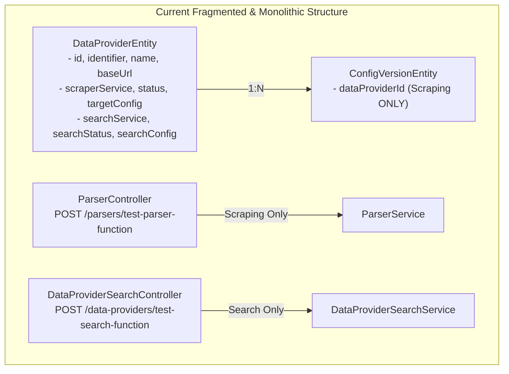
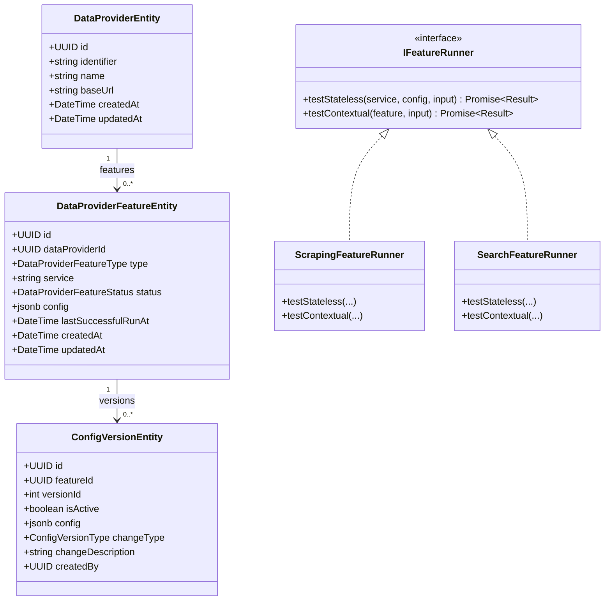
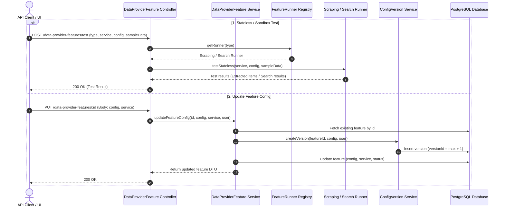

# Technical Proposal: Decouple Features and Standardize Feature Testing from DataProvider

## 1. Problem Statement & Core Concept

- **Core Business Problem**:
  1. **Monolithic DataProvider Entity**: [`DataProviderEntity`](file:///d:/Sources/Personal/only-one-be/src/modules/data-provider/entities/data-provider.entity.ts) conflates core data provider identity (`name`, `identifier`, `baseUrl`) with feature-specific configurations and execution statuses (`scraperService`, `status`, `targetConfig`, `lastSuccessfulScrapeAt` for Scraping; `searchService`, `searchStatus`, `searchConfig` for Search).
  2. **Fragmented & Ad-hoc Feature Testing**: Testing feature logic is currently scattered across arbitrary controllers and services without a unified contract:
     - Scraping parser testing lives in [`ParserController`](file:///d:/Sources/Personal/only-one-be/src/modules/data-provider/controllers/parser.controller.ts) / [`ParserService`](file:///d:/Sources/Personal/only-one-be/src/modules/data-provider/services/parser.service.ts) under `POST /parsers/test-parser-function`.
     - Search configuration testing lives in [`DataProviderSearchController`](file:///d:/Sources/Personal/only-one-be/src/modules/data-provider/controllers/data-provider-search.controller.ts) under `POST /data-providers/test-search-function`.
     - Adding any future feature (e.g., AI extraction, price monitoring) would produce further fragmented controllers and ad-hoc test endpoints.
  3. **Versioning Mismatch**: [`ConfigVersionEntity`](file:///d:/Sources/Personal/only-one-be/src/modules/data-provider/entities/config-version.entity.ts) is tightly bound to `dataProviderId` and exclusively versions `targetConfig` (Scraping), leaving Search and future features with no version history or rollback mechanism.
- **Core Value & Target Audience**: Developers, QA, and API consumers gain a clean, modular architecture where features are decoupled from the data provider container, have isolated version lifecycles, and use a unified, pluggable Strategy/Runner pattern for sandbox and contextual testing.
- **Success Metrics (Definition of Done)**:
  - [`DataProviderEntity`](file:///d:/Sources/Personal/only-one-be/src/modules/data-provider/entities/data-provider.entity.ts) streamlined to core attributes (`id`, `name`, `identifier`, `baseUrl`, timestamps).
  - New entity `DataProviderFeatureEntity` introduced with unique constraint on `(dataProviderId, type)` and 1-to-N relation to `DataProviderEntity`.
  - Dedicated `DataProviderFeatureController` exposing RESTful endpoints under `/data-providers/:dataProviderId/features` and `/data-providers/features/:type/test`.
  - Feature test architecture unified under an `IFeatureRunner` strategy registry, consolidating [`ParserService`](file:///d:/Sources/Personal/only-one-be/src/modules/data-provider/services/parser.service.ts) and `DataProviderSearchService.validateSearchFunction`.
  - [`ConfigVersionEntity`](file:///d:/Sources/Personal/only-one-be/src/modules/data-provider/entities/config-version.entity.ts) refactored to manage version history per feature (`featureId`), versioning any polymorphic `config` payload.
  - Zero downtime / lossless database migration script migrating existing `targetConfig` and `searchConfig` to `data_provider_features`.
- **Scope Boundaries**:
  - **In-Scope**:
    - Backend: Entities, DTOs, Mappers, Services, Feature Runners, Controllers, and Enums in `DataProviderModule`.
    - Unify test endpoints and deprecate `ParserController`/`ParserService` in favor of `ScrapingFeatureRunner`.
    - Database: TypeORM migration to create `data_provider_features`, migrate data from `data_providers`, refactor `data_provider_config_versions`, and drop legacy columns.
    - Refactor 2 current features: `SCRAPING` and `SEARCH`.
  - **Explicit Out-of-Scope**:
    - Adding new feature types (e.g., AI Extraction, Price Monitor) during this refactoring phase.
    - Altering scraping/search engine runtimes (Cheerio, Puppeteer, VM sandbox execution).

---

## 2. Current Business Logic (As-is Analysis)

### Current Execution Flow & Coupled Logic
1. **Entity Coupling** ([data-provider.entity.ts](file:///d:/Sources/Personal/only-one-be/src/modules/data-provider/entities/data-provider.entity.ts#L24-L55)):
   - Defines columns `scraperService`, `status`, `searchService`, `searchStatus`, `targetConfig`, `searchConfig`, and `lastSuccessfulScrapeAt` directly on `data_providers`.
2. **Fragmented Test Endpoints**:
   - `POST /parsers/test-parser-function` ([parser.controller.ts](file:///d:/Sources/Personal/only-one-be/src/modules/data-provider/controllers/parser.controller.ts)): Hardcoded to `targetConfig` scraping validation via `ParserService`.
   - `POST /data-providers/test-search-function` ([data-provider-search.controller.ts](file:///d:/Sources/Personal/only-one-be/src/modules/data-provider/controllers/data-provider-search.controller.ts)): Dedicated search testing via `DataProviderSearchService`.
3. **Version History Coupling** ([config-version.entity.ts](file:///d:/Sources/Personal/only-one-be/src/modules/data-provider/entities/config-version.entity.ts#L24-L31)):
   - Stores `dataProviderId` and `targetConfig: ITargetConfig`. Search configuration changes are completely untracked.

---

## 3. Proposed Solution Alternatives

### Option 1 (Recommended): Feature Entity + Dedicated Controller + Strategy Runner Registry

- **Solution Overview & Mechanics**:
  - Extract all feature-specific fields into `DataProviderFeatureEntity` mapped to table `data_provider_features`.
  - Introduce `DataProviderFeatureType` enum (`SCRAPING`, `SEARCH`).
  - Add `@Unique(['dataProviderId', 'type'])` to guarantee exactly 1 active configuration per feature type for a provider.
  - Refactor `ConfigVersionEntity` to link to `featureId` (`feature_id`) and store generic `config: jsonb`.
  - **Unified Feature Runner Architecture**:
    - Define generic `IFeatureRunner<TConfig, TTestInput, TTestResult>`.
    - Implement `ScrapingFeatureRunner` (absorbing `ParserService`) and `SearchFeatureRunner`.
    - Create `FeatureRunnerRegistry` to resolve runners dynamically by `DataProviderFeatureType`.
  - **Standardized API Endpoints**:
    - Sandbox / Stateless Test: `POST /data-providers/features/:type/test` (tests draft config with test payload).
    - Contextual Test: `POST /data-providers/:dataProviderId/features/:type/test` (tests active config of a specific provider with sample item).
    - Manage Features: `GET / PUT / DELETE` under `/data-providers/:dataProviderId/features`.

- **Architecture Diagram**:

- **Execution Flow (Feature Configuration & Testing)**:

- **Pros**:
  - **Complete Consistency**: Configuration, status, versioning, and testing are identical across all features.
  - **Zero Controller Proliferation**: Eliminates `ParserController` and individual test endpoints in favor of one standard contract.
  - **Open/Closed Principle**: Adding new capabilities requires only a new `IFeatureRunner` and enum entry.
- **Cons**:
  - Requires migrating existing frontend test calls to the new `/data-providers/features/:type/test` endpoints.
- **Complexity & Risks**:
  - Complexity: Moderate.
  - Risks: Low (clear interface boundaries and well-isolated runners).

---

### Option 2 (Alternative): Retain Standalone Test Controllers while Decoupling Entities Only

- **Solution Overview & Mechanics**:
  - Decouple `DataProviderEntity` and `DataProviderFeatureEntity`, but leave `ParserController` (`POST /parsers/test-parser-function`) and `DataProviderSearchController` test endpoints as-is.
- **Pros**:
  - Minimal frontend API URL changes for testing.
- **Cons**:
  - Architecture remains inconsistent and fragmented.
  - Future features will continue to create bespoke test controllers.
- **Complexity & Risks**:
  - Complexity: Low.
  - Risks: High tech debt accumulation.

---

### Comparison Matrix & Recommendation

| Criteria                 | Option 1 (Unified Runners & Endpoints) [Recommended] | Option 2 (Fragmented Controllers) |
| :----------------------- | :--------------------------------------------------- | :-------------------------------- |
| **API Consistency**      | High (Standard `/features/:type/test`)              | Low (Scattered test routes)       |
| **Architectural Cohesion**| Excellent (Strategy Registry)                        | Moderate (Bespoke services)       |
| **Extensibility**        | Plug-and-play for any new feature                   | Requires new controllers          |
| **Relational Integrity** | High (Foreign Keys, Unique constraints)              | High                              |
| **Risk Level**           | Low                                                  | Moderate (Tech debt)              |

- **Conclusion**: Recommend **Option 1** to achieve a unified, consistent, and extensible feature platform.

---

## 4. Key Failure Modes & Security Boundaries

- **Unregistered Feature Type on Test / Execution**:
  - If a client calls `/data-providers/features/:type/test` with an unsupported type, `FeatureRunnerRegistry` throws a descriptive `BadRequestException` (`Unsupported feature type: ${type}`).
- **Concurrent Version Bumping**:
  - Database transactions ensure atomic version increments and `isActive` flag swapping in `ConfigVersionService`.
- **Validation Before Activation**:
  - When switching a feature status to `READY`, the contextual runner executes validation against sample data to ensure the configuration works.
- **Authorization Boundary**:
  - All mutating and testing endpoints remain protected by `JwtAuthGuard`.

---

## 5. High-Level Technical Specifications

- **Affected Modules, Controllers & Entities**:
  - [NEW] `DataProviderFeatureController` (`src/modules/data-provider/controllers/data-provider-feature.controller.ts`)
    - Route Prefix: `@Controller('data-provider-features')`
    - Endpoints:
      - `POST /test` — Sandbox / Stateless test (tests raw draft config against test payload by `type`)
      - `GET /` — Lấy danh sách features (hỗ trợ query filter `?dataProviderId=xxx&type=xxx&status=xxx`)
      - `GET /:id` — Lấy chi tiết feature theo ID
      - `GET /data-providers/:dataProviderId/:type` — Lấy chi tiết feature theo dataProviderId & type
      - `PUT /:id` — Cập nhật cấu hình / service của feature
      - `POST /:id/test` — Contextual test (test trực tiếp config đã lưu của feature với sample data)
      - `PUT /:id/switch-status/:status` — Thay đổi trạng thái (`READY`, `TESTING`, `DISABLED`, ...)
      - `GET /:id/versions` — Lấy danh sách lịch sử cấu hình (versions) của feature
      - `POST /:id/versions/:versionId/rollback` — Rollback về version chỉ định
      - `DELETE /:id/versions/:versionId` — Xóa version không active
  - [NEW] `DataProviderFeatureEntity` (`src/modules/data-provider/entities/data-provider-feature.entity.ts`)
  - [NEW] `DataProviderFeatureService` (`src/modules/data-provider/services/data-provider-feature.service.ts`)
  - [NEW] Feature Runners & Registry:
    - `src/modules/data-provider/runners/interfaces/feature-runner.interface.ts`
    - `src/modules/data-provider/runners/feature-runner.registry.ts`
    - `src/modules/data-provider/runners/scraping-feature.runner.ts` (thay thế `ParserService`)
    - `src/modules/data-provider/runners/search-feature.runner.ts`
  - [DELETE / DEPRECATE] `ParserController` & `ParserService` (logic được chuyển hoàn toàn vào `ScrapingFeatureRunner`).
  - [MODIFY] [`DataProviderController`](file:///d:/Sources/Personal/only-one-be/src/modules/data-provider/controllers/data-provider.controller.ts) — Thu gọn chỉ giữ lại CRUD Data Provider cơ bản.
  - [MODIFY] [`DataProviderEntity`](file:///d:/Sources/Personal/only-one-be/src/modules/data-provider/entities/data-provider.entity.ts)
  - [MODIFY] [`ConfigVersionEntity`](file:///d:/Sources/Personal/only-one-be/src/modules/data-provider/entities/config-version.entity.ts)
  - [NEW] Enums: `DataProviderFeatureType` (`SCRAPING`, `SEARCH`), `DataProviderFeatureStatus` (`UNCONFIGURED`, `TESTING`, `READY`, `ERROR`, `DISABLED`)
  - [MODIFY] Services: `DataProviderService`, `DataProviderScraperService`, `DataProviderSearchService`, `ConfigVersionService`
  - [MODIFY] DTOs & Mappers: `DataProviderDto`, `DataProviderFeatureDto`, `ConfigVersionDto`, `TestFeatureRequestDto`
- **Database Migration Plan**:
  1. Create `data_provider_features` table.
  2. Migrate existing `scraperService`, `status`, `targetConfig`, `lastSuccessfulScrapeAt` into records with `type = 'SCRAPING'`.
  3. Migrate existing `searchService`, `searchStatus`, `searchConfig` into records with `type = 'SEARCH'`.
  4. Update `data_provider_config_versions` to add `feature_id` and populate it from the migrated `SCRAPING` features.
  5. Drop legacy columns from `data_providers` (`status`, `search_status`, `scraper_service`, `search_service`, `target_config`, `search_config`, `last_successful_scrape_at`).

---

## 6. Next Steps

- User reviews and confirms the proposed architecture in `concept.md`.
- Run `/only-one-plan only-one/tasks/20260819-213000-decouple-data-provider-function-settings` to generate the step-by-step implementation plan (`plan.md`).
