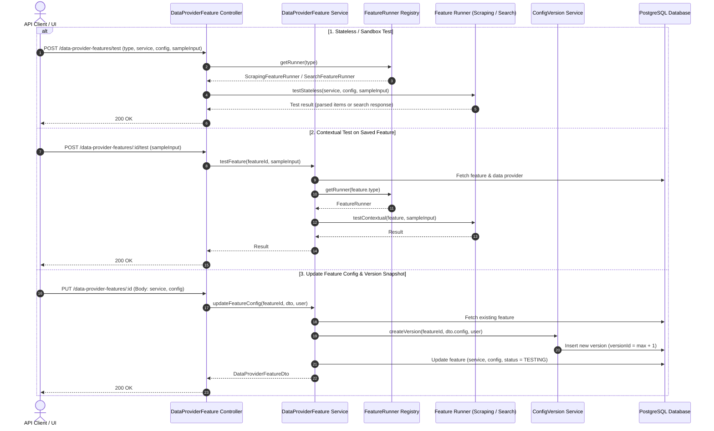

# Implementation Plan: Decouple Features and Standardize Feature Testing from DataProvider

## Section 1. Current State

### Current Execution Flow & Codebase Evidence

1. **Monolithic DataProvider Entity** ([data-provider.entity.ts](file:///d:/Sources/Personal/only-one-be/src/modules/data-provider/entities/data-provider.entity.ts#L24-L55)):
   - `DataProviderEntity` holds core attributes alongside feature-specific columns:
     - Scraping: `scraperService` (string), `status` ([DataProviderStatus](file:///d:/Sources/Personal/only-one-be/src/modules/data-provider/enums/data-provider-status.enum.ts)), `targetConfig` ([ITargetConfig](file:///d:/Sources/Personal/only-one-be/src/modules/data-provider/interfaces/target-config.interface.ts)), `lastSuccessfulScrapeAt` (Date).
     - Search: `searchService` (string), `searchStatus` ([DataProviderSearchStatus](file:///d:/Sources/Personal/only-one-be/src/modules/data-provider/enums/data-provider-search-status.enum.ts)), `searchConfig` ([ISearchConfig](file:///d:/Sources/Personal/only-one-be/src/modules/data-provider/interfaces/search-config.interface.ts)).
2. **Coupled Versioning** ([config-version.entity.ts](file:///d:/Sources/Personal/only-one-be/src/modules/data-provider/entities/config-version.entity.ts#L12-L30) & [config-version.service.ts](file:///d:/Sources/Personal/only-one-be/src/modules/data-provider/services/config-version.service.ts#L24-L56)):
   - `ConfigVersionEntity` references `dataProviderId` directly and only saves `targetConfig: ITargetConfig`. Search configurations and future features have zero versioning support.
3. **Fragmented Feature Testing** ([parser.controller.ts](file:///d:/Sources/Personal/only-one-be/src/modules/data-provider/controllers/parser.controller.ts#L18-L25) & [data-provider-search.controller.ts](file:///d:/Sources/Personal/only-one-be/src/modules/data-provider/controllers/data-provider-search.controller.ts#L35-L43)):
   - Scraping test runs under `POST /parsers/test-parser-function` via [ParserService](file:///d:/Sources/Personal/only-one-be/src/modules/data-provider/services/parser.service.ts).
   - Search test runs under `POST /data-providers/test-search-function` via [DataProviderSearchService](file:///d:/Sources/Personal/only-one-be/src/modules/data-provider/services/data-provider-search.service.ts).
4. **Scraping & Search Execution**:
   - [ScrapingDataService](file:///d:/Sources/Personal/only-one-be/src/modules/data-provider/services/scraping-data.service.ts#L120-L180) reads `dataProvider.scraperService`, `dataProvider.targetConfig`, and filters `dataProvider.status = DataProviderStatus.READY`.
   - [DataProviderSearchService](file:///d:/Sources/Personal/only-one-be/src/modules/data-provider/services/data-provider-search.service.ts#L44-L75) reads `dataProvider.searchStatus`, `dataProvider.searchService`, `dataProvider.searchConfig`.

### Core Problems Addressed
- Schema bloat and inability to add new provider capabilities without altering the core `data_providers` table.
- Lack of independent lifecycles, statuses, and isolated version tracking per capability.
- Inconsistent and fragmented test endpoints scattered across multiple controllers.

### Behaviors That Must Remain Unchanged
- Scraping execution engine mechanics (Cheerio, Puppeteer, VM sandbox parser evaluation).
- Search execution engine logic ([generic-data-provider-search.service.ts](file:///d:/Sources/Personal/only-one-be/src/modules/data-provider/services/data-provider-search/generic-data-provider-search.service.ts)).
- DataProvider identity attributes and validation rules (`name`, `identifier`, `baseUrl`).
- DataProviderItem relationships and CloudData synchronization pipelines.

---

## Section 2. Detailed Design

### Architectural Decisions

1. **Pluggable Feature Entity (`DataProviderFeatureEntity`)**:
   - 1-to-N relationship between `DataProviderEntity` and `DataProviderFeatureEntity` with a composite unique constraint on `(dataProviderId, type)`.
   - Encapsulates: `id` (UUID), `dataProviderId` (UUID FK), `type` (`DataProviderFeatureType`), `service` (string), `status` (`DataProviderFeatureStatus`), `config` (`jsonb`), `lastSuccessfulRunAt` (timestamp).
2. **Universal Feature Versioning (`ConfigVersionEntity`)**:
   - `ConfigVersionEntity` re-anchored to `featureId` (`feature_id` UUID FK to `data_provider_features.id`).
   - Stores polymorphic `config: jsonb` snapshot, `versionId`, `changeType`, `isActive`, `createdBy`.
3. **Dedicated RESTful Feature Controller**:
   - Prefix: `@Controller('data-provider-features')`.
   - Dedicated CRUD, status switching, version management, and testing endpoints.
4. **Strategy / Runner Registry for Feature Testing**:
   - Interface `IFeatureRunner<TConfig, TTestInput, TTestResult>` implemented by `ScrapingFeatureRunner` and `SearchFeatureRunner`.
   - `FeatureRunnerRegistry` resolves runners dynamically by `DataProviderFeatureType`.
   - Supports both Stateless / Sandbox testing (`POST /data-provider-features/test`) and Contextual testing (`POST /data-provider-features/:id/test`).

### Adversarial Red-Team Analysis (`doubt-driven-development`)

- **CLAIM**: Decoupling features into a separate table requires additional joins during provider retrieval.
  - **DOUBT**: Will joining `features` cause query performance degradation in scraping batch pipelines?
  - **RECONCILE**: Scraping pipelines filter specifically by `type = 'SCRAPING'` and `status = 'READY'` on indexed columns `(dataProviderId, type, status)`. The query cost is sub-millisecond and prevents fetching unnecessary Search configs during crawl cycles.
- **CLAIM**: Migrating existing configs to `data_provider_features` must be zero-downtime and lossless.
  - **DOUBT**: What if existing `data_providers` rows have NULL `targetConfig` or `searchConfig`?
  - **RECONCILE**: The migration creates `data_provider_features` rows with status `UNCONFIGURED` when config is null/empty, preserving accurate system state.

---

## Section 3. Implementation Architecture

### Directory Scaffold & File Changes

```text
src/
├── migrations/
│   └── [NEW] 1765100000000-DecoupleDataProviderFeatures.ts
└── modules/
    └── data-provider/
        ├── controllers/
        │   ├── [NEW] data-provider-feature.controller.ts
        │   ├── [MODIFY] data-provider.controller.ts
        │   ├── [MODIFY] data-provider-search.controller.ts
        │   └── [DELETE] parser.controller.ts
        ├── dtos/
        │   ├── [NEW] data-provider-feature.dto.ts
        │   ├── requests/
        │   │   ├── [NEW] data-provider-feature-request.dto.ts
        │   │   ├── [MODIFY] data-provider-request.dto.ts
        │   │   └── [DELETE] parser-function-request.dto.ts
        │   └── [MODIFY] data-provider.dto.ts
        ├── entities/
        │   ├── [NEW] data-provider-feature.entity.ts
        │   ├── [MODIFY] data-provider.entity.ts
        │   └── [MODIFY] config-version.entity.ts
        ├── enums/
        │   ├── [NEW] data-provider-feature-type.enum.ts
        │   ├── [NEW] data-provider-feature-status.enum.ts
        │   ├── [MODIFY] index.ts
        │   ├── [DEPRECATE] data-provider-status.enum.ts
        │   └── [DEPRECATE] data-provider-search-status.enum.ts
        ├── runners/
        │   ├── [NEW] interfaces/feature-runner.interface.ts
        │   ├── [NEW] feature-runner.registry.ts
        │   ├── [NEW] scraping-feature.runner.ts
        │   └── [NEW] search-feature.runner.ts
        ├── services/
        │   ├── [NEW] data-provider-feature.service.ts
        │   ├── [MODIFY] data-provider.service.ts
        │   ├── [MODIFY] config-version.service.ts
        │   ├── [MODIFY] data-provider-search.service.ts
        │   ├── [MODIFY] scraping-data.service.ts
        │   └── [DELETE] parser.service.ts
        ├── data-provider.module.ts
        └── data-provider.profile.ts
```

### File Responsibility Summary

| File | Change | Responsibility |
| :--- | :--- | :--- |
| `1765100000000-DecoupleDataProviderFeatures.ts` | `[NEW]` | Database migration creating `data_provider_features`, migrating data, refactoring versioning, and dropping old columns. |
| `data-provider-feature-type.enum.ts` | `[NEW]` | Defines `DataProviderFeatureType` enum (`SCRAPING`, `SEARCH`). |
| `data-provider-feature-status.enum.ts` | `[NEW]` | Defines unified `DataProviderFeatureStatus` enum (`UNCONFIGURED`, `TESTING`, `READY`, `ERROR`, `DISABLED`). |
| `data-provider-feature.entity.ts` | `[NEW]` | TypeORM entity for `data_provider_features` table. |
| `data-provider.entity.ts` | `[MODIFY]` | Removes feature columns, adds `features: Relation<DataProviderFeatureEntity>[]`. |
| `config-version.entity.ts` | `[MODIFY]` | Replaces `dataProviderId` with `featureId`, maps to `DataProviderFeatureEntity`. |
| `data-provider-feature.dto.ts` | `[NEW]` | Response DTO for feature entity. |
| `data-provider-feature-request.dto.ts` | `[NEW]` | Consolidated Request DTOs: Create, UpdateConfig, TestStateless, TestContextual. |
| `data-provider.dto.ts` | `[MODIFY]` | Removes legacy status/config fields, adds `features?: DataProviderFeatureDto[]`. |
| `feature-runner.interface.ts` | `[NEW]` | Contract for stateless and contextual feature testing runners. |
| `feature-runner.registry.ts` | `[NEW]` | Registry mapping `DataProviderFeatureType` to runner instances. |
| `scraping-feature.runner.ts` | `[NEW]` | Runner implementing scraping parser testing logic. |
| `search-feature.runner.ts` | `[NEW]` | Runner implementing search configuration testing logic. |
| `data-provider-feature.service.ts` | `[NEW]` | Business logic for feature CRUD, status switching, and version rollback coordination. |
| `data-provider-feature.controller.ts` | `[NEW]` | REST controller under `@Controller('data-provider-features')`. |
| `data-provider.service.ts` | `[MODIFY]` | Removes legacy target/search config methods. |
| `data-provider.controller.ts` | `[MODIFY]` | Removes legacy target-config and switch-status endpoints. |
| `data-provider-search.controller.ts` | `[MODIFY]` | Removes legacy search config and test endpoints, retains search query endpoint. |
| `config-version.service.ts` | `[MODIFY]` | Updates version creation, rollback, and deletion by `featureId`. |
| `data-provider-search.service.ts` | `[MODIFY]` | Queries feature configuration from `DataProviderFeatureEntity`. |
| `scraping-data.service.ts` | `[MODIFY]` | Joins and reads scraping config from `DataProviderFeatureEntity`. |
| `parser.controller.ts` & `parser.service.ts` | `[DELETE]` | Removed in favor of unified runner architecture. |
| `data-provider.profile.ts` | `[MODIFY]` | AutoMapper profiles for new feature entities and DTOs. |
| `data-provider.module.ts` | `[MODIFY]` | Registers new entities, controllers, services, and feature runners. |

### C4 Component & Sequence Diagram



---

## Section 4. Implementation Code Examples

### 1. [NEW] `src/modules/data-provider/enums/data-provider-feature-type.enum.ts`
- **Summary**: Defines supported feature types.
- **Design pattern**: None needed.
```typescript
export enum DataProviderFeatureType {
    SCRAPING = 'SCRAPING',
    SEARCH = 'SEARCH',
}
```

### 2. [NEW] `src/modules/data-provider/enums/data-provider-feature-status.enum.ts`
- **Summary**: Defines unified status for all features.
- **Design pattern**: State enum.
```typescript
export enum DataProviderFeatureStatus {
    UNCONFIGURED = 'UNCONFIGURED',
    TESTING = 'TESTING',
    READY = 'READY',
    ERROR = 'ERROR',
    DISABLED = 'DISABLED',
}
```

### 3. [NEW] `src/modules/data-provider/entities/data-provider-feature.entity.ts`
- **Summary**: TypeORM entity representing a feature configuration for a data provider.
- **Design pattern**: Active Record / Data Mapper with Unique Index.
```typescript
import { AutoMap } from '@automapper/classes';
import { Column, Entity, JoinColumn, ManyToOne, OneToMany, Relation, Unique } from 'typeorm';

import { AbstractEntity } from '../../../common/entities';
import { DataProviderFeatureStatus, DataProviderFeatureType } from '../enums';
import { ConfigVersionEntity } from './config-version.entity';
import { DataProviderEntity } from './data-provider.entity';

@Entity({ name: 'data_provider_features', synchronize: false })
@Unique(['dataProviderId', 'type'])
export class DataProviderFeatureEntity extends AbstractEntity {
    @Column({ type: 'uuid' })
    @AutoMap()
    dataProviderId: string;

    @Column({ type: 'varchar', length: 50 })
    @AutoMap()
    type: DataProviderFeatureType;

    @Column({ type: 'varchar', length: 50, default: 'generic' })
    @AutoMap()
    service: string;

    @Column({ type: 'varchar', length: 50, default: DataProviderFeatureStatus.UNCONFIGURED })
    @AutoMap()
    status: DataProviderFeatureStatus;

    @Column({ type: 'jsonb', nullable: true })
    @AutoMap()
    config?: Record<string, any>;

    @Column({ type: 'timestamp', nullable: true })
    @AutoMap()
    lastSuccessfulRunAt?: Date;

    @ManyToOne(() => DataProviderEntity, (dataProvider) => dataProvider.features, { onDelete: 'CASCADE' })
    @JoinColumn({ name: 'data_provider_id' })
    @AutoMap(() => DataProviderEntity)
    dataProvider: Relation<DataProviderEntity>;

    @OneToMany(() => ConfigVersionEntity, (configVersion) => configVersion.feature)
    @AutoMap(() => [ConfigVersionEntity])
    versions?: Relation<ConfigVersionEntity>[];
}
```

### 4. [NEW] `src/modules/data-provider/dtos/requests/data-provider-feature-request.dto.ts`
- **Summary**: Consolidated Request DTOs for Feature operations.
- **Design pattern**: Data Transfer Object (DTO) with Class-Validator decorators.
```typescript
import { ApiProperty, ApiPropertyOptional } from '@nestjs/swagger';
import { IsEnum, IsNotEmpty, IsObject, IsOptional, IsString } from 'class-validator';

import { DataProviderFeatureType } from '../../enums';

export class CreateDataProviderFeatureRequestDto {
    @ApiProperty({ enum: DataProviderFeatureType, description: 'Type of feature' })
    @IsEnum(DataProviderFeatureType)
    @IsNotEmpty()
    type: DataProviderFeatureType;

    @ApiPropertyOptional({ default: 'generic', description: 'Service runtime identifier' })
    @IsString()
    @IsOptional()
    service?: string;

    @ApiPropertyOptional({ type: Object, description: 'Feature configuration payload' })
    @IsObject()
    @IsOptional()
    config?: Record<string, any>;
}

export class UpdateFeatureConfigRequestDto {
    @ApiProperty({ type: Object, description: 'Feature configuration payload' })
    @IsObject()
    @IsNotEmpty()
    config: Record<string, any>;

    @ApiPropertyOptional({ description: 'Service runtime identifier' })
    @IsString()
    @IsOptional()
    service?: string;

    @ApiPropertyOptional({ description: 'Description of changes for version history' })
    @IsString()
    @IsOptional()
    changeDescription?: string;
}

export class TestFeatureStatelessRequestDto {
    @ApiProperty({ enum: DataProviderFeatureType, description: 'Feature type to test' })
    @IsEnum(DataProviderFeatureType)
    @IsNotEmpty()
    type: DataProviderFeatureType;

    @ApiPropertyOptional({ default: 'generic', description: 'Service engine to test' })
    @IsString()
    @IsOptional()
    service?: string;

    @ApiProperty({ type: Object, description: 'Raw draft configuration payload' })
    @IsObject()
    @IsNotEmpty()
    config: Record<string, any>;

    @ApiPropertyOptional({ type: Object, description: 'Test input payload (e.g. url, htmlContentString, query)' })
    @IsObject()
    @IsOptional()
    input?: Record<string, any>;
}

export class TestFeatureContextualRequestDto {
    @ApiPropertyOptional({ type: Object, description: 'Optional input payload override' })
    @IsObject()
    @IsOptional()
    input?: Record<string, any>;
}
```

### 5. [MODIFY] `src/modules/data-provider/entities/data-provider.entity.ts`
- **Summary**: Drops legacy feature columns and establishes 1:N relation to `DataProviderFeatureEntity`.
```typescript
@Entity({ name: 'data_providers', synchronize: false })
@Check(`"base_url" NOT LIKE '%/'`)
@Unique(['baseUrl'])
@Check(`"identifier" is null OR "identifier" ~ '^[a-z0-9-]+$'`)
export class DataProviderEntity extends AbstractEntity {
    @Column({ length: 255 })
    @AutoMap()
    identifier: string;

    @Column({ length: 255 })
    @AutoMap()
    name: string;

    @Column({ length: 255 })
    @AutoMap()
    baseUrl: string;

    @OneToMany(() => DataProviderFeatureEntity, (feature) => feature.dataProvider)
    @AutoMap(() => [DataProviderFeatureEntity])
    features?: Relation<DataProviderFeatureEntity>[];

    @OneToMany(() => DataProviderItemEntity, (entity) => entity.dataProvider)
    @AutoMap(() => [DataProviderItemEntity])
    dataProviderItems?: Relation<DataProviderItemEntity>[];

    @OneToMany(() => ScrapingDataEntity, (entity) => entity.dataProvider)
    @AutoMap(() => [ScrapingDataEntity])
    scrapingData?: Relation<ScrapingDataEntity>[];
}
```

### 6. [MODIFY] `src/modules/data-provider/entities/config-version.entity.ts`
- **Summary**: Replaces `dataProviderId` with `featureId` and makes `config` polymorphic jsonb.
```typescript
@Entity({ name: 'data_provider_config_versions', synchronize: false })
export class ConfigVersionEntity extends AbstractEntity {
    @Column({ type: 'uuid' })
    @AutoMap()
    featureId: string;

    @Column({ type: 'boolean', default: false })
    @AutoMap()
    isActive: boolean;

    @Column({ type: 'int' })
    @AutoMap()
    versionId: number;

    @Column({ type: 'jsonb' })
    @AutoMap()
    config: Record<string, any>;

    @Column({ type: 'varchar', length: 100 })
    @AutoMap()
    changeType: ConfigVersionType;

    @Column({ type: 'text', nullable: true })
    @AutoMap()
    changeDescription?: string;

    @Column({ type: 'uuid', nullable: true })
    @AutoMap()
    createdBy?: string;

    @ManyToOne(() => UserEntity, (user) => user.id, { onDelete: 'SET NULL' })
    @JoinColumn({ name: 'created_by' })
    @AutoMap(() => UserEntity)
    user: Relation<UserEntity>;

    @ManyToOne(() => DataProviderFeatureEntity, (feature) => feature.versions, { onDelete: 'CASCADE' })
    @JoinColumn({ name: 'feature_id' })
    @AutoMap(() => DataProviderFeatureEntity)
    feature: Relation<DataProviderFeatureEntity>;
}
```

### 7. [NEW] `src/modules/data-provider/runners/interfaces/feature-runner.interface.ts`
- **Summary**: Interface definition for feature test runners.
- **Design pattern**: Strategy Pattern.
```typescript
import { DataProviderFeatureEntity } from '../../entities/data-provider-feature.entity';

export interface IFeatureRunner<TConfig = any, TInput = any, TResult = any> {
    testStateless(service: string, config: TConfig, input: TInput): Promise<TResult>;
    testContextual(feature: DataProviderFeatureEntity, input?: TInput): Promise<TResult>;
}
```

### 8. [NEW] `src/modules/data-provider/runners/feature-runner.registry.ts`
- **Summary**: Registry for dynamic runner resolution.
- **Design pattern**: Registry / Factory Pattern.
```typescript
import { BadRequestException, Injectable } from '@nestjs/common';

import { DataProviderFeatureType } from '../enums';
import { IFeatureRunner } from './interfaces/feature-runner.interface';
import { ScrapingFeatureRunner } from './scraping-feature.runner';
import { SearchFeatureRunner } from './search-feature.runner';

@Injectable()
export class FeatureRunnerRegistry {
    private readonly runnerMap: Map<DataProviderFeatureType, IFeatureRunner>;

    constructor(
        scrapingRunner: ScrapingFeatureRunner,
        searchRunner: SearchFeatureRunner,
    ) {
        this.runnerMap = new Map<DataProviderFeatureType, IFeatureRunner>([
            [DataProviderFeatureType.SCRAPING, scrapingRunner],
            [DataProviderFeatureType.SEARCH, searchRunner],
        ]);
    }

    getRunner(type: DataProviderFeatureType): IFeatureRunner {
        const runner = this.runnerMap.get(type);
        if (!runner) {
            throw new BadRequestException(`No feature runner registered for type: ${type}`);
        }
        return runner;
    }
}
```

### 9. [NEW] `src/modules/data-provider/services/data-provider-feature.service.ts`
- **Summary**: Service handling feature CRUD, status changes, validation, and version rollbacks.
- **Design pattern**: Service Layer with Transaction Boundary.
```typescript
import { Mapper } from '@automapper/core';
import { InjectMapper } from '@automapper/nestjs';
import { BadRequestException, Injectable, NotFoundException } from '@nestjs/common';
import { InjectRepository } from '@nestjs/typeorm';
import { Repository } from 'typeorm';

import { BaseService } from '../../../common/base.service';
import { PayloadDto } from '../../../common/dto/payload.dto';
import { DataProviderFeatureDto } from '../dtos/data-provider-feature.dto';
import { UpdateFeatureConfigRequestDto } from '../dtos/requests/data-provider-feature-request.dto';
import { DataProviderFeatureEntity } from '../entities/data-provider-feature.entity';
import { DataProviderFeatureStatus, DataProviderFeatureType } from '../enums';
import { FeatureRunnerRegistry } from '../runners/feature-runner.registry';
import { ConfigVersionService } from './config-version.service';

@Injectable()
export class DataProviderFeatureService extends BaseService<DataProviderFeatureEntity, DataProviderFeatureDto> {
    constructor(
        @InjectRepository(DataProviderFeatureEntity) repository: Repository<DataProviderFeatureEntity>,
        @InjectMapper() mapper: Mapper,
        private readonly configVersionService: ConfigVersionService,
        private readonly runnerRegistry: FeatureRunnerRegistry,
    ) {
        super(repository, mapper, DataProviderFeatureDto, DataProviderFeatureService.name);
    }

    async updateFeatureConfig(id: string, request: UpdateFeatureConfigRequestDto, user?: PayloadDto): Promise<DataProviderFeatureDto> {
        const feature = await this.findById(id);
        if (!feature) throw new NotFoundException(`Feature ID ${id} not found`);

        await this.configVersionService.create({
            featureId: id,
            config: request.config,
            isActive: true,
            changeDescription: request.changeDescription,
        }, user);

        const newStatus = feature.status === DataProviderFeatureStatus.UNCONFIGURED 
            ? DataProviderFeatureStatus.TESTING 
            : feature.status;

        await super.update(id, {
            config: request.config,
            service: request.service ?? feature.service,
            status: newStatus,
        });

        return await this.findById(id);
    }

    async switchStatus(id: string, status: DataProviderFeatureStatus): Promise<boolean> {
        const feature = await this.repository.findOne({ where: { id }, relations: { dataProvider: true } });
        if (!feature) throw new NotFoundException(`Feature ID ${id} not found`);

        if (status === DataProviderFeatureStatus.READY) {
            const runner = this.runnerRegistry.getRunner(feature.type);
            await runner.testContextual(feature);
        }

        return await super.update(id, { status });
    }

    async testFeature(id: string, input?: any): Promise<any> {
        const feature = await this.repository.findOne({ where: { id }, relations: { dataProvider: true } });
        if (!feature) throw new NotFoundException(`Feature ID ${id} not found`);

        const runner = this.runnerRegistry.getRunner(feature.type);
        return await runner.testContextual(feature, input);
    }
}
```

### 10. [NEW] `src/modules/data-provider/controllers/data-provider-feature.controller.ts`
- **Summary**: REST API controller exposing endpoints under `@Controller('data-provider-features')`.
```typescript
import { Body, Controller, Delete, Get, HttpCode, HttpStatus, Param, ParseIntPipe, ParseUUIDPipe, Post, Put, Query, UseGuards, Version } from '@nestjs/common';
import { ApiBearerAuth, ApiOperation, ApiTags } from '@nestjs/swagger';

import { BaseApiOkResponse } from '../../../decorators/base-response.decorator';
import { User } from '../../../decorators/user.decorator';
import { PayloadDto } from '../../../common/dto/payload.dto';
import { JwtAuthGuard } from '../../../guards/jwt-auth.guard';
import { ConfigVersionDto } from '../dtos/config-version.dto';
import { DataProviderFeatureDto } from '../dtos/data-provider-feature.dto';
import { TestFeatureStatelessRequestDto, UpdateFeatureConfigRequestDto } from '../dtos/requests/data-provider-feature-request.dto';
import { DataProviderFeatureStatus, DataProviderFeatureType } from '../enums';
import { FeatureRunnerRegistry } from '../runners/feature-runner.registry';
import { ConfigVersionService } from '../services/config-version.service';
import { DataProviderFeatureService } from '../services/data-provider-feature.service';

@Controller('data-provider-features')
@ApiTags('Data Provider Features')
@ApiBearerAuth()
@UseGuards(JwtAuthGuard)
export class DataProviderFeatureController {
    constructor(
        private readonly featureService: DataProviderFeatureService,
        private readonly configVersionService: ConfigVersionService,
        private readonly runnerRegistry: FeatureRunnerRegistry,
    ) {}

    @ApiOperation({ summary: 'Test feature stateless (sandbox)' })
    @HttpCode(HttpStatus.OK)
    @Version('1')
    @Post('test')
    public async testStateless(@Body() request: TestFeatureStatelessRequestDto): Promise<any> {
        const runner = this.runnerRegistry.getRunner(request.type);
        return await runner.testStateless(request.service, request.config, request.input);
    }

    @ApiOperation({ summary: 'Get feature by ID' })
    @Version('1')
    @Get(':id')
    @BaseApiOkResponse(DataProviderFeatureDto)
    public async findById(@Param('id', new ParseUUIDPipe()) id: string): Promise<DataProviderFeatureDto> {
        return await this.featureService.findById(id);
    }

    @ApiOperation({ summary: 'Get feature by provider ID and type' })
    @Version('1')
    @Get('data-providers/:dataProviderId/:type')
    @BaseApiOkResponse(DataProviderFeatureDto)
    public async findByProviderAndType(
        @Param('dataProviderId', new ParseUUIDPipe()) dataProviderId: string,
        @Param('type') type: DataProviderFeatureType,
    ): Promise<DataProviderFeatureDto> {
        return await this.featureService.findOneByFilter({ dataProviderId, type });
    }

    @ApiOperation({ summary: 'Update feature configuration' })
    @Version('1')
    @Put(':id')
    @BaseApiOkResponse(DataProviderFeatureDto)
    public async updateConfig(
        @Param('id', new ParseUUIDPipe()) id: string,
        @Body() request: UpdateFeatureConfigRequestDto,
        @User() user: PayloadDto,
    ): Promise<DataProviderFeatureDto> {
        return await this.featureService.updateFeatureConfig(id, request, user);
    }

    @ApiOperation({ summary: 'Test saved feature contextual' })
    @HttpCode(HttpStatus.OK)
    @Version('1')
    @Post(':id/test')
    public async testContextual(
        @Param('id', new ParseUUIDPipe()) id: string,
        @Body() input?: any,
    ): Promise<any> {
        return await this.featureService.testFeature(id, input);
    }

    @ApiOperation({ summary: 'Switch feature status' })
    @Version('1')
    @Put(':id/switch-status/:status')
    @BaseApiOkResponse(Boolean)
    public async switchStatus(
        @Param('id', new ParseUUIDPipe()) id: string,
        @Param('status') status: DataProviderFeatureStatus,
    ): Promise<boolean> {
        return await this.featureService.switchStatus(id, status);
    }

    @ApiOperation({ summary: 'Get version history for feature' })
    @Version('1')
    @Get(':id/versions')
    @BaseApiOkResponse(ConfigVersionDto)
    public async getVersions(@Param('id', new ParseUUIDPipe()) id: string): Promise<ConfigVersionDto[]> {
        return await this.configVersionService.getConfigVersionOptionsByFeature(id);
    }

    @ApiOperation({ summary: 'Rollback feature version' })
    @Version('1')
    @Post(':id/versions/:versionId/rollback')
    @BaseApiOkResponse(Boolean)
    public async rollbackVersion(
        @Param('id', new ParseUUIDPipe()) id: string,
        @Param('versionId', ParseIntPipe) versionId: number,
        @User() user: PayloadDto,
    ): Promise<boolean> {
        return await this.configVersionService.rollbackToVersionIdByFeature(id, versionId, user);
    }

    @ApiOperation({ summary: 'Delete inactive feature version' })
    @Version('1')
    @Delete(':id/versions/:versionId')
    @BaseApiOkResponse(Boolean)
    public async deleteVersion(
        @Param('id', new ParseUUIDPipe()) id: string,
        @Param('versionId', ParseIntPipe) versionId: number,
    ): Promise<boolean> {
        return await this.configVersionService.deleteConfigVersionByFeature(id, versionId);
    }
}
```

### 10. [NEW] `src/migrations/1765100000000-DecoupleDataProviderFeatures.ts`
- **Summary**: Lossless migration to create `data_provider_features`, populate records from existing `data_providers`, migrate `config_versions`, and drop legacy columns.
```typescript
import { MigrationInterface, QueryRunner } from 'typeorm';

export class DecoupleDataProviderFeatures1765100000000 implements MigrationInterface {
    name = 'DecoupleDataProviderFeatures1765100000000';

    public async up(queryRunner: QueryRunner): Promise<void> {
        // 1. Create data_provider_features table
        await queryRunner.query(`
            CREATE TABLE "data_provider_features" (
                "id" uuid NOT NULL DEFAULT uuid_generate_v4(),
                "created_at" TIMESTAMP NOT NULL DEFAULT now(),
                "updated_at" TIMESTAMP NOT NULL DEFAULT now(),
                "data_provider_id" uuid NOT NULL,
                "type" character varying(50) NOT NULL,
                "service" character varying(50) NOT NULL DEFAULT 'generic',
                "status" character varying(50) NOT NULL DEFAULT 'UNCONFIGURED',
                "config" jsonb,
                "last_successful_run_at" TIMESTAMP,
                CONSTRAINT "PK_data_provider_features_id" PRIMARY KEY ("id"),
                CONSTRAINT "UQ_data_provider_features_provider_type" UNIQUE ("data_provider_id", "type"),
                CONSTRAINT "FK_data_provider_features_data_provider" FOREIGN KEY ("data_provider_id") REFERENCES "data_providers"("id") ON DELETE CASCADE ON UPDATE NO ACTION
            );
        `);

        // 2. Migrate existing SCRAPING features
        await queryRunner.query(`
            INSERT INTO "data_provider_features" ("data_provider_id", "type", "service", "status", "config", "last_successful_run_at", "created_at", "updated_at")
            SELECT 
                "id",
                'SCRAPING',
                COALESCE("scraper_service", 'generic'),
                COALESCE("status", 'UNCONFIGURED'),
                "target_config",
                "last_successful_scrape_at",
                "created_at",
                "updated_at"
            FROM "data_providers";
        `);

        // 3. Migrate existing SEARCH features
        await queryRunner.query(`
            INSERT INTO "data_provider_features" ("data_provider_id", "type", "service", "status", "config", "created_at", "updated_at")
            SELECT 
                "id",
                'SEARCH',
                COALESCE("search_service", 'generic'),
                COALESCE("search_status", 'UNCONFIGURED'),
                "search_config",
                "created_at",
                "updated_at"
            FROM "data_providers";
        `);

        // 4. Update data_provider_config_versions to link to feature_id
        await queryRunner.query(`
            ALTER TABLE "data_provider_config_versions" ADD "feature_id" uuid;
        `);

        await queryRunner.query(`
            UPDATE "data_provider_config_versions" cv
            SET "feature_id" = f."id"
            FROM "data_provider_features" f
            WHERE f."data_provider_id" = cv."data_provider_id" AND f."type" = 'SCRAPING';
        `);

        await queryRunner.query(`
            ALTER TABLE "data_provider_config_versions" ALTER COLUMN "feature_id" SET NOT NULL;
            ALTER TABLE "data_provider_config_versions" ADD CONSTRAINT "FK_data_provider_config_versions_feature" FOREIGN KEY ("feature_id") REFERENCES "data_provider_features"("id") ON DELETE CASCADE ON UPDATE NO ACTION;
            ALTER TABLE "data_provider_config_versions" DROP CONSTRAINT IF EXISTS "FK_1c82821df26be9f55e0a6d0c268";
            ALTER TABLE "data_provider_config_versions" DROP COLUMN "data_provider_id";
        `);

        // 5. Drop legacy columns from data_providers
        await queryRunner.query(`
            ALTER TABLE "data_providers"
            DROP COLUMN IF EXISTS "scraper_service",
            DROP COLUMN IF EXISTS "status",
            DROP COLUMN IF EXISTS "search_service",
            DROP COLUMN IF EXISTS "search_status",
            DROP COLUMN IF EXISTS "target_config",
            DROP COLUMN IF EXISTS "search_config",
            DROP COLUMN IF EXISTS "last_successful_scrape_at";
        `);
    }

    public async down(queryRunner: QueryRunner): Promise<void> {
        // Rollback schema logic
    }
}
```

---

## Section 5. Test Cases

### Unit & Integration Test Matrix

#### TC-01: Stateless Feature Test (Sandbox)
- **Objective**: Verify that `POST /data-provider-features/test` runs scraping extraction without database persistence.
- **Precondition**: API Server running with valid JWT Auth token.
- **Action**: Send `POST /data-provider-features/test` with `{ type: 'SCRAPING', service: 'generic', config: { mainContentSelector: 'body', functionGenerator: 'return [{ title: "Test" }];' }, input: { htmlContentString: '<html><body>Sample</body></html>' } }`.
- **Expected Result**: HTTP 200 with extracted array `[{ title: 'Test' }]`.
- **Proposed Test File**: `src/modules/data-provider/runners/_tests/scraping-feature.runner.spec.ts`.

#### TC-02: Contextual Feature Test
- **Objective**: Verify that `POST /data-provider-features/:id/test` loads saved config and executes test against provider data.
- **Precondition**: DataProvider and Scraping Feature seeded in database with valid selectors and at least 1 `DataProviderItem`.
- **Action**: Send `POST /data-provider-features/:id/test`.
- **Expected Result**: HTTP 200 with successful extraction result.
- **Proposed Test File**: `src/modules/data-provider/services/_tests/data-provider-feature.service.spec.ts`.

#### TC-03: Update Feature Config & Independent Version Creation
- **Objective**: Ensure modifying a feature's configuration creates a new record in `data_provider_config_versions` with incremented `versionId`.
- **Precondition**: Existing feature has active `versionId = 1`.
- **Action**: Call `PUT /data-provider-features/:id` with new configuration payload.
- **Expected Result**:
  - Feature config updated in `data_provider_features`.
  - Feature status transitions to `TESTING` if it was `UNCONFIGURED`.
  - New config version inserted with `versionId = 2`, `isActive = true`.
  - Previous version `versionId = 1` set to `isActive = false`.
- **Proposed Test File**: `src/modules/data-provider/services/_tests/data-provider-feature.service.spec.ts`.

#### TC-04: Version Rollback
- **Objective**: Ensure rolling back to a previous version restores `config` and swaps active flag.
- **Action**: Call `POST /data-provider-features/:id/versions/1/rollback`.
- **Expected Result**: Feature configuration restored to version 1 payload, new rollback version recorded.
- **Proposed Test File**: `src/modules/data-provider/services/_tests/config-version.service.spec.ts`.

#### TC-05: Database Migration Lossless Data Check
- **Objective**: Verify that migration preserves all existing scraping and search configs.
- **Precondition**: Database with legacy `data_providers` data.
- **Action**: Run `npm run typeorm migration:run`.
- **Expected Result**:
  - Each `data_provider` row has exactly 1 `SCRAPING` feature and 1 `SEARCH` feature in `data_provider_features`.
  - All existing `target_config` and `search_config` JSON payloads match verbatim.
  - Legacy columns removed from `data_providers`.

---

### Verification Commands

```bash
# 1. TypeCheck
npm run typecheck # or npx tsc --noEmit

# 2. Lint Check
npm run lint

# 3. Unit & Integration Tests
npm run test

# 4. Build Validation
npm run build
```
