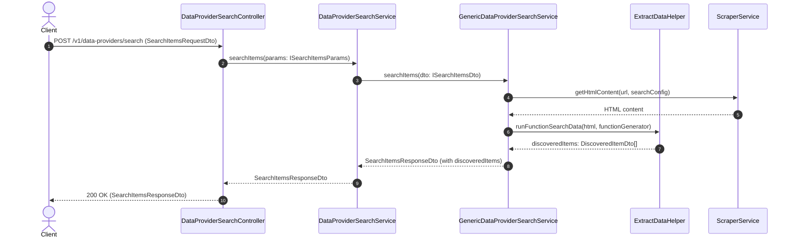
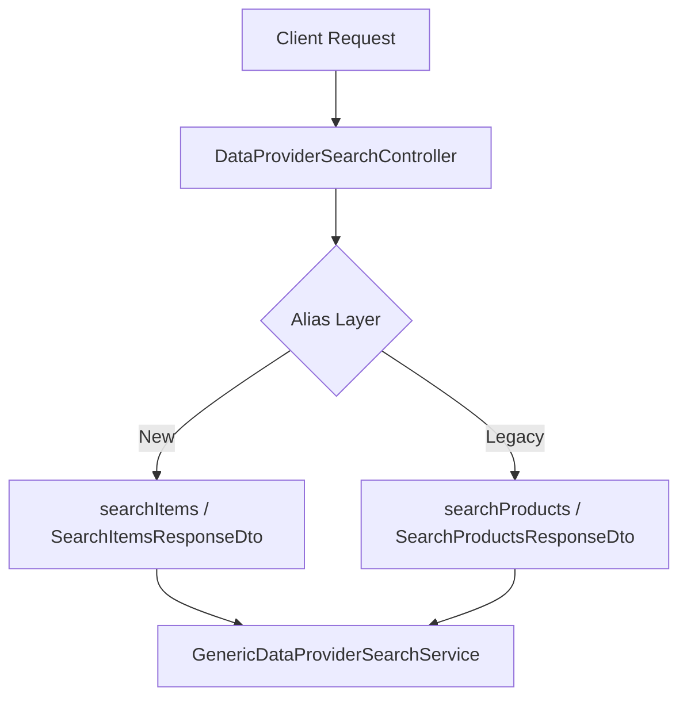

# Technical Proposal: Rename Search Products to Search Items in Data Provider Module

## 1. Problem Statement & Core Concept

- **Core Business Problem**: In the Data Provider module, terminology is currently inconsistent. While data extraction uses the generic term `Item` (e.g., `ScrapeItemDataResponseItemDto`), the search capability uses `Product` (e.g., `searchProducts`, `DiscoveredProductDto`, `discoveredProducts`, `SearchProductsRequestDto`, `SearchProductsResponseDto`). Data providers may provide diverse catalog entities (e.g., ingredients, articles, listings, components) rather than just retail products. Standardizing to `Item` across all search endpoints, DTOs, interfaces, services, and helpers creates domain consistency.
- **Core Value & Target Audience**: Developers and consumers of the Data Provider API benefit from a uniform naming convention across scraping and search features (`item` / `items`).
- **Success Metrics (Definition of Done)**:
    - 100% of methods, DTOs, parameters, and interfaces in `data-provider` search feature use `Item`/`Items` instead of `Product`/`Products`.
    - No broken references across controllers, services, interfaces, helpers, or response DTOs.
    - Clean build and test execution without type errors.
- **Scope Boundaries**:
    - **In-Scope**:
        - Rename DTO files and class names: `search-products-request.dto.ts` $\rightarrow$ `search-items-request.dto.ts`, `search-products-response.dto.ts` $\rightarrow$ `search-items-response.dto.ts`.
        - Rename classes and interfaces: `SearchProductsRequestDto` $\rightarrow$ `SearchItemsRequestDto`, `SearchProductsResponseDto` $\rightarrow$ `SearchItemsResponseDto`, `DiscoveredProductDto` $\rightarrow$ `DiscoveredItemDto`, `ISearchProductsDto` $\rightarrow$ `ISearchItemsDto`, `ISearchProductsParams` $\rightarrow$ `ISearchItemsParams`.
        - Rename response field: `discoveredProducts` $\rightarrow$ `discoveredItems`.
        - Rename service methods & controller handlers: `searchProducts()` $\rightarrow$ `searchItems()`.
        - Update index barrel files and [`ExtractDataHelper`](file:///d:/Sources/Personal/only-one-be/src/modules/data-provider/helpers/extract-data.helper.ts).
    - **Explicit Out-of-Scope**:
        - Changing core scraping logic or altering data provider entity schema (`data_provider_features`).
        - Changing scraping feature DTOs that already use `Item`.

## 2. Current Business Logic (As-is Analysis)

- **Entry Point**: [`DataProviderSearchController.searchProducts()`](file:///d:/Sources/Personal/only-one-be/src/modules/data-provider/controllers/data-provider-search.controller.ts#L22) accepts [`SearchProductsRequestDto`](file:///d:/Sources/Personal/only-one-be/src/modules/data-provider/dtos/requests/search-products-request.dto.ts#L6) and delegates to [`DataProviderSearchService.searchProducts()`](file:///d:/Sources/Personal/only-one-be/src/modules/data-provider/services/data-provider-search.service.ts#L28).
- **Service Resolution**: [`DataProviderSearchService`](file:///d:/Sources/Personal/only-one-be/src/modules/data-provider/services/data-provider-search.service.ts#L20) resolves the feature runner by `feature.service` (e.g. `GenericDataProviderSearchService`).
- **Data Extraction**: [`GenericDataProviderSearchService.getSearchResults()`](file:///d:/Sources/Personal/only-one-be/src/modules/data-provider/services/data-provider-search/generic-data-provider-search.service.ts#L130) invokes [`ExtractDataHelper.runFunctionSearchData()`](file:///d:/Sources/Personal/only-one-be/src/modules/data-provider/helpers/extract-data.helper.ts#L12) which returns `DiscoveredProductDto[]`.
- **Response Construction**: Response encapsulates results under `discoveredProducts` within [`SearchProductsResponseDto`](file:///d:/Sources/Personal/only-one-be/src/modules/data-provider/dtos/responses/search-products-response.dto.ts#L32).
- **Limitations**: Inconsistent naming with the rest of the scraping module (which uses `item`/`items`), confusing API consumers and developers.

## 3. Proposed Solution Alternatives

### Option 1 (Recommended): Comprehensive End-to-End Refactoring to "Item"

- **Solution Overview & Mechanics**:
    - Rename DTO files, classes, interfaces, and methods in Backend to `searchItems` / `DiscoveredItemDto` / `SearchItemsResponseDto` / `discoveredItems`.
    - Keep API route backwards compatibility or update endpoint to `/data-providers/search` (the route path itself is already generic `/data-providers/search`).
    - Update exports in `dtos/requests/index.ts` and `dtos/responses/index.ts`.

- **Mermaid Sequence Diagram**:

- **Pros**:
    - Complete domain consistency across scraping and search sub-modules.
    - Clean TypeScript contracts with zero ambiguity.
    - Clean and maintainable codebase.
- **Cons**:
    - Breaking change for external API clients consuming `discoveredProducts` field (if any).
- **Complexity & Risks**: Low risk; bounded within the data-provider module.

---

### Option 2 (Alternative): Alias/Deprecated Bridge Approach

- **Solution Overview & Mechanics**:
    - Introduce new `DiscoveredItemDto` and `SearchItemsResponseDto`, but keep `searchProducts` and `discoveredProducts` as getters / deprecated aliases.
- **Mermaid Diagram**:

- **Pros**:
    - Backward-compatible if external clients rely on legacy field names.
- **Cons**:
    - Adds unnecessary boilerplate and tech debt when all components are controlled internally.
- **Complexity & Risks**: Low complexity, but higher maintenance overhead.

---

### Comparison Matrix & Recommendation

| Criteria | Option 1 (Recommended): Comprehensive Refactor | Option 2: Alias/Bridge Approach |
| :--- | :--- | :--- |
| **Complexity** | Low | Moderate (dual maintenance) |
| **Domain Cleanliness** | High (100% unified terminology) | Medium (dual names) |
| **Maintenance Burden** | Zero post-refactor | Ongoing deprecation debt |
| **Risk Level** | Low | Low |

- **Conclusion**: Recommend **Option 1** as this repository is in active development with no external legacy third parties requiring backwards compatibility for deprecated field names.

## 4. Key Failure Modes & Security Boundaries

- **Broken Type References**: Renaming files and exported DTOs could cause compilation errors if barrel files are not updated in sync. Mitigation: Full project type-check via `npm run build` or `nest build`.
- **Authorization & Guards**: Retain `@UseGuards(JwtAuthGuard)` and `@ApiBearerAuth()` on [`DataProviderSearchController`](file:///d:/Sources/Personal/only-one-be/src/modules/data-provider/controllers/data-provider-search.controller.ts#L13).

## 5. High-Level Technical Specifications

- **Renamed Files**:
    - `src/modules/data-provider/dtos/requests/search-products-request.dto.ts` $\rightarrow$ `src/modules/data-provider/dtos/requests/search-items-request.dto.ts`
    - `src/modules/data-provider/dtos/responses/search-products-response.dto.ts` $\rightarrow$ `src/modules/data-provider/dtos/responses/search-items-response.dto.ts`
- **Updated Files**:
    - [`src/modules/data-provider/controllers/data-provider-search.controller.ts`](file:///d:/Sources/Personal/only-one-be/src/modules/data-provider/controllers/data-provider-search.controller.ts)
    - [`src/modules/data-provider/services/data-provider-search.service.ts`](file:///d:/Sources/Personal/only-one-be/src/modules/data-provider/services/data-provider-search.service.ts)
    - [`src/modules/data-provider/services/data-provider-search/generic-data-provider-search.service.ts`](file:///d:/Sources/Personal/only-one-be/src/modules/data-provider/services/data-provider-search/generic-data-provider-search.service.ts)
    - [`src/modules/data-provider/interfaces/data-provider-search-service.interface.ts`](file:///d:/Sources/Personal/only-one-be/src/modules/data-provider/interfaces/data-provider-search-service.interface.ts)
    - [`src/modules/data-provider/helpers/extract-data.helper.ts`](file:///d:/Sources/Personal/only-one-be/src/modules/data-provider/helpers/extract-data.helper.ts)
    - [`src/modules/data-provider/dtos/requests/index.ts`](file:///d:/Sources/Personal/only-one-be/src/modules/data-provider/dtos/requests/index.ts)
    - [`src/modules/data-provider/dtos/responses/index.ts`](file:///d:/Sources/Personal/only-one-be/src/modules/data-provider/dtos/responses/index.ts)

## 6. Next Steps

- User reviews and confirms the proposal in `concept.md`.
- Run `/only-one-plan only-one/tasks/20260822-214100-rename-search-products-to-items` to generate the 5-section `plan.md`.
- Execute implementation with `/only-one-apply only-one/tasks/20260822-214100-rename-search-products-to-items`.
- Distill and archive with `/only-one-archive only-one/tasks/20260822-214100-rename-search-products-to-items`.
