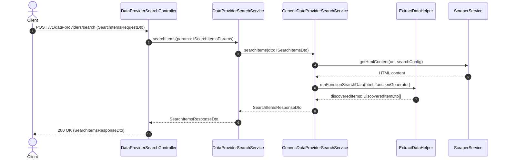

# Implementation Plan: Rename Search Products to Search Items in Data Provider Module

## Section 1. Current State

### Verified Current Flow & Architecture
- **Controller Entry Point**: [`DataProviderSearchController.searchProducts()`](file:///d:/Sources/Personal/only-one-be/src/modules/data-provider/controllers/data-provider-search.controller.ts#L22) receives `SearchProductsRequestDto` from `POST /v1/data-providers/search` and routes to [`DataProviderSearchService.searchProducts()`](file:///d:/Sources/Personal/only-one-be/src/modules/data-provider/services/data-provider-search.service.ts#L28).
- **Service Dispatcher**: [`DataProviderSearchService`](file:///d:/Sources/Personal/only-one-be/src/modules/data-provider/services/data-provider-search.service.ts#L20) checks provider existence & feature readiness (`DataProviderFeatureType.SEARCH`), then looks up the runner implementation from `DATA_PROVIDER_SEARCH_SERVICE_MAP`.
- **Search Execution & Extraction**: [`GenericDataProviderSearchService.searchProducts()`](file:///d:/Sources/Personal/only-one-be/src/modules/data-provider/services/data-provider-search/generic-data-provider-search.service.ts#L33) crawls HTML using [`ScraperService`](file:///d:/Sources/Personal/only-one-be/src/modules/data-provider/services/scraper.service.ts) and extracts product entries into `DiscoveredProductDto[]` using [`ExtractDataHelper.runFunctionSearchData()`](file:///d:/Sources/Personal/only-one-be/src/modules/data-provider/helpers/extract-data.helper.ts#L12).
- **Response Format**: Results are encapsulated in [`SearchProductsResponseDto`](file:///d:/Sources/Personal/only-one-be/src/modules/data-provider/dtos/responses/search-products-response.dto.ts#L32) with property `discoveredProducts: DiscoveredProductDto[]`.

### Core Problem & Motivation
- Terminology in `data-provider` is currently split between `product` (in search) and `item` (in scraping e.g. `DataProviderItemEntity`, `ScrapeItemDataResponseItemDto`).
- Data providers scrape diverse entities (components, raw goods, ingredients, items) rather than strictly retail products.
- Standardizing all occurrences of `Product` $\rightarrow$ `Item` across search services, DTOs, interfaces, and helpers aligns domain language across the system.

### Behaviors That Must Remain Unchanged
- HTTP Route path remains `POST /v1/data-providers/search`.
- Scraper execution logic, proxy support, Cheerio-based function execution in [`ExtractDataHelper`](file:///d:/Sources/Personal/only-one-be/src/modules/data-provider/helpers/extract-data.helper.ts#L12).
- Feature runner contracts in [`SearchFeatureRunner`](file:///d:/Sources/Personal/only-one-be/src/modules/data-provider/runners/search-feature.runner.ts#L9).
- Database entity structure (`data_providers`, `data_provider_features`).

---

## Section 2. Detailed Design

### Technical Design & Boundary
1. **DTO Renaming & Migration**:
   - `search-products-request.dto.ts` $\rightarrow$ `search-items-request.dto.ts` defining `SearchItemsRequestDto`.
   - `search-products-response.dto.ts` $\rightarrow$ `search-items-response.dto.ts` defining `SearchItemsResponseDto`, `DiscoveredItemDto`, `ValidateSearchConfigurationResponseDto`, `ExtractSearchResultsResponse`.
   - Property `discoveredProducts` $\rightarrow$ `discoveredItems`.
2. **Interface & Contract Refactoring**:
   - `ISearchProductsDto` $\rightarrow$ `ISearchItemsDto`.
   - `ISearchProductsParams` $\rightarrow$ `ISearchItemsParams`.
   - `IDataProviderSearchService.searchProducts()` $\rightarrow `searchItems()`.
   - `ExtractDataHelper.runFunctionSearchData()` return type updated to `Promise<DiscoveredItemDto[]>`.
3. **Module Barrel Exports**:
   - Update `dtos/requests/index.ts` and `dtos/responses/index.ts` to export new DTO filenames and symbols.

### Adversarial Red-Team Analysis (Doubt-Driven Check)
- **Claim**: Renaming files and symbols will not break any external integrations or other modules.
- **Doubt**: Are there other modules in `src/` importing `SearchProductsResponseDto` or `DiscoveredProductDto`?
- **Reconciliation**: Full codebase search confirmed that only `data-provider` internals reference these DTOs. Updating barrel exports (`index.ts`) ensures seamless resolution.

---

## Section 3. Implementation Architecture

### Directory Tree & File Changes

```text
src/modules/data-provider/
├── controllers/
│   └── [MODIFY] data-provider-search.controller.ts
├── dtos/
│   ├── requests/
│   │   ├── [DELETE] search-products-request.dto.ts
│   │   ├── [NEW]    search-items-request.dto.ts
│   │   └── [MODIFY] index.ts
│   └── responses/
│       ├── [DELETE] search-products-response.dto.ts
│       ├── [NEW]    search-items-response.dto.ts
│       └── [MODIFY] index.ts
├── helpers/
│   └── [MODIFY] extract-data.helper.ts
├── interfaces/
│   └── [MODIFY] data-provider-search-service.interface.ts
└── services/
    ├── [MODIFY] data-provider-search.service.ts
    └── data-provider-search/
        └── [MODIFY] generic-data-provider-search.service.ts
```

### File Responsibilities
1. `[DELETE] src/modules/data-provider/dtos/requests/search-products-request.dto.ts`: Obsolete request DTO file.
2. `[NEW] src/modules/data-provider/dtos/requests/search-items-request.dto.ts`: Contains `SearchItemsRequestDto`, `TestSearchFunctionRequestDto`, and `UpdateSearchConfigRequestDto`.
3. `[MODIFY] src/modules/data-provider/dtos/requests/index.ts`: Re-exports request DTOs from `search-items-request.dto`.
4. `[DELETE] src/modules/data-provider/dtos/responses/search-products-response.dto.ts`: Obsolete response DTO file.
5. `[NEW] src/modules/data-provider/dtos/responses/search-items-response.dto.ts`: Contains `DiscoveredItemDto`, `SearchItemsResponseDto`, `ValidateSearchConfigurationResponseDto`, and `ExtractSearchResultsResponse`.
6. `[MODIFY] src/modules/data-provider/dtos/responses/index.ts`: Re-exports response DTOs from `search-items-response.dto`.
7. `[MODIFY] src/modules/data-provider/interfaces/data-provider-search-service.interface.ts`: Defines `ISearchItemsDto`, `ISearchItemsParams`, and `IDataProviderSearchService` interface with `searchItems()`.
8. `[MODIFY] src/modules/data-provider/helpers/extract-data.helper.ts`: Updates `runFunctionSearchData` return type to `Promise<DiscoveredItemDto[]>`.
9. `[MODIFY] src/modules/data-provider/services/data-provider-search.service.ts`: Implements `searchItems(params: ISearchItemsParams): Promise<SearchItemsResponseDto>`.
10. `[MODIFY] src/modules/data-provider/services/data-provider-search/generic-data-provider-search.service.ts`: Implements `searchItems()` and returns `discoveredItems`.
11. `[MODIFY] src/modules/data-provider/controllers/data-provider-search.controller.ts`: Controller endpoint method `searchItems()` returning `SearchItemsResponseDto`.

### Architecture Sequence Diagram



---

## Section 4. Implementation Code Examples

### 1. `[DELETE]` `src/modules/data-provider/dtos/requests/search-products-request.dto.ts`
- **Action**: Delete legacy request DTO file.

---

### 2. `[NEW]` `src/modules/data-provider/dtos/requests/search-items-request.dto.ts`
- **Summary**: Defines validated request payload for searching items.
- **Design pattern**: Data Transfer Object (DTO) pattern with `class-validator` and `swagger` decorators.

```typescript
import { ApiProperty, ApiPropertyOptional } from '@nestjs/swagger';
import { IsBoolean, IsNotEmpty, IsObject, IsOptional, IsString, IsUUID } from 'class-validator';

import { ISearchConfig, SearchOptions } from '../../interfaces/search-config.interface';

export class SearchItemsRequestDto {
    @ApiProperty({ description: 'ID của Data Provider' })
    @IsUUID()
    @IsNotEmpty()
    dataProviderId: string;

    @ApiProperty({ description: 'Từ khóa tìm kiếm' })
    @IsString()
    @IsNotEmpty()
    searchQuery: string;

    @ApiPropertyOptional({ description: 'Tùy chọn tìm kiếm' })
    @IsObject()
    @IsOptional()
    options?: SearchOptions;
}

export class TestSearchFunctionRequestDto {
    @ApiProperty({ description: 'Tên service search (ví dụ: generic)' })
    @IsString()
    @IsNotEmpty()
    searchService: string;

    @ApiProperty({ description: 'Base URL' })
    @IsString()
    @IsNotEmpty()
    baseUrl: string;

    @ApiProperty({ description: 'Từ khóa tìm kiếm mẫu' })
    @IsString()
    @IsNotEmpty()
    searchQuery: string;

    @ApiProperty({ description: 'Cấu hình search' })
    @IsObject()
    @IsNotEmpty()
    searchConfig: ISearchConfig;
}

export class UpdateSearchConfigRequestDto {
    @ApiProperty({ description: 'Cấu hình tìm kiếm mới' })
    @IsObject()
    @IsNotEmpty()
    searchConfig: ISearchConfig;

    @ApiPropertyOptional({ description: 'Bật/tắt trạng thái search' })
    @IsBoolean()
    @IsOptional()
    enableSearch?: boolean;
}
```

---

### 3. `[MODIFY]` `src/modules/data-provider/dtos/requests/index.ts`
- **Summary**: Re-export `search-items-request.dto`.

```typescript
export * from './create-data-provider-item-request.dto';
export * from './create-data-provider-request.dto';
export * from './create-scraping-data-request.dto';
export * from './filter-data-provider-request.dto';
export * from './filter-scraping-data-request.dto';
export * from './search-items-request.dto';
export * from './test-scraper-request.dto';
export * from './update-data-provider-item-request.dto';
export * from './update-data-provider-request.dto';
export * from './validate-data-provider-config-request.dto';
```

---

### 4. `[DELETE]` `src/modules/data-provider/dtos/responses/search-products-response.dto.ts`
- **Action**: Delete legacy response DTO file.

---

### 5. `[NEW]` `src/modules/data-provider/dtos/responses/search-items-response.dto.ts`
- **Summary**: Defines response DTOs for searched items with updated `DiscoveredItemDto` and `SearchItemsResponseDto`.

```typescript
import { ApiProperty, ApiPropertyOptional } from '@nestjs/swagger';

import { IScraperRequest } from '../../interfaces/scraper.interface';

export class DiscoveredItemDto {
    @ApiProperty({ description: 'URL sản phẩm / item' })
    url: string;

    @ApiProperty({ description: 'Tiêu đề item' })
    title: string;

    @ApiProperty({ description: 'Độ tin cậy khớp tên (0-1)' })
    confidence: number;

    @ApiPropertyOptional({ description: 'Giá item' })
    price?: string;

    @ApiPropertyOptional({ description: 'Đơn vị tiền tệ' })
    currency?: string;

    @ApiPropertyOptional({ description: 'URL hình ảnh' })
    imageUrl?: string;

    @ApiPropertyOptional({ description: 'URL tương đối' })
    relativeUrl?: string;

    constructor(data?: Partial<DiscoveredItemDto>) {
        if (data) Object.assign(this, data);
    }
}

export class SearchItemsResponseDto {
    @ApiProperty() searchQuery: string;
    @ApiProperty() dataProviderId: string;
    @ApiProperty() status: 'success' | 'error';
    @ApiPropertyOptional() html?: string;
    @ApiPropertyOptional() searchUrl?: string;
    @ApiPropertyOptional() totalResults?: number;
    @ApiPropertyOptional() executionTime?: number;
    @ApiPropertyOptional() request?: IScraperRequest;
    @ApiPropertyOptional({ type: [DiscoveredItemDto] }) discoveredItems?: DiscoveredItemDto[];
    @ApiPropertyOptional() error?: string;

    constructor(data?: Partial<SearchItemsResponseDto>) {
        if (data) Object.assign(this, data);
    }
}

export class ValidateSearchConfigurationResponseDto {
    @ApiProperty() status: 'success' | 'error';
    @ApiPropertyOptional() resultCount?: number;
    @ApiPropertyOptional() executionTime?: number;
    @ApiPropertyOptional({ type: [DiscoveredItemDto] }) sampleResults?: DiscoveredItemDto[];
    @ApiPropertyOptional() error?: string;

    constructor(data?: Partial<ValidateSearchConfigurationResponseDto>) {
        if (data) Object.assign(this, data);
    }
}

export class ExtractSearchResultsResponse {
    html?: string;
    error?: string;
    discoveredItems?: DiscoveredItemDto[];

    constructor(data?: Partial<ExtractSearchResultsResponse>) {
        if (data) Object.assign(this, data);
    }
}
```

---

### 6. `[MODIFY]` `src/modules/data-provider/dtos/responses/index.ts`
- **Summary**: Re-export from `search-items-response.dto`.

```typescript
export * from './create-data-provider-item-response.dto';
export * from './data-provider-item-response.dto';
export * from './data-provider-response.dto';
export * from './scrape-item-data-response.dto';
export * from './scraping-data-response.dto';
export * from './search-items-response.dto';
export * from './update-data-provider-item-response.dto';
```

---

### 7. `[MODIFY]` `src/modules/data-provider/interfaces/data-provider-search-service.interface.ts`
- **Summary**: Updates interfaces from `Product` $\rightarrow$ `Item`.

```typescript
import {
    DiscoveredItemDto,
    ExtractSearchResultsResponse,
    SearchItemsResponseDto,
    ValidateSearchConfigurationResponseDto,
} from '../dtos/responses/search-items-response.dto';
import { DataProviderEntity } from '../entities/data-provider.entity';
import { IScraperRequest } from './scraper.interface';
import { ISearchConfig, SearchOptions } from './search-config.interface';

export interface ISearchItemsDto {
    searchQuery: string;
    dataProvider: DataProviderEntity;
    options?: SearchOptions;
    barcode?: string;
}

export interface IValidateSearchConfigurationDto {
    baseUrl: string;
    searchQuery: string;
    searchConfig: ISearchConfig;
}

export interface IGetSearchResultsDto {
    baseUrl: string;
    searchQuery: string;
    searchConfig: ISearchConfig;
    options?: SearchOptions;
    htmlContentString?: string;
    requestOptions?: IScraperRequest;
}

export interface IPrepareRequestOptionsResponse {
    error?: string;
    data?: IScraperRequest;
}

export interface IFilterSearchResultsDto {
    baseUrl: string;
    searchQuery: string;
    searchConfig: ISearchConfig;
    discoveredItems: DiscoveredItemDto[];
    options?: SearchOptions;
}

export interface IDataProviderSearchService {
    searchItems(dto: ISearchItemsDto): Promise<SearchItemsResponseDto>;
    validateSearchConfiguration(dto: IValidateSearchConfigurationDto): Promise<ValidateSearchConfigurationResponseDto>;
    getSearchResults(dto: IGetSearchResultsDto): Promise<ExtractSearchResultsResponse>;
    prepareRequestOptions(url: string, searchQuery: string, searchConfig: ISearchConfig): Promise<IPrepareRequestOptionsResponse>;
    filterSearchResults(dto: IFilterSearchResultsDto): Promise<DiscoveredItemDto[]>;
}
```

---

### 8. `[MODIFY]` `src/modules/data-provider/helpers/extract-data.helper.ts`
- **Summary**: Updates `runFunctionSearchData` signature to return `Promise<DiscoveredItemDto[]>`.

```typescript
import { DiscoveredItemDto } from '../dtos/responses/search-items-response.dto';
// ...
async runFunctionSearchData(dto: IRunFunctionSearchData): Promise<DiscoveredItemDto[]> {
    // Logic remains intact, returning DiscoveredItemDto[]
}
```

---

### 9. `[MODIFY]` `src/modules/data-provider/services/data-provider-search.service.ts`
- **Summary**: Updates service methods and param types to `ISearchItemsParams` and `searchItems()`.

```typescript
export interface ISearchItemsParams {
    dataProviderId: string;
    searchQuery: string;
    barcode?: string;
    options?: SearchOptions;
}

@Injectable()
export class DataProviderSearchService {
    // ...
    async searchItems(params: ISearchItemsParams): Promise<SearchItemsResponseDto> {
        // ...
        const result = await searchService.searchItems({
            options,
            searchQuery: finalSearchQuery,
            dataProvider: feature.dataProvider,
            barcode,
        });
        return result;
    }
}
```

---

### 10. `[MODIFY]` `src/modules/data-provider/services/data-provider-search/generic-data-provider-search.service.ts`
- **Summary**: Renames method to `searchItems()` and fields to `discoveredItems`.

```typescript
@Injectable()
export class GenericDataProviderSearchService implements IDataProviderSearchService {
    // ...
    async searchItems(dto: ISearchItemsDto): Promise<SearchItemsResponseDto> {
        // ...
        const successRes = new SearchItemsResponseDto({
            ...defaultResponse,
            status: 'success',
            html: searchResults.html,
            request: requestOptions.data,
            searchUrl: requestOptions.data?.url,
            discoveredItems: searchResults.discoveredItems,
            totalResults: searchResults.discoveredItems?.length || 0,
        });
        return successRes;
    }

    async getSearchResults(dto: IGetSearchResultsDto): Promise<ExtractSearchResultsResponse> {
        // ...
        const discoveredItems = await this.extractDataHelper.runFunctionSearchData({
            htmlContent: html,
            functionGenerator: searchConfig.functionGenerator,
            isGetParentElement: searchConfig.isGetParentElement,
            mainContentSelector: searchConfig.mainContentSelector,
        });

        const filteredResults = await this.filterSearchResults({ ...dto, baseUrl, discoveredItems: discoveredItems || [] });
        // normalize URLs on filteredResults ...
        return new ExtractSearchResultsResponse({ html, discoveredItems: filteredResults });
    }

    async filterSearchResults(dto: IFilterSearchResultsDto): Promise<DiscoveredItemDto[]> {
        const { discoveredItems } = dto;
        const maxResults = dto.options?.maxResults || dto.searchConfig?.maxResults || 20;
        return (discoveredItems || []).slice(0, maxResults);
    }
}
```

---

### 11. `[MODIFY]` `src/modules/data-provider/controllers/data-provider-search.controller.ts`
- **Summary**: Updates Swagger documentation, DTO types, and handler method name.

```typescript
@Controller('data-providers')
@ApiTags('Data Providers Search')
@ApiBearerAuth()
@UseGuards(JwtAuthGuard)
export class DataProviderSearchController {
    constructor(private readonly dataProviderSearchService: DataProviderSearchService) {}

    @ApiOperation({ summary: 'Search items by data provider' })
    @HttpCode(HttpStatus.OK)
    @Version('1')
    @Post('search')
    @BaseApiOkResponse(SearchItemsResponseDto)
    public async searchItems(@Body() request: SearchItemsRequestDto): Promise<SearchItemsResponseDto> {
        const result = await this.dataProviderSearchService.searchItems(request);
        return result;
    }
}
```

---

## Section 5. Test Cases

### Acceptance Scenarios (Gherkin BDD)

```gherkin
Feature: Data Provider Search Items API
  As an API consumer
  I want to search items across data providers
  So that I get a standardized list of discovered items

  Scenario: Successfully search items by query
    Given a configured data provider with SEARCH feature READY
    When I send POST /v1/data-providers/search with dataProviderId and searchQuery "milk"
    Then response status is 200 OK
    And response body status is "success"
    And response body contains "discoveredItems" array with DiscoveredItemDto objects

  Scenario: Handle search configuration missing error
    Given a data provider without SEARCH feature configured
    When I send POST /v1/data-providers/search with dataProviderId and searchQuery "coffee"
    Then response status is 200 OK
    And response body status is "error"
    And response body error message states "Search is not enabled for data provider"
```

### Test Cases Matrix

| Test Case | Objective | Precondition | Action | Expected Result |
| :--- | :--- | :--- | :--- | :--- |
| **TC-01** | Verify `SearchItemsRequestDto` validation | App bootstrapped | Send request with missing `dataProviderId` | 400 Bad Request with class-validator error |
| **TC-02** | Verify `searchItems` execution and `discoveredItems` response | Mocked scraper returning HTML | Call `GenericDataProviderSearchService.searchItems` | Returns `SearchItemsResponseDto` with `discoveredItems` populated |
| **TC-03** | Verify TypeScript compilation & zero lint errors | Code updated | Run `npm run build` | Build succeeds with 0 compile errors |

### Verification Commands
- **Lint Check**: `npm run lint`
- **Build Check**: `npm run build`
