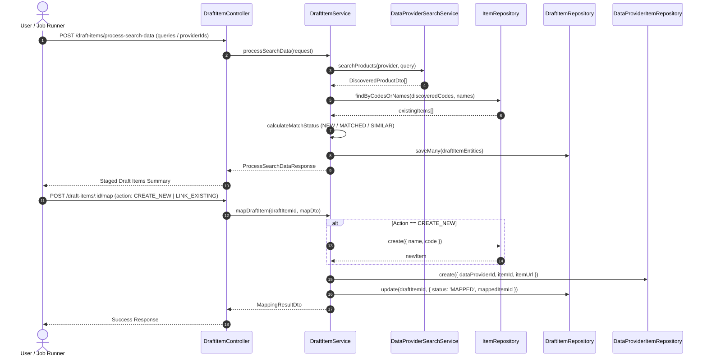
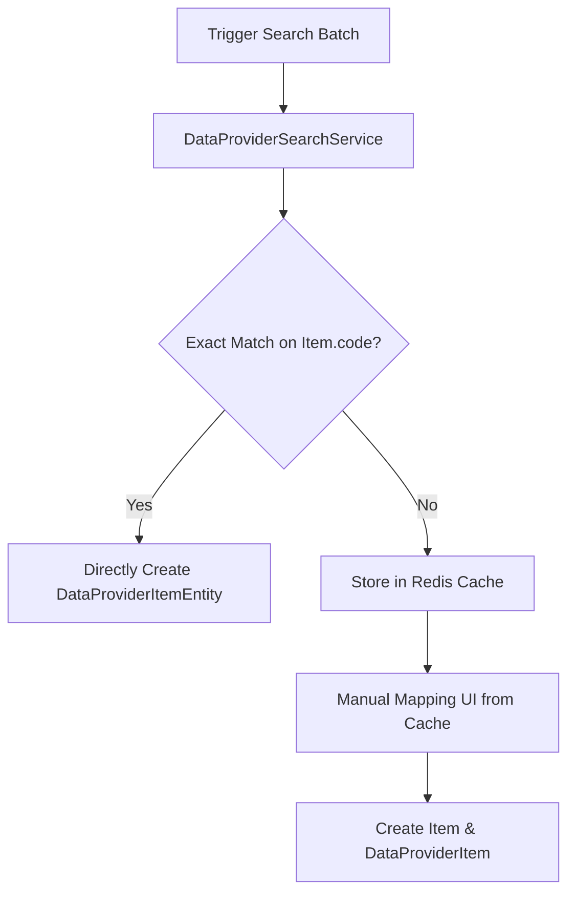

# Technical Proposal: Draft Item Search Processing & Mapping Architecture

## 1. Problem Statement & Core Concept

- **Core Business Problem**: 
  Currently, the system possesses a rich batch scraping pipeline ([`ScrapingDataService`](file:///Users/kiem/Sources/Personal/only-one-be/src/modules/data-provider/services/scraping-data.service.ts)) which queries configured [`DataProviderFeatureType.SCRAPING`](file:///Users/kiem/Sources/Personal/only-one-be/src/modules/data-provider/enums/data-provider-feature-type.enum.ts#L2) features to extract structured page data into [`ScrapingDataEntity`](file:///Users/kiem/Sources/Personal/only-one-be/src/modules/data-provider/entities/scraping-data.entity.ts). However, for search capabilities ([`DataProviderFeatureType.SEARCH`](file:///Users/kiem/Sources/Personal/only-one-be/src/modules/data-provider/enums/data-provider-feature-type.enum.ts#L3)), the platform only has a direct, ad-hoc execution service ([`DataProviderSearchService`](file:///Users/kiem/Sources/Personal/only-one-be/src/modules/data-provider/services/data-provider-search.service.ts)) without a persistent orchestrator, staging storage, automatic matching algorithm against canonical items, or human-in-the-loop mapping workflow.
  
- **Core Value & Target Audience**: 
  - **Data Operators & Administrators**: Discover products from external data providers, automatically classify them as new, exact match, or duplicate against existing catalog items, and promote/map them into official [`ItemEntity`](file:///Users/kiem/Sources/Personal/only-one-be/src/modules/data-provider/entities/item.entity.ts) and [`DataProviderItemEntity`](file:///Users/kiem/Sources/Personal/only-one-be/src/modules/data-provider/entities/data-provider-item.entity.ts) entities with a single click.
  - **System Automation**: Provides a resilient, decoupled staging layer (`DraftItemEntity`) preventing unverified third-party search results from polluting the primary product catalog.

- **Success Metrics (Definition of Done)**:
  - 100% decoupling: Search results are staged in `DraftItemEntity` prior to manual or automated catalog promotion.
  - Automated status evaluation: Discovered items are checked against [`ItemEntity.code`](file:///Users/kiem/Sources/Personal/only-one-be/src/modules/data-provider/entities/item.entity.ts#L22) and [`ItemEntity.name`](file:///Users/kiem/Sources/Personal/only-one-be/src/modules/data-provider/entities/item.entity.ts#L14) to classify status (`NEW`, `MATCHED`, `SIMILAR`, `CONFLICT`).
  - Seamless catalog promotion: 1-step mapping API creates [`ItemEntity`](file:///Users/kiem/Sources/Personal/only-one-be/src/modules/data-provider/entities/item.entity.ts) (if new) and links [`DataProviderItemEntity`](file:///Users/kiem/Sources/Personal/only-one-be/src/modules/data-provider/entities/data-provider-item.entity.ts) referencing `dataProviderId`, `itemId`, and `itemUrl`.

- **Scope Boundaries**:
  - **In-Scope**:
    - Creation of `DraftItemEntity` (and corresponding DTOs, repository, automapper profiles).
    - Creation of `DraftItemService` orchestrating search calls across active search-ready Data Providers, matching discovered items with [`ItemEntity`](file:///Users/kiem/Sources/Personal/only-one-be/src/modules/data-provider/entities/item.entity.ts), and persisting draft records.
    - Status evaluation logic (`NEW`, `MATCHED`, `SIMILAR`, `MAPPED`).
    - API endpoints in `DraftItemController` for triggering search batch processing, querying/filtering draft items, and executing mapping into [`ItemEntity`](file:///Users/kiem/Sources/Personal/only-one-be/src/modules/data-provider/entities/item.entity.ts) + [`DataProviderItemEntity`](file:///Users/kiem/Sources/Personal/only-one-be/src/modules/data-provider/entities/data-provider-item.entity.ts).
    - Integration with [`DataProviderFeatureService`](file:///Users/kiem/Sources/Personal/only-one-be/src/modules/data-provider/services/data-provider-feature.service.ts) to record feature execution success/failure health.
  - **Explicit Out-of-Scope**:
    - Automatic scraping of full product details upon draft discovery (scraping remains in [`ScrapingDataService`](file:///Users/kiem/Sources/Personal/only-one-be/src/modules/data-provider/services/scraping-data.service.ts) after items are mapped to `DataProviderItemEntity`).
    - AI-based semantic vector search (matching uses deterministic code/barcode & normalized text similarity).

---

## 2. Current Business Logic (As-is Analysis)

- **Existing Scraping Pipeline**:
  - [`ScrapingDataService.processScrapeData()`](file:///Users/kiem/Sources/Personal/only-one-be/src/modules/data-provider/services/scraping-data.service.ts#L40): Fetches data providers with `DataProviderFeatureType.SCRAPING` in `READY` status, traverses active `dataProviderItems`, dispatches scraping calls via `DATA_PROVIDER_SCRAPER_SERVICE_MAP`, checks duplicates, uploads media to cloud storage, and saves records into `ScrapingDataEntity`.
- **Existing Search Pipeline**:
  - [`DataProviderSearchService.searchProducts()`](file:///Users/kiem/Sources/Personal/only-one-be/src/modules/data-provider/services/data-provider-search.service.ts#L28): Performs direct search via [`GenericDataProviderSearchService`](file:///Users/kiem/Sources/Personal/only-one-be/src/modules/data-provider/services/data-provider-search/generic-data-provider-search.service.ts#L33) using CSS selectors / JS function generators. It returns transient [`SearchProductsResponseDto`](file:///Users/kiem/Sources/Personal/only-one-be/src/modules/data-provider/dtos/responses/search-products-response.dto.ts#L32) containing `DiscoveredProductDto[]` directly to the caller.
- **Identified Gap**:
  - No persistence or audit trail for search discovery runs.
  - No comparison mechanism between search results and existing catalog items ([`ItemEntity`](file:///Users/kiem/Sources/Personal/only-one-be/src/modules/data-provider/entities/item.entity.ts)).
  - No structured workflow to convert discovered URLs into [`DataProviderItemEntity`](file:///Users/kiem/Sources/Personal/only-one-be/src/modules/data-provider/entities/data-provider-item.entity.ts) records.

---

## 3. Proposed Solution Alternatives

### Option 1 (Recommended): Dedicated `DraftItemService` with Staging Entity & Two-Phase Promotion

- **Solution Overview & Mechanics**:
  1. **Staging Persistence (`DraftItemEntity`)**: Stores discovered products from search runs with fields: `id`, `dataProviderFeatureId`, `title`, `url`, `code` (parsed barcode/SKU), `status` (`NEW` | `MATCHED` | `SIMILAR` | `MAPPED`), `suggestedItemId`, `metadata` (JSON: storing raw provider payload like price, currency, imageUrl, etc.), and `searchQuery`.
  2. **Processing Pipeline (`DraftItemService.processSearchData`)**:
     - Queries providers having `DataProviderFeatureType.SEARCH` with `DataProviderFeatureStatus.READY`.
     - Invokes `DataProviderSearchService` using configured search parameters or batch request queries.
     - Compares discovered products against `ItemEntity` (matching on `code` and normalized `name`).
     - Inserts/Updates draft records in `draft_items` table and updates `DataProviderFeatureEntity` success/failure health.
  3. **Atomic Mapping API (`DraftItemService.mapDraftItem`)**:
     - If user confirms mapping to an existing `ItemEntity`: creates [`DataProviderItemEntity`](file:///Users/kiem/Sources/Personal/only-one-be/src/modules/data-provider/entities/data-provider-item.entity.ts) linking `dataProviderId` + `itemId` + `itemUrl`.
     - If user requests creating a new `ItemEntity`: inserts new [`ItemEntity`](file:///Users/kiem/Sources/Personal/only-one-be/src/modules/data-provider/entities/item.entity.ts) and the corresponding [`DataProviderItemEntity`](file:///Users/kiem/Sources/Personal/only-one-be/src/modules/data-provider/entities/data-provider-item.entity.ts).
     - Marks `DraftItemEntity.status = 'MAPPED'` (or updates `mappedItemId`).

- **Mermaid Architecture & Sequence Diagram**:

- **Pros**:
  - Total separation of concerns: Third-party web data is safely quarantined in `DraftItemEntity`.
  - Rich user workflow: Operators can filter by match status (`NEW`, `MATCHED`, `SIMILAR`), inspect discovered images/prices, and bulk-approve or reject.
  - Symmetrical with existing `ScrapingDataService` architecture, adhering to repository design patterns.
- **Cons**:
  - Requires a new database migration for `draft_items` table.
- **Complexity & Risks**:
  - Low complexity; leverages existing TypeORM repositories, BaseService, and Automapper.

---

### Option 2 (Alternative): Inline Auto-Creation of `DataProviderItem` & Direct Promotion

- **Solution Overview & Mechanics**:
  - Instead of a dedicated `DraftItemEntity` staging table, `SearchDataService` directly attempts to match discovered items. If an exact match is found, it immediately creates a [`DataProviderItemEntity`](file:///Users/kiem/Sources/Personal/only-one-be/src/modules/data-provider/entities/data-provider-item.entity.ts).
  - Unmatched items are written into a temporary Redis cache or a lightweight event log for manual intervention.

- **Mermaid Flow Diagram**:

- **Pros**:
  - No new persistent relational table required if mostly automated.
- **Cons**:
  - Lack of durable persistence: In-memory/cache storage risks losing discovered product data during crashes or TTL expiration.
  - High risk of false-positive duplicate creation without administrative staging review.
  - Inflexible pagination and filtering capabilities compared to PostgreSQL relational queries.
- **Complexity & Risks**:
  - High risk of catalog pollution and duplicate URLs.

---

### Comparison Matrix & Recommendation

| Criteria | Option 1: Dedicated `DraftItemService` + `DraftItemEntity` (Recommended) | Option 2: Inline Auto-Creation + Cache |
| :--- | :--- | :--- |
| **Data Safety & Integrity** | **High** (Quarantined staging table, validated before catalog insertion) | Low (Direct catalog mutations, transient cache) |
| **Workflow Flexibility** | **High** (Review status: NEW, MATCHED, SIMILAR; bulk mapping) | Low (Rigid binary auto-match or discard) |
| **Codebase Alignment** | **High** (Parallels `ScrapingDataService`, `BaseService`, TypeORM) | Moderate (Introduces ad-hoc caching patterns) |
| **Auditability & History** | **High** (Full persistence of discovered URLs and timestamps) | Low (Ephemeral) |
| **Implementation Effort** | Moderate (Standard NestJS Module CRUD + Pipeline) | Moderate |

- **Conclusion**: Recommend **Option 1** because it strictly maintains catalog integrity, adheres to the established repository structure, and provides a clear human-in-the-loop review mechanism for discovered third-party items.

---

## 4. Key Failure Modes & Security Boundaries

- **Exception & Timeout Handling**:
  - **External Provider Outages / HTTP Timeouts**: Handled via try-catch blocks in `processSearchDataProvider`; records errors in [`DataProviderFeatureEntity`](file:///Users/kiem/Sources/Personal/only-one-be/src/modules/data-provider/entities/data-provider-feature.entity.ts) via `DataProviderFeatureService.recordFeatureFailure(featureId, error, FATAL | TRANSIENT)`.
  - **Duplicate Discovered URLs**: Unique constraint / duplicate check on `(data_provider_feature_id, url)` in `draft_items` table or upsert logic to refresh prices/metadata without creating duplicate drafts.
- **Authorization Boundary**:
  - Search execution and mapping endpoints are restricted to authenticated admin/system operators.

---

## 5. High-Level Technical Specifications

- **Affected Modules / Services**:
  - Module: [`DataProviderModule`](file:///Users/kiem/Sources/Personal/only-one-be/src/modules/data-provider/data-provider.module.ts)
  - Entities:
    - `DraftItemEntity` (`draft_items` table)
    - Enum: `DraftItemStatus` (`NEW`, `MATCHED`, `SIMILAR`, `MAPPED`, `IGNORED`)
  - Services:
    - `DraftItemService` (orchestrates batch search, matching, and mapping to `ItemEntity` + `DataProviderItemEntity`)
  - Controllers:
    - `DraftItemController` (CRUD endpoints, `POST /draft-items/process-search`, `POST /draft-items/:id/map`)
  - DTOs & Responses:
    - `ProcessSearchDataRequestDto`, `ProcessSearchDataResponseDto`
    - `MapDraftItemRequestDto`, `DraftItemDto`, `DraftItemFilterDto`
  - Automapper:
    - Updates in `DataProviderProfile` for `DraftItemEntity` $\leftrightarrow$ `DraftItemDto`.

---

## 6. Next Steps

1. User confirms Option 1 in `concept.md`.
2. Run `/only-one-plan only-one/tasks/20260824-175000-draft-item-search-service` to generate the 5-section `plan.md`.
3. Execute the implementation with `/only-one-apply only-one/tasks/20260824-175000-draft-item-search-service`.
4. Review with `/only-one-review` and create PR with `/only-one-pr-git`.
5. Distill and archive with `/only-one-archive only-one/tasks/20260824-175000-draft-item-search-service`.
