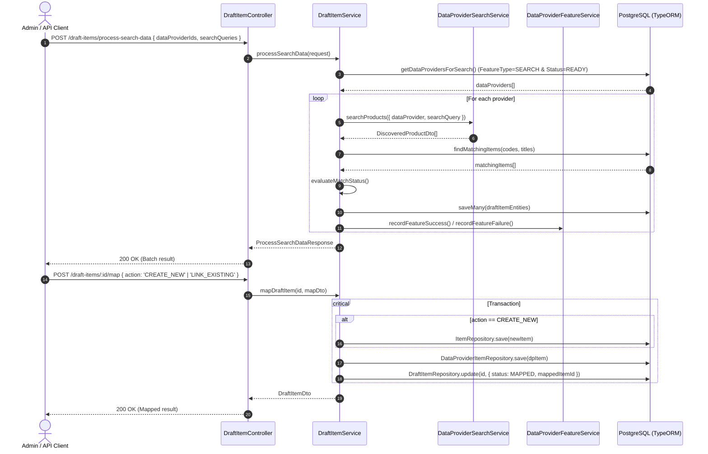

# Implementation Plan: Draft Item Search Processing & Mapping Architecture

## Section 1. Current State

### 1.1 Verified Current Behavior & Execution Flow
- **Scraping Pipeline**:
  - [`ScrapingDataService.processScrapeData()`](file:///Users/kiem/Sources/Personal/only-one-be/src/modules/data-provider/services/scraping-data.service.ts#L40): Dispatches batch scraping across data providers with [`DataProviderFeatureType.SCRAPING`](file:///Users/kiem/Sources/Personal/only-one-be/src/modules/data-provider/enums/data-provider-feature-type.enum.ts#L2) in `READY` status, resolves scraper implementation via [`DATA_PROVIDER_SCRAPER_SERVICE_MAP`](file:///Users/kiem/Sources/Personal/only-one-be/src/modules/data-provider/constants/data-provider-scraper-service-map.ts), extracts data items, uploads media via [`CloudDataItemService`](file:///Users/kiem/Sources/Personal/only-one-be/src/modules/cloud-data/services/cloud-data-item.service.ts), stores records into [`ScrapingDataEntity`](file:///Users/kiem/Sources/Personal/only-one-be/src/modules/data-provider/entities/scraping-data.entity.ts), and tracks health status in [`DataProviderFeatureService`](file:///Users/kiem/Sources/Personal/only-one-be/src/modules/data-provider/services/data-provider-feature.service.ts#L197).
- **Search Pipeline**:
  - [`DataProviderSearchService.searchProducts()`](file:///Users/kiem/Sources/Personal/only-one-be/src/modules/data-provider/services/data-provider-search.service.ts#L28): Executes on-demand search by querying [`DataProviderFeatureEntity`](file:///Users/kiem/Sources/Personal/only-one-be/src/modules/data-provider/entities/data-provider-feature.entity.ts) with [`DataProviderFeatureType.SEARCH`](file:///Users/kiem/Sources/Personal/only-one-be/src/modules/data-provider/enums/data-provider-feature-type.enum.ts#L3), and delegates extraction to [`GenericDataProviderSearchService.searchProducts()`](file:///Users/kiem/Sources/Personal/only-one-be/src/modules/data-provider/services/data-provider-search/generic-data-provider-search.service.ts#L33).
  - Search results are returned transiently as [`SearchProductsResponseDto`](file:///Users/kiem/Sources/Personal/only-one-be/src/modules/data-provider/dtos/responses/search-products-response.dto.ts#L32) containing [`DiscoveredProductDto[]`](file:///Users/kiem/Sources/Personal/only-one-be/src/modules/data-provider/dtos/responses/search-products-response.dto.ts#L5).

### 1.2 Core Limitations Addressed
1. **No Staging Persistence**: Search discovery runs are not persisted to database; discovered product links and metadata are lost after the HTTP request finishes.
2. **Missing Catalog Match Evaluation**: The system has no automatic comparison comparing search results against canonical [`ItemEntity`](file:///Users/kiem/Sources/Personal/only-one-be/src/modules/data-provider/entities/item.entity.ts) records (by `code` / barcode or `name`).
3. **No Promotion / Mapping Mechanism**: Operators lack an endpoint and workflow to promote draft items into official catalog records ([`ItemEntity`](file:///Users/kiem/Sources/Personal/only-one-be/src/modules/data-provider/entities/item.entity.ts) & [`DataProviderItemEntity`](file:///Users/kiem/Sources/Personal/only-one-be/src/modules/data-provider/entities/data-provider-item.entity.ts)).

### 1.3 Behaviors That Must Remain Unchanged
- [`ScrapingDataService`](file:///Users/kiem/Sources/Personal/only-one-be/src/modules/data-provider/services/scraping-data.service.ts) and [`ScrapingDataController`](file:///Users/kiem/Sources/Personal/only-one-be/src/modules/data-provider/controllers/scraping-data.controller.ts) scraping workflows and DTOs must remain intact.
- Existing [`DataProviderSearchService.searchProducts()`](file:///Users/kiem/Sources/Personal/only-one-be/src/modules/data-provider/services/data-provider-search.service.ts#L28) and test runner functions must continue to function for single ad-hoc queries and playground tests.
- [`DataProviderFeatureEntity`](file:///Users/kiem/Sources/Personal/only-one-be/src/modules/data-provider/entities/data-provider-feature.entity.ts) and [`ConfigVersionEntity`](file:///Users/kiem/Sources/Personal/only-one-be/src/modules/data-provider/entities/config-version.entity.ts) rules defined in [`only-one/rules.md`](file:///Users/kiem/Sources/Personal/only-one-be/only-one/rules.md) must be strictly followed.

---

## Section 2. Detailed Design

### 2.1 Architecture & Component Workflow

```
       [ Client / Scheduler ]
                 │ (Trigger Batch Search)
                 ▼
       ┌────────────────────────┐
       │  DraftItemController   │
       └──────────┬─────────────┘
                  │
                  ▼
       ┌────────────────────────┐
       │    DraftItemService    │
       └────┬──────────────┬────┘
            │              │
            │ (1. Search)  │ (2. Compare with Catalog)
            ▼              ▼
 ┌────────────────────┐  ┌────────────────────┐
 │DataProviderSearch  │  │   ItemRepository   │
 │      Service       │  │ (ItemEntity.code)  │
 └────────────────────┘  └────────────────────┘
            │                      │
            └──────────┬───────────┘
                       │ (3. Persist Staged Drafts)
                       ▼
            ┌────────────────────┐
            │DraftItemRepository │
            │ (draft_items table)│
            └────────────────────┘
                       │
                       │ (4. Operator Review & Map API)
                       ▼
            ┌──────────────────────────────────────────────┐
            │ Atomic Promotion:                            │
            │  1. Create ItemEntity (if new)               │
            │  2. Create DataProviderItemEntity            │
            │  3. Update DraftItemEntity.status = 'MAPPED' │
            └──────────────────────────────────────────────┘
```

### 2.2 Matching & Classification Algorithm
When search results (`DiscoveredProductDto[]`) arrive:
1. **Extract Identifiers**: Extract `barcode` / `code` from discovered products (if provided by search extraction or URL pattern) and product titles.
2. **Exact Code Match (`MATCHED`)**:
   - Query `ItemEntity` where `item.code = discoveredProduct.code`.
   - If found, classify draft status as `DraftItemStatus.MATCHED` and assign `suggestedItemId = item.id`.
3. **Similarity Check (`SIMILAR`)**:
   - If no exact code match, run case-insensitive normalized name comparison against active items.
   - If string similarity or substring match exceeds confidence threshold (e.g. $\ge 0.8$), classify as `DraftItemStatus.SIMILAR` with `suggestedItemId`.
4. **New Item (`NEW`)**:
   - If no matching code or similar name exists in the database, classify as `DraftItemStatus.NEW`.
5. **Deduplication against Drafts**:
   - Prevent duplicate draft entries for the same provider feature and URL `(dataProviderFeatureId, url)` by updating metadata or skipping existing unprocessed drafts.

### 2.3 Catalog Promotion Flow (`mapDraftItem`)
1. **Input Payload**: `MapDraftItemRequestDto` with `action`: `CREATE_NEW` | `LINK_EXISTING`, and optional override fields (`name`, `code`, `itemId`, `isSavedToCloudData`).
2. **Database Transaction (Atomic)**:
   - Case A (`CREATE_NEW`): Insert new [`ItemEntity`](file:///Users/kiem/Sources/Personal/only-one-be/src/modules/data-provider/entities/item.entity.ts) with `name`, `code`, and `ProductMappingStatus.MAPPED`.
   - Case B (`LINK_EXISTING`): Verify specified `itemId` exists in `ItemEntity`.
   - Insert [`DataProviderItemEntity`](file:///Users/kiem/Sources/Personal/only-one-be/src/modules/data-provider/entities/data-provider-item.entity.ts) with `dataProviderId = draft.dataProviderFeature.dataProviderId`, `itemId`, `itemUrl = draft.url`, `isActive = true`.
   - Update [`DraftItemEntity`](file:///Users/kiem/Sources/Personal/only-one-be/src/modules/data-provider/entities/draft-item.entity.ts): `status = DraftItemStatus.MAPPED`, `mappedItemId = targetItemId`, `mappedDataProviderItemId = createdDpItemId`.

### 2.4 Adversarial Red-Team Checks (`doubt-driven-development`)
- `CLAIM`: Search results might return items already tracked in `DataProviderItemEntity`.
  - `DOUBT`: What happens if user tries to map a draft item whose `(dataProviderId, itemUrl)` already exists in `DataProviderItemEntity`?
  - `RECONCILE`: In `mapDraftItem`, check if a `DataProviderItemEntity` with `(dataProviderId, itemUrl)` already exists. If it exists, link to the existing `DataProviderItemEntity` and mark the draft as mapped rather than failing or violating unique constraints.
- `CLAIM`: Concurrent batch search executions for the same search query might insert duplicate drafts.
  - `DOUBT`: Race conditions on draft insertion.
  - `RECONCILE`: Implement find-or-create / upsert logic using `(dataProviderFeatureId, url)` composite key check in `DraftItemService.saveDiscoveredDrafts()`.

---

## Section 3. Implementation Architecture

### 3.1 Target Directory Tree

```
src/modules/data-provider/
├── constants/
│   ├── [NEW] draft-item-pagination.config.ts
│   └── ...
├── controllers/
│   ├── [NEW] draft-item.controller.ts
│   └── ...
├── dtos/
│   ├── [NEW] draft-item.dto.ts
│   ├── requests/
│   │   ├── [NEW] draft-item-request.dto.ts
│   │   ├── [NEW] process-search-data-request.dto.ts
│   │   └── [MODIFY] index.ts
│   └── responses/
│       ├── [NEW] process-search-data-response.dto.ts
│       └── [MODIFY] index.ts
├── entities/
│   ├── [NEW] draft-item.entity.ts
│   ├── [MODIFY] data-provider.entity.ts
│   ├── [MODIFY] item.entity.ts
│   └── ...
├── enums/
│   ├── [NEW] draft-item-status.enum.ts
│   └── [MODIFY] index.ts
├── services/
│   ├── [NEW] draft-item.service.ts
│   └── ...
├── [MODIFY] data-provider.profile.ts
└── [MODIFY] data-provider.module.ts
```

### 3.2 Planned File Changes Summary

| Action | Path | Responsibility |
| :--- | :--- | :--- |
| `[NEW]` | `src/modules/data-provider/enums/draft-item-status.enum.ts` | Enum for draft item lifecycle status (`NEW`, `MATCHED`, `SIMILAR`, `MAPPED`, `IGNORED`). |
| `[MODIFY]` | `src/modules/data-provider/enums/index.ts` | Export `DraftItemStatus`. |
| `[NEW]` | `src/modules/data-provider/entities/draft-item.entity.ts` | TypeORM entity for `draft_items` table. |
| `[MODIFY]` | `src/modules/data-provider/entities/data-provider-feature.entity.ts` | Add 1-to-N relation to `DraftItemEntity`. |
| `[MODIFY]` | `src/modules/data-provider/entities/item.entity.ts` | Add 1-to-N relation to `DraftItemEntity` for suggested / mapped items. |
| `[NEW]` | `src/modules/data-provider/dtos/draft-item.dto.ts` | DTO for `DraftItemEntity` responses and AutoMapper. |
| `[NEW]` | `src/modules/data-provider/dtos/requests/draft-item-request.dto.ts` | Request DTOs: `CreateDraftItemRequestDto`, `MapDraftItemRequestDto`, `FilterDraftItemPaginationDto`. |
| `[NEW]` | `src/modules/data-provider/dtos/requests/process-search-data-request.dto.ts` | Request DTO for `processSearchData` batch execution. |
| `[NEW]` | `src/modules/data-provider/dtos/responses/process-search-data-response.dto.ts` | Response DTO summarizing batch search execution results. |
| `[MODIFY]` | `src/modules/data-provider/dtos/requests/index.ts` | Export draft item request DTOs. |
| `[MODIFY]` | `src/modules/data-provider/dtos/responses/index.ts` | Export draft item response DTOs. |
| `[NEW]` | `src/modules/data-provider/constants/draft-item-pagination.config.ts` | Pagination, filter, and sorting configuration for `DraftItemEntity`. |
| `[NEW]` | `src/modules/data-provider/services/draft-item.service.ts` | Orchestration service for batch search execution, matching, and item mapping. |
| `[NEW]` | `src/modules/data-provider/controllers/draft-item.controller.ts` | REST API controller exposing CRUD, pagination, batch search process, and map endpoints. |
| `[MODIFY]` | `src/modules/data-provider/data-provider.profile.ts` | AutoMapper mappings between `DraftItemEntity`, `DraftItemDto`, and request DTOs. |
| `[MODIFY]` | `src/modules/data-provider/data-provider.module.ts` | Register `DraftItemEntity`, `DraftItemService`, `DraftItemController`, and pagination configs. |

### 3.3 Sequence Diagram of Operations



---

## Section 4. Implementation Code Examples

### 4.1 `[NEW] src/modules/data-provider/enums/draft-item-status.enum.ts`
- **Responsibility**: Define lifecycle states of discovered draft items.
- **Design pattern**: Enum definition.

```typescript
export enum DraftItemStatus {
    NEW = 'NEW',
    MATCHED = 'MATCHED',
    SIMILAR = 'SIMILAR',
    MAPPED = 'MAPPED',
    IGNORED = 'IGNORED',
}
```

---

### 4.2 `[MODIFY] src/modules/data-provider/enums/index.ts`
- **Responsibility**: Export `DraftItemStatus`.

```typescript
export * from './draft-item-status.enum';
```

---

### 4.3 `[NEW] src/modules/data-provider/entities/draft-item.entity.ts`
- **Responsibility**: Staging entity in `draft_items` table storing discovered search results.
- **Design pattern**: TypeORM Active Record / Data Mapper entity pattern extending `AbstractEntity`.

```typescript
import { AutoMap } from '@automapper/classes';
import { Column, Entity, JoinColumn, ManyToOne, Relation } from 'typeorm';

import { AbstractEntity } from '../../../common/entities';
import { DraftItemStatus } from '../enums/draft-item-status.enum';
import { DataProviderFeatureEntity } from './data-provider-feature.entity';
import { ItemEntity } from './item.entity';

@Entity({ name: 'draft_items', synchronize: false })
export class DraftItemEntity extends AbstractEntity {
    @Column({ name: 'data_provider_feature_id', type: 'uuid' })
    @AutoMap()
    dataProviderFeatureId: string;

    @Column({ type: 'text' })
    @AutoMap()
    title: string;

    @Column({ type: 'text' })
    @AutoMap()
    url: string;

    @Column({ type: 'varchar', length: 100, nullable: true })
    @AutoMap()
    code?: string;

    @Column({ type: 'varchar', length: 255, nullable: true })
    @AutoMap()
    searchQuery?: string;

    @Column({ type: 'float', default: 0 })
    @AutoMap()
    confidence: number;

    @Column({ type: 'varchar', length: 50, default: DraftItemStatus.NEW })
    @AutoMap()
    status: DraftItemStatus;

    @Column({ name: 'suggested_item_id', type: 'uuid', nullable: true })
    @AutoMap()
    suggestedItemId?: string;

    @Column({ name: 'mapped_item_id', type: 'uuid', nullable: true })
    @AutoMap()
    mappedItemId?: string;

    @Column({ name: 'mapped_data_provider_item_id', type: 'uuid', nullable: true })
    @AutoMap()
    mappedDataProviderItemId?: string;

    @Column({ type: 'jsonb', nullable: true })
    @AutoMap()
    metadata?: Record<string, any>;

    @ManyToOne(() => DataProviderFeatureEntity, { onDelete: 'CASCADE' })
    @JoinColumn({ name: 'data_provider_feature_id' })
    @AutoMap(() => DataProviderFeatureEntity)
    dataProviderFeature: Relation<DataProviderFeatureEntity>;

    @ManyToOne(() => ItemEntity, { onDelete: 'SET NULL', nullable: true })
    @JoinColumn({ name: 'suggested_item_id' })
    @AutoMap(() => ItemEntity)
    suggestedItem?: Relation<ItemEntity>;

    @ManyToOne(() => ItemEntity, { onDelete: 'SET NULL', nullable: true })
    @JoinColumn({ name: 'mapped_item_id' })
    @AutoMap(() => ItemEntity)
    mappedItem?: Relation<ItemEntity>;
}
```

---

### 4.4 `[MODIFY] src/modules/data-provider/entities/data-provider-feature.entity.ts`
- **Responsibility**: Add `@OneToMany(() => DraftItemEntity, (draftItem) => draftItem.dataProviderFeature)` relation to `DataProviderFeatureEntity`.

---

### 4.5 `[MODIFY] src/modules/data-provider/entities/item.entity.ts`
- **Responsibility**: Add relations for draft items (`suggestedDraftItems`, `mappedDraftItems`).

---

### 4.6 `[NEW] src/modules/data-provider/dtos/draft-item.dto.ts`
- **Responsibility**: Response DTO for `DraftItemEntity`.

```typescript
import { AutoMap } from '@automapper/classes';
import { ApiResponseProperty } from '@nestjs/swagger';

import { AbstractDto } from '../../../common/dto/abstract.dto';
import { DraftItemStatus } from '../enums/draft-item-status.enum';
import { DataProviderFeatureDto } from './data-provider-feature.dto';
import { ItemDto } from './item.dto';

export class DraftItemDto extends AbstractDto {
    @ApiResponseProperty()
    @AutoMap()
    dataProviderFeatureId: string;

    @ApiResponseProperty()
    @AutoMap()
    title: string;

    @ApiResponseProperty()
    @AutoMap()
    url: string;

    @ApiResponseProperty()
    @AutoMap()
    code?: string;

    @ApiResponseProperty()
    @AutoMap()
    searchQuery?: string;

    @ApiResponseProperty()
    @AutoMap()
    confidence: number;

    @ApiResponseProperty({ enum: DraftItemStatus })
    @AutoMap()
    status: DraftItemStatus;

    @ApiResponseProperty()
    @AutoMap()
    suggestedItemId?: string;

    @ApiResponseProperty()
    @AutoMap()
    mappedItemId?: string;

    @ApiResponseProperty()
    @AutoMap()
    mappedDataProviderItemId?: string;

    @ApiResponseProperty()
    @AutoMap()
    metadata?: Record<string, any>;

    @ApiResponseProperty({ type: () => DataProviderFeatureDto })
    @AutoMap(() => DataProviderFeatureDto)
    dataProviderFeature?: DataProviderFeatureDto;

    @ApiResponseProperty({ type: () => ItemDto })
    @AutoMap(() => ItemDto)
    suggestedItem?: ItemDto;

    @ApiResponseProperty({ type: () => ItemDto })
    @AutoMap(() => ItemDto)
    mappedItem?: ItemDto;
}
```

---

### 4.7 `[NEW] src/modules/data-provider/dtos/requests/draft-item-request.dto.ts`
- **Responsibility**: Input validation for draft item operations and mapping.

```typescript
import { AutoMap } from '@automapper/classes';
import { ApiProperty, ApiPropertyOptional } from '@nestjs/swagger';
import { IsEnum, IsNotEmpty, IsOptional, IsString, IsUUID } from 'class-validator';

import { DraftItemStatus } from '../../enums/draft-item-status.enum';

export enum MapDraftItemAction {
    CREATE_NEW = 'CREATE_NEW',
    LINK_EXISTING = 'LINK_EXISTING',
}

export class MapDraftItemRequestDto {
    @ApiProperty({ enum: MapDraftItemAction, description: 'Action: create new item or link to existing' })
    @IsEnum(MapDraftItemAction)
    @IsNotEmpty()
    action: MapDraftItemAction;

    @ApiPropertyOptional({ description: 'Target Item ID if LINK_EXISTING' })
    @IsUUID()
    @IsOptional()
    itemId?: string;

    @ApiPropertyOptional({ description: 'Custom item name if CREATE_NEW (defaults to draft title)' })
    @IsString()
    @IsOptional()
    itemName?: string;

    @ApiPropertyOptional({ description: 'Custom item code if CREATE_NEW (defaults to draft code)' })
    @IsString()
    @IsOptional()
    itemCode?: string;
}

export class FilterDraftItemPaginationDto {
    @ApiPropertyOptional()
    @IsOptional()
    @IsUUID()
    dataProviderFeatureId?: string;

    @ApiPropertyOptional({ enum: DraftItemStatus })
    @IsOptional()
    @IsEnum(DraftItemStatus)
    status?: DraftItemStatus;
}
```

---

### 4.8 `[NEW] src/modules/data-provider/dtos/requests/process-search-data-request.dto.ts`
- **Responsibility**: Input DTO for triggering batch search discovery.

```typescript
import { ApiPropertyOptional } from '@nestjs/swagger';
import { IsArray, IsOptional, IsString } from 'class-validator';

export class ProcessSearchDataRequestDto {
    @ApiPropertyOptional({ description: 'Optional list of DataProvider IDs to search' })
    @IsOptional()
    @IsArray()
    dataProviderIds?: string[];

    @ApiPropertyOptional({ description: 'Optional explicit search queries (overrides config defaults)' })
    @IsOptional()
    @IsArray()
    @IsString({ each: true })
    searchQueries?: string[];

    @ApiPropertyOptional({ description: 'Optional barcodes to search' })
    @IsOptional()
    @IsArray()
    @IsString({ each: true })
    barcodes?: string[];

    constructor(data?: Partial<ProcessSearchDataRequestDto>) {
        if (data) Object.assign(this, data);
    }
}
```

---

### 4.9 `[NEW] src/modules/data-provider/dtos/responses/process-search-data-response.dto.ts`
- **Responsibility**: Output DTO summarizing batch search discovery results.

```typescript
import { ApiProperty } from '@nestjs/swagger';

export class ProcessSearchDataProviderError {
    @ApiProperty() dataProviderName: string;
    @ApiProperty() errorMessage: string;
    @ApiProperty({ required: false }) searchQuery?: string;
}

export class ProcessSearchDataResponse {
    @ApiProperty() process: number;
    @ApiProperty() success: number;
    @ApiProperty() error: number;
    @ApiProperty({ required: false }) errorsMessage?: string;
    @ApiProperty({ type: [ProcessSearchDataProviderError], required: false }) errors?: ProcessSearchDataProviderError[];
    @ApiProperty() totalDraftsCreated: number;

    constructor(data?: Partial<ProcessSearchDataResponse>) {
        if (data) Object.assign(this, data);
    }
}
```

---

### 4.10 `[NEW] src/modules/data-provider/constants/draft-item-pagination.config.ts`
- **Responsibility**: Pagination & filtering configuration for `DraftItemEntity`.

```typescript
import { FilterOperator } from 'nestjs-paginate';

import { createPaginationConfig } from '../../../common/pagination/pagination-config.factory';
import { getColumnNames } from '../../../shared/helpers/typeorm.helper';
import { DraftItemEntity } from '../entities/draft-item.entity';

const draftItemColumns = getColumnNames(DraftItemEntity);

export const DRAFT_ITEM_PAGINATION_CONFIG = createPaginationConfig<DraftItemEntity>({
    sortableColumns: ['createdAt', 'updatedAt', 'title', 'status', 'confidence'],
    searchableColumns: ['title', 'url', 'code', 'searchQuery', 'status'],
    filterableColumns: {
        dataProviderFeatureId: [FilterOperator.EQ],
        status: [FilterOperator.EQ, FilterOperator.IN],
        code: [FilterOperator.EQ, FilterOperator.ILIKE],
        suggestedItemId: [FilterOperator.EQ],
        mappedItemId: [FilterOperator.EQ],
    },
    defaultSortBy: [['createdAt', 'DESC']],
    relations: ['dataProviderFeature', 'dataProviderFeature.dataProvider', 'suggestedItem', 'mappedItem'],
    select: [...draftItemColumns, 'dataProviderFeature.id', 'dataProviderFeature.dataProviderId', 'dataProviderFeature.type'],
    maxLimit: 100,
    defaultLimit: 20,
});
```

---

### 4.11 `[NEW] src/modules/data-provider/services/draft-item.service.ts`
- **Responsibility**: Orchestration of batch search extraction, item catalog matching, draft staging persistence, and atomic promotion/mapping.
- **Design pattern**: Service Layer / Facade / Transactional Script.

```typescript
import { Mapper } from '@automapper/core';
import { InjectMapper } from '@automapper/nestjs';
import { BadRequestException, Injectable, NotFoundException } from '@nestjs/common';
import { InjectRepository } from '@nestjs/typeorm';
import { DataSource, In, Repository } from 'typeorm';

import { BaseService } from '../../../common/base.service';
import { ProcessSearchDataRequestDto } from '../dtos/requests/process-search-data-request.dto';
import { MapDraftItemAction, MapDraftItemRequestDto } from '../dtos/requests/draft-item-request.dto';
import { ProcessSearchDataResponse } from '../dtos/responses/process-search-data-response.dto';
import { DraftItemDto } from '../dtos/draft-item.dto';
import { DataProviderEntity } from '../entities/data-provider.entity';
import { DataProviderItemEntity } from '../entities/data-provider-item.entity';
import { DraftItemEntity } from '../entities/draft-item.entity';
import { ItemEntity } from '../entities/item.entity';
import { DataProviderFeatureErrorType, DataProviderFeatureStatus, DataProviderFeatureType, DraftItemStatus, ProductMappingStatus } from '../enums';
import { ISearchConfig } from '../interfaces/search-config.interface';
import { DataProviderFeatureService } from './data-provider-feature.service';
import { DataProviderSearchService } from './data-provider-search.service';

@Injectable()
export class DraftItemService extends BaseService<DraftItemEntity, DraftItemDto> {
    constructor(
        @InjectRepository(DraftItemEntity) draftItemRepository: Repository<DraftItemEntity>,
        @InjectRepository(ItemEntity) private readonly itemRepository: Repository<ItemEntity>,
        @InjectRepository(DataProviderItemEntity) private readonly dataProviderItemRepository: Repository<DataProviderItemEntity>,
        @InjectRepository(DataProviderEntity) private readonly dataProviderRepository: Repository<DataProviderEntity>,
        private readonly dataProviderSearchService: DataProviderSearchService,
        private readonly dataProviderFeatureService: DataProviderFeatureService,
        private readonly dataSource: DataSource,
        @InjectMapper() mapper: Mapper,
    ) {
        super(draftItemRepository, mapper, DraftItemDto, DraftItemService.name);
    }

    async processSearchData(request: ProcessSearchDataRequestDto): Promise<ProcessSearchDataResponse> {
        const providers = await this.getDataProvidersForSearch(request.dataProviderIds);
        if (!providers.length) {
            return new ProcessSearchDataResponse({
                process: 0,
                success: 0,
                error: 0,
                errorsMessage: 'No data providers available with active SEARCH feature',
                totalDraftsCreated: 0,
            });
        }

        const response = new ProcessSearchDataResponse({
            process: providers.length,
            success: 0,
            error: 0,
            errors: [],
            totalDraftsCreated: 0,
        });

        for (const dataProvider of providers) {
            const searchFeature = dataProvider.features?.find((f) => f.type === DataProviderFeatureType.SEARCH);
            const searchConfig = searchFeature?.config as ISearchConfig;
            const queries = request.searchQueries?.length ? request.searchQueries : [''];

            for (const query of queries) {
                try {
                    const searchRes = await this.dataProviderSearchService.searchProducts({
                        dataProviderId: dataProvider.id,
                        searchQuery: query,
                    });

                    if (searchRes.status === 'success' && searchRes.discoveredProducts?.length && searchFeature) {
                        const count = await this.saveDiscoveredProducts(searchFeature, query, searchRes.discoveredProducts);
                        response.totalDraftsCreated += count;
                        response.success++;
                        await this.dataProviderFeatureService.recordFeatureSuccess(searchFeature.id);
                    } else if (searchRes.error) {
                        response.error++;
                        response.errors.push({
                            dataProviderName: dataProvider.name,
                            errorMessage: searchRes.error,
                            searchQuery: query,
                        });
                        if (searchFeature) {
                            await this.dataProviderFeatureService.recordFeatureFailure(
                                searchFeature.id,
                                searchRes.error,
                                DataProviderFeatureErrorType.TRANSIENT,
                            );
                        }
                    }
                } catch (err) {
                    response.error++;
                    response.errors.push({
                        dataProviderName: dataProvider.name,
                        errorMessage: err?.message || 'Unknown error',
                        searchQuery: query,
                    });
                }
            }
        }

        return response;
    }

    async mapDraftItem(draftItemId: string, dto: MapDraftItemRequestDto): Promise<DraftItemDto> {
        const draft = await this.repository.findOne({
            where: { id: draftItemId },
            relations: { dataProviderFeature: { dataProvider: true } },
        });

        if (!draft) {
            throw new NotFoundException(`Draft item id ${draftItemId} not found`);
        }

        if (draft.status === DraftItemStatus.MAPPED) {
            throw new BadRequestException(`Draft item is already mapped`);
        }

        const dataProviderId = draft.dataProviderFeature?.dataProviderId;
        if (!dataProviderId) {
            throw new BadRequestException('Draft item does not have associated data provider');
        }

        const queryRunner = this.dataSource.createQueryRunner();
        await queryRunner.connect();
        await queryRunner.startTransaction();

        try {
            let targetItemId: string;

            if (dto.action === MapDraftItemAction.CREATE_NEW) {
                const item = queryRunner.manager.create(ItemEntity, {
                    name: dto.itemName || draft.title,
                    code: dto.itemCode || draft.code || undefined,
                    mappingStatus: ProductMappingStatus.MAPPED,
                });
                const savedItem = await queryRunner.manager.save(item);
                targetItemId = savedItem.id;
            } else {
                if (!dto.itemId) {
                    throw new BadRequestException('itemId is required when linking to existing item');
                }
                const existingItem = await queryRunner.manager.findOne(ItemEntity, { where: { id: dto.itemId } });
                if (!existingItem) {
                    throw new NotFoundException(`Item id ${dto.itemId} not found`);
                }
                targetItemId = existingItem.id;
            }

            // Find or create DataProviderItem
            let dpItem = await queryRunner.manager.findOne(DataProviderItemEntity, {
                where: { dataProviderId, itemUrl: draft.url },
            });

            if (!dpItem) {
                dpItem = queryRunner.manager.create(DataProviderItemEntity, {
                    dataProviderId,
                    itemId: targetItemId,
                    itemUrl: draft.url,
                    isActive: true,
                });
                dpItem = await queryRunner.manager.save(dpItem);
            }

            // Update Draft Item
            draft.status = DraftItemStatus.MAPPED;
            draft.mappedItemId = targetItemId;
            draft.mappedDataProviderItemId = dpItem.id;
            const updatedDraft = await queryRunner.manager.save(draft);

            await queryRunner.commitTransaction();
            return this.mapper.map(updatedDraft, DraftItemEntity, DraftItemDto);
        } catch (error) {
            await queryRunner.rollbackTransaction();
            throw error;
        } finally {
            await queryRunner.release();
        }
    }

    private async getDataProvidersForSearch(dataProviderIds?: string[]): Promise<DataProviderEntity[]> {
        const builder = this.dataProviderRepository
            .createQueryBuilder('dataProvider')
            .innerJoinAndSelect('dataProvider.features', 'feature', 'feature.type = :featureType', {
                featureType: DataProviderFeatureType.SEARCH,
            })
            .where('feature.status = :status', { status: DataProviderFeatureStatus.READY });

        if (dataProviderIds?.length) {
            builder.andWhere('dataProvider.id IN (:...dataProviderIds)', { dataProviderIds });
        }

        return await builder.getMany();
    }

    private async saveDiscoveredProducts(
        feature: DataProviderFeatureEntity,
        searchQuery: string,
        discovered: any[],
    ): Promise<number> {
        let count = 0;
        for (const item of discovered) {
            if (!item.url || !item.title) continue;

            const existingDraft = await this.repository.findOne({
                where: { dataProviderFeatureId: feature.id, url: item.url },
            });

            if (existingDraft && existingDraft.status === DraftItemStatus.MAPPED) {
                continue;
            }

            // Evaluate matching status with ItemEntity
            let status = DraftItemStatus.NEW;
            let suggestedItemId: string = undefined;

            if (item.code) {
                const matchByCode = await this.itemRepository.findOne({ where: { code: item.code } });
                if (matchByCode) {
                    status = DraftItemStatus.MATCHED;
                    suggestedItemId = matchByCode.id;
                }
            }

            if (status === DraftItemStatus.NEW && item.title) {
                const matchByName = await this.itemRepository.findOne({ where: { name: item.title } });
                if (matchByName) {
                    status = DraftItemStatus.SIMILAR;
                    suggestedItemId = matchByName.id;
                }
            }

            if (existingDraft) {
                existingDraft.title = item.title;
                existingDraft.status = status;
                existingDraft.suggestedItemId = suggestedItemId;
                existingDraft.confidence = item.confidence || 0;
                existingDraft.metadata = {
                    ...existingDraft.metadata,
                    ...item,
                };
                await this.repository.save(existingDraft);
            } else {
                const newDraft = this.repository.create({
                    dataProviderFeatureId: feature.id,
                    title: item.title,
                    url: item.url,
                    code: item.code,
                    searchQuery,
                    confidence: item.confidence || 0,
                    status,
                    suggestedItemId,
                    metadata: item,
                });
                await this.repository.save(newDraft);
                count++;
            }
        }
        return count;
    }
}
```

---

### 4.12 `[NEW] src/modules/data-provider/controllers/draft-item.controller.ts`
- **Responsibility**: REST endpoints for Draft Items (listing, pagination, triggering batch search, mapping).

```typescript
import { Body, Controller, HttpCode, HttpStatus, Param, ParseUUIDPipe, Post, Version } from '@nestjs/common';
import { ApiOperation, ApiTags } from '@nestjs/swagger';

import { BaseController } from '../../../common/base.controller';
import { BaseApiOkResponse } from '../../../decorators/base-response.decorator';
import { DRAFT_ITEM_PAGINATION_CONFIG } from '../constants/draft-item-pagination.config';
import { MapDraftItemRequestDto, ProcessSearchDataRequestDto } from '../dtos/requests';
import { ProcessSearchDataResponse } from '../dtos/responses';
import { DraftItemDto } from '../dtos/draft-item.dto';
import { DraftItemEntity } from '../entities/draft-item.entity';
import { DraftItemService } from '../services/draft-item.service';

@ApiTags('Draft Item')
@Controller('draft-items')
export class DraftItemController extends BaseController<DraftItemEntity, DraftItemDto> {
    constructor(private readonly draftItemService: DraftItemService) {
        super(draftItemService, DRAFT_ITEM_PAGINATION_CONFIG, { enableDeleteMany: true });
    }

    @ApiOperation({ summary: 'Process batch search across search-enabled data providers' })
    @HttpCode(HttpStatus.OK)
    @Version('1')
    @Post('process-search-data')
    @BaseApiOkResponse(ProcessSearchDataResponse)
    public async processSearchData(@Body() request: ProcessSearchDataRequestDto): Promise<ProcessSearchDataResponse> {
        return await this.draftItemService.processSearchData(request);
    }

    @ApiOperation({ summary: 'Map draft item to catalog (create new item or link existing)' })
    @HttpCode(HttpStatus.OK)
    @Version('1')
    @Post(':id/map')
    @BaseApiOkResponse(DraftItemDto)
    public async mapDraftItem(
        @Param('id', ParseUUIDPipe) id: string,
        @Body() dto: MapDraftItemRequestDto,
    ): Promise<DraftItemDto> {
        return await this.draftItemService.mapDraftItem(id, dto);
    }
}
```

---

### 4.13 `[MODIFY] src/modules/data-provider/data-provider.profile.ts`
- **Responsibility**: Register AutoMapper mapping for `DraftItemEntity` $\leftrightarrow$ `DraftItemDto`.

```typescript
// Add mapping inside get profile():
createMap(mapper, DraftItemEntity, DraftItemDto);
```

---

### 4.14 `[MODIFY] src/modules/data-provider/data-provider.module.ts`
- **Responsibility**: Register `DraftItemEntity`, `DraftItemService`, and `DraftItemController`.

```typescript
// Add DraftItemEntity to entities array
// Add DraftItemController to controllers array
// Add DraftItemService to services and exports array
```

---

## Section 5. Test Cases

### 5.1 Unit Tests (`src/modules/data-provider/_tests/draft-item.service.spec.ts`)

#### TC-01: Batch Search Execution Happy Path
- **Objective**: Verify `processSearchData` iterates search-ready providers, discovers items, and persists `DraftItemEntity` with status `NEW`.
- **Precondition**: `DataProviderEntity` with feature `SEARCH` status `READY` exists.
- **Action**: Call `draftItemService.processSearchData({ dataProviderIds: [provider.id] })`.
- **Expected Result**: Returns `ProcessSearchDataResponse` with `success = 1`, `error = 0`, and `totalDraftsCreated > 0`. `recordFeatureSuccess` is called.

#### TC-02: Status Classification for Exact Code Match
- **Objective**: Discovered item matching existing `ItemEntity.code` must be classified with `DraftItemStatus.MATCHED`.
- **Precondition**: `ItemEntity` with `code = 'BAR123'` exists in DB.
- **Action**: Discovered product with `code = 'BAR123'` is processed.
- **Expected Result**: Saved `DraftItemEntity` has `status = 'MATCHED'` and `suggestedItemId = item.id`.

#### TC-03: Atomic Promotion (`CREATE_NEW`)
- **Objective**: Calling `mapDraftItem` with `action = CREATE_NEW` atomically creates `ItemEntity`, `DataProviderItemEntity`, and updates draft status to `MAPPED`.
- **Precondition**: `DraftItemEntity` in `NEW` status exists.
- **Action**: Call `draftItemService.mapDraftItem(draft.id, { action: MapDraftItemAction.CREATE_NEW })`.
- **Expected Result**: New `ItemEntity` is inserted with `ProductMappingStatus.MAPPED`. `DataProviderItemEntity` is linked to `(dataProviderId, itemUrl, itemId)`. Draft item status is updated to `MAPPED`.

#### TC-04: Idempotency on Already Mapped Draft
- **Objective**: Prevent re-mapping an already mapped draft item.
- **Precondition**: `DraftItemEntity` with `status = DraftItemStatus.MAPPED`.
- **Action**: Call `mapDraftItem(draft.id, { action: MapDraftItemAction.CREATE_NEW })`.
- **Expected Result**: Throws `BadRequestException` ('Draft item is already mapped').

### 5.2 Verification Commands
- Unit Tests: `npm run test`
- Linting: `npm run lint`
- Build Validation: `npm run build`
