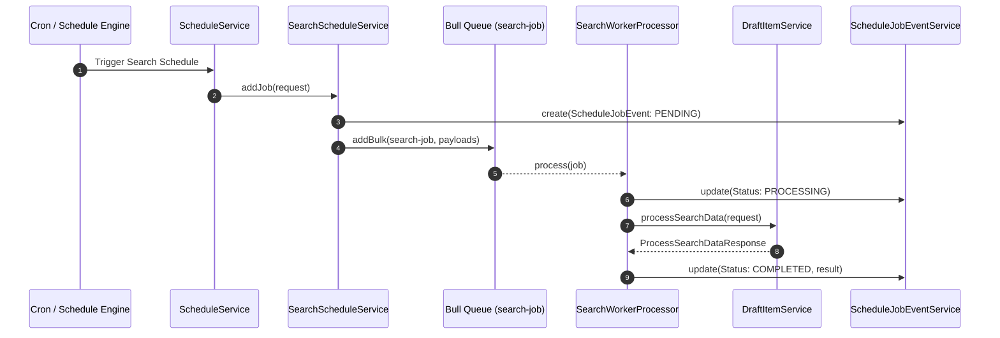

# Technical Proposal: Automated Search Discovery via Schedule & Worker Architecture

## 1. Problem Statement & Core Concept

- **Core Business Problem**: 
  Currently, `DraftItemService.processSearchData()` can only be triggered via manual HTTP POST request (`POST /v1/draft-items/process-search-data`). The system has an active scheduling and queue worker engine ([`ScheduleModule`](file:///d:/Sources/Personal/only-one-be/src/modules/schedule) + [`WorkerModule`](file:///d:/Sources/Personal/only-one-be/src/modules/worker)), but it exclusively handles scraping workflows ([`DataProviderFeatureType.SCRAPING`](file:///d:/Sources/Personal/only-one-be/src/modules/data-provider/enums/data-provider-feature-type.enum.ts#L2)) via [`DataProviderScheduleService`](file:///d:/Sources/Personal/only-one-be/src/modules/schedule/services/schedule-execution/data-provider-schedule.service.ts). Operators cannot set recurring cron schedules to continuously discover new products and populate `draft_items` automatically.
  
- **Core Value & Target Audience**: 
  - **Data Operators & Administrators**: Hands-free recurring product discovery runs on external platforms (daily/hourly).
  - **System Automation**: Continuous population and refreshing of staging drafts for human review.

- **Success Metrics (Definition of Done)**:
  - Operators can create schedule jobs with `executionService = 'search'` or dedicated search schedule configs.
  - Schedule execution dispatches jobs to Bull Queue `QUEUE_NAME.SEARCH_JOB`.
  - Background worker (`SearchWorkerProcessor`) executes `DraftItemService.processSearchData()`, tracks progress in `schedule_job_events`, and persists draft items.

- **Scope Boundaries**:
  - **In-Scope**:
    - Adding `ExecutionServiceEnum.SEARCH` or dedicated search schedule handler.
    - Adding `QUEUE_NAME.SEARCH_JOB` and queue registration.
    - Implementing `SearchScheduleService` (implements `IScheduleExecutionInterface`).
    - Implementing `SearchWorkerProcessor` in `WorkerModule`.
    - Recording schedule execution events (`ScheduleJobEventEntity`).
  - **Explicit Out-of-Scope**:
    - Modifying the core scraping schedule workflow.

---

## 2. Current Business Logic (As-is Analysis)

- **Existing Schedule Architecture**:
  - [`ScheduleService`](file:///d:/Sources/Personal/only-one-be/src/modules/schedule/services/schedule.service.ts) triggers registered cron tasks and executes schedule strategies using [`SCHEDULE_EXECUTION_SERVICE_MAP`](file:///d:/Sources/Personal/only-one-be/src/modules/schedule/constants/schedule-execution-service-map.ts).
  - [`ExecutionServiceEnum`](file:///d:/Sources/Personal/only-one-be/src/modules/schedule/enums/schedule-execution.enum.ts) only defines `DATA_PROVIDER = 'data_provider'`.
  - [`DataProviderScheduleService`](file:///d:/Sources/Personal/only-one-be/src/modules/schedule/services/schedule-execution/data-provider-schedule.service.ts) queries only `DataProviderFeatureType.SCRAPING` features and active `dataProviderItems`, creating `ProcessScrapeDataRequestDto` jobs for `QUEUE_NAME.SCRAPING_JOB`.
  - [`ScrapingWorkerProcessor`](file:///d:/Sources/Personal/only-one-be/src/modules/worker/processors/scraping-worker.processor.ts) processes `SCRAPING_JOB` by calling `ScrapingDataService.processScrapeData()`.

- **Identified Gap**:
  - Zero integration between `ScheduleModule` / `WorkerModule` and `DraftItemService.processSearchData()`.

---

## 3. Proposed Solution Alternatives

### Option 1 (Recommended): Dedicated `SearchScheduleService` & `SearchWorkerProcessor`

- **Solution Overview & Mechanics**:
  1. Add `ExecutionServiceEnum.SEARCH = 'search'` and register `SearchScheduleService` in `SCHEDULE_EXECUTION_SERVICE_MAP`.
  2. Add `QUEUE_NAME.SEARCH_JOB = 'search-job'`.
  3. `SearchScheduleService.addJob()` fetches data providers with `DataProviderFeatureType.SEARCH` in `READY` status, creates `ProcessSearchDataRequestDto` payloads, and enqueues Bull jobs.
  4. Create `SearchWorkerProcessor` listening on `QUEUE_NAME.SEARCH_JOB` to invoke `DraftItemService.processSearchData()` asynchronously and update `ScheduleJobEventEntity`.

- **Mermaid Architecture & Sequence Diagram**:

- **Pros**:
  - Decoupled from scraping pipelines; conforms to Open/Closed Principle.
  - Dedicated queue prevents long search requests from stalling fast scraping jobs.
  - Reuses existing `ScheduleJobEventEntity` event audit and retry lifecycle.
- **Cons**:
  - Requires adding a new Bull Queue processor in `WorkerModule`.
- **Complexity & Risks**: Low; follows identical patterns established in `DataProviderScheduleService` and `ScrapingWorkerProcessor`.

---

### Option 2 (Alternative): Unified Polymorphic `DataProviderScheduleService`

- **Solution Overview & Mechanics**:
  - Modify `DataProviderScheduleService` to inspect whether target feature is `SCRAPING` or `SEARCH` and dispatch to a single shared queue or branching logic.
- **Pros**:
  - Fewer new service classes.
- **Cons**:
  - Violates Single Responsibility Principle.
  - Search jobs have different payload shapes (`ProcessSearchDataRequestDto` vs `ProcessScrapeDataRequestDto`) and different timeouts.
- **Complexity & Risks**: Moderate; increases regression risk on existing scraping schedule jobs.

---

### Comparison Matrix & Recommendation

| Criteria | Option 1: Dedicated `SearchScheduleService` (Recommended) | Option 2: Unified Schedule Handler |
| :--- | :--- | :--- |
| **Separation of Concerns** | **High** (Dedicated queue & worker) | Low (Coupled handlers) |
| **Queue Isolation** | **High** (Search spikes won't block Scraping) | Low (Shared queue bottleneck) |
| **Maintainability** | **High** | Moderate |
| **Implementation Risk** | **Low** (Zero regression on scraping) | Moderate |

- **Conclusion**: Recommend **Option 1**.

---

## 4. Key Failure Modes & Security Boundaries

- **Worker Timeout & Rate Limits**: External search engines may rate limit or timeout; Bull Queue retry options and `DataProviderFeatureService.recordFeatureFailure` protect system stability.
- **Circuit Breaker**: If consecutive failures exceed threshold, feature switches to `ERROR`, preventing subsequent schedule executions from making wasteful external calls.

---

## 5. High-Level Technical Specifications

- **Affected Modules**:
  - `src/modules/schedule`
  - `src/modules/queue`
  - `src/modules/worker`
- **New Components**:
  - `SearchScheduleService`
  - `SearchWorkerProcessor`
  - Queue `search-job`

---

## 6. Next Steps

1. User confirms Option 1 in `concept.md`.
2. Run `/only-one-plan only-one/tasks/20260824-203000-schedule-search-service` to generate `plan.md`.
3. Run `/only-one-apply only-one/tasks/20260824-203000-schedule-search-service` to execute implementation.
