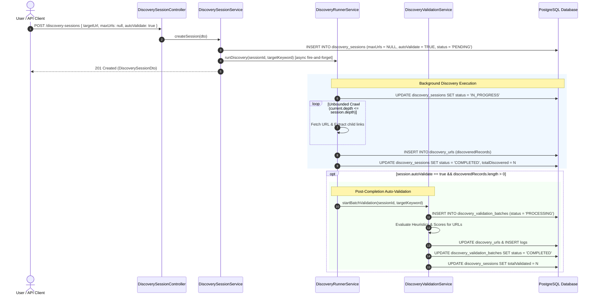

# Plan: Make Discovery Session Max URLs Optional & Post-Completion Auto-Validation

## Section 1. Current State (Hiện trạng & Phân tích Mã nguồn)

### 1.1 Phân tích Luồng Thực thi Hiện tại
- **Entity Schema**: Trong [discovery-session.entity.ts](file:///d:/Sources/Personal/only-one-be/src/modules/data-provider/entities/discovery-session.entity.ts#L33-L35), trường `maxUrls` được định nghĩa là `@Column({ type: 'integer', default: 100 })` và bắt buộc kiểu `number`. Hiện tại chưa có trường `autoValidate` để cấu hình chế độ tự động đánh giá URLs.
- **Request DTOs**: Trong [create-discovery-session-request.dto.ts](file:///d:/Sources/Personal/only-one-be/src/modules/data-provider/dtos/requests/create-discovery-session-request.dto.ts#L22-L28), `maxUrls` có decorator `@Max(1000)` và mặc định 100, chưa hỗ trợ chế độ không giới hạn (unbounded), đồng thời thiếu trường `autoValidate`.
- **Response DTO & AutoMapper**: [discovery-session.dto.ts](file:///d:/Sources/Personal/only-one-be/src/modules/data-provider/dtos/discovery-session.dto.ts#L26-L28) đang định nghĩa `maxUrls: number`, thiếu `autoValidate: boolean`.
- **Service Creation Logic**: Trong [discovery-session.service.ts](file:///d:/Sources/Personal/only-one-be/src/modules/data-provider/services/discovery-session.service.ts#L55), phương thức `createSession` fallback cứng: `maxUrls: request.maxUrls || 100`. Nếu client truyền `null` hoặc không truyền với mong muốn chạy unbounded, hệ thống vẫn ép về 100.
- **Runner Execution Loop**: Trong [discovery-runner.service.ts](file:///d:/Sources/Personal/only-one-be/src/modules/data-provider/services/discovery-runner.service.ts#L41-L88), vòng lặp crawler duyệt `while (queue.length > 0 && discoveredRecords.length < session.maxUrls)` chặn cứng quá trình khám phá khi chạm ngưỡng `maxUrls`.
- **Validation Trigger**: Khi crawler kết thúc thành công và cập nhật session `COMPLETED` tại [discovery-runner.service.ts:L117-L122](file:///d:/Sources/Personal/only-one-be/src/modules/data-provider/services/discovery-runner.service.ts#L117-L122), hệ thống không tự động kích hoạt [discovery-validation.service.ts](file:///d:/Sources/Personal/only-one-be/src/modules/data-provider/services/discovery-validation.service.ts), buộc người dùng phải gọi endpoint `POST /discovery-sessions/:id/validate` thủ công.

### 1.2 Danh sách Hành vi Bắt buộc Giữ nguyên (Invariants)
1. **Backward Compatibility**: Nếu client vẫn gửi payload cũ có `maxUrls` cụ thể (ví dụ: `50`), crawler vẫn dừng chính xác khi đạt 50 URLs.
2. **Deterministic Heuristics Integrity**: Toàn bộ thuật toán nhận diện link, bóc tách giá tiền và scoring trong `DiscoveryValidationHelper` không bị thay đổi.
3. **Session Lifecycle Transition**: Trạng thái session vẫn trải qua đúng chu trình `PENDING -> IN_PROGRESS -> COMPLETED | FAILED`.
4. **Validation Isolation**: Lỗi xảy ra trong quá trình Auto-Validation không được làm sập hay chuyển trạng thái của `DiscoverySession` thành `FAILED` khi session đã cào URLs thành công.

---

## Section 2. Detailed Design (Thiết kế Kỹ thuật Chi tiết)

### 2.1 Kiến trúc Thực thi Bounded vs Unbounded Discovery
- Khi `session.maxUrls` có giá trị `number` (ví dụ: `50`): Điều kiện dừng crawler là `discoveredRecords.length < session.maxUrls`.
- Khi `session.maxUrls` là `null` hoặc `undefined`: Crawler hoạt động ở chế độ **Unbounded Discovery**, tiếp tục duyệt cây liên kết đến khi vét cạn toàn bộ URL trong giới hạn `depth` (`current.depth <= session.depth`).

### 2.2 Cơ chế Post-Completion Auto-Validation Hook
- Bổ sung `DiscoveryValidationService` vào constructor của `DiscoveryRunnerService`.
- Sau khi crawler lưu danh sách `discoveredRecords` và cập nhật session sang `DiscoverySessionStatus.COMPLETED`:
  - Kiểm tra điều kiện: `if (session.autoValidate && discoveredRecords.length > 0)`.
  - Khởi chạy bất đồng bộ `this.validationService.startBatchValidation(sessionId, targetKeyword)`.
  - Bọc trong `catch` block để log lỗi mà không gây crash background runner job.

### 2.3 Sơ đồ Tương tác Hệ thống (Sequence Diagram)



### 2.4 Đánh giá Phản biện & Quản trị Rủi ro (Red-Team Sanity Check)
- **Claim**: Cho phép `maxUrls = null` có thể dẫn đến việc crawler duyệt vô hạn làm cạn kiệt RAM/Disk.
  - **Doubt**: Nếu trang web có hàng triệu URLs, session không có `maxUrls` có thể gây Out-Of-Memory (OOM).
  - **Reconcile**: Hệ thống luôn có chốt chặn cứng `depth` (mặc định 1, tối đa 5 qua validator `@Max(5)`). Crawler chỉ duyệt trong cùng domain (`targetHostname`) và loại bỏ các file static/media. Tuy nhiên, để an toàn tuyệt đối, trong DTO nếu client truyền `maxUrls` thì validate `@Min(1) @Max(10000)`, nếu không truyền thì nhận `null` và phụ thuộc hoàn toàn vào `depth`.
- **Claim**: Gọi `startBatchValidation` trực tiếp từ `DiscoveryRunnerService` có thể gây vòng lặp phụ thuộc (circular dependency).
  - **Doubt**: `DiscoveryRunnerService` gọi `DiscoveryValidationService`, liệu `DiscoveryValidationService` có gọi ngược lại không?
  - **Reconcile**: Đã kiểm tra mã nguồn: `DiscoveryValidationService` hoàn toàn độc lập, chỉ phụ thuộc vào các Entity Repositories (`urlRepo`, `batchRepo`, `logRepo`, `sessionRepo`, `dataSource`). Không có bất kỳ circular dependency nào.

---

## Section 3. Implementation Architecture & Machine-Readable Task Matrix

### 3.1 Machine-Readable Task Matrix & Dependency Graph

| Order | Status | Action | File Path | Target Symbols / AST Seams | Depends On | Fast Test Command |
| :---: | :---: | :---: | :--- | :--- | :--- | :--- |
| **1** | `[x]` | `[MODIFY]` | `src/modules/data-provider/entities/discovery-session.entity.ts` | `DiscoverySessionEntity.maxUrls`, `DiscoverySessionEntity.autoValidate` | `None` | `npx tsc -p tsconfig.build.json --noEmit` |
| **2** | `[x]` | `[MODIFY]` | `src/modules/data-provider/dtos/requests/create-discovery-session-request.dto.ts` | `CreateDiscoverySessionRequestDto.maxUrls`, `CreateDiscoverySessionRequestDto.autoValidate` | `Order 1` | `npx tsc -p tsconfig.build.json --noEmit` |
| **3** | `[x]` | `[MODIFY]` | `src/modules/data-provider/dtos/discovery-session.dto.ts` | `DiscoverySessionDto.maxUrls`, `DiscoverySessionDto.autoValidate` | `Order 1` | `npx tsc -p tsconfig.build.json --noEmit` |
| **4** | `[x]` | `[MODIFY]` | `src/modules/data-provider/services/discovery-session.service.ts` | `DiscoverySessionService.createSession` | `Order 2, 3` | `npx tsc -p tsconfig.build.json --noEmit` |
| **5** | `[x]` | `[MODIFY]` | `src/modules/data-provider/services/discovery-runner.service.ts` | `DiscoveryRunnerService.constructor`, `DiscoveryRunnerService.runDiscovery` | `Order 1, 4` | `npx tsc -p tsconfig.build.json --noEmit` |
| **6** | `[x]` | `[MODIFY]` | `src/modules/data-provider/_tests/discovery-session.service.spec.ts` | `DiscoverySessionService test suite` | `Order 4` | `npx tsc -p tsconfig.build.json --noEmit` |

---

## Section 4. Implementation Code Examples (Mẫu Code Triển khai)

### 4.1 Order 1: `src/modules/data-provider/entities/discovery-session.entity.ts`
- **Mục đích**: Chuyển `maxUrls` thành nullable integer và bổ sung cột `autoValidate` (boolean, default: `true`).

```typescript
// [TARGET SEAM]: discovery-session.entity.ts lines 33-36
    // [RATIONALE]: Allow nullable maxUrls for unbounded discovery traversal
    @Column({ type: 'integer', nullable: true, default: null })
    @AutoMap()
    maxUrls?: number | null;

    // [RATIONALE]: Enable opt-out auto-validation trigger upon session completion
    @Column({ type: 'boolean', default: true })
    @AutoMap()
    autoValidate: boolean;
```

### 4.2 Order 2: `src/modules/data-provider/dtos/requests/create-discovery-session-request.dto.ts`
- **Mục đích**: Cập nhật Swagger documentation và validation decorators cho `maxUrls` và `autoValidate`.

```typescript
// [TARGET SEAM]: create-discovery-session-request.dto.ts lines 22-28
    // [RATIONALE]: maxUrls is optional; when omitted or null, crawler operates in unbounded depth mode
    @ApiPropertyOptional({ description: 'Maximum URLs to discover (omit for unbounded discovery)', default: null })
    @IsNumber()
    @Min(1)
    @Max(10000)
    @IsOptional()
    maxUrls?: number;

    // [RATIONALE]: Allow client to configure whether to auto-run validation upon completion
    @ApiPropertyOptional({ description: 'Automatically run validation batch upon completion', default: true })
    @IsBoolean()
    @IsOptional()
    autoValidate?: boolean;
```

### 4.3 Order 3: `src/modules/data-provider/dtos/discovery-session.dto.ts`
- **Mục đích**: Đồng bộ response DTO để AutoMapper serialize đúng trường `autoValidate` và `maxUrls`.

```typescript
// [TARGET SEAM]: discovery-session.dto.ts lines 26-28
    @AutoMap()
    maxUrls?: number | null;

    @AutoMap()
    autoValidate: boolean;
```

### 4.4 Order 4: `src/modules/data-provider/services/discovery-session.service.ts`
- **Mục đích**: Khởi tạo thực thể với giá trị `maxUrls` nullable và `autoValidate` chuẩn xác từ request.

```typescript
// [TARGET SEAM]: discovery-session.service.ts lines 49-60
        const newSession = this.sessionRepository.create({
            sessionCode,
            dataProviderId: request.dataProviderId,
            targetUrl: request.targetUrl,
            status: DiscoverySessionStatus.PENDING,
            depth: request.depth || 1,
            maxUrls: request.maxUrls !== undefined ? request.maxUrls : null,
            autoValidate: request.autoValidate !== undefined ? request.autoValidate : true,
            notes: request.notes,
            totalDiscovered: 0,
            totalQueued: 0,
            totalValidated: 0,
        });
```

### 4.5 Order 5: `src/modules/data-provider/services/discovery-runner.service.ts`
- **Mục đích**: Cập nhật điều kiện dừng crawler hỗ trợ unbounded (`maxUrls == null`) và kích hoạt post-completion auto-validation.

```typescript
// [TARGET SEAM]: discovery-runner.service.ts constructor & runDiscovery loop
    constructor(
        @InjectRepository(DiscoverySessionEntity)
        private readonly sessionRepo: Repository<DiscoverySessionEntity>,
        @InjectRepository(DiscoveryUrlEntity)
        private readonly urlRepo: Repository<DiscoveryUrlEntity>,
        private readonly validationService: DiscoveryValidationService,
    ) {}

    // Inside runDiscovery:
    // [RATIONALE]: Support unbounded queue loop when maxUrls is null
    while (queue.length > 0 && (session.maxUrls == null || discoveredRecords.length < session.maxUrls)) {
        // ...
        // [RATIONALE]: Support unbounded link gathering
        if (current.depth < session.depth && (session.maxUrls == null || discoveredRecords.length < session.maxUrls)) {
            // enqueue child URLs
        }
    }

    // [RATIONALE]: Trigger auto-validation post-completion hook
    if (session.autoValidate && discoveredRecords.length > 0) {
        this.validationService
            .startBatchValidation(sessionId, targetKeyword)
            .catch((err) => this.logger.error(`Auto-validation failed for session ${sessionId}: ${err.message}`));
    }
```

---

## Section 5. Test Cases (Kịch bản Kiểm thử & Nghiệm thu)

### 5.1 BDD Acceptance Scenarios

#### Scenario 1: Create Discovery Session with Null / Omitted maxUrls (Unbounded Mode)
- **Given**: Data provider `dp-1` exists in database.
- **When**: Client calls `POST /discovery-sessions` with payload `{ dataProviderId: "dp-1", targetUrl: "https://example.com", depth: 2 }` (không truyền `maxUrls`).
- **Then**:
  - Response status is `201 Created`.
  - `session.maxUrls` is `null`.
  - `session.autoValidate` defaults to `true`.

#### Scenario 2: Create Discovery Session with Explicit maxUrls & autoValidate = false
- **When**: Client calls `POST /discovery-sessions` with payload `{ dataProviderId: "dp-1", targetUrl: "https://example.com", maxUrls: 25, autoValidate: false }`.
- **Then**:
  - `session.maxUrls` is `25`.
  - `session.autoValidate` is `false`.

#### Scenario 3: Auto-Validation Trigger on Session Completion
- **Given**: A discovery session has `autoValidate: true`.
- **When**: `DiscoveryRunnerService.runDiscovery` finishes discovering 10 URLs and marks session `COMPLETED`.
- **Then**:
  - `DiscoveryValidationService.startBatchValidation` is automatically invoked with `sessionId`.
  - A new `DiscoveryValidationBatchEntity` is created in database.

### 5.2 Verification Commands
```bash
# 1. Typecheck validation
npx tsc -p tsconfig.build.json --noEmit

# 2. Build verification
npm run build
```

---

## Section 6. Technical English Key Patterns

### 1. Opt-Out Default Configuration
- **Meaning (VI)**: Mô hình cấu hình có giá trị mặc định là bật (`true`), người dùng chỉ định rõ giá trị khi muốn chủ động tắt bỏ tính năng.
- **Grammar / Usage**: `Structure the property with an opt-out default flag (default: true).`
- **Engineering Example**: *"The `autoValidate` parameter is designed with an opt-out default so that url validation executes automatically without explicit user intervention."*

### 2. Unbounded Stream / Traversal
- **Meaning (VI)**: Quá trình duyệt hoặc xử lý dòng dữ liệu không bị chặn bởi một trần số lượng cố định, chỉ bị ràng buộc bởi điều kiện dừng tự nhiên (độ sâu hoặc hết dữ liệu).
- **Grammar / Usage**: `Execute an unbounded traversal governed solely by the depth constraint.`
- **Engineering Example**: *"When `maxUrls` is set to null, the runner performs an unbounded traversal governed solely by the search depth."*

### 3. Post-Completion Automation Hook
- **Meaning (VI)**: Hook tự động hóa chạy sau khi một tác vụ nền đã hoàn thành, thường chạy theo mô hình fire-and-forget kèm error boundary để không làm gián đoạn tác vụ gốc.
- **Grammar / Usage**: `Trigger [downstream action] via a post-completion hook with isolated error handling.`
- **Engineering Example**: *"We trigger the validation batch via a post-completion hook wrapped in isolated error logging to prevent pipeline crashes."*
