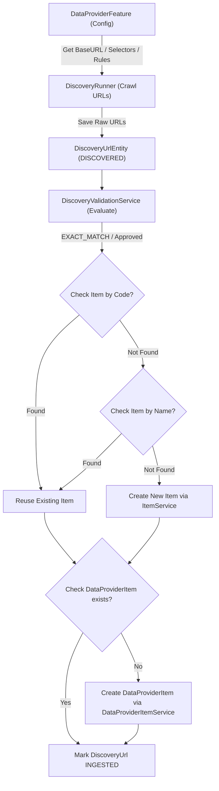

# Concept: Tái cấu trúc Luồng Discovery sang Item Ingestion (DataProviderFeature -> DiscoveryUrl -> Item & DataProviderItem)

## 1. Problem Statement & Root Need (Bối cảnh & Vấn đề Cốt lõi)
- **Core Business Problem**: Hiện tại luồng Discovery trong module `data-provider` đang đi sai hướng: Người dùng phải nhập `targetUrl` thủ công và kết quả sau khi duyệt URL lại tạo ra `ScrapingDataEntity` (chờ cào thô), thay vì tự động hoặc bán tự động trích xuất và tạo Master Product ([`ItemEntity`](file:///Users/kiem/Sources/PERSONAL/only-one-be/src/modules/data-provider/entities/item.entity.ts)) cùng Provider Product Mapping ([`DataProviderItemEntity`](file:///Users/kiem/Sources/PERSONAL/only-one-be/src/modules/data-provider/entities/data-provider-item.entity.ts)). Ngoài ra, hệ thống chưa tận dụng cấu hình tính năng có sẵn từ [`DataProviderFeatureEntity`](file:///Users/kiem/Sources/PERSONAL/only-one-be/src/modules/data-provider/entities/data-provider-feature.entity.ts) của từng đối tác để khám phá link.
- **Target Audience & Core Value**: Quản trị viên và hệ thống tự động hóa danh mục sản phẩm (Catalog Automation). Giúp rút ngắn toàn bộ quy trình từ khám phá link nhà cung cấp -> thẩm định (validation) -> lập danh mục sản phẩm hoàn chỉnh mà không cần qua bước trung gian dư thừa.

---

## 2. Scope Boundaries (Ranh giới Phạm vi)
- **In-Scope**:
  - **Feature-Driven Discovery Trigger**: Lấy cấu hình khám phá từ [`DataProviderFeatureEntity`](file:///Users/kiem/Sources/PERSONAL/only-one-be/src/modules/data-provider/entities/data-provider-feature.entity.ts) theo `dataProviderId`.
  - **Validation & Matching**: Tiếp tục dùng [`DiscoveryValidationService`](file:///Users/kiem/Sources/PERSONAL/only-one-be/src/modules/data-provider/services/discovery-validation.service.ts) để đánh giá `EXACT_MATCH`, `PARTIAL_MATCH`, `NO_MATCH`.
  - **Hierarchical Identity Resolution for Item**:
    1. Kiểm tra tồn tại theo `code` (SKU/Code).
    2. Nếu không tìm thấy hoặc `code` null, kiểm tra tiếp theo `name` (Title).
    3. Nếu chưa có -> Tạo mới [`ItemEntity`](file:///Users/kiem/Sources/PERSONAL/only-one-be/src/modules/data-provider/entities/item.entity.ts) qua [`ItemService`](file:///Users/kiem/Sources/PERSONAL/only-one-be/src/modules/data-provider/services/item.service.ts).
  - **DataProviderItem Linking**: Kiểm tra cặp (`itemId`, `dataProviderId`, `itemUrl`). Nếu chưa có -> Tạo mới [`DataProviderItemEntity`](file:///Users/kiem/Sources/PERSONAL/only-one-be/src/modules/data-provider/entities/data-provider-item.entity.ts) qua [`DataProviderItemService`](file:///Users/kiem/Sources/PERSONAL/only-one-be/src/modules/data-provider/services/data-provider-item.service.ts).
  - **Hybrid Ingestion Trigger**: Tự động tạo Item cho các URL đạt `EXACT_MATCH` và hỗ trợ người dùng duyệt thủ công (Approve / Bulk Ingest) cho các URL `PARTIAL_MATCH` / `UNCERTAIN`.
  - **Decommission/Refactor Legacy Enqueue**: Loại bỏ hoặc thay thế hành vi tạo `ScrapingDataEntity` trong `DiscoveryUrlService.batchEnqueue`.
- **Explicit Out-of-Scope**:
  - Không thay đổi cấu trúc bảng `items` và `data_provider_items`.
  - Không tích hợp OCR hay machine learning visual model trong bước validation này (giữ nguyên logic rule-based & regex hiện có).

---

## 3. Success Metrics (Thước đo Thành công / Definition of Done)
- **Idempotency & Zero Duplication**: 100% các URL hợp lệ khi chạy lặp lại không tạo trùng `Item` hay `DataProviderItem`.
- **Accurate Resolution**: Đúng 100% thứ tự ưu tiên: Check `code` -> Check `name` -> Tạo mới.
- **Traceability**: `DiscoveryUrlEntity` lưu trữ đầy đủ `itemId` và `dataProviderItemId` sau khi ingest thành công.
- **Test Coverage**: Toàn bộ unit test và integration test của luồng Discovery chạy xanh (100% pass).

---

## 4. Proposed Solution & Core Mechanism (Phương pháp Giải quyết & Cơ chế Xử lý)

### 4.1. Explored Options & Trade-off Analysis (Các Phương án Đã Cân Nhắc)

| Option | Hướng tiếp cận | Ưu điểm (Pros) | Nhược điểm (Cons) | Độ phức tạp | Đánh giá |
| :--- | :--- | :--- | :--- | :--- | :--- |
| **Option 1: Đồng bộ In-line tức thì (Synchronous In-line Ingestion)** | Tạo Item & DataProviderItem trực tiếp ngay trong vòng lặp validation hoặc API approve. | Triển khai nhanh, dữ liệu hiển thị tức thì, logic tập trung. | Nếu số lượng URL lớn có thể làm chậm request; cần transaction chặt chẽ. | Medium | **Khuyến nghị cho giai đoạn này** |
| **Option 2: Hàng đợi Event/Job Asynchronous (Bull Queue Ingestion)** | Bắn event `DISCOVERY_URL_APPROVED`, queue worker nhận và thực thi tạo Item. | Non-blocking, chịu tải cao, có retry tự động. | Cần setup worker handler mới, UI cần cơ chế polling hoặc websocket để biết khi nào tạo xong. | High | Phù hợp khi scale hàng trăm nghìn URL |

- **Chosen Strategy (Phương án Được Chọn)**: **Option 1 (kết hợp Database Transaction)** để đảm bảo tính toàn vẹn (ACID), đơn giản, nhất quán và phản hồi ngay cho UI quản trị.

---

### 4.2. Core Processing Flow (Luồng Xử lý / Chuyển trạng thái Chính)

1. **Step 1: Khởi tạo & Thu thập (Feature Config Discovery)**
   - Lấy `DataProviderFeature` (type `SCRAPING` hoặc `SEARCH`) của Provider.
   - Trích xuất danh sách link mục tiêu -> Lưu vào `DiscoveryUrlEntity` (status: `DISCOVERED`).

2. **Step 2: Validation (Thẩm định dữ liệu)**
   - Chạy `DiscoveryValidationService.startBatchValidation(sessionId)`.
   - Tính toán `confidenceScore`, trích xuất `title`, `detectedPrice`, gán `matchResult` (`EXACT_MATCH`, `PARTIAL_MATCH`, `NO_MATCH`).

3. **Step 3: Item Ingestion (Tạo & Liên kết Sản phẩm)**
   - **Với EXACT_MATCH (nếu bật auto-ingest) hoặc khi User bấm Approve**:
     - *B1 (Tìm Item theo code)*: `item = await itemRepo.findOne({ where: { code } })` (nếu trích xuất được `code`).
     - *B2 (Tìm Item theo name)*: Nếu chưa có `item`, tìm `item = await itemRepo.findOne({ where: { name: url.title } })`.
     - *B3 (Tạo Item mới)*: Nếu vẫn chưa có `item`, gọi `itemService.create({ name: url.title, code })`.
     - *B4 (Kiểm tra & Tạo DataProviderItem)*: Kiểm tra `dataProviderItem = await dataProviderItemRepo.findOne({ where: { itemId: item.id, dataProviderId, itemUrl: url.url } })`. Nếu chưa có -> gọi `dataProviderItemService.create(...)`.
     - *B5 (Cập nhật DiscoveryUrl)*: Đánh dấu URL status thành `INGESTED` (hoặc `MAPPED`), liên kết `itemId` và `dataProviderItemId`.



---

### 4.3. UI Wireframe / Visual Mockup (Mẫu Phác thảo Giao diện Quản trị Discovery)

```text
+-----------------------------------------------------------------------------------------+
|  Discovery Session: DISC-AMAZ-842 | Data Provider: Amazon US [Feature: Product Search]   |
+-----------------------------------------------------------------------------------------+
|  [Filter: All | Exact Match (12) | Partial Match (5) | Uncertain (2)]    [⚡ Bulk Ingest] |
|                                                                                         |
|  +------------------------------------------------------------------------------------+ |
|  | Title & URL                           | Score | Match Status | Existing Item | Action| |
|  +------------------------------------------------------------------------------------+ |
|  | Sony WH-1000XM5 Noise Canceling       | 98%   | EXACT_MATCH  | [Auto-Mapped] | [Done]| |
|  | https://amazon.com/dp/B09XS7JWHH      |       |              | Item #8401    |       | |
|  +------------------------------------------------------------------------------------+ |
|  | Apple AirPods Pro (2nd Gen)           | 85%   | PARTIAL_MATCH| [None - New]  | [App- | |
|  | https://amazon.com/dp/B0BDHWDR12      |       |              |               | rove] | |
|  +------------------------------------------------------------------------------------+ |
|  | Random Accessory Cable                | 15%   | NO_MATCH     | [N/A]         | [Rej- | |
|  | https://amazon.com/dp/B001234567      |       |              |               |  ect] | |
|  +------------------------------------------------------------------------------------+ |
+-----------------------------------------------------------------------------------------+
```

---

### 4.4. Critical Edge Cases & Risk Handling (Kịch bản Biên & Xử lý Rủi ro)
- **Race Condition / Concurrent Ingest**: Khi 2 URL cùng trỏ về 1 Item hoặc thao tác approve đồng thời. -> *Giải pháp: Sử dụng unique constraint / database transaction / upsert check với lock.*
- **Missing Title / Code**: Nếu URL không parse được title -> *Giải pháp: Fallback dùng slug URL làm name tạm thời, đánh dấu `ProductMappingStatus.UNMAPPED`.*
- **Provider Item Đã Tồn Tại Nhưng Đang Inactive**: -> *Giải pháp: Kích hoạt lại `isActive = true` thay vì báo lỗi duplicate.*

---

## 5. Technical English Key Patterns

### 1. Hierarchical Resolution Fallback (Đối soát phân tầng thứ bậc)
- **Meaning (VI)**: Kỹ thuật kiểm tra thực thể theo độ ưu tiên từ cao xuống thấp (khóa chính xác -> khóa gần đúng -> tạo mới).
- **Grammar / Usage**: `<Primary Key Check> -> Fallback to <Secondary Key Check> -> Instantiate New Entity`
- **Engineering Example**: *"The system employs a hierarchical resolution strategy, checking the item code first, falling back to product name matching, and only instantiating a new record if both lookups yield no results."*

### 2. Idempotent Ingestion Pipeline (Đường ống nạp dữ liệu bất biến lặp)
- **Meaning (VI)**: Đảm bảo việc nạp dữ liệu dù kích hoạt nhiều lần trên cùng một tập dữ liệu vẫn cho ra một kết quả nhất quán mà không nhân bản bản ghi.
- **Grammar / Usage**: `Subject + ensure/guarantee + idempotent ingestion + to prevent + <noun phrase>`
- **Engineering Example**: *"We refactored the discovery service into an idempotent ingestion pipeline to prevent duplicate item creation across repetitive batch runs."*
