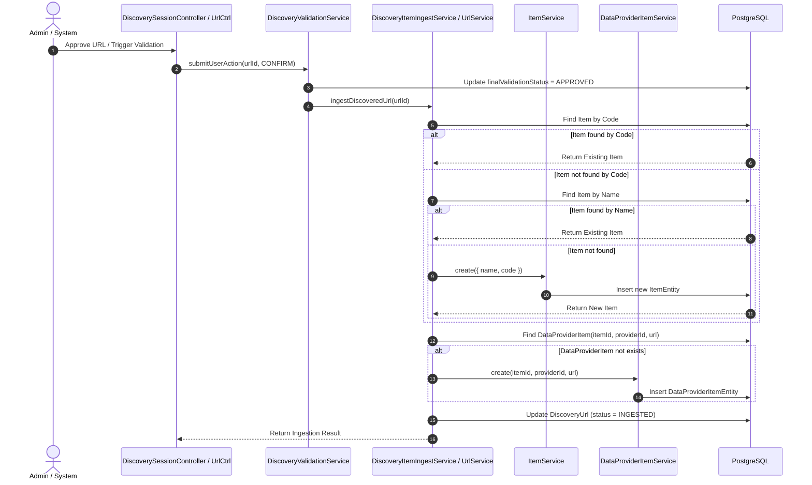

# Plan: Tái cấu trúc Luồng Discovery sang Item Ingestion (DataProviderFeature -> DiscoveryUrl -> Item & DataProviderItem)

## Section 1. Current State (Hiện trạng & Phân tích Mã nguồn)

### 1.1. Phân tích Hiện trạng
- **Discovery Session & Runner**:
  - [`DiscoverySessionService.createSession`](file:///Users/kiem/Sources/PERSONAL/only-one-be/src/modules/data-provider/services/discovery-session.service.ts#L34-L55) yêu cầu người dùng tự nhập `targetUrl` thủ công và trực tiếp gọi [`DiscoveryRunnerService.runDiscovery`](file:///Users/kiem/Sources/PERSONAL/only-one-be/src/modules/data-provider/services/discovery-runner.service.ts#L25-L125) để crawl liên kết đệ quy bằng `axios` + `cheerio`. Chưa lấy cấu hình từ [`DataProviderFeatureEntity`](file:///Users/kiem/Sources/PERSONAL/only-one-be/src/modules/data-provider/entities/data-provider-feature.entity.ts).
- **Validation Pipeline**:
  - [`DiscoveryValidationService.startBatchValidation`](file:///Users/kiem/Sources/PERSONAL/only-one-be/src/modules/data-provider/services/discovery-validation.service.ts#L32-L116) đánh giá độ khớp từ khóa/tiêu đề và gắn nhãn `EXACT_MATCH`, `PARTIAL_MATCH`, `NO_MATCH`.
  - Khi người dùng gọi [`submitUserAction`](file:///Users/kiem/Sources/PERSONAL/only-one-be/src/modules/data-provider/services/discovery-validation.service.ts#L175-L185) hoặc [`submitBulkUserActions`](file:///Users/kiem/Sources/PERSONAL/only-one-be/src/modules/data-provider/services/discovery-validation.service.ts#L187-L200), hệ thống chỉ cập nhật trường `finalValidationStatus = APPROVED/REJECTED` trên `discovery_urls` mà không kích hoạt tạo sản phẩm.
- **Legacy Enqueue Flow**:
  - [`DiscoveryUrlService.batchEnqueue`](file:///Users/kiem/Sources/PERSONAL/only-one-be/src/modules/data-provider/services/discovery-url.service.ts#L33-L71) hiện tạo các bản ghi [`ScrapingDataEntity`](file:///Users/kiem/Sources/PERSONAL/only-one-be/src/modules/data-provider/entities/scraping-data.entity.ts) để chờ cào thô, thay vì tạo sản phẩm Master Product ([`ItemEntity`](file:///Users/kiem/Sources/PERSONAL/only-one-be/src/modules/data-provider/entities/item.entity.ts)) và liên kết nhà cung cấp ([`DataProviderItemEntity`](file:///Users/kiem/Sources/PERSONAL/only-one-be/src/modules/data-provider/entities/data-provider-item.entity.ts)).

### 1.2. Invariants (Các hành vi bắt buộc giữ nguyên)
1. **Catalog Integrity**: Schema bảng `items` (`name`, `code`, `mappingStatus`) và `data_provider_items` (`itemId`, `dataProviderId`, `itemUrl`, `isActive`) giữ nguyên tính nhất quán, không thay đổi migration phá vỡ dữ liệu.
2. **Validation Scoring**: Thuật toán tính điểm và regex giá tiền trong `DiscoveryValidationHelper` tiếp tục được tái sử dụng nguyên vẹn.
3. **Audit Log Trail**: Mọi thay đổi trạng thái validation đều lưu đầy đủ vào `discovery_validation_logs`.

---

## Section 2. Detailed Design (Thiết kế Kỹ thuật Chi tiết)

### 2.1. Cơ chế Phân giải Định danh Sản phẩm (Hierarchical Item Resolution)
Khi một `DiscoveryUrl` được xác thực hợp lệ (tự động qua `EXACT_MATCH` hoặc khi người dùng duyệt thủ công qua `ValidationUserAction.CONFIRM`):
1. **Trích xuất định danh**:
   - `code`: Trích xuất mã SKU/mã sản phẩm từ URL (hoặc slug).
   - `name`: Lấy từ `title` của `DiscoveryUrlEntity` (fallback dùng `url` nếu `title` rỗng).
2. **Đối soát phân tầng (Resolution Strategy)**:
   - **Bước 1 (Check Code)**: Nếu `code` hợp lệ, kiểm tra `item = await itemRepo.findOne({ where: { code } })`.
   - **Bước 2 (Check Name)**: Nếu không tìm thấy hoặc không có code, kiểm tra `item = await itemRepo.findOne({ where: { name } })`.
   - **Bước 3 (Create Item)**: Nếu không tìm thấy, tạo mới `ItemEntity` thông qua `ItemService.create({ name, code })`.
3. **Liên kết DataProviderItem**:
   - Kiểm tra `dataProviderItem = await dataProviderItemRepo.findOne({ where: { itemId: item.id, dataProviderId: url.dataProviderId, itemUrl: url.url } })`.
   - Nếu chưa có: Tạo mới `DataProviderItemEntity` thông qua `DataProviderItemService.create(...)`.
   - Nếu đã có nhưng `isActive = false`: Kích hoạt lại `isActive = true`.

### 2.2. Sequence Diagram



---

## Section 3. Implementation Architecture & Machine-Readable Task Matrix

### 3.1 Machine-Readable Task Matrix & Dependency Graph

| Order | Status | Action | File Path | Target Symbols / AST Seams | Reused Existing Utilities / Helpers | Depends On | Fast Test Command |
| :---: | :---: | :---: | :--- | :--- | :--- | :--- | :--- |
| **1** | `[x]` | `[MODIFY]` | `src/modules/data-provider/enums/discovery-url-status.enum.ts` | `DiscoveryUrlStatus` | N/A | `None` | `npx tsc -p tsconfig.build.json --noEmit` |
| **2** | `[x]` | `[NEW]` | `src/modules/data-provider/dtos/responses/ingest-discovery-url-response.dto.ts` | `IngestDiscoveryUrlResponseDto` | `AbstractDto` | `Order 1` | `npx tsc -p tsconfig.build.json --noEmit` |
| **3** | `[x]` | `[MODIFY]` | `src/modules/data-provider/dtos/responses/index.ts` | Barrel Export | N/A | `Order 2` | `npx tsc -p tsconfig.build.json --noEmit` |
| **4** | `[x]` | `[MODIFY]` | `src/modules/data-provider/services/discovery-url.service.ts` | `DiscoveryUrlService.ingestDiscoveredUrl`, `DiscoveryUrlService.batchIngest` | `ItemService`, `DataProviderItemService` | `Order 3` | `npx tsc -p tsconfig.build.json --noEmit` |
| **5** | `[x]` | `[MODIFY]` | `src/modules/data-provider/services/discovery-validation.service.ts` | `DiscoveryValidationService.submitUserAction`, `submitBulkUserActions` | `DiscoveryUrlService` | `Order 4` | `npx tsc -p tsconfig.build.json --noEmit` |
| **6** | `[x]` | `[MODIFY]` | `src/modules/data-provider/services/discovery-session.service.ts` | `DiscoverySessionService.createSession` | `DataProviderFeatureRepository` | `Order 5` | `npx tsc -p tsconfig.build.json --noEmit` |
| **7** | `[x]` | `[MODIFY]` | `src/modules/data-provider/controllers/discovery-session.controller.ts` | `DiscoverySessionController.batchIngestUrls` | `BaseApiOkResponse` | `Order 6` | `npx tsc -p tsconfig.build.json --noEmit` |
| **8** | `[x]` | `[MODIFY]` | `src/modules/data-provider/_tests/discovery-session.service.spec.ts` | Unit Tests | Jest Mocks | `Order 7` | `npx tsc -p tsconfig.build.json --noEmit` |

---

## Section 4. Implementation Code Examples (Mẫu Code Triển khai)

### Order 1: `src/modules/data-provider/enums/discovery-url-status.enum.ts`
- **Mục đích**: Bổ sung trạng thái `INGESTED` vào `DiscoveryUrlStatus`.
```typescript
export enum DiscoveryUrlStatus {
    DISCOVERED = 'discovered',
    QUEUED = 'queued',
    SCRAPED = 'scraped',
    FAILED = 'failed',
    INGESTED = 'ingested', // [TARGET SEAM] Added INGESTED status
}
```

### Order 2 & 3: `src/modules/data-provider/dtos/responses/ingest-discovery-url-response.dto.ts`
- **Mục đích**: DTO trả về kết quả sau khi ingest (số lượng item tạo mới, số lượng item tái sử dụng, số lượng data_provider_items).
```typescript
import { ApiProperty } from '@nestjs/swagger';

export class IngestDiscoveryUrlResponseDto {
    @ApiProperty({ description: 'Total URLs processed' })
    totalProcessed: number;

    @ApiProperty({ description: 'Number of new Items created' })
    itemsCreated: number;

    @ApiProperty({ description: 'Number of existing Items matched and reused' })
    itemsReused: number;

    @ApiProperty({ description: 'Number of DataProviderItems created' })
    dataProviderItemsCreated: number;

    constructor(data?: Partial<IngestDiscoveryUrlResponseDto>) {
        if (data) {
            Object.assign(this, data);
        }
    }
}
```

### Order 4: `src/modules/data-provider/services/discovery-url.service.ts`
- **Mục đích**: Thêm phương thức `ingestDiscoveredUrl` và `batchIngest` thực thi đối soát phân tầng theo `code` -> `name` -> `create Item` -> `create DataProviderItem`.
```typescript
// [TARGET SEAM] Inject ItemService & DataProviderItemService
async ingestDiscoveredUrl(urlId: string): Promise<{ itemId: string; dataProviderItemId: string; isNewItem: boolean }> {
    const urlEntity = await this.urlRepository.findOne({ where: { id: urlId } });
    if (!urlEntity) throw new NotFoundException(`Discovery URL not found with id: ${urlId}`);

    const code = this.extractCodeFromUrl(urlEntity.url, urlEntity.title);
    const name = urlEntity.title?.trim() || urlEntity.url;

    let item: ItemDto = null;
    let isNewItem = false;

    // Step 1: Check by code
    if (code) {
        item = await this.itemService.findOneByFilter({ code });
    }

    // Step 2: Fallback to name
    if (!item && name) {
        item = await this.itemService.findOneByFilter({ name });
    }

    // Step 3: Create new Item if not found
    if (!item) {
        item = await this.itemService.create({ name, code });
        isNewItem = true;
    }

    // Step 4: Check & create DataProviderItem
    let dataProviderItem = await this.dataProviderItemService.findOneByFilterAndOptions({
        itemId: item.id,
        dataProviderId: urlEntity.dataProviderId,
        itemUrl: urlEntity.url,
    });

    if (!dataProviderItem) {
        dataProviderItem = await this.dataProviderItemService.create({
            itemId: item.id,
            dataProviderId: urlEntity.dataProviderId,
            itemUrl: urlEntity.url,
        });
    }

    // Step 5: Mark status INGESTED
    await this.urlRepository.update(urlId, { status: DiscoveryUrlStatus.INGESTED });

    return { itemId: item.id, dataProviderItemId: dataProviderItem.id, isNewItem };
}
```

### Order 5: `src/modules/data-provider/services/discovery-validation.service.ts`
- **Mục đích**: Tự động gọi `ingestDiscoveredUrl` khi user duyệt URL (`CONFIRM`).
```typescript
// [TARGET SEAM] Trigger ingestion on confirmation
async submitUserAction(urlId: string, action: ValidationUserAction, reason?: string): Promise<boolean> {
    const finalStatus = action === ValidationUserAction.CONFIRM ? FinalValidationStatus.APPROVED : FinalValidationStatus.REJECTED;

    await this.urlRepo.update(urlId, {
        userAction: action,
        userActionDate: new Date(),
        userActionReason: reason,
        finalValidationStatus: finalStatus,
    });

    if (action === ValidationUserAction.CONFIRM) {
        await this.discoveryUrlService.ingestDiscoveredUrl(urlId);
    }

    return true;
}
```

---

## Section 5. Test Cases (Kịch bản Kiểm thử & Nghiệm thu)

### Scenario 1: Hierarchical Item Resolution - Match by Code
- **Objective**: Xác thực khi URL có SKU/code trùng với Item đã có trong DB thì tái sử dụng Item đó.
- **Precondition**: `Item` với code `SKU-1234` đã tồn tại trong DB.
- **Action**: Kích hoạt ingest cho `DiscoveryUrl` có title `"Product Name"` và URL chứa code `SKU-1234`.
- **Expected Result**: Không tạo mới `ItemEntity`. Tạo mới `DataProviderItemEntity` trỏ về `Item` cũ. URL chuyển status `INGESTED`.

### Scenario 2: Hierarchical Item Resolution - Match by Name Fallback
- **Objective**: Xác thực khi code không có hoặc không trùng nhưng title trùng `Item.name`.
- **Precondition**: `Item` có tên `"Sony WH-1000XM5"` đã tồn tại.
- **Action**: Ingest URL có title `"Sony WH-1000XM5"`.
- **Expected Result**: Tái sử dụng `Item` hiện có, tạo `DataProviderItem` tương ứng.

### Scenario 3: Complete New Product Ingestion
- **Objective**: Xác thực khi cả `code` và `name` đều chưa có trong hệ thống.
- **Action**: Ingest URL mới `"Apple Watch Ultra 2"`.
- **Expected Result**: Tạo mới 1 `ItemEntity` và 1 `DataProviderItemEntity`.

### Scenario 4: Idempotency Verification
- **Objective**: Xác thực bấm Ingest/Approve nhiều lần trên cùng 1 URL không tạo trùng lặp.
- **Action**: Gọi Ingest 3 lần liên tiếp trên 1 URL.
- **Expected Result**: Database chỉ có duy nhất 1 `ItemEntity` và 1 `DataProviderItemEntity`.

---

## Section 6. Technical English Key Patterns

### 1. Hierarchical Resolution Fallback (Đối soát phân tầng thứ bậc)
- **Meaning (VI)**: Kỹ thuật kiểm tra thực thể theo độ ưu tiên từ cao xuống thấp (khóa chính xác -> khóa gần đúng -> tạo mới).
- **Grammar / Usage**: `<Primary Key Check> -> Fallback to <Secondary Key Check> -> Instantiate New Entity`
- **Engineering Example**: *"The system employs a hierarchical resolution strategy, checking the item code first, falling back to product name matching, and only instantiating a new record if both lookups yield no results."*

### 2. Idempotent Ingestion Pipeline (Đường ống nạp dữ liệu bất biến lặp)
- **Meaning (VI)**: Đảm bảo việc nạp dữ liệu dù kích hoạt nhiều lần trên cùng một tập dữ liệu vẫn cho ra một kết quả nhất quán mà không nhân bản bản ghi.
- **Grammar / Usage**: `Subject + ensure/guarantee + idempotent ingestion + to prevent + <noun phrase>`
- **Engineering Example**: *"We refactored the discovery service into an idempotent ingestion pipeline to prevent duplicate item creation across repetitive batch runs."*
