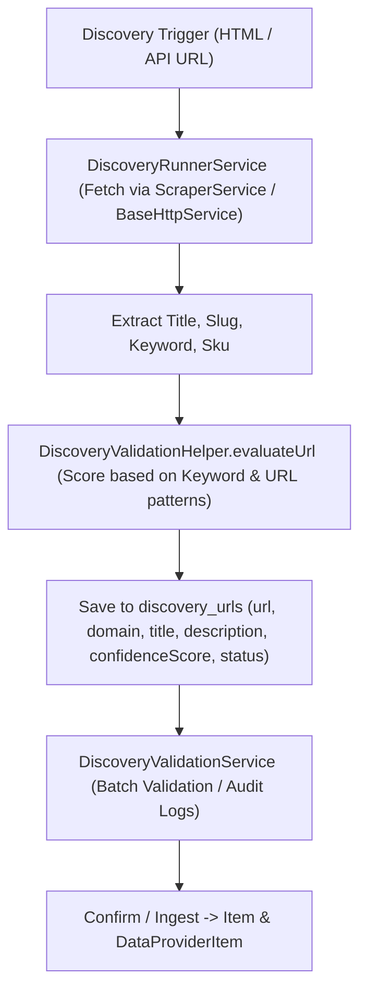

# Concept: Loại Bỏ Hoàn Toàn Các Thuộc Tính Giá Cả Khỏi Luồng Discovery URL

## 1. Problem Statement & Root Need (Bối cảnh & Vấn đề Cốt lõi)
- **Core Business Problem**:
  - Giai đoạn **Discovery Session** có nhiệm vụ cốt lõi là quét, phát hiện các đường dẫn URL sản phẩm/danh mục hợp lệ và phân giải vào hệ thống danh mục (`items` & `data_provider_items`).
  - Việc phát hiện và bóc tách giá tiền (`priceDetected`, `detectedPrice`, `detectedCurrency`) tại bước Discovery gây ra nhiều bất cập:
    1. **Sai lệch trách nhiệm (Separation of Concerns)**: Discovery chỉ cần xác thực URL có phải là trang sản phẩm hợp lệ hay không; việc bóc tách chi tiết giá cả, biến thể, tồn kho thuộc về giai đoạn Scraping/Syncing chi tiết sau này.
    2. **Độ chính xác thấp & Gây nhiễu**: Giá quét thô từ regex HTML/JSON tại bước Discovery thường không chính xác (dễ nhầm giá gốc, giá khuyến mãi, giá theo currency khác nhau).
    3. **Tải xử lý dư thừa**: Tốn CPU và độ trễ để chạy `PriceDetectorHelper` trên từng trang web khi crawl hàng loạt URL.
- **Target Audience & Core Value**:
  - Tối ưu hiệu năng crawler của Discovery Session, tinh gọn schema cơ sở dữ liệu `discovery_urls`, đơn giản hóa logic kiểm tra và phân tách rõ ràng trách nhiệm giữa Discovery (Tìm URL) và Scraping (Lấy dữ liệu chi tiết).

---

## 2. Scope Boundaries (Ranh giới Phạm vi)

- **In-Scope**:
  - Loại bỏ các cột `priceDetected`, `detectedPrice`, `detectedCurrency` khỏi [`DiscoveryUrlEntity`](file:///Users/kiem/Sources/PERSONAL/only-one-be/src/modules/data-provider/entities/discovery-url.entity.ts) và [`DiscoveryUrlDto`](file:///Users/kiem/Sources/PERSONAL/only-one-be/src/modules/data-provider/dtos/discovery-url.dto.ts).
  - Loại bỏ các trường liên quan đến giá trong [`IDiscoveryUrlEvaluationResult`](file:///Users/kiem/Sources/PERSONAL/only-one-be/src/modules/data-provider/interfaces) và [`DiscoveryValidationHelper`](file:///Users/kiem/Sources/PERSONAL/only-one-be/src/modules/data-provider/helpers/discovery-validation.helper.ts).
  - Dọn dẹp logic gán/tính toán giá trong [`DiscoveryRunnerService`](file:///Users/kiem/Sources/PERSONAL/only-one-be/src/modules/data-provider/services/discovery-runner.service.ts) và [`DiscoveryValidationService`](file:///Users/kiem/Sources/PERSONAL/only-one-be/src/modules/data-provider/services/discovery-validation.service.ts).
  - Cập nhật các bộ unit test liên quan (`discovery-validation.helper.spec.ts`, `discovery-validation.service.spec.ts`, `price-detector.helper.spec.ts` nếu cần loại bỏ hoặc cô lập).

- **Explicit Out-of-Scope**:
  - Không thay đổi bảng `items` hoặc bảng `scraping_data` (các bảng này phục vụ lưu trữ dữ liệu sản phẩm đầy đủ).
  - Không thay đổi các thuật toán đánh giá relevance/confidence score dựa trên SKU, Title và Target Keyword.

---

## 3. Success Metrics (Thước đo Thành công / Definition of Done)

1. **Zero Price References in Discovery Module**: Không còn bất kỳ trường `priceDetected`, `detectedPrice`, `detectedCurrency` nào trong entity `DiscoveryUrlEntity`, DTOs, hay helpers đánh giá Discovery.
2. **Lean Discovery Validation**: `DiscoveryValidationHelper.evaluateUrl` tính toán `confidenceScore` dựa thuần túy trên Keyword, Slug, Pattern đường dẫn và Tiêu đề trang.
3. **Clean Build & Test Suite**: 100% test cases trong `src/modules/data-provider/_tests/` vượt qua, `tsc -p tsconfig.build.json --noEmit` hoàn tất không có lỗi.

---

## 4. Proposed Solution & Core Mechanism (Phương pháp Giải quyết & Cơ chế Xử lý)

### 4.1. Explored Options & Trade-off Analysis (Các Phương án Đã Cân Nhắc)

| Option | Hướng tiếp cận | Ưu điểm (Pros) | Nhược điểm (Cons) | Độ phức tạp | Đánh giá |
| :--- | :--- | :--- | :--- | :--- | :--- |
| **Option 1: Complete Purge (Loại bỏ triệt để)** *(Đề xuất)* | Xóa bỏ hoàn toàn 3 trường giá khỏi `DiscoveryUrlEntity`, `DiscoveryUrlDto`, `DiscoveryValidationHelper` và `DiscoveryRunnerService`. | Triệt để, tinh gọn codebase, giảm tải I/O và RAM, schema sạch sẽ, tuân thủ chặt chẽ Single Responsibility Principle. | Cần cập nhật nhẹ các DTO/Test liên quan đến `DiscoveryUrl`. | Low | **Khuyến nghị chọn** |
| **Option 2: Deprecate & Make Nullable (Giữ lại nhưng không dùng)** | Giữ các cột trong entity nhưng set nullable và đánh dấu `@deprecated`, không tính toán giá trong runner. | Tránh sửa đổi schema DB lớn nếu database đang chạy migration nghiêm ngặt. | Codebase tích tụ technical debt và code thừa (dead fields), gây hiểu nhầm cho frontend / API consumers. | Low | Loại bỏ |

- **Chosen Strategy (Phương án Được Chọn)**: **Option 1 (Complete Purge)** để làm sạch toàn bộ module Discovery.

---

### 4.2. Core Processing Flow (Luồng Xử lý Sau Cải Tiến)

---

### 4.3. Critical Edge Cases & Risk Handling (Kịch bản Biên & Xử lý Rủi ro)
- **Scoring Weight Rebalancing**: Trước đây `priceDetected` có thể đóng góp một phần vào `confidenceScore`. Sau khi loại bỏ giá, trọng số tính điểm sẽ tập trung vào:
  - Khớp SKU/Code trong đường dẫn URL (trọng số cao).
  - Khớp từ khóa tìm kiếm (`targetKeyword`) trong Title hoặc Slug (trọng số trung bình).
  - Độ sâu tìm kiếm (`depth`) và định dạng domain hợp lệ.
- **Frontend Compatibility**: Đảm bảo frontend không phụ thuộc vào `priceDetected` / `detectedPrice` của bảng URL discovery (Frontend chỉ hiển thị URL, Tiêu đề, Match Result, và Confidence Score).

---

## 5. Technical English Key Patterns

### 1. Separation of Concerns (Nguyên lý Phân tách Trách nhiệm)
- **Meaning (VI)**: Nguyên tắc thiết kế phần mềm trong đó mỗi module, service chỉ giải quyết một mối quan tâm/trách nhiệm duy nhất.
- **Grammar / Usage**: `Separation of concerns between [Module A] and [Module B]`
- **Engineering Example**: *"Enforcing strict separation of concerns ensures the discovery engine is not burdened with price extraction logic."*

### 2. Purge / Deprecate Dead Fields (Dọn dẹp / Loại bỏ Trường Dư thừa)
- **Meaning (VI)**: Hành động loại bỏ hoàn toàn các trường dữ liệu không còn giá trị sử dụng nhằm tránh technical debt.
- **Grammar / Usage**: `Purge [deprecated/redundant fields] from [entity/schema]`
- **Engineering Example**: *"We will purge all price-related attributes from the discovery schema to streamline data ingestion."*

### 3. Streamline (Tinh gọn hóa / Tối ưu quy trình)
- **Meaning (VI)**: Làm cho một quy trình hoặc hệ thống trở nên đơn giản, trực tiếp và hiệu quả hơn bằng cách loại bỏ các bước dư thừa.
- **Grammar / Usage**: `Streamline the [workflow / pipeline / lifecycle]`
- **Engineering Example**: *"Removing price detection will streamline the URL evaluation pipeline and reduce crawling latency."*
