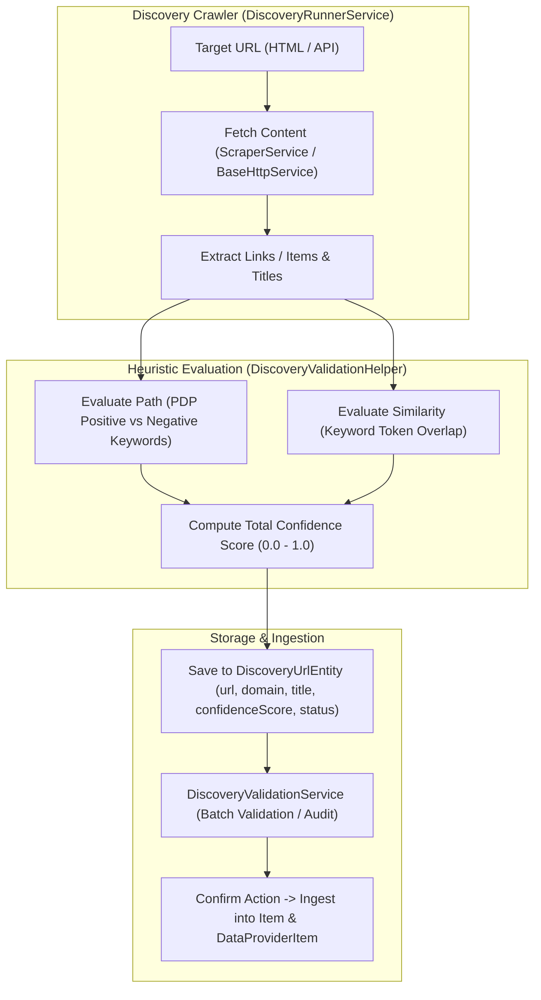

# Plan: Loại Bỏ Hoàn Toàn Các Thuộc Tính Giá Cả Khỏi Module Discovery URL

## Section 1. Current State (Hiện trạng & Phân tích Mã nguồn)

### 1.1. Hiện trạng Mã nguồn
Hiện tại, module Discovery URL đang đảm nhận việc phát hiện, bóc tách và lưu trữ các trường dữ liệu giá cả từ tiêu đề/nội dung trang web:
1. **[`DiscoveryUrlEntity`](file:///Users/kiem/Sources/PERSONAL/only-one-be/src/modules/data-provider/entities/discovery-url.entity.ts#L57-L68)**: Định nghĩa 3 cột `priceDetected`, `detectedPrice`, `detectedCurrency`.
2. **[`DiscoveryUrlDto`](file:///Users/kiem/Sources/PERSONAL/only-one-be/src/modules/data-provider/dtos/discovery-url.dto.ts#L48-L56)**: Chứa 3 trường DTO tương ứng.
3. **[`PriceDetectorHelper`](file:///Users/kiem/Sources/PERSONAL/only-one-be/src/modules/data-provider/helpers/price-detector.helper.ts)**: Sử dụng regular expressions để bóc tách giá và đơn vị tiền tệ từ chuỗi tiêu đề.
4. **[`DiscoveryValidationHelper`](file:///Users/kiem/Sources/PERSONAL/only-one-be/src/modules/data-provider/helpers/discovery-validation.helper.ts#L47-L82)**: Gọi `PriceDetectorHelper.detectPriceInText(title)` và cộng điểm `priceScore` (0.2) vào `confidenceScore`.
5. **[`DiscoveryRunnerService`](file:///Users/kiem/Sources/PERSONAL/only-one-be/src/modules/data-provider/services/discovery-runner.service.ts#L198-L203)** & **[`DiscoveryValidationService`](file:///Users/kiem/Sources/PERSONAL/only-one-be/src/modules/data-provider/services/discovery-validation.service.ts#L79-L81)**: Gán giá trị giá vào `DiscoveryUrlEntity`.

### 1.2. Vấn đề Kỹ thuật Cốt lõi
- **Vi phạm Phân tách Trách nhiệm (Separation of Concerns)**: Mục tiêu duy nhất của Discovery Session là xác định các URL sản phẩm hợp lệ để nạp vào danh mục (`Item` và `DataProviderItem`). Việc trích xuất giá chi tiết (giá bán, giá khuyến mãi, lịch sử giá) thuộc về scraper runner sau khi item đã được mapping.
- **Dữ liệu Rác & Không Chính xác**: Nhận diện giá thô qua regex từ title ở giai đoạn quét link thường sai lệch (dễ bắt nhầm mã sản phẩm, model number, hoặc giá chưa định dạng chuẩn).
- **Tải Xử lý Dư thừa**: Chạy regex trên mọi link crawl gây suy giảm thông lượng crawl URL.

### 1.3. Invariants (Danh sách Hành vi Bắt buộc Giữ nguyên)
1. **URL Discovery & Ingestion Flow**: Luồng BFS crawler, bóc tách mã SKU/Code từ URL (`extractCodeFromUrl`), và phân giải vào `items` / `data_provider_items` (`ingestDiscoveredUrl`) không bị ảnh hưởng.
2. **Heuristic Confidence Scoring**: Đánh giá độ tin cậy của URL dựa trên:
   - PDP path patterns (`/dp/`, `/product/`, `/p/`, `/item/`).
   - Loại trừ negative keywords (cart, checkout, login, blog, etc.).
   - Mức độ tương đồng của từ khóa tìm kiếm (`targetKeyword`) với tiêu đề trang.
3. **AutoMapper Contract**: Các DTO mapping giữa Entity và DTO tiếp tục nhất quán qua AutoMapper.

---

## Section 2. Detailed Design (Thiết kế Kỹ thuật Chi tiết)

### 2.1. Kiến trúc Cải tiến (Clean Discovery Pipeline)



### 2.2. Trọng số Tính Điểm Mới (Confidence Scoring Breakdown)
Khi bỏ `priceScore`, công thức tính điểm `DiscoveryValidationHelper.evaluateUrl` được phân bổ lại:
- **PDP Path Score**:
  - Khớp positive keyword (`/dp/`, `/product/`, etc.): `+0.5`
  - Dính negative keyword (`/cart/`, `/login/`, etc.): `-0.3` (tối thiểu `0.0`)
- **Keyword Similarity Score**:
  - Baseline khi có domain/title hợp lệ: `+0.2`
  - Tỷ lệ khớp từ khóa `targetKeyword` trong `title`: Lên đến `+0.3` (tổng similarity tối đa `0.5`).
- **Tổng điểm `confidenceScore`**: `Math.min(1.0, parseFloat((pathScore + similarityScore).toFixed(2)))`.
  - `totalScore >= 0.70` $\rightarrow$ `EXACT_MATCH`
  - `totalScore >= 0.40` $\rightarrow$ `PARTIAL_MATCH`
  - `totalScore < 0.40` $\rightarrow$ `NO_MATCH`

### 2.3. Loại bỏ Module Dư thừa
- `PriceDetectorHelper` (`src/modules/data-provider/helpers/price-detector.helper.ts`) và unit test tương ứng sẽ bị xóa bỏ hoàn toàn khỏi project.
- Xóa `PriceDetectorHelper` khỏi danh sách `helpers` trong `DataProviderModule`.

---

## Section 3. Implementation Architecture & Machine-Readable Task Matrix

### 3.1 Machine-Readable Task Matrix & Dependency Graph

| Order | Status | Action | File Path | Target Symbols / AST Seams | Reused Existing Utilities / Helpers | Depends On | Fast Test Command |
| :---: | :---: | :---: | :--- | :--- | :--- | :--- | :--- |
| **1** | `[x]` | `[MODIFY]` | `src/modules/data-provider/entities/discovery-url.entity.ts` | `DiscoveryUrlEntity` | `AbstractEntity` | `None` | `npx tsc -p tsconfig.build.json --noEmit` |
| **2** | `[x]` | `[MODIFY]` | `src/modules/data-provider/dtos/discovery-url.dto.ts` | `DiscoveryUrlDto` | `AutoMap` | `Order 1` | `npx tsc -p tsconfig.build.json --noEmit` |
| **3** | `[x]` | `[DELETE]` | `src/modules/data-provider/helpers/price-detector.helper.ts` | `PriceDetectorHelper` | `None` | `None` | `npx tsc -p tsconfig.build.json --noEmit` |
| **4** | `[x]` | `[DELETE]` | `src/modules/data-provider/_tests/price-detector.helper.spec.ts` | `describe('PriceDetectorHelper')` | `None` | `Order 3` | `npx tsc -p tsconfig.build.json --noEmit` |
| **5** | `[x]` | `[MODIFY]` | `src/modules/data-provider/helpers/discovery-validation.helper.ts` | `ValidationEvaluationResult`, `DiscoveryValidationHelper.evaluateUrl` | `PDP_POSITIVE_KEYWORDS`, `PDP_NEGATIVE_KEYWORDS` | `Order 3` | `npx tsc -p tsconfig.build.json --noEmit` |
| **6** | `[x]` | `[MODIFY]` | `src/modules/data-provider/data-provider.module.ts` | `helpers`, `DataProviderModule` | `ExtractDataHelper`, `UrlResolverHelper` | `Order 3` | `npx tsc -p tsconfig.build.json --noEmit` |
| **7** | `[x]` | `[MODIFY]` | `src/modules/data-provider/services/discovery-runner.service.ts` | `DiscoveryRunnerService.runApiDiscovery`, `DiscoveryRunnerService.runHtmlDiscovery` | `DiscoveryValidationHelper` | `Order 1, Order 5` | `npx tsc -p tsconfig.build.json --noEmit` |
| **8** | `[x]` | `[MODIFY]` | `src/modules/data-provider/services/discovery-validation.service.ts` | `DiscoveryValidationService.startBatchValidation`, `DiscoveryValidationService.revalidateDiscoveredUrl` | `DiscoveryValidationHelper` | `Order 1, Order 5` | `npx tsc -p tsconfig.build.json --noEmit` |
| **9** | `[x]` | `[MODIFY]` | `src/modules/data-provider/_tests/discovery-validation.helper.spec.ts` | `describe('DiscoveryValidationHelper')` | `DiscoveryValidationHelper` | `Order 5` | `npx tsc -p tsconfig.build.json --noEmit` |

---

## Section 4. Implementation Code Examples (Mẫu Code Triển khai)

### Order 1: `src/modules/data-provider/entities/discovery-url.entity.ts`
- **Action**: `[MODIFY]`
- **Depends On**: `None`
- **Mục đích**: Xóa các cột `priceDetected`, `detectedPrice`, `detectedCurrency`.

```typescript
// [TARGET SEAM: Lines 53-68 in discovery-url.entity.ts]
// [RATIONALE: Purge price detection columns from discovery schema]

    @Column({ type: 'decimal', precision: 3, scale: 2, default: 0 })
    @AutoMap()
    confidenceScore: number;

    @Column({ type: 'varchar', length: 20, default: DiscoveryValidationStatus.PENDING })
    @AutoMap()
    validationStatus: DiscoveryValidationStatus;
```

---

### Order 2: `src/modules/data-provider/dtos/discovery-url.dto.ts`
- **Action**: `[MODIFY]`
- **Depends On**: `Order 1`
- **Mục đích**: Xóa các trường giá khỏi DTO.

```typescript
// [TARGET SEAM: Lines 46-56 in discovery-url.dto.ts]
// [RATIONALE: Remove price attributes from client-facing DTO contract]

    @AutoMap()
    confidenceScore: number;

    @AutoMap()
    validationStatus: DiscoveryValidationStatus;
```

---

### Order 5: `src/modules/data-provider/helpers/discovery-validation.helper.ts`
- **Action**: `[MODIFY]`
- **Depends On**: `Order 3`
- **Mục đích**: Xóa `PriceDetectorHelper` và cấu trúc lại kết quả đánh giá URL.

```typescript
// [TARGET SEAM: Lines 1-84 in discovery-validation.helper.ts]
// [RATIONALE: Streamline evaluation result and remove price dependency]

import { PDP_NEGATIVE_KEYWORDS, PDP_POSITIVE_KEYWORDS } from '../constants/discovery-constants';
import { ValidationMatchResult } from '../enums';

export interface ValidationEvaluationResult {
    confidenceScore: number;
    matchResult: ValidationMatchResult;
    reason: string;
    matchedCriteria: Record<string, any>;
}

export class DiscoveryValidationHelper {
    public static evaluateUrl(params: {
        url: string;
        title?: string;
        targetKeyword?: string;
        domain?: string;
    }): ValidationEvaluationResult {
        const { url, title, targetKeyword } = params;
        const normalizedUrl = url.toLowerCase();
        let pathScore = 0;
        let negativeHit = false;

        // 1. Negative Filter Check
        for (const neg of PDP_NEGATIVE_KEYWORDS) {
            if (normalizedUrl.includes(neg)) {
                negativeHit = true;
                break;
            }
        }

        // 2. Positive PDP Path Check
        for (const pos of PDP_POSITIVE_KEYWORDS) {
            if (normalizedUrl.includes(pos)) {
                pathScore = 0.5;
                break;
            }
        }
        if (negativeHit) {
            pathScore = Math.max(0, pathScore - 0.3);
        }

        // 3. Token Overlap / Similarity Check
        let similarityScore = 0.2; // Baseline
        if (targetKeyword && title) {
            const targetTokens = targetKeyword
                .toLowerCase()
                .split(/\s+/)
                .filter((t) => t.length > 2);
            if (targetTokens.length > 0) {
                const matchedTokens = targetTokens.filter((t) => title.toLowerCase().includes(t));
                similarityScore = (matchedTokens.length / targetTokens.length) * 0.3;
            }
        }

        const totalScore = Math.min(1.0, parseFloat((pathScore + similarityScore).toFixed(2)));

        let matchResult = ValidationMatchResult.NO_MATCH;
        if (totalScore >= 0.7) {
            matchResult = ValidationMatchResult.EXACT_MATCH;
        } else if (totalScore >= 0.4) {
            matchResult = ValidationMatchResult.PARTIAL_MATCH;
        } else {
            matchResult = ValidationMatchResult.NO_MATCH;
        }

        return {
            confidenceScore: totalScore,
            matchResult,
            reason: `Heuristic: PDP=${pathScore > 0}, Negative=${negativeHit}, Similarity=${similarityScore}`,
            matchedCriteria: { pathScore, similarityScore, negativeHit },
        };
    }
}
```

---

### Order 6: `src/modules/data-provider/data-provider.module.ts`
- **Action**: `[MODIFY]`
- **Depends On**: `Order 3`
- **Mục đích**: Gỡ bỏ import và provider của `PriceDetectorHelper`.

```typescript
// [TARGET SEAM: Line 26 & Line 48 in data-provider.module.ts]
// [RATIONALE: Remove PriceDetectorHelper from helper provider list]

const helpers = [ExtractDataHelper, UrlResolverHelper];
```

---

### Order 7: `src/modules/data-provider/services/discovery-runner.service.ts`
- **Action**: `[MODIFY]`
- **Depends On**: `Order 1, Order 5`
- **Mục đích**: Xóa gán các trường `priceDetected`, `detectedPrice`, `detectedCurrency` khi khởi tạo `DiscoveryUrlEntity`.

```typescript
// [TARGET SEAM: In runApiDiscovery and runHtmlDiscovery]
// [RATIONALE: Purge price fields when constructing DiscoveryUrlEntity]

const urlEntity = this.urlRepo.create({
    sessionId: session.id,
    dataProviderId: session.dataProviderId,
    url: item.url,
    domain,
    title: item.title,
    description: item.description,
    status: DiscoveryUrlStatus.DISCOVERED,
    foundAtDepth: 1,
    confidenceScore: evalResult.confidenceScore,
    validationStatus: DiscoveryValidationStatus.COMPLETED,
    matchResult: evalResult.matchResult,
});
```

---

### Order 8: `src/modules/data-provider/services/discovery-validation.service.ts`
- **Action**: `[MODIFY]`
- **Depends On**: `Order 1, Order 5`
- **Mục đích**: Xóa gán `urlEntity.priceDetected`, `detectedPrice`, `detectedCurrency` trong `startBatchValidation` và `revalidateDiscoveredUrl`.

```typescript
// [TARGET SEAM: Lines 76-82 and Lines 153-159 in discovery-validation.service.ts]
// [RATIONALE: Clean up evaluation assignment]

urlEntity.confidenceScore = evalResult.confidenceScore;
urlEntity.matchResult = evalResult.matchResult;
urlEntity.validationStatus = DiscoveryValidationStatus.COMPLETED;
```

---

## Section 5. Test Cases (Kịch bản Kiểm thử & Nghiệm thu)

### 5.1. Unit Test Scenarios (Gherkin Format)

#### Scenario 1: Evaluate Product URL without price detection
- **Objective**: Xác nhận `DiscoveryValidationHelper` chấm điểm chính xác dựa trên path và title mà không cần giá.
- **Precondition**: URL chứa PDP pattern `/dp/B08N5WRWNW` và targetKeyword `'Sony Headphones'`.
- **Action**: Gọi `DiscoveryValidationHelper.evaluateUrl({ url, title: 'Sony WH-1000XM4 Headphones', targetKeyword: 'Sony Headphones' })`.
- **Expected Result**:
  - `result.confidenceScore` $\ge 0.70$.
  - `result.matchResult` là `ValidationMatchResult.EXACT_MATCH`.
  - `result.priceDetected` và `detectedPrice` không còn tồn tại trong interface.
- **Test File**: `src/modules/data-provider/_tests/discovery-validation.helper.spec.ts`.

#### Scenario 2: Batch Validation in DiscoveryValidationService
- **Objective**: Đảm bảo quá trình batch validation cập nhật status và confidenceScore của các URL trong session mà không gặp lỗi liên quan đến các cột giá.
- **Precondition**: Session có 2 URL khám phá.
- **Action**: Gọi `discoveryValidationService.startBatchValidation('session-1', 'Keyword')`.
- **Expected Result**:
  - Batch hoàn thành với trạng thái `COMPLETED`.
  - Không có lỗi gán trường `priceDetected`.
- **Test File**: `src/modules/data-provider/_tests/discovery-validation.service.spec.ts`.

### 5.2. Verification Commands
```bash
# 1. Chạy toàn bộ unit tests của module data-provider
npm test -- src/modules/data-provider/_tests/

# 2. Kiểm tra TypeScript build toàn dự án
npx tsc -p tsconfig.build.json --noEmit

# 3. Kiểm tra ESLint & Format
ESLINT_USE_FLAT_CONFIG=false npx eslint src/modules/data-provider/ --fix
```

---

## Section 6. Technical English Key Patterns

### 1. Zero Out-of-Band Dependencies (Loại bỏ Phụ thuộc Không Cần thiết)
- **Meaning (VI)**: Loại bỏ các thư viện hoặc helper ngoài luồng không còn đóng góp vào mục tiêu chính của module.
- **Grammar / Usage**: `Eliminate [out-of-band / extraneous] dependencies from [subsystem]`
- **Engineering Example**: *"By deleting PriceDetectorHelper, we eliminate an extraneous dependency from the discovery subsystem."*

### 2. Backward Compatibility Guardrails (Rào chắn Tương thích Ngược)
- **Meaning (VI)**: Các biện pháp và kịch bản kiểm thử nhằm bảo đảm sự thay đổi nội bộ không làm gãy các luồng nghiệp vụ hiện hữu.
- **Grammar / Usage**: `Maintain [backward compatibility guardrails] across [API surfaces / contracts]`
- **Engineering Example**: *"We ensure that removing price fields maintains full compatibility with downstream item ingestion pipelines."*

### 3. Lean Domain Model (Mô hình Nghiệp vụ Tinh gọn)
- **Meaning (VI)**: Mô hình dữ liệu được thiết kế tập trung đúng trọng tâm bài toán, không chứa các thuộc tính thừa thãi gây phình schema.
- **Grammar / Usage**: `Achieve a [lean domain model] by pruning [unnecessary attributes]`
- **Engineering Example**: *"Pruning the price attributes allows DiscoveryUrlEntity to achieve a lean domain model focused purely on URL lifecycle management."*
