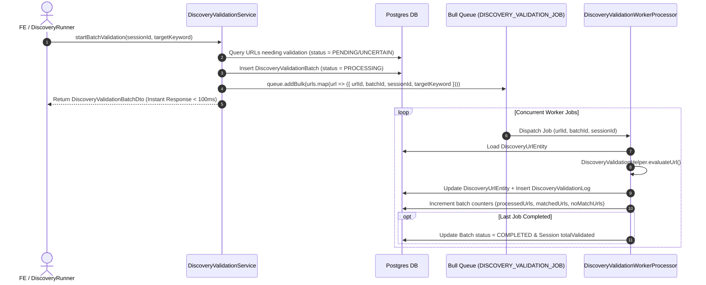

# Concept: Chuyển Đổi Xử Lý Discovery Validation Sang Async Worker Processor (Bull Queue)

## 1. Problem Statement & Root Need (Bối cảnh & Vấn đề Cốt lõi)
- **Core Business Problem**:
  - Hiện tại, [`DiscoveryValidationService.startBatchValidation`](file:///Users/kiem/Sources/PERSONAL/only-one-be/src/modules/data-provider/services/discovery-validation.service.ts) đang query toàn bộ danh sách `DiscoveryUrlEntity` trong một session và thực hiện đánh giá heuristic, tạo audit logs, commit transaction lớn hoàn toàn đồng bộ (in-process) trên Backend API container.
  - Khi một discovery session quét được hàng trăm đến hàng nghìn URLs, việc validation đồng bộ gây:
    1. **Nghẽn Event Loop & Memory Spike**: API process bị chậm, ảnh hưởng trực tiếp đến trải nghiệm người dùng trên frontend portal.
    2. **Transaction Bottleneck**: Lock bảng và giữ connection pool của TypeORM trong thời gian dài.
    3. **Không có Fault Isolation & Retry**: Nếu server API restart hoặc crash giữa chừng, toàn bộ batch bị kẹt ở trạng thái `PROCESSING`, không thể resume từng URL độc lập.
- **Target Audience & Core Value**:
  - **Hệ thống Backend & Người dùng Admin/Operator**: API luôn phản hồi nhanh (< 100ms), tác vụ validation nặng được đẩy sang Worker container (`WorkerModule`) chuyên dụng, hỗ trợ scale độc lập và hiển thị tiến độ realtime.

---

## 2. Scope Boundaries (Ranh giới Phạm vi)

### In-Scope:
1. **Queue & Job Definition**:
   - Bổ sung queue name `QUEUE_NAME.DISCOVERY_VALIDATION_JOB` trong [`QUEUE_NAME`](file:///Users/kiem/Sources/PERSONAL/only-one-be/src/modules/queue/enums/queue-name.enum.ts).
   - Định nghĩa job payload interface `IDiscoveryValidationJob` (hỗ trợ cả validate theo single URL hoặc theo chunked batch).
2. **Worker Processor**:
   - Tạo [`DiscoveryValidationWorkerProcessor`](file:///Users/kiem/Sources/PERSONAL/only-one-be/src/modules/worker/processors) lắng nghe queue và thực hiện validate từng URL/chunk, ghi audit log, cập nhật tiến độ batch và session.
   - Đăng ký processor vào [`WorkerModule`](file:///Users/kiem/Sources/PERSONAL/only-one-be/src/modules/worker/worker.module.ts) có điều kiện qua `WORKER_NODE_ENABLED`.
3. **Producer Integration**:
   - Cập nhật [`DiscoveryValidationService`](file:///Users/kiem/Sources/PERSONAL/only-one-be/src/modules/data-provider/services/discovery-validation.service.ts) & [`DiscoveryRunner`](file:///Users/kiem/Sources/PERSONAL/only-one-be/src/modules/data-provider/runners/discovery.runner.ts): Thay vì xử lý trực tiếp, chuyển sang tạo record Batch với status `PENDING` / `PROCESSING` và enqueue jobs vào Bull Queue.
4. **Progress & Status Synchronization**:
   - Cập nhật số lượng `processedUrls`, `matchedUrls`, `noMatchUrls` theo từng job hoàn thành (atomic increment hoặc aggregation) và hoàn tất Batch khi job cuối cùng kết thúc.

### Explicit Out-of-Scope:
- Thay đổi thuật toán chấm điểm heuristic của [`DiscoveryValidationHelper`](file:///Users/kiem/Sources/PERSONAL/only-one-be/src/modules/data-provider/helpers/discovery-validation.helper.ts) (giữ nguyên logic PDP Path + Similarity).
- Tách riêng worker thành microservice độc lập (tiếp tục sử dụng kiến trúc modular monolith hiện tại qua `WORKER_NODE_ENABLED`).

---

## 3. Success Metrics (Thước đo Thành công / Definition of Done)
1. **Zero Main Thread Blocking**: API trigger validation (`POST /discovery-sessions/:id/validate` hoặc autoValidate từ runner) trả về phản hồi ngay lập tức (`< 150ms`) với thông tin Batch đã được tạo.
2. **Horizontal Scalability**: Worker có thể chạy với nhiều concurrency (ví dụ `concurrency: 5-10`) hoặc chạy trên nhiều Worker node song song mà không bị race condition.
3. **Graceful Error Handling & Retry**: Lỗi trên 1 URL không làm dừng cả batch; các job thất bại được Bull retry hoặc log riêng.
4. **100% Test Coverage & Build Integrity**: Toàn bộ unit tests và TypeScript compile không có lỗi.

---

## 4. Proposed Solution & Core Mechanism (Phương pháp Giải quyết & Cơ chế Xử lý)

### 4.1. Explored Options & Trade-off Analysis (Các Phương án Đã Cân Nhắc)

| Option | Hướng tiếp cận | Ưu điểm (Pros) | Nhược điểm (Cons) | Độ phức tạp | Đánh giá |
| :--- | :--- | :--- | :--- | :--- | :--- |
| **Option 1: Single-URL Job Granularity** | Mỗi URL là 1 Bull Job độc lập (`urlId`, `sessionId`, `batchId`). | - Độ mịn cao nhất, retry từng URL dễ dàng. - Tận dụng tối đa concurrency của worker. - Tiến độ cập nhật realtime theo từng URL. | Số lượng job lớn trong Redis nếu session có > 10,000 URLs; cần atomic counter khi update batch status. | Medium | **(Khuyến nghị)** Chuẩn kiến trúc Worker, cách ly lỗi tốt nhất. |
| **Option 2: Chunked Batch Job (Chunks of 50-100 URLs)** | Chia session thành các chunk nhỏ (50 URLs/job). | - Giảm số lượng job trong Redis. - Xử lý nhanh nhờ bulk database operations (`manager.save`). | Nếu 1 URL trong chunk bị lỗi lạ, cả chunk phải retry hoặc cần try-catch nội bộ. | Low-Medium | Khả thi nếu muốn tối ưu database round-trips. |
| **Option 3: Session-Level Background Job** | 1 Job duy nhất cho cả Session, Worker chạy vòng lặp xử lý. | - Đơn giản nhất, giữ nguyên code service hiện tại. | - Không scale concurrency trên từng URL. - 1 job chạy lâu dễ bị Bull coi là stalled job nếu không renew lock. | Low | Không tối ưu tải và thiếu linh hoạt. |

- **Chosen Strategy (Phương án Được Chọn)**: **Option 1 kết hợp Bulk Enqueue**:
  - Khi trigger validation, API tạo `DiscoveryValidationBatchEntity` và gọi `queue.addBulk()` đẩy danh sách `urlIds` vào Redis.
  - `DiscoveryValidationWorkerProcessor` nhận từng URL job, gọi hàm validate đơn lẻ, cập nhật `DiscoveryUrlEntity`, lưu `DiscoveryValidationLogEntity`, và cập nhật counter của batch.
  - Khi `processedUrls === totalUrls`, batch chuyển sang trạng thái `COMPLETED`.

---

### 4.2. Core Processing Flow (Luồng Xử lý / Chuyển trạng thái Chính)

---

### 4.3. Critical Edge Cases & Risk Handling (Kịch bản Biên & Xử lý Rủi ro)
1. **Race Condition khi Update Batch Completion**:
   - Sử dụng database atomic increment: `UPDATE discovery_validation_batches SET processed_urls = processed_urls + 1 WHERE id = :batchId`.
   - Kiểm tra `processed_urls === total_urls` trong transaction để set `status = COMPLETED` an toàn.
2. **User Cancel Batch giữa chừng**:
   - Processor kiểm tra trạng thái của batch trước khi xử lý job: Nếu `batch.status === CANCELLED`, bỏ qua job mà không ghi đè dữ liệu.
3. **Queue Stall / Worker Crash**:
   - Cấu hình lock duration và retry attempts (`attempts: 3`, `backoff: { type: 'exponential', delay: 2000 }`).

---

## 5. Technical English Key Patterns

### 1. Offloading compute-heavy tasks to background workers
- **Meaning (VI)**: Chuyển giao các tác vụ tính toán nặng từ luồng xử lý chính sang các tiến trình worker nền để tránh làm nghẽn ứng dụng.
- **Grammar / Usage**: `offload <heavy-task> from <main-thread/API> to <worker-process>`
- **Engineering Example**: *"We offloaded the heuristic URL validation logic from the HTTP request lifecycle to Bull worker processors to prevent event loop starvation."*

### 2. Fine-grained job granularity vs Chunked batching
- **Meaning (VI)**: Độ mịn từng tác vụ đơn lẻ so với gom nhóm theo lô (đánh đổi giữa độ cô lập lỗi và chi phí quản lý queue).
- **Grammar / Usage**: `<fine-grained granularity> provides better fault isolation at the expense of <queue overhead>`
- **Engineering Example**: *"Adopting fine-grained job granularity allows each URL to be retried independently without re-executing the entire validation batch."*

### 3. Atomic counter increment for concurrency safety
- **Meaning (VI)**: Tăng biến đếm nguyên tử trong database để đảm bảo an toàn đa luồng/tiến trình song song.
- **Grammar / Usage**: `use atomic increments to avoid race conditions during concurrent worker execution`
- **Engineering Example**: *"The worker processor uses atomic database increments on the batch entity to accurately track processed URLs across multiple concurrent workers."*
