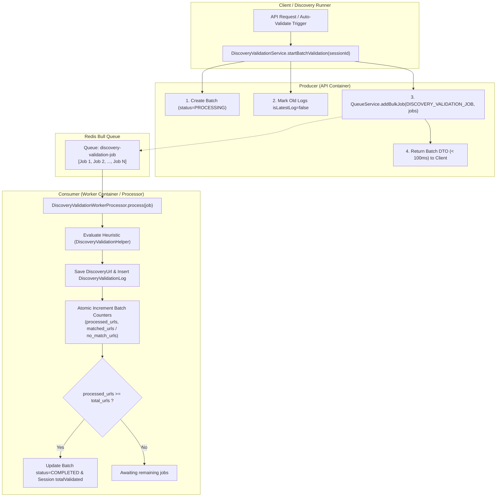

# Plan: Chuyển Đổi Xử Lý Discovery Validation Sang Async Worker Processor (Bull Queue)

## Section 1. Current State (Hiện trạng & Phân tích Mã nguồn)

### 1.1. Hiện trạng Mã nguồn
Hiện tại, tiến trình đánh giá và xác thực danh sách URLs (`DiscoveryValidationService.startBatchValidation`) đang được thực hiện in-process trên API Server:
1. **[`DiscoveryValidationService.startBatchValidation`](file:///Users/kiem/Sources/PERSONAL/only-one-be/src/modules/data-provider/services/discovery-validation.service.ts#L40-L123)**:
   - Query toàn bộ các URLs của một session (`this.urlRepo.find({ where: { sessionId } })`).
   - Khởi tạo `DiscoveryValidationBatchEntity` với trạng thái `PROCESSING`.
   - Chạy vòng lặp đồng bộ `for (const urlEntity of urls)` để gọi `DiscoveryValidationHelper.evaluateUrl()`, gán kết quả và push vào mảng `logEntries`.
   - Chạy transaction TypeORM lớn (`this.dataSource.transaction`) để lưu hàng loạt `DiscoveryUrlEntity`, `DiscoveryValidationLogEntity`, cập nhật `DiscoveryValidationBatchEntity` và `DiscoverySessionEntity`.
2. **[`QueueModule`](file:///Users/kiem/Sources/PERSONAL/only-one-be/src/modules/queue/queue.module.ts)** & **[`QueueService`](file:///Users/kiem/Sources/PERSONAL/only-one-be/src/modules/queue/services/queue.service.ts)**:
   - Đã cấu hình Bull Queue toàn cục, hiện tại mới chỉ đăng ký queue `QUEUE_NAME.SCRAPING_JOB`.
   - `QueueService` có sẵn các phương thức `addJob` và `addBulkJob` để enqueue tác vụ vào Redis.
3. **[`WorkerModule`](file:///Users/kiem/Sources/PERSONAL/only-one-be/src/modules/worker/worker.module.ts)**:
   - Được thiết kế dưới dạng dynamic module (`WorkerModule.register()`), kích hoạt các processor khi biến môi trường `WORKER_NODE_ENABLED=true`. Hiện tại mới chỉ có `ScrapingWorkerProcessor`.

### 1.2. Vấn đề Kỹ thuật Cốt lõi
- **Main Process Starvation**: Khi một session phát hiện nhiều URLs (> 1,000 URLs), việc loop đánh giá heuristic và commit transaction giữ connection DB quá lâu làm nghẽn Event Loop của Backend API.
- **Không có Concurrency & Distributed Scaling**: Việc xử lý gộp toàn bộ session không tận dụng được sức mạnh của Redis Queue và các Worker node chạy song song.
- **Thiếu Retry / Partial Failure Isolation**: Nếu server API bị restart đột ngột, toàn bộ batch bị dở dang và không thể retry chính xác từng URL.

### 1.3. Invariants (Danh sách Hành vi Bắt buộc Giữ nguyên)
1. **Heuristic Evaluation Accuracy**: Thuật toán tính điểm trong `DiscoveryValidationHelper.evaluateUrl` (PDP positive path + similarity overlap) giữ nguyên tuyệt đối.
2. **Audit Logging Contract**: Mỗi lần một URL được validate, bản ghi `DiscoveryValidationLogEntity` phải được ghi nhận chính xác với `isLatestLog: true` và `operationStatus: 'completed'`.
3. **Batch & Session Counts**: `DiscoveryValidationBatchEntity` (`processedUrls`, `matchedUrls`, `noMatchUrls`, `status: COMPLETED`) và `DiscoverySessionEntity` (`totalValidated`) phải phản ánh chính xác số liệu sau khi tất cả worker jobs hoàn tất.
4. **Single URL Revalidation**: Phương thức `revalidateDiscoveredUrl` cho 1 URL cụ thể từ UI vẫn giữ nguyên để trả kết quả đồng bộ ngay lập tức cho người dùng.

---

## Section 2. Detailed Design (Thiết kế Kỹ thuật Chi tiết)

### 2.1. Kiến trúc Producer - Consumer Phân tán



### 2.2. Chi tiết Payload & Queue Configuration
- **Queue Name**: `QUEUE_NAME.DISCOVERY_VALIDATION_JOB = 'discovery-validation-job'`.
- **Job Interface**: `IDiscoveryValidationJob`:
  ```typescript
  export interface IDiscoveryValidationJob {
      urlId: string;
      sessionId: string;
      batchId: string;
      targetKeyword?: string;
  }
  ```
- **Job Options**: `attempts: 3`, `backoff: { type: 'exponential', delay: 1000 }`, `removeOnComplete: true`.

### 2.3. Cơ chế Đảm bảo Tính Toàn vẹn & An toàn Đa luồng (Atomic Batch Progress)
1. Mỗi worker job khi hoàn thành 1 URL sẽ thực hiện transaction:
   - Cập nhật `DiscoveryUrlEntity` (`validationStatus = COMPLETED`, `confidenceScore`, `matchResult`).
   - Tạo bản ghi `DiscoveryValidationLogEntity`.
   - Atomic update:
     ```sql
     UPDATE discovery_validation_batches 
     SET processed_urls = processed_urls + 1,
         matched_urls = matched_urls + :isMatched,
         no_match_urls = no_match_urls + :isNoMatch
     WHERE id = :batchId
     RETURNING processed_urls, total_urls;
     ```
2. Nếu `processed_urls === total_urls`, worker thực hiện cập nhật `status = COMPLETED`, `completedAt = NOW()` cho Batch và cập nhật `totalValidated` cho Session.

---

## Section 3. Implementation Architecture & Machine-Readable Task Matrix

### 3.1 Machine-Readable Task Matrix & Dependency Graph

| Order | Status | Action | File Path | Target Symbols / AST Seams | Reused Existing Utilities / Helpers | Depends On | Fast Test Command |
| :---: | :---: | :---: | :--- | :--- | :--- | :--- | :--- |
| **1** | `[x]` | `[MODIFY]` | `src/modules/queue/enums/queue-name.enum.ts` | `QUEUE_NAME.DISCOVERY_VALIDATION_JOB` | `None` | `None` | `npx tsc -p tsconfig.build.json --noEmit` |
| **2** | `[x]` | `[NEW]` | `src/modules/queue/interfaces/discovery-validation-job-queue.interface.ts` | `IDiscoveryValidationJob` | `None` | `None` | `npx tsc -p tsconfig.build.json --noEmit` |
| **3** | `[x]` | `[MODIFY]` | `src/modules/queue/interfaces/index.ts` | `export * from './discovery-validation-job-queue.interface'` | `None` | `Order 2` | `npx tsc -p tsconfig.build.json --noEmit` |
| **4** | `[x]` | `[MODIFY]` | `src/modules/queue/queue.module.ts` | `BullModule.registerQueue` | `QUEUE_NAME` | `Order 1` | `npx tsc -p tsconfig.build.json --noEmit` |
| **5** | `[x]` | `[MODIFY]` | `src/modules/queue/services/queue.service.ts` | `QueueService.constructor`, `discoveryValidationQueue` | `@InjectQueue`, `QUEUE_NAME` | `Order 1, Order 4` | `npx tsc -p tsconfig.build.json --noEmit` |
| **6** | `[x]` | `[NEW]` | `src/modules/worker/processors/discovery-validation-worker.processor.ts` | `DiscoveryValidationWorkerProcessor` | `DiscoveryValidationHelper`, `LoggerService` | `Order 1, Order 2` | `npx tsc -p tsconfig.build.json --noEmit` |
| **7** | `[x]` | `[MODIFY]` | `src/modules/worker/worker.module.ts` | `WorkerModule`, `processors` | `DiscoveryValidationWorkerProcessor` | `Order 6` | `npx tsc -p tsconfig.build.json --noEmit` |
| **8** | `[x]` | `[MODIFY]` | `src/modules/data-provider/services/discovery-validation.service.ts` | `DiscoveryValidationService.startBatchValidation` | `QueueService`, `addBulkJob` | `Order 1, Order 5` | `npx tsc -p tsconfig.build.json --noEmit` |
| **9** | `[x]` | `[MODIFY]` | `src/modules/data-provider/_tests/discovery-validation.service.spec.ts` | `describe('DiscoveryValidationService')` | `QueueService` mock | `Order 8` | `npx tsc -p tsconfig.build.json --noEmit` |

---

## Section 4. Implementation Code Examples (Mẫu Code Triển khai)

### Order 1: `src/modules/queue/enums/queue-name.enum.ts`
- **Action**: `[MODIFY]`
- **Depends On**: `None`
- **Mục đích**: Khai báo queue name cho discovery validation job.

```typescript
// [TARGET SEAM: Lines 1-4 in queue-name.enum.ts]
// [RATIONALE: Add unique identifier for Discovery Validation Bull queue]

export enum QUEUE_NAME {
    SCRAPING_JOB = 'scraping-job',
    DISCOVERY_VALIDATION_JOB = 'discovery-validation-job',
}
```

---

### Order 2: `src/modules/queue/interfaces/discovery-validation-job-queue.interface.ts`
- **Action**: `[NEW]`
- **Depends On**: `None`
- **Mục đích**: Định nghĩa cấu trúc job data trong queue.

```typescript
// [TARGET SEAM: Brand new interface file]
// [RATIONALE: Strong contract for worker job consumption]

export interface IDiscoveryValidationJob {
    urlId: string;
    sessionId: string;
    batchId: string;
    targetKeyword?: string;
}
```

---

### Order 4: `src/modules/queue/queue.module.ts`
- **Action**: `[MODIFY]`
- **Depends On**: `Order 1`
- **Mục đích**: Đăng ký queue với BullModule.

```typescript
// [TARGET SEAM: Lines 11-16 in queue.module.ts]
// [RATIONALE: Register DISCOVERY_VALIDATION_JOB in Bull module]

    imports: [
        forwardRef(() => SharedModule),
        BullModule.registerQueue(
            {
                name: QUEUE_NAME.SCRAPING_JOB,
            },
            {
                name: QUEUE_NAME.DISCOVERY_VALIDATION_JOB,
            },
        ),
    ],
```

---

### Order 6: `src/modules/worker/processors/discovery-validation-worker.processor.ts`
- **Action**: `[NEW]`
- **Depends On**: `Order 1, Order 2`
- **Mục đích**: Processor xử lý từng job validate URL và cập nhật tiến độ batch.

```typescript
// [TARGET SEAM: Brand new processor file in src/modules/worker/processors]
// [RATIONALE: Isolated, scalable worker processing logic for heuristic validation]

import { Process, Processor } from '@nestjs/bull';
import { Injectable } from '@nestjs/common';
import { InjectRepository } from '@nestjs/typeorm';
import { Job } from 'bull';
import { DataSource, Repository } from 'typeorm';

import { LoggerService } from '../../../shared/services/logger.service';
import { DiscoverySessionEntity } from '../../data-provider/entities/discovery-session.entity';
import { DiscoveryUrlEntity } from '../../data-provider/entities/discovery-url.entity';
import { DiscoveryValidationBatchEntity } from '../../data-provider/entities/discovery-validation-batch.entity';
import { DiscoveryValidationLogEntity } from '../../data-provider/entities/discovery-validation-log.entity';
import {
    DiscoveryValidationStatus,
    ValidationBatchStatus,
    ValidationMatchResult,
} from '../../data-provider/enums';
import { DiscoveryValidationHelper } from '../../data-provider/helpers/discovery-validation.helper';
import { QUEUE_NAME } from '../../queue/enums/queue-name.enum';
import { IDiscoveryValidationJob } from '../../queue/interfaces';

export type DiscoveryValidationJobType = Job<IDiscoveryValidationJob>;

@Processor(QUEUE_NAME.DISCOVERY_VALIDATION_JOB)
@Injectable()
export class DiscoveryValidationWorkerProcessor {
    private readonly logger = new LoggerService(DiscoveryValidationWorkerProcessor.name);

    constructor(
        private readonly dataSource: DataSource,
        @InjectRepository(DiscoveryUrlEntity)
        private readonly urlRepo: Repository<DiscoveryUrlEntity>,
        @InjectRepository(DiscoveryValidationBatchEntity)
        private readonly batchRepo: Repository<DiscoveryValidationBatchEntity>,
        @InjectRepository(DiscoveryValidationLogEntity)
        private readonly logRepo: Repository<DiscoveryValidationLogEntity>,
        @InjectRepository(DiscoverySessionEntity)
        private readonly sessionRepo: Repository<DiscoverySessionEntity>,
    ) {}

    @Process({ concurrency: 5 })
    async process(job: DiscoveryValidationJobType): Promise<void> {
        const { urlId, sessionId, batchId, targetKeyword } = job.data;
        const startTime = Date.now();

        const batch = await this.batchRepo.findOne({ where: { id: batchId } });
        if (!batch || batch.status === ValidationBatchStatus.CANCELLED) {
            return;
        }

        const urlEntity = await this.urlRepo.findOne({ where: { id: urlId } });
        if (!urlEntity) return;

        const evalResult = DiscoveryValidationHelper.evaluateUrl({
            targetKeyword,
            url: urlEntity.url,
            title: urlEntity.title,
            domain: urlEntity.domain,
        });

        const isMatched =
            evalResult.matchResult === ValidationMatchResult.EXACT_MATCH ||
            evalResult.matchResult === ValidationMatchResult.PARTIAL_MATCH;

        await this.dataSource.transaction(async (manager) => {
            await manager.update(DiscoveryUrlEntity, urlId, {
                matchResult: evalResult.matchResult,
                confidenceScore: evalResult.confidenceScore,
                validationStatus: DiscoveryValidationStatus.COMPLETED,
            });

            await manager.save(
                DiscoveryValidationLogEntity,
                manager.create(DiscoveryValidationLogEntity, {
                    sessionId,
                    isLatestLog: true,
                    validationBatchId: batchId,
                    discoveryUrlId: urlId,
                    operationStatus: 'completed',
                    reason: evalResult.reason,
                    matchResult: evalResult.matchResult,
                    confidenceScore: evalResult.confidenceScore,
                    matchedCriteria: evalResult.matchedCriteria,
                    processingDuration: Date.now() - startTime,
                }),
            );

            await manager.query(
                `UPDATE discovery_validation_batches
                 SET processed_urls = processed_urls + 1,
                     matched_urls = matched_urls + $1,
                     no_match_urls = no_match_urls + $2
                 WHERE id = $3`,
                [isMatched ? 1 : 0, isMatched ? 0 : 1, batchId],
            );

            const updatedBatch = await manager.findOne(DiscoveryValidationBatchEntity, { where: { id: batchId } });
            if (updatedBatch && updatedBatch.processedUrls >= updatedBatch.totalUrls) {
                await manager.update(DiscoveryValidationBatchEntity, batchId, {
                    status: ValidationBatchStatus.COMPLETED,
                    completedAt: new Date(),
                });
                await manager.update(DiscoverySessionEntity, sessionId, {
                    totalValidated: updatedBatch.processedUrls,
                });
            }
        });
    }
}
```

---

### Order 8: `src/modules/data-provider/services/discovery-validation.service.ts`
- **Action**: `[MODIFY]`
- **Depends On**: `Order 1, Order 5`
- **Mục đích**: Chuyển `startBatchValidation` sang cơ chế enqueue job async.

```typescript
// [TARGET SEAM: startBatchValidation in discovery-validation.service.ts]
// [RATIONALE: Enqueue validation jobs to Bull queue and return immediate batch DTO]

    async startBatchValidation(sessionId: string, targetKeyword?: string): Promise<DiscoveryValidationBatchDto> {
        const session = await this.sessionRepo.findOne({
            where: { id: sessionId },
            relations: ['dataProvider'],
        });
        if (!session) throw new NotFoundException('Discovery session not found');

        const urls = await this.urlRepo.find({ where: { sessionId } });
        if (!urls.length) throw new BadRequestException('No discovered URLs found for session');

        const batchNumber = `BATCH-${Date.now()}`;
        const batch = this.batchRepo.create({
            sessionId,
            batchNumber,
            startedAt: new Date(),
            totalUrls: urls.length,
            processedUrls: 0,
            matchedUrls: 0,
            noMatchUrls: 0,
            status: ValidationBatchStatus.PROCESSING,
        });
        await this.batchRepo.save(batch);

        // Mark existing logs as not latest
        await this.logRepo.update({ sessionId }, { isLatestLog: false });

        // Enqueue bulk jobs into Redis queue
        const jobs = urls.map((u) => ({
            data: {
                urlId: u.id,
                sessionId,
                batchId: batch.id,
                targetKeyword,
            },
            opts: {
                attempts: 3,
                backoff: { type: 'exponential', delay: 1000 },
                removeOnComplete: true,
            },
        }));

        await this.queueService.addBulkJob(QUEUE_NAME.DISCOVERY_VALIDATION_JOB, jobs);

        return this.mapper.map(batch, DiscoveryValidationBatchEntity, DiscoveryValidationBatchDto);
    }
```

---

## Section 5. Test Suite & Verification Matrix

### 5.1. Automated Test Scenarios
1. **Queue Registration**:
   - Verify `QueueService.getQueue(QUEUE_NAME.DISCOVERY_VALIDATION_JOB)` returns the active queue instance without throwing `NotFoundException`.
2. **Batch Producer Enqueue**:
   - Calling `startBatchValidation` creates a batch record with `status: PROCESSING` and calls `queueService.addBulkJob` with exact number of URLs.
3. **Worker Processor Unit Test**:
   - Execute `DiscoveryValidationWorkerProcessor.process(job)` with sample `urlId`, verify `DiscoveryUrlEntity` is updated, `DiscoveryValidationLogEntity` is created, and batch counters increment.
4. **Batch Completion Trigger**:
   - When the final job completes (`processedUrls === totalUrls`), verify batch status transitions to `COMPLETED` and `totalValidated` on session is updated.

---

## Section 6. Risk Assessment, Rollback & Fallback Strategies

| Rủi ro (Risk) | Khả năng | Tác động | Giải pháp & Phòng ngừa (Mitigation) |
| :--- | :---: | :---: | :--- |
| **Worker Node Disabled (`WORKER_NODE_ENABLED=false`)** | Medium | High | Trong môi trường local development hoặc standalone container nếu worker node tắt, queue jobs sẽ nằm chờ trong Redis. Hướng dẫn bật worker trong `docker-compose` hoặc `.env`. |
| **Race Condition khi Batch Completion** | Low | Medium | Sử dụng atomic SQL counter increment (`UPDATE ... processed_urls = processed_urls + 1`) và transaction cô lập để chỉ cập nhật `COMPLETED` một lần duy nhất. |
| **Cancelled Batch Processing** | Low | Low | Worker kiểm tra trạng thái batch ở đầu mỗi job; nếu batch đã bị `CANCELLED`, bỏ qua job ngay lập tức. |

- **Rollback Strategy**: Nếu gặp sự cố với Redis hoặc Queue, có thể revert `startBatchValidation` về thực thi đồng bộ ban đầu mà không làm thay đổi schema database.
