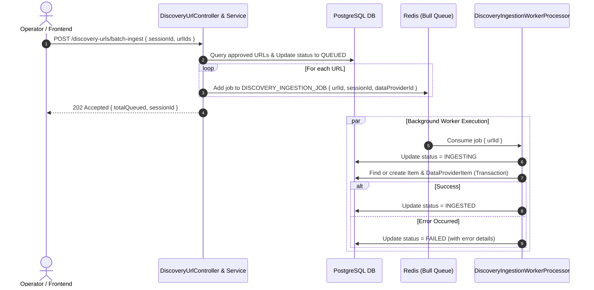

# Concept: Asynchronous Discovery URL Ingestion Worker

## 1. Problem Statement & Root Need (Bối cảnh & Vấn đề Cốt lõi)
- **Core Business Problem**: Hiện tại phương thức `batchIngest` trong `DiscoveryUrlService` đang thực thi vòng lặp đồng bộ (`synchronous blocking loop`) trực tiếp trong luồng xử lý HTTP request. Khi người dùng phê duyệt (approve) và kích hoạt nạp hàng loạt (hàng chục đến hàng trăm URLs), mỗi URL phải trải qua các bước: kiểm tra trùng lặp, tạo `ItemEntity`, tạo `DataProviderItemEntity` và kích hoạt cào dữ liệu (`scraping job`). Việc chạy đồng bộ dẫn đến nguy cơ cao bị timeout HTTP (`504 Gateway Timeout` / `Connection reset`), nghẽn tài nguyên API server, không có khả năng retry độc lập khi 1 URL bị lỗi và không thể scale đa tiến trình (multi-worker concurrency).
- **Target Audience & Core Value**: 
  - **Hệ thống Backend & Worker Cluster**: Giải phóng API thread ngay lập tức với cơ chế non-blocking, phân tải xử lý qua hàng đợi Redis Bull Queue.
  - **Quản trị viên / Người vận hành (Operator/Admin)**: Thao tác batch ingest mượt mà, phản hồi tức thì (`202 Accepted`), theo dõi được tiến độ realtime và trạng thái chi tiết của từng URL (`INGESTING`, `INGESTED`, `FAILED`).

## 2. Scope Boundaries (Ranh giới Phạm vi)
- **In-Scope**:
  - Thiết kế Queue và Worker Processor riêng cho Ingestion: `DISCOVERY_INGESTION_JOB` queue (hoặc tái sử dụng cơ chế queue hiện có trong module worker).
  - Tái cấu trúc API `batchIngest` / `ingestDiscoveryUrl` thành cơ chế bất đồng bộ (Asynchronous Job Dispatching).
  - Định nghĩa interface payload cho Ingestion Job (`IDiscoveryIngestionJob`: `urlId`, `sessionId`, `dataProviderId`, ...).
  - Triển khai `DiscoveryIngestionWorkerProcessor` với cơ chế concurrency (ví dụ: concurrency = 5), xử lý độc lập từng URL, transaction an toàn (idempotency, atomic item creation, logging).
  - Cập nhật trạng thái `DiscoveryUrlStatus` theo từng pha xử lý (`APPROVED` $\rightarrow$ `QUEUED` / `INGESTING` $\rightarrow$ `INGESTED` / `FAILED`).
- **Explicit Out-of-Scope**:
  - Không thay đổi nghiệp vụ lõi của việc cào dữ liệu bên trong `ScraperService` (giữ nguyên logic cào và mapping đã có).
  - Không thay đổi bảng dữ liệu `discovery_sessions` hay `discovery_urls` trong migration mới trừ khi cần thêm enum trạng thái nếu thiếu.
  - Chưa triển khai WebSocket realtime progress notification trong scope này (client có thể polling hoặc refetch danh sách theo cơ chế chuẩn).

## 3. Success Metrics (Thước đo Thành công / Definition of Done)
- **API Response Time**: Endpoint `batchIngest` phản hồi trong thời gian $< 200\text{ms}$ bất kể số lượng URL (10 hay 500 URLs).
- **Fault Isolation & Zero Crash**: Lỗi xảy ra tại 1 URL (ví dụ: duplicate item code, network drop) không làm gián đoạn các URLs khác trong cùng session/batch.
- **Concurrency & Throughput**: Hỗ trợ xử lý song song với concurrency cấu hình linh hoạt (mặc định 5 workers), rút ngắn thời gian hoàn tất tổng thể.
- **Data Consistency & Idempotency**: Không phát sinh duplicate `ItemEntity` hoặc `DataProviderItemEntity` khi job bị retry hoặc kích hoạt trùng lặp.

---

## 4. Proposed Solution & Core Mechanism (Phương pháp Giải quyết & Cơ chế Xử lý)

### 4.1. Explored Options & Trade-off Analysis (Các Phương án Đã Cân Nhắc)
| Option | Hướng tiếp cận | Ưu điểm (Pros) | Nhược điểm (Cons) | Độ phức tạp | Đánh giá |
| :--- | :--- | :--- | :--- | :--- | :--- |
| **Option 1: URL-Level Worker Processor (Chosen Strategy)** | Chia nhỏ batch thành từng job riêng biệt ở cấp độ URL (`url-level granularity`), dispatch vào Bull Queue. | - Concurrency cao, xử lý song song nhiều URL. - Retry độc lập từng URL lỗi mà không ảnh hưởng URL khác. - Cập nhật trạng thái chi tiết theo từng URL (`INGESTING`, `INGESTED`, `FAILED`). | Số lượng Redis keys/jobs nhiều hơn, cần đảm bảo transaction phân tán không bị lock DB. | Medium | **Khuyến nghị & Được chọn**: Phù hợp nhất với kiến trúc module `worker` hiện tại (`discovery-validation-worker`). |
| **Option 2: Batch-Level Single Job** | Push 1 Job duy nhất chứa toàn bộ mảng `urlIds` vào queue, 1 worker processor lặp xử lý tuần tự trong background. | - Đơn giản, chỉ 1 job được tạo trong queue. - Giảm overhead cho Redis scheduler. | - Không tận dụng được worker concurrency. - 1 URL bị treo/crash có thể gây trễ toàn bộ batch. - Khó resume chính xác điểm dừng nếu worker pod restart. | Low | **Loại**: Kém linh hoạt khi số lượng URL tăng cao. |
| **Option 3: Event-Driven Sagas (CQRS & Event Bus)** | Sử dụng Event Bus (EventEmitter / Kafka / RabbitMQ) bắn event `DiscoveryUrlApprovedEvent`, subscriber tự bắt và xử lý. | Phân tách rời rạc tuyệt đối (loose coupling), dễ mở rộng thêm các integration khác (analytics, webhooks). | Quá phức tạp (over-engineering) so với cấu trúc Bull Queue hiện hữu của hệ thống; khó kiểm soát backpressure và concurrency rate-limit. | High | **Loại**: Phức tạp không cần thiết cho giai đoạn hiện tại. |

- **Chosen Strategy (Phương án Được Chọn)**: **Option 1 (URL-Level Worker Processor)**. Tận dụng hạ tầng Bull Queue sẵn có trong `src/modules/queue` và `src/modules/worker/processors`, đồng bộ hóa pattern kiến trúc với `discovery-validation-worker.processor.ts`.

### 4.2. Core Processing Flow (Luồng Xử lý / Chuyển trạng thái Chính)

1. **Trigger / Dispatch Phase**:
   - Client gọi `POST /discovery-urls/batch-ingest` với `sessionId` và danh sách `urlIds` (nếu để trống, tự query các URLs có `finalValidationStatus = APPROVED`).
   - `DiscoveryUrlService` cập nhật trạng thái các URLs sang `QUEUED` và dispatch $N$ jobs vào Bull Queue `DISCOVERY_INGESTION_JOB`.
   - API trả về ngay `202 Accepted` kèm metadata `{ totalQueued, sessionId }`.
2. **Worker Execution Phase**:
   - `DiscoveryIngestionWorkerProcessor` nhận từng job (concurrency = 5).
   - Đánh dấu URL sang `INGESTING`.
   - Gọi logic tạo / tái sử dụng `ItemEntity` và `DataProviderItemEntity` (với TypeORM database transaction để đảm bảo atomic).
   - Nếu có cào dữ liệu, kích hoạt downstream job hoặc tích hợp scraper.
   - Hoàn tất: Cập nhật URL sang `INGESTED`.
3. **Failure & Retry Phase**:
   - Nếu gặp lỗi không thể phục hồi: ghi log chi tiết, cập nhật URL sang `FAILED` và ghi nhận `errorMessage`.
   - Bull retry theo cấu hình backoff (nếu cấu hình retryable errors).

### 4.3. UI / State Handling Matrix
- **Status Progression**:
  - `APPROVED`: Đã được duyệt, sẵn sàng để nạp vào cơ sở dữ liệu.
  - `QUEUED`: Đã tiếp nhận và xếp vào hàng đợi Redis.
  - `INGESTING`: Worker đang bóc tách và tạo bản ghi dữ liệu.
  - `INGESTED`: Đã nạp thành công vào hệ thống (đã liên kết `item_id` / `data_provider_item_id`).
  - `FAILED`: Gặp lỗi trong quá trình nạp dữ liệu (có lý do cụ thể).

### 4.4. Critical Edge Cases & Risk Handling (Kịch bản Biên & Xử lý Rủi ro)
- **Idempotent Ingestion**: Sử dụng unique constraint trên cặp `(data_provider_id, item_url)` hoặc transaction lock để tránh duplicate item nếu job bị trigger nhiều lần.
- **Worker Crash / Pod Restart**: Sử dụng cơ chế lock visibility timeout và active job recovery của Bull Queue để tự động requeue các job bị gián đoạn do container restart.
- **Partial Failure Resiliency**: Khi 5/100 URLs bị lỗi (ví dụ định dạng URL hỏng hoặc mất mạng nguồn), 95 URLs còn lại vẫn hoàn tất bình thường; hệ thống lưu log lỗi để admin có thể bấm "Retry Failed" sau.

---

## 5. Technical English Key Patterns
### 1. Granularity (Noun) & Granular (Adjective)
- **Meaning (VI)**: Mức độ chi tiết, độ mịn phân bổ (của tác vụ, dữ liệu hoặc quyền hạn).
- **Grammar / Usage**: `[adjective] + granularity` (e.g., *job granularity, fine-grained control, coarse-grained architecture*).
- **Engineering Example**: *"Adopting URL-level job granularity allows individual retries and concurrent processing across worker pods."*

### 2. Dispatch and Acknowledge (Idiomatic Architectural Pattern)
- **Meaning (VI)**: Tiếp nhận yêu cầu, đẩy tác vụ vào hàng đợi và phản hồi xác nhận ngay cho client (bất đồng bộ / non-blocking).
- **Grammar / Usage**: `dispatch [task] and acknowledge with [HTTP status]`
- **Engineering Example**: *"The API endpoint dispatches ingestion tasks to the message queue and immediately acknowledges with a 202 Accepted status."*

### 3. Fault Isolation (Noun Phrase)
- **Meaning (VI)**: Cơ chế cách ly sự cố (lỗi tại một phân vùng/item không lan rộng ra toàn bộ hệ thống).
- **Grammar / Usage**: `ensure / achieve + fault isolation`
- **Engineering Example**: *"Processing each URL in an isolated worker job guarantees fault isolation, preventing a single malformed payload from aborting the entire batch."*

### 4. Idempotency Guard (Noun Phrase)
- **Meaning (VI)**: Cơ chế phòng vệ tính bất biến / chống trùng lặp dữ liệu khi thực thi nhiều lần.
- **Grammar / Usage**: `implement / enforce + idempotency guards`
- **Engineering Example**: *"We enforce idempotency guards via unique database constraints to prevent duplicate item creation upon job retries."*
