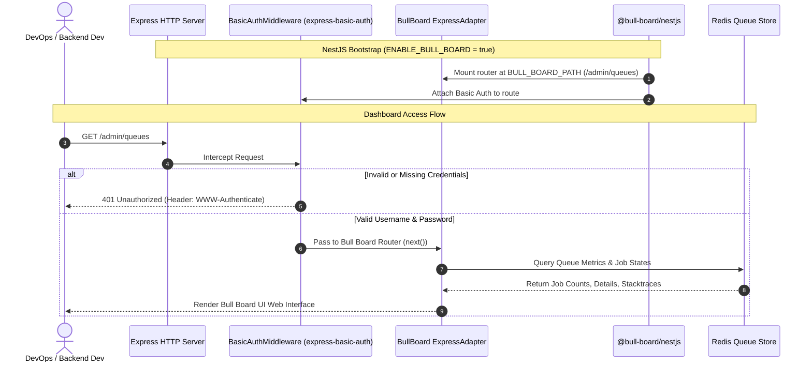

# Plan: Tích hợp Bull Board Dashboard Quản lý Background Jobs cho Only-One Backend

## Section 1. Current State (Hiện trạng & Phân tích Mã nguồn)

### 1.1. Hiện trạng triển khai Background Queue trong `only-one-be`
Hệ thống `only-one-be` hiện tại sử dụng `@nestjs/bull` và `bull` để điều phối các tác vụ ngầm (background jobs):
- [AppModule](file:///d:/Sources/Personal/only-one-be/src/app.module.ts#L49-L60) khởi tạo `BullModule.forRootAsync` kết nối tới Redis instance.
- [QueueModule](file:///d:/Sources/Personal/only-one-be/src/modules/queue/queue.module.ts#L13-L23) đăng ký các queue thông qua enum `QUEUE_NAME`:
  - `QUEUE_NAME.SCRAPING_JOB` (`scraping-job`)
  - `QUEUE_NAME.DISCOVERY_VALIDATION_JOB` (`discovery-validation-job`)
  - `QUEUE_NAME.DISCOVERY_INGESTION_JOB` (`discovery-ingestion-job`)
- [WorkerModule](file:///d:/Sources/Personal/only-one-be/src/modules/worker/worker.module.ts#L15-L37) xử lý các job thông qua các Processors tương ứng (`ScrapingWorkerProcessor`, `DiscoveryValidationWorkerProcessor`, `DiscoveryIngestionWorkerProcessor`).

### 1.2. Giới hạn kỹ thuật & Điểm nghẽn
1. **Thiếu trực quan hóa (Observability)**: Kỹ sư backend và DevOps không có giao diện realtime để quan sát số lượng job đang chờ (`waiting`), đang chạy (`active`), bị lỗi (`failed`), hoặc bị trễ (`delayed`).
2. **Chi phí gỡ lỗi (Debugging Overhead)**: Khi một job bị hỏng (failed), việc trích xuất error message và stacktrace phải qua log file hoặc query Redis thô.
3. **Thao tác thủ công nguy hiểm**: Không có nút bấm nhanh để retry failed jobs hoặc purge queue trong quá trình dev/staging.

### 1.3. Danh sách hành vi bắt buộc giữ nguyên (Invariants)
- **[INVARIANT-1] Zero Regressions on Existing Queues**: Không làm ảnh hưởng hoặc gián đoạn đến việc đăng ký, push job và xử lý job của [QueueModule](file:///d:/Sources/Personal/only-one-be/src/modules/queue/queue.module.ts) và [WorkerModule](file:///d:/Sources/Personal/only-one-be/src/modules/worker/worker.module.ts).
- **[INVARIANT-2] Zero Footprint when Disabled**: Khi `ENABLE_BULL_BOARD=false` hoặc không được bật, không có route nào được mount vào Express server và không tiêu tốn tài nguyên kết nối.
- **[INVARIANT-3] Secure by Default**: Mọi truy cập vào Bull Board endpoint bắt buộc phải đi qua lớp bảo vệ HTTP Basic Auth, chặn đứng mọi truy cập trái phép với `401 Unauthorized`.

---

## Section 2. Detailed Design (Thiết kế Kỹ thuật Chi tiết)

### 2.1. Kiến trúc Module & Ranh giới Trách nhiệm (Deep Module Design)
Theo quy chuẩn thiết kế deep module và tái sử dụng pattern từ `WorkerModule.register()`:
1. **Thư mục Module**: Đặt tại `src/modules/bull-board/`.
2. **Dependencies bổ sung vào `package.json`**:
   - `@bull-board/api`: Core adapter logic và job serializers.
   - `@bull-board/express`: Express router adapter gắn UI vào NestJS HTTP server.
   - `@bull-board/nestjs`: NestJS dynamic module integration cho Bull Board.
   - `express-basic-auth`: Middleware bảo vệ route bằng HTTP Basic Authentication.
3. **Quản lý cấu hình (`AppConfigService`)**:
   - Mở rộng [app-config.interface.ts](file:///d:/Sources/Personal/only-one-be/src/shared/interfaces/app-config.interface.ts) với `IBullBoardConfig`.
   - Bổ sung getter `bullBoardConfig` vào [AppConfigService](file:///d:/Sources/Personal/only-one-be/src/shared/services/app-config.service.ts) đọc các biến:
     - `ENABLE_BULL_BOARD` (boolean, default: `false`)
     - `BULL_BOARD_PATH` (string, default: `/admin/queues`)
     - `BULL_BOARD_USERNAME` (string, default: `admin`)
     - `BULL_BOARD_PASSWORD` (string, default: `admin`)
4. **Cơ chế Tự động hóa Đăng ký (Auto-Queue Mapping)**:
   - Thay vì hardcode từng queue, `BullBoardAppModule.register()` tự động duyệt qua `Object.values(QUEUE_NAME)` và đăng ký `BullBoardModule.forFeature({ name, adapter: BullAdapter })` cho toàn bộ các queue hiện có trong hệ thống.
   - Khi thêm queue mới vào `QUEUE_NAME`, Bull Board tự động nhận diện mà không cần chỉnh sửa module dashboard.

### 2.2. Sơ đồ Tương tác & Kiến trúc Luồng Dữ liệu


### 2.3. Phản biện Red-Team (`doubt-driven-development`)
- **`CLAIM`**: Có nên dùng NestJS Guard thay vì Express middleware `express-basic-auth` không?
- **`DOUBT`**: Bull Board là một SPA đóng gói sẵn (static HTML/JS/CSS assets và internal API sub-routes). Nếu dùng NestJS Guard, các sub-route tĩnh (`/admin/queues/static/...`, `/admin/queues/api/...`) rất dễ bị lỗi guard bypass hoặc lỗi 403 do context execution của Express adapter nằm ngoài controller context thông thường.
- **`RECONCILE`**: Sử dụng `express-basic-auth` gắn trực tiếp vào adapter middleware của Bull Board (giống như reference code đã hoạt động ổn định trong `orien-trade-backend`) là phương án cô lập, an toàn và tin cậy nhất.

---

## Section 3. Implementation Architecture & Machine-Readable Task Matrix

### 3.1 Machine-Readable Task Matrix & Dependency Graph

| Order | Status | Action | File Path | Target Symbols / AST Seams | Reused Existing Utilities / Helpers | Depends On | Fast Test Command |
| :---: | :---: | :---: | :--- | :--- | :--- | :--- | :--- |
| **1** | `[x]` | `[MODIFY]` | `package.json` | `dependencies` | `None` | `None` | `npm run lint` |
| **2** | `[x]` | `[MODIFY]` | `src/shared/interfaces/app-config.interface.ts` | `IBullBoardConfig` | `None` | `Order 1` | `npm run lint` |
| **3** | `[x]` | `[MODIFY]` | `src/shared/services/app-config.service.ts` | `AppConfigService.bullBoardConfig` | `AppConfigService.get`, `AppConfigService.getBoolean` | `Order 2` | `npm run lint` |
| **4** | `[x]` | `[NEW]` | `src/modules/bull-board/create-basic-auth-middleware.ts` | `createBasicAuthMiddleware` | `express-basic-auth` | `Order 1` | `npm run lint` |
| **5** | `[x]` | `[NEW]` | `src/modules/bull-board/bull-board.module.ts` | `BullBoardAppModule.register` | `AppConfigService`, `QUEUE_NAME`, `SharedModule` | `Order 3, 4` | `npm run lint` |
| **6** | `[x]` | `[MODIFY]` | `src/app.module.ts` | `AppModule.imports` | `BullBoardAppModule.register` | `Order 5` | `npm run lint` |
| **7** | `[x]` | `[MODIFY]` | `.env.sample` | `Bull Board Environment Variables` | `None` | `Order 6` | `npm run lint` |

### 3.2 Scaffold Directory Tree
```text
only-one-be/
├── src/
│   ├── modules/
│   │   └── bull-board/
│   │       ├── bull-board.module.ts              # [NEW] Dynamic module registering Bull Board
│   │       └── create-basic-auth-middleware.ts   # [NEW] Basic Auth Express middleware factory
│   ├── shared/
│   │   ├── interfaces/
│   │   │   └── app-config.interface.ts           # [MODIFY] Add IBullBoardConfig
│   │   └── services/
│   │       └── app-config.service.ts             # [MODIFY] Add bullBoardConfig getter
│   └── app.module.ts                             # [MODIFY] Import BullBoardAppModule.register()
├── .env.sample                                   # [MODIFY] Add Bull Board config samples
└── package.json                                  # [MODIFY] Add @bull-board packages & express-basic-auth
```

---

## Section 4. Implementation Code Examples (Mẫu Code Triển khai)

### 4.1. [MODIFY] `package.json` (Order 1, Depends On: None)
**Reused Abstractions**: `@nestjs/bull`, `bull`  
**Mục đích**: Bổ sung các thư viện chính thức của Bull Board và HTTP Basic Auth.
```json
// [TARGET SEAM]: dependencies section
"dependencies": {
    "@bull-board/api": "^6.9.6",
    "@bull-board/express": "^6.9.6",
    "@bull-board/nestjs": "^6.9.6",
    "express-basic-auth": "^1.2.1",
    // [RATIONALE]: Ensure compatibility with Express 5 and NestJS 11 in only-one-be
```

---

### 4.2. [MODIFY] `src/shared/interfaces/app-config.interface.ts` (Order 2, Depends On: Order 1)
**Reused Abstractions**: Không có  
**Mục đích**: Định nghĩa kiểu dữ liệu `IBullBoardConfig` cho cấu hình bảng điều khiển.
```typescript
// [TARGET SEAM]: Add IBullBoardConfig interface
export interface IBullBoardConfig {
    enabled: boolean;
    path: string;
    username: string;
    password: string;
}
```

---

### 4.3. [MODIFY] `src/shared/services/app-config.service.ts` (Order 3, Depends On: Order 2)
**Reused Abstractions**: `this.get()`, `this.getBoolean()`, `IBullBoardConfig`  
**Mục đích**: Cung cấp getter `bullBoardConfig` trích xuất thông tin cấu hình từ biến môi trường.
```typescript
// [TARGET SEAM]: Inside AppConfigService class
get bullBoardConfig(): IBullBoardConfig {
    return {
        enabled: this.getBoolean('ENABLE_BULL_BOARD') || false,
        path: this.get('BULL_BOARD_PATH') || '/admin/queues',
        username: this.get('BULL_BOARD_USERNAME') || 'admin',
        password: this.get('BULL_BOARD_PASSWORD') || 'admin',
    };
}
```

---

### 4.4. [NEW] `src/modules/bull-board/create-basic-auth-middleware.ts` (Order 4, Depends On: Order 1)
**Reused Abstractions**: `express-basic-auth`  
**Mục đích**: Khởi tạo middleware xác thực Basic Auth độc lập cho Bull Board route.
```typescript
// [TARGET SEAM]: src/modules/bull-board/create-basic-auth-middleware.ts
import basicAuth from 'express-basic-auth';

/**
 * Creates a basic authentication middleware for Bull Board
 * @param username Admin username
 * @param password Admin password
 * @returns Express middleware for basic authentication
 */
export function createBasicAuthMiddleware(username: string, password: string): any {
    const users: Record<string, string> = {};
    users[username] = password;

    return basicAuth({
        users,
        challenge: true,
        realm: 'Bull Board',
    });
}
```

---

### 4.5. [NEW] `src/modules/bull-board/bull-board.module.ts` (Order 5, Depends On: Order 3, 4)
**Reused Abstractions**: `BullAdapter`, `ExpressAdapter`, `BullBoardModule`, `BullModule`, `QUEUE_NAME`, `AppConfigService`, `SharedModule`  
**Mục đích**: Đăng ký Dynamic Module tự động ánh xạ toàn bộ queues trong `QUEUE_NAME` và áp dụng cấu hình Basic Auth.
```typescript
// [TARGET SEAM]: src/modules/bull-board/bull-board.module.ts
import { BullAdapter } from '@bull-board/api/bullAdapter';
import { ExpressAdapter } from '@bull-board/express';
import { BullBoardModule } from '@bull-board/nestjs';
import { BullModule } from '@nestjs/bull';
import { DynamicModule, Module } from '@nestjs/common';
import { ConfigModule, ConfigService } from '@nestjs/config';

import { AppConfigService } from '../../shared/services/app-config.service';
import { SharedModule } from '../../shared/shared.module';
import { QUEUE_NAME } from '../queue/enums/queue-name.enum';
import { createBasicAuthMiddleware } from './create-basic-auth-middleware';

@Module({})
export class BullBoardAppModule {
    static register(): DynamicModule {
        const appConfigService = new AppConfigService();
        const enabled = appConfigService.getBoolean('ENABLE_BULL_BOARD');

        if (!enabled) {
            return {
                module: BullBoardAppModule,
                imports: [],
                providers: [],
                exports: [],
            };
        }

        const queueValues = Object.values(QUEUE_NAME);
        const queueImports = queueValues.map((name) => BullModule.registerQueue({ name }));
        const bullBoardFeatureImports = queueValues.map((name) =>
            BullBoardModule.forFeature({
                name,
                adapter: BullAdapter,
            }),
        );

        return {
            module: BullBoardAppModule,
            imports: [
                SharedModule,
                ...queueImports,
                BullBoardModule.forRootAsync({
                    imports: [SharedModule, ConfigModule],
                    useFactory: (config: AppConfigService, _configService: ConfigService) => {
                        const boardConfig = config.bullBoardConfig;
                        return {
                            route: boardConfig.path,
                            adapter: ExpressAdapter,
                            middleware: createBasicAuthMiddleware(boardConfig.username, boardConfig.password),
                        };
                    },
                    inject: [AppConfigService, ConfigService],
                }),
                ...bullBoardFeatureImports,
            ],
            providers: [],
            exports: [],
        };
    }
}
```

---

### 4.6. [MODIFY] `src/app.module.ts` (Order 6, Depends On: Order 5)
**Reused Abstractions**: `BullBoardAppModule.register()`  
**Mục đích**: Nhúng `BullBoardAppModule.register()` vào root module.
```typescript
// [TARGET SEAM]: imports section of AppModule
import { BullBoardAppModule } from './modules/bull-board/bull-board.module';

@Module({
    imports: [
        // ... existing imports
        QueueModule,
        ScheduleExecutorModule,
        WorkerModule.register(),
        BullBoardAppModule.register(), // [RATIONALE]: Dynamically mounts Bull Board when enabled
        NotificationModule,
        // ...
    ]
})
```

---

### 4.7. [MODIFY] `.env.sample` (Order 7, Depends On: Order 6)
**Reused Abstractions**: Không có  
**Mục đích**: Cung cấp mẫu cấu hình biến môi trường cho các nhà phát triển.
```env
# [TARGET SEAM]: End of .env.sample
# Bull Board Configuration
ENABLE_BULL_BOARD=true
BULL_BOARD_PATH=/admin/queues
BULL_BOARD_USERNAME=admin
BULL_BOARD_PASSWORD=admin
```

---

## Section 5. Test Cases (Kịch bản Kiểm thử & Nghiệm thu)

### Scenario 1: Unauthorized Access Blocked (HTTP 401)
- **Objective**: Xác thực cơ chế bảo vệ HTTP Basic Auth.
- **Precondition**: `ENABLE_BULL_BOARD=true`, server đang chạy.
- **Action**: Gửi request `GET /admin/queues` không kèm header hoặc kèm credential sai (`admin:wrongpassword`).
- **Expected Result**: Server trả về `401 Unauthorized` và header `WWW-Authenticate: Basic realm="Bull Board"`.

### Scenario 2: Successful Dashboard Access (HTTP 200)
- **Objective**: Xác thực hiển thị giao diện khi đăng nhập đúng.
- **Precondition**: `ENABLE_BULL_BOARD=true`, server đang chạy.
- **Action**: Gửi request `GET /admin/queues` kèm header `Authorization: Basic YWRtaW46YWRtaW4=` (`admin:admin`).
- **Expected Result**: Server trả về `200 OK` kèm nội dung HTML chứa giao diện Bull Board Dashboard.

### Scenario 3: Auto-Discovery of Registered Queues
- **Objective**: Xác thực toàn bộ queues trong `QUEUE_NAME` xuất hiện trên giao diện.
- **Precondition**: Server khởi động thành công với Bull Board được bật.
- **Action**: Mở giao diện và kiểm tra danh sách tab hàng đợi.
- **Expected Result**: Xuất hiện đầy đủ 3 queues: `scraping-job`, `discovery-validation-job`, `discovery-ingestion-job`.

### Scenario 4: Feature Toggle Inactive (Zero Footprint)
- **Objective**: Xác thực tắt hoàn toàn Bull Board khi flag `ENABLE_BULL_BOARD=false`.
- **Precondition**: Cấu hình `ENABLE_BULL_BOARD=false`.
- **Action**: Gửi request `GET /admin/queues`.
- **Expected Result**: Server trả về `404 Not Found`, không mount middleware hay queue listeners phụ.

### Lệnh kiểm tra chất lượng mã nguồn:
```bash
npm run lint
```

---

## Section 6. Technical English Key Patterns

### 1. Inversion of Control & Dynamic Module Resolution
- **Meaning (VI)**: Cơ chế đảo ngược điều khiển và phân giải module động dựa trên cấu hình runtime.
- **Grammar / Usage**: `[Concept] + enables the application to conditionally mount routes and bindings without code duplication`
- **Engineering Example**: *"Leveraging **dynamic module resolution** enables the application to conditionally mount Bull Board routes only when explicitly toggled on."*

### 2. Guard against regression
- **Meaning (VI)**: Bảo vệ hệ thống chống suy thoái hành vi sẵn có.
- **Grammar / Usage**: `to guard against + [Noun/Gerund]`
- **Engineering Example**: *"The implementation preserves all existing queue definitions to **guard against regressions** in the worker execution pipeline."*

### 3. Graceful degradation / Zero-overhead fallback
- **Meaning (VI)**: Cơ chế suy giảm mềm / chạy không tiêu tốn tài nguyên khi tắt tính năng.
- **Grammar / Usage**: `[Subject] provides a zero-overhead fallback by returning an empty dynamic module`
- **Engineering Example**: *"When the feature flag is disabled, the module provides a **zero-overhead fallback** by returning an empty module metadata descriptor."*
