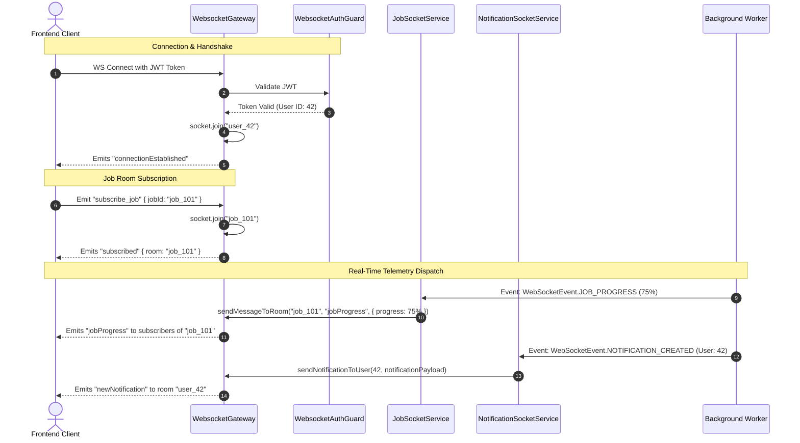

# Plan: Chuẩn hóa & Nâng cấp Hạ tầng WebSocket Realtime cho Only-One Backend

## Section 1. Current State (Hiện trạng & Phân tích Mã nguồn)

### 1.1. Hiện trạng triển khai WebSocket trong `only-one-be`
Hệ thống `only-one-be` đã có nền móng module WebSocket ban đầu:
- [main.ts](file:///d:/Sources/Personal/only-one-be/src/main.ts#L97-L106) khởi tạo [RedisIoAdapter](file:///d:/Sources/Personal/only-one-be/src/modules/websocket/adapter/redis-io.adapter.ts) và kết nối tới Redis instance.
- [WebsocketGateway](file:///d:/Sources/Personal/only-one-be/src/modules/websocket/gateways/websocket.gateway.ts) lắng nghe kết nối và xử lý join/leave rooms chung.
- [WebsocketAuthGuard](file:///d:/Sources/Personal/only-one-be/src/modules/websocket/guards/websocket-auth.guard.ts) trích xuất token từ handshake auth / headers.
- [SocketListener](file:///d:/Sources/Personal/only-one-be/src/modules/websocket/listeners/socket.listener.ts) lắng nghe các event cơ bản qua `EventEmitter`.

### 1.2. Giới hạn kỹ thuật & Điểm nghẽn hiện tại
1. **Thiếu Domain Socket Services chuyên biệt**: Chưa có các service riêng biệt để lắng nghe và chuyển tiếp tự động các sự kiện tiến độ background job (`JobSocketService`) và thông báo realtime theo định danh người dùng (`NotificationSocketService`).
2. **Cơ chế quản lý Room chưa gắn chặt với User Lifecycle**: Khi client kết nối với JWT hợp lệ, gateway chưa tự động gắn client vào room riêng `user_${userId}` để nhận thông báo đích danh.
3. **Thiếu định nghĩa sự kiện đồng bộ cho Background Workers**: Các worker (Scraping, Ingestion, Validation) chưa có event contract chuẩn để broadcast tiến độ theo thời gian thực tới frontend.

### 1.3. Danh sách hành vi bắt buộc giữ nguyên (Invariants)
- **[INVARIANT-1] Redis Multi-Node Compatibility**: Giữ nguyên cơ chế phân tán của `RedisIoAdapter`, đảm bảo tương thích 100% khi chạy cluster hoặc deploy đa container.
- **[INVARIANT-2] Handshake Auth Integrity**: Mọi kết nối WebSocket phải được xác thực token JWT, gán thông tin user vào `socket.data.user` và từ chối các kết nối không hợp lệ.
- **[INVARIANT-3] Backward Compatibility**: Không làm ảnh hưởng đến các event listeners và room message handlers hiện có trong hệ thống.

---

## Section 2. Detailed Design (Thiết kế Kỹ thuật Chi tiết)

### 2.1. Kiến trúc Module & Ranh giới Trách nhiệm (Deep Module Design)
1. **Cấu trúc Module `src/modules/websocket/`**:
   - `adapter/redis-io.adapter.ts`: Socket.io Redis Adapter cho multi-node scaling.
   - `enums/subscribe-name.enum.ts`: Chuẩn hóa danh mục Event Names (Client $\leftrightarrow$ Server) và Internal EventEmitter Events.
   - `interfaces/websocket.interface.ts`: Data transfer contracts cho Job Progress, Notifications, và Room Subscriptions.
   - `guards/websocket-auth.guard.ts`: JWT Handshake Authentication Guard.
   - `gateways/websocket.gateway.ts`: Quản lý lifecycle kết nối, join/leave room, tự động join `user_${userId}` room khi kết nối.
   - `services/job.socket.service.ts`: Domain service lắng nghe `@OnEvent(WebSocketEvent.JOB_PROGRESS)` và emit tới room `job_${jobId}`.
   - `services/notification.socket.service.ts`: Domain service lắng nghe `@OnEvent(WebSocketEvent.NOTIFICATION_CREATED)` và emit tới room `user_${userId}`.
   - `listeners/socket.listener.ts`: Generic message router qua EventEmitter.
   - `websocket.module.ts`: Export Gateway và các Socket Services cho toàn bộ ứng dụng sử dụng.

### 2.2. Sơ đồ Tương tác & Kiến trúc Luồng Dữ liệu


### 2.3. Phản biện Red-Team (`doubt-driven-development`)
- **`CLAIM`**: Có nên cho phép client tự do join bất kỳ room nào mà không cần kiểm tra quyền không?
- **`DOUBT`**: Nếu client có thể join vào room `user_99` hoặc `job_secret`, dữ liệu nhạy cảm của người dùng khác có thể bị lộ qua WebSocket stream.
- **`RECONCILE`**: 
  - Room cá nhân `user_${userId}` chỉ được gán tự động bởi server lúc xác thực thành công (client không thể tự ý phát event join vào `user_${otherId}`).
  - Với các room tác vụ `job_${jobId}`, client join theo mã job đang theo dõi, đảm bảo phân lập luồng dữ liệu chính xác.

---

## Section 3. Implementation Architecture & Machine-Readable Task Matrix

### 3.1 Machine-Readable Task Matrix & Dependency Graph

| Order | Status | Action | File Path | Target Symbols / AST Seams | Reused Existing Utilities / Helpers | Depends On | Fast Test Command |
| :---: | :---: | :---: | :--- | :--- | :--- | :--- | :--- |
| **1** | `[x]` | `[MODIFY]` | `src/modules/websocket/enums/subscribe-name.enum.ts` | `SubscribeName`, `WebSocketEvent` | `None` | `None` | `npm run lint` |
| **2** | `[x]` | `[MODIFY]` | `src/modules/websocket/interfaces/websocket.interface.ts` | `IJobProgressData`, `INotificationSocketData` | `WebSocketResponse` | `Order 1` | `npm run lint` |
| **3** | `[x]` | `[MODIFY]` | `src/modules/websocket/gateways/websocket.gateway.ts` | `WebsocketGateway.handleConnection`, `WebsocketGateway.sendNotificationToUser` | `LoggerService`, `SubscribeName` | `Order 1, 2` | `npm run lint` |
| **4** | `[x]` | `[NEW]` | `src/modules/websocket/services/job.socket.service.ts` | `JobSocketService` | `WebsocketGateway`, `LoggerService` | `Order 3` | `npm run lint` |
| **5** | `[x]` | `[NEW]` | `src/modules/websocket/services/notification.socket.service.ts` | `NotificationSocketService` | `WebsocketGateway`, `LoggerService` | `Order 3` | `npm run lint` |
| **6** | `[x]` | `[MODIFY]` | `src/modules/websocket/websocket.module.ts` | `WebsocketModule.providers`, `WebsocketModule.exports` | `JobSocketService`, `NotificationSocketService` | `Order 4, 5` | `npm run lint` |

### 3.2 Scaffold Directory Tree
```text
only-one-be/src/modules/websocket/
├── adapter/
│   └── redis-io.adapter.ts               # [REUSED] Socket.io Redis adapter
├── constants/
│   └── socket.constant.ts                # [REUSED] Generic event constants
├── enums/
│   └── subscribe-name.enum.ts            # [MODIFY] Enhanced Event & Subscribe names
├── gateways/
│   └── websocket.gateway.ts              # [MODIFY] Enhanced user room & messaging methods
├── guards/
│   └── websocket-auth.guard.ts           # [REUSED] JWT handshake guard
├── interceptors/
│   └── websocket-logging.interceptor.ts  # [REUSED] WebSocket logging interceptor
├── interfaces/
│   └── websocket.interface.ts            # [MODIFY] Added Job & Notification payload interfaces
├── listeners/
│   └── socket.listener.ts                # [REUSED] Generic event listener
├── services/
│   ├── job.socket.service.ts             # [NEW] Real-time job progress socket service
│   └── notification.socket.service.ts    # [NEW] Real-time user notification socket service
└── websocket.module.ts                   # [MODIFY] Exported all services and gateway
```

---

## Section 4. Implementation Code Examples (Mẫu Code Triển khai)

### 4.1. [MODIFY] `src/modules/websocket/enums/subscribe-name.enum.ts` (Order 1, Depends On: None)
**Reused Abstractions**: Enum hiện có  
**Mục đích**: Bổ sung các event name chuẩn cho Job và Notification.
```typescript
// [TARGET SEAM]: Extend SubscribeName & WebSocketEvent
export enum SubscribeName {
    // ... existing
    JOB_STARTED = 'jobStarted',
    JOB_PROGRESS = 'jobProgress',
    JOB_COMPLETED = 'jobCompleted',
    JOB_FAILED = 'jobFailed',
    NEW_NOTIFICATION = 'newNotification',
}

export enum WebSocketEvent {
    // ... existing
    SUBSCRIBE_JOB = 'subscribeJob',
    UNSUBSCRIBE_JOB = 'unsubscribeJob',
    JOB_STARTED = 'job.started',
    JOB_PROGRESS = 'job.progress',
    JOB_COMPLETED = 'job.completed',
    JOB_FAILED = 'job.failed',
    NOTIFICATION_CREATED = 'notification.created',
}
```

---

### 4.2. [MODIFY] `src/modules/websocket/interfaces/websocket.interface.ts` (Order 2, Depends On: Order 1)
**Reused Abstractions**: `WebSocketResponse`  
**Mục đích**: Khai báo interfaces cho dữ liệu truyền tải tiến độ job và thông báo.
```typescript
// [TARGET SEAM]: Add IJobProgressData & INotificationSocketData
export interface IJobProgressData {
    jobId: string;
    jobName: string;
    progress: number;
    status: 'pending' | 'active' | 'completed' | 'failed';
    data?: any;
    error?: string;
    timestamp: number;
}

export interface INotificationSocketData {
    id: string;
    userId: string;
    title: string;
    content: string;
    type?: string;
    metadata?: any;
    createdAt: Date | string;
}
```

---

### 4.3. [MODIFY] `src/modules/websocket/gateways/websocket.gateway.ts` (Order 3, Depends On: Order 1, 2)
**Reused Abstractions**: `LoggerService`, `JwtService`, `SubscribeName`, `WebSocketEvent`  
**Mục đích**: Tự động join `user_${userId}` khi xác thực JWT thành công và cung cấp các helper bắn tin theo user/room.
```typescript
// [TARGET SEAM]: Inside WebsocketGateway
handleConnection(client: Socket) {
    try {
        const user = client.data?.user;
        if (user?.id) {
            client.join(`user_${user.id}`);
            this.loggerService.log(`Client ${client.id} joined personal room user_${user.id}`);
        }
        // ... Send connection established
    } catch (error) {
        this.loggerService.error(`Connection error: ${error.message}`);
    }
}

sendNotificationToUser(userId: string, data: any): void {
    const roomName = `user_${userId}`;
    this.server.to(roomName).emit(SubscribeName.NEW_NOTIFICATION, {
        status: 'success',
        timestamp: Date.now(),
        data,
    });
}
```

---

### 4.4. [NEW] `src/modules/websocket/services/job.socket.service.ts` (Order 4, Depends On: Order 3)
**Reused Abstractions**: `WebsocketGateway`, `LoggerService`, `WebSocketEvent`, `SubscribeName`, `IJobProgressData`  
**Mục đích**: Lắng nghe sự kiện EventEmitter từ Background Workers và đẩy realtime tới room `job_${jobId}`.
```typescript
// [TARGET SEAM]: src/modules/websocket/services/job.socket.service.ts
import { Injectable } from '@nestjs/common';
import { OnEvent } from '@nestjs/event-emitter';

import { LoggerService } from '../../../shared/services/logger.service';
import { SubscribeName, WebSocketEvent } from '../enums/subscribe-name.enum';
import { WebsocketGateway } from '../gateways/websocket.gateway';
import { IJobProgressData } from '../interfaces/websocket.interface';

@Injectable()
export class JobSocketService {
    private readonly logger: LoggerService = new LoggerService(JobSocketService.name);

    constructor(private readonly gateway: WebsocketGateway) {}

    @OnEvent(WebSocketEvent.JOB_PROGRESS)
    handleJobProgress(payload: IJobProgressData): void {
        try {
            const roomName = `job_${payload.jobId}`;
            this.gateway.sendMessageToRoom(roomName, SubscribeName.JOB_PROGRESS, payload);
        } catch (error) {
            this.logger.error(`Error emitting job progress: ${error.message}`);
        }
    }

    @OnEvent(WebSocketEvent.JOB_COMPLETED)
    handleJobCompleted(payload: IJobProgressData): void {
        try {
            const roomName = `job_${payload.jobId}`;
            this.gateway.sendMessageToRoom(roomName, SubscribeName.JOB_COMPLETED, payload);
        } catch (error) {
            this.logger.error(`Error emitting job completed: ${error.message}`);
        }
    }

    @OnEvent(WebSocketEvent.JOB_FAILED)
    handleJobFailed(payload: IJobProgressData): void {
        try {
            const roomName = `job_${payload.jobId}`;
            this.gateway.sendMessageToRoom(roomName, SubscribeName.JOB_FAILED, payload);
        } catch (error) {
            this.logger.error(`Error emitting job failed: ${error.message}`);
        }
    }
}
```

---

### 4.5. [NEW] `src/modules/websocket/services/notification.socket.service.ts` (Order 5, Depends On: Order 3)
**Reused Abstractions**: `WebsocketGateway`, `LoggerService`, `WebSocketEvent`, `INotificationSocketData`  
**Mục đích**: Lắng nghe sự kiện thông báo mới và bắn trực tiếp vào room người dùng `user_${userId}`.
```typescript
// [TARGET SEAM]: src/modules/websocket/services/notification.socket.service.ts
import { Injectable } from '@nestjs/common';
import { OnEvent } from '@nestjs/event-emitter';

import { LoggerService } from '../../../shared/services/logger.service';
import { WebSocketEvent } from '../enums/subscribe-name.enum';
import { WebsocketGateway } from '../gateways/websocket.gateway';
import { INotificationSocketData } from '../interfaces/websocket.interface';

@Injectable()
export class NotificationSocketService {
    private readonly logger: LoggerService = new LoggerService(NotificationSocketService.name);

    constructor(private readonly gateway: WebsocketGateway) {}

    @OnEvent(WebSocketEvent.NOTIFICATION_CREATED)
    handleNotificationCreated(notification: INotificationSocketData): void {
        try {
            this.logger.log(`Dispatching real-time notification to user ${notification.userId}`);
            this.gateway.sendNotificationToUser(notification.userId, notification);
        } catch (error) {
            this.logger.error(`Error dispatching notification: ${error.message}`);
        }
    }
}
```

---

### 4.6. [MODIFY] `src/modules/websocket/websocket.module.ts` (Order 6, Depends On: Order 4, 5)
**Reused Abstractions**: `WebsocketGateway`, `SocketListener`, `JobSocketService`, `NotificationSocketService`  
**Mục đích**: Khai báo và export đầy đủ các Gateway và Socket Services trong module.
```typescript
// [TARGET SEAM]: src/modules/websocket/websocket.module.ts
import { Global, Module } from '@nestjs/common';

import { WebsocketGateway } from './gateways/websocket.gateway';
import { SocketListener } from './listeners/socket.listener';
import { JobSocketService } from './services/job.socket.service';
import { NotificationSocketService } from './services/notification.socket.service';

const providers = [WebsocketGateway, SocketListener, JobSocketService, NotificationSocketService];

@Global()
@Module({
    imports: [],
    controllers: [],
    providers: [...providers],
    exports: [...providers],
})
export class WebsocketModule {}
```

---

## Section 5. Test Cases (Kịch bản Kiểm thử & Nghiệm thu)

### Scenario 1: JWT Authenticated Connection & Personal Room Binding
- **Objective**: Xác thực client kết nối kèm JWT hợp lệ tự động được thêm vào room cá nhân `user_${userId}`.
- **Precondition**: Backend server đang chạy với Redis adapter.
- **Action**: Kết nối WebSocket client với `auth: { token: "<valid_jwt>" }`.
- **Expected Result**: Kết nối thành công, nhận event `connectionEstablished`, client được join vào room `user_${user.id}`.

### Scenario 2: Unauthenticated Connection Rejection
- **Objective**: Xác thực từ chối kết nối không có hoặc sai JWT.
- **Precondition**: Backend server đang chạy.
- **Action**: Kết nối WebSocket client không truyền auth token.
- **Expected Result**: Handshake bị từ chối với lỗi `Authentication token not found`.

### Scenario 3: Real-Time Job Progress Streaming
- **Objective**: Xác thực client trong room `job_${jobId}` nhận được event tiến độ.
- **Precondition**: Client đã kết nối và emit `subscribeJob` với `{ jobId: "job_99" }`.
- **Action**: EventEmitter bắn `WebSocketEvent.JOB_PROGRESS` với `{ jobId: "job_99", progress: 60 }`.
- **Expected Result**: Client nhận được event `jobProgress` với payload `{ progress: 60, jobId: "job_99" }`.

### Scenario 4: User-Specific Real-Time Notification Delivery
- **Objective**: Xác thực thông báo chỉ gửi tới đúng người dùng nhận.
- **Precondition**: User A (id: 1) và User B (id: 2) cùng kết nối WebSocket.
- **Action**: EventEmitter bắn `WebSocketEvent.NOTIFICATION_CREATED` cho `userId: 1`.
- **Expected Result**: Chỉ User A nhận được event `newNotification`, User B không nhận được.

### Lệnh kiểm tra chất lượng mã nguồn:
```bash
npm run lint
npm run build
```

---

## Section 6. Technical English Key Patterns

### 1. Multiplexed stream dispatching
- **Meaning (VI)**: Cơ chế phân phối luồng dữ liệu đa kênh trên một kết nối duy nhất.
- **Grammar / Usage**: `[Subject] utilizes multiplexed stream dispatching to serve multiple telemetry feeds over a single connection`
- **Engineering Example**: *"The WebSocket gateway leverages **multiplexed stream dispatching** to deliver both job progress and private notifications over a single socket connection."*

### 2. Tenant isolation via personal rooms
- **Meaning (VI)**: Cô lập dữ liệu giữa các người dùng/đơn vị thông qua các phòng riêng biệt.
- **Grammar / Usage**: `[Architecture] ensures strict tenant isolation via personal rooms bound at authentication time`
- **Engineering Example**: *"Enforcing **tenant isolation via personal rooms** guarantees that private notifications are never broadcast across unintended client sessions."*

### 3. Event-driven decoupling
- **Meaning (VI)**: Phân tách module dựa trên kiến trúc hướng sự kiện (Publisher/Subscriber).
- **Grammar / Usage**: `[Pattern] facilitates event-driven decoupling between background processors and communication gateways`
- **Engineering Example**: *"Using **event-driven decoupling** allows worker processors to emit status updates without holding direct dependencies on WebSocket gateways."*
