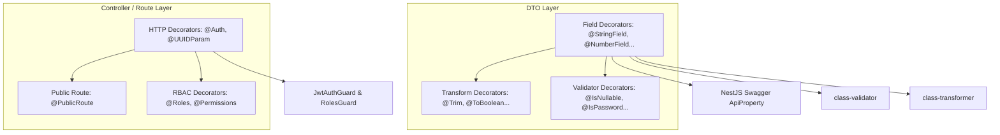

# Concept: Triển khai 5 Nhóm Decorators Chuẩn Hoá cho Only-One-BE

## 1. Problem & Goal (Vấn đề & Mục tiêu)
- **Problem**: Các DTO và Controller trong `only-one-be` hiện phải lặp lại nhiều decorator thủ công (`@ApiProperty`, `@IsString`, `@IsNotEmpty`, `@Trim`, `@Type`, `@IsOptional`...), gây boilerplate code lớn, khó bảo trì và dễ xảy ra sai sót hoặc không đồng bộ giữa Swagger Documentation và runtime validation.
- **Goal**: Triển khai 5 nhóm decorators cốt lõi từ `carwash-api` sang `only-one-be`, giúp tinh gọn DTOs (giảm ~70% boilerplate), chuẩn hoá HTTP routing/guards, và đảm bảo tính nhất quán giữa validation, transformation và OpenAPI/Swagger metadata.

## 2. Scope Boundaries (Ranh giới Phạm vi)
- **In-Scope**:
  1. **Field Decorators** (`field.decorators.ts`, `property.decorators.ts`): Toàn bộ composite decorators cho DTO properties (`@StringField`, `@NumberField`, `@BooleanField`, `@EnumField`, `@DateField`, `@UUIDField`, `@URLField`, `@EmailField`, `@PhoneField`, `@ClassField` cùng các biến thể `*Optional`).
  2. **Transform Decorators** (`transform.decorators.ts`): Sanitize input và cast kiểu dữ liệu (`@Trim`, `@ToBoolean`, `@ToInt`, `@ToArray`, `@ToLowerCase`, `@ToUpperCase`, `@PhoneNumberSerializer`).
  3. **Validator Decorators** (`validator.decorators.ts`): Custom validation rules (`@IsNullable`, `@IsUndefinable`, `@IsPassword`, `@IsPhoneNumber`, `@IsTmpKey`).
  4. **HTTP & Param Decorators** (`http.decorators.ts`, `public-route.decorator.ts`): `@Auth` (tích hợp Swagger Bearer, Guards, Roles/Permissions), `@PublicRoute`, `@UUIDParam`.
  5. **RBAC Decorators** (`roles.decorator.ts`, `permissions.decorator.ts`): Metadata decorators gắn quyền và vai trò phục vụ Auth Guards.
  6. **Export & Barrel Alignment** (`src/decorators/index.ts`): Xuất khẩu đồng bộ và tương thích ngược với các decorator hiện có (`@BaseResponse`, `@ApiFile`, `@User`, `@IsEqualField`).
- **Explicit Out-of-Scope**:
  - `distributed-cron.decorator.ts` (Hoãn lại, chưa áp dụng cơ chế Redis lock cho cron job).
  - `virtual-column.decorator.ts` (Chưa tích hợp TypeORM polyfill computed getters).
  - `translate.decorator.ts` & `localizable.decorator.ts` (Chưa cấu hình hệ thống i18n đa ngôn ngữ).
  - Refactor hàng loạt toàn bộ DTOs cũ trong `only-one-be` (sẽ thực hiện dần theo từng feature task riêng).

## 3. Proposed Solution & Core Mechanism (Giải pháp Đề xuất & Cơ chế)
- **Core Mechanism**:
  - Sử dụng NestJS `applyDecorators` để đóng gói tổ hợp các decorators (Swagger `@ApiProperty*` + `class-validator` + `class-transformer`) thành một decorator duy nhất có kiểu dữ liệu mạnh (strong typing) và tuân thủ các options tuỳ biến (`nullable`, `swagger`, `each`, `min`, `max`, `groups`...).
  - Chuẩn hoá luồng `@Auth()` kết hợp `JwtAuthGuard` + `RolesGuard` + OpenAPI `@ApiBearerAuth` + Swagger Response status annotations.
- **Decorators Architecture Mapping**:

## 4. Critical Risks & Edge Cases (Rủi ro & Kịch bản Biên)
- **Dependency Missing**: Cần đảm bảo các package bổ trợ như `lodash` hoặc validator helpers đã có sẵn và khớp type definitions trong `only-one-be`.
- **Naming Conflict**: Decorator `@User()` hiện có trong `only-one-be` cần được giữ nguyên hoặc alias tương thích với `@AuthUser()` để không làm gãy các controller hiện hữu.
- **Optional vs Nullable behavior**: Cơ chế xử lý trường `null` vs `undefined` (`@IsNullable()` vs `@IsOptional()`) cần cấu hình chặt chẽ để tương thích với `ValidationPipe` whitelist/transform settings trong `main.ts`.
