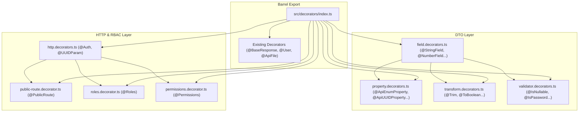

# Plan: Triển khai 5 Nhóm Decorators Chuẩn Hoá cho Only-One-BE

## Section 1. Current State (Hiện trạng & Phân tích Mã nguồn)
- **Hiện trạng tại `only-one-be`**: Hệ thống decorators hiện tại ở `src/decorators/` chỉ có các tiện ích cơ bản ([base-response.decorator.ts](file:///Users/kiem/Sources/PERSONAL/only-one-be/src/decorators/base-response.decorator.ts), [file.decorator.ts](file:///Users/kiem/Sources/PERSONAL/only-one-be/src/decorators/file.decorator.ts), [user.decorator.ts](file:///Users/kiem/Sources/PERSONAL/only-one-be/src/decorators/user.decorator.ts), [class-validation](file:///Users/kiem/Sources/PERSONAL/only-one-be/src/decorators/class-validation)). Các DTO đang phải khai báo thủ công nhiều decorators rời rạc (`@ApiProperty`, `@IsString`, `@IsNotEmpty`, `@Trim`, `@IsOptional`...).
- **Nhu cầu kỹ thuật**: Port 5 nhóm decorators cốt lõi từ `carwash-api` sang `only-one-be` để chuẩn hoá DTO properties, transformations, custom validations, HTTP routing và RBAC metadata.
- **Invariants bắt buộc duy trì**:
  - Không làm gián đoạn hoặc phá vỡ các decorator hiện có (`@BaseResponse`, `@ApiFile`, `@User`, `@IsEqualField`).
  - Giữ tương thích hoàn toàn với `ValidationPipe` toàn cục (`whitelist: true`, `transform: true`) và `@nestjs/swagger`.
  - Giữ type safety cho TypeScript compilation, không phát sinh lỗi unresolved dependencies.

---

## Section 2. Detailed Design (Thiết kế Kỹ thuật Chi tiết)
- **Kiến trúc phân tầng 5 nhóm Decorators**:
  1. **Transform Decorators (`transform.decorators.ts`)**: Cung cấp `@Trim`, `@ToBoolean`, `@ToInt`, `@ToArray`, `@ToLowerCase`, `@ToUpperCase`, `@PhoneNumberSerializer`, `@JSONToObject`, `@JSONToArray` dựa trên `class-transformer` và `lodash`.
  2. **Custom Validator Decorators (`validator.decorators.ts`)**: Cung cấp `@IsNullable`, `@IsUndefinable`, `@IsPhoneNumber`, `@IsTmpKey`, `@IsPassword` dựa trên `class-validator`.
  3. **Property Decorators (`property.decorators.ts`)**: Cung cấp OpenAPI/Swagger schema builders chuyên biệt (`@ApiBooleanProperty`, `@ApiUUIDProperty`, `@ApiEnumProperty` kèm các biến thể `*Optional`).
  4. **Field Decorators (`field.decorators.ts`)**: Tổ hợp cấp cao gom gọn `Swagger metadata + class-validator + class-transformer` vào một khai báo duy nhất (`@StringField`, `@NumberField`, `@BooleanField`, `@EnumField`, `@DateField`, `@UUIDField`, `@URLField`, `@EmailField`, `@PhoneField`, `@ClassField` kèm các biến thể `*Optional`).
  5. **HTTP & RBAC Decorators (`http.decorators.ts`, `public-route.decorator.ts`, `roles.decorator.ts`, `permissions.decorator.ts`)**:
     - `@PublicRoute(isPublic)`: Gán metadata `public_route` cho route handler.
     - `@Roles(...roles)` / `@Permissions(...permissions)`: Gán metadata quyền hạn cho endpoint.
     - `@Auth(...)`: Đóng gói `UseGuards(JwtAuthGuard)`, `@ApiBearerAuth()`, `@ApiUnauthorizedResponse()`, cùng Roles/Permissions metadata.
     - `@UUIDParam(name)`: Param decorator validate UUID v4.
  6. **Barrel Export (`src/decorators/index.ts`)**: Re-export toàn bộ 5 nhóm mới cùng các decorator hiện có để import thuận tiện.



---

## Section 3. Task Matrix & Dependency Graph

| Order | Status | Action | File Path | Target Symbols / AST Seams | Reused Existing Utilities / Helpers | Depends On | Fast Test Command |
| :---: | :---: | :---: | :--- | :--- | :--- | :--- | :--- |
| **1** | `[x]` | `[NEW]` | `src/decorators/transform.decorators.ts` | `Trim`, `ToBoolean`, `ToInt`, `ToArray`, `ToLowerCase`, `ToUpperCase`, `PhoneNumberSerializer`, `JSONToObject`, `JSONToArray` | `lodash` (`trim`, `castArray`, `isNil`, `isArray`, `map`) | `None` | `npm run build` |
| **2** | `[x]` | `[NEW]` | `src/decorators/validator.decorators.ts` | `IsPhoneNumber`, `IsTmpKey`, `IsUndefinable`, `IsNullable`, `IsPassword` | `class-validator` (`registerDecorator`, `ValidateIf`, `isPhoneNumber`) | `None` | `npm run build` |
| **3** | `[x]` | `[NEW]` | `src/decorators/property.decorators.ts` | `ApiBooleanProperty`, `ApiUUIDProperty`, `ApiEnumProperty`, `getVariableName` | `@nestjs/swagger` (`ApiProperty`) | `None` | `npm run build` |
| **4** | `[x]` | `[NEW]` | `src/decorators/field.decorators.ts` | `StringField`, `NumberField`, `BooleanField`, `EnumField`, `DateField`, `UUIDField`, `URLField`, `EmailField`, `PhoneField`, `ClassField` | `transform.decorators.ts`, `validator.decorators.ts`, `property.decorators.ts` | `Order 1, 2, 3` | `npm run build` |
| **5** | `[x]` | `[NEW]` | `src/decorators/public-route.decorator.ts` | `PUBLIC_ROUTE_KEY`, `PublicRoute` | `@nestjs/common` (`SetMetadata`) | `None` | `npm run build` |
| **6** | `[x]` | `[NEW]` | `src/decorators/roles.decorator.ts` | `ROLE_KEY`, `Roles` | `@nestjs/common` (`SetMetadata`) | `None` | `npm run build` |
| **7** | `[x]` | `[NEW]` | `src/decorators/permissions.decorator.ts` | `PERMISSION_KEY`, `Permissions`, `Permission` | `@nestjs/common` (`SetMetadata`) | `None` | `npm run build` |
| **8** | `[x]` | `[NEW]` | `src/decorators/http.decorators.ts` | `Auth`, `UUIDParam` | `src/guards/jwt-auth.guard.ts`, `public-route.decorator.ts`, `roles.decorator.ts` | `Order 5, 6, 7` | `npm run build` |
| **9** | `[x]` | `[MODIFY]` | `src/decorators/index.ts` | Re-export barrel entries | Existing decorator files | `Order 1, 2, 3, 4, 5, 6, 7, 8` | `npm run build` |


---

## Section 4. Code Changes (Unified Diff)

### 1. `[NEW]` `src/decorators/transform.decorators.ts`
> **Action**: Tạo các decorator transform dữ liệu đầu vào bằng `class-transformer` và `lodash`.

```typescript
import { Transform } from 'class-transformer';
import { castArray, isArray, isNil, map, trim } from 'lodash';

/**
 * @description Trim spaces from start and end, replace multiple spaces with one.
 */
export function Trim(): PropertyDecorator {
    return Transform((params) => {
        const value = params.value as string[] | string;

        if (isArray(value)) {
            return map(value, (v) => trim(v).replaceAll(/\s\s+/g, ' '));
        }

        if (typeof value === 'string') {
            return trim(value).replaceAll(/\s\s+/g, ' ');
        }

        return value;
    });
}

export function ToBoolean(): PropertyDecorator {
    return Transform(
        (params) => {
            switch (params.value) {
                case 'true':
                case true:
                case 1:
                case '1': {
                    return true;
                }
                case 'false':
                case false:
                case 0:
                case '0': {
                    return false;
                }
                default: {
                    return params.value;
                }
            }
        },
        { toClassOnly: true },
    );
}

/**
 * @description Convert string or number to integer
 */
export function ToInt(): PropertyDecorator {
    return Transform(
        (params) => {
            const value = params.value as string;
            if (isNil(value) || value === '') return value;
            return Number.parseInt(value, 10);
        },
        { toClassOnly: true },
    );
}

/**
 * @description Transforms to array, especially for query params
 */
export function ToArray(): PropertyDecorator {
    return Transform(
        (params) => {
            const value = params.value;
            if (isNil(value)) {
                return [];
            }
            return castArray(value);
        },
        { toClassOnly: true },
    );
}

export function ToLowerCase(): PropertyDecorator {
    return Transform(
        (params) => {
            const value = params.value;
            if (!value) return value;
            if (!Array.isArray(value)) {
                return typeof value === 'string' ? value.toLowerCase() : value;
            }
            return value.map((v) => (typeof v === 'string' ? v.toLowerCase() : v));
        },
        { toClassOnly: true },
    );
}

export function ToUpperCase(): PropertyDecorator {
    return Transform(
        (params) => {
            const value = params.value;
            if (!value) return value;
            if (!Array.isArray(value)) {
                return typeof value === 'string' ? value.toUpperCase() : value;
            }
            return value.map((v) => (typeof v === 'string' ? v.toUpperCase() : v));
        },
        { toClassOnly: true },
    );
}

export function PhoneNumberSerializer(): PropertyDecorator {
    return Transform(({ value }) => {
        if (!value || typeof value !== 'string') return value;
        const cleaned = value.replaceAll(/[^\d+]/g, '');
        return cleaned;
    });
}

export function JSONToObject(): PropertyDecorator {
    return Transform(
        ({ value }) => {
            if (isNil(value)) return {};
            if (typeof value === 'string') {
                try {
                    return JSON.parse(value);
                } catch {
                    return value;
                }
            }
            return value;
        },
        { toClassOnly: true },
    );
}

export function JSONToArray(): PropertyDecorator {
    return Transform(
        ({ value }) => {
            if (isNil(value)) return [];
            if (typeof value === 'string') {
                try {
                    const json = JSON.parse(value);
                    return isArray(json) ? json : [json];
                } catch {
                    return [];
                }
            }
            if (isArray(value)) {
                return value.map((item: any) => {
                    if (typeof item === 'string') {
                        try {
                            return JSON.parse(item);
                        } catch {
                            return item;
                        }
                    }
                    return item;
                });
            }
            return value;
        },
        { toClassOnly: true },
    );
}
```

---

### 2. `[NEW]` `src/decorators/validator.decorators.ts`
> **Action**: Tạo các decorator kiểm tra tính hợp lệ tuỳ biến (custom validation rules).

```typescript
import type { ValidationOptions } from 'class-validator';
import {
    IsPhoneNumber as isPhoneNumber,
    Matches,
    registerDecorator,
    ValidateIf,
} from 'class-validator';
import { isString } from 'lodash';

export function IsPhoneNumber(
    validationOptions?: ValidationOptions & {
        region?: Parameters<typeof isPhoneNumber>[0];
    },
): PropertyDecorator {
    return isPhoneNumber(validationOptions?.region ?? 'VN', {
        message: 'error.phoneNumber',
        ...validationOptions,
    });
}

export function IsTmpKey(
    validationOptions?: ValidationOptions,
): PropertyDecorator {
    return (object: object, propertyName: string | symbol) => {
        registerDecorator({
            propertyName: propertyName as string,
            name: 'tmpKey',
            target: object.constructor,
            options: validationOptions,
            validator: {
                validate(value: string): boolean {
                    return isString(value) && value.startsWith('tmp/');
                },
                defaultMessage(): string {
                    return 'error.invalidTmpKey';
                },
            },
        });
    };
}

export function IsUndefinable(options?: ValidationOptions): PropertyDecorator {
    return ValidateIf((_obj, value) => value !== undefined, options);
}

export function IsNullable(options?: ValidationOptions): PropertyDecorator {
    return ValidateIf((_obj, value) => value !== null, options);
}

export function IsPassword(
    validationOptions?: ValidationOptions,
): PropertyDecorator {
    return Matches(/^[a-zA-Z0-9!@#$%^&*()_+\-=[\]{};':"\\|,.<>/?]*$/, {
        message: 'error.invalidPassword',
        ...validationOptions,
    });
}
```

---

### 3. `[NEW]` `src/decorators/property.decorators.ts`
> **Action**: Tạo các helper decorator sinh OpenAPI/Swagger property metadata tương thích cao.

```typescript
import type { ApiPropertyOptions } from '@nestjs/swagger';
import { ApiProperty } from '@nestjs/swagger';

export function getVariableName<TResult>(
    getVar: () => TResult,
): string | undefined {
    try {
        const m = /\(\)=>(.*)/.exec(
            getVar.toString().replaceAll(/(\r\n|\n|\r|\s)/gm, ''),
        );
        if (!m) return undefined;
        const fullMemberName = m[1]!;
        const memberParts = fullMemberName.split('.');
        return memberParts.at(-1);
    } catch {
        return undefined;
    }
}

export function ApiBooleanProperty(
    options: Omit<ApiPropertyOptions, 'type'> = {},
): PropertyDecorator {
    return ApiProperty({ type: Boolean, ...options });
}

export function ApiBooleanPropertyOptional(
    options: Omit<ApiPropertyOptions, 'type' | 'required'> = {},
): PropertyDecorator {
    return ApiBooleanProperty({ required: false, ...options });
}

export function ApiUUIDProperty(
    options: Omit<ApiPropertyOptions, 'type' | 'format'> &
        Partial<{ each: boolean }> = {},
): PropertyDecorator {
    return ApiProperty({
        type: options.each ? [String] : String,
        format: 'uuid',
        isArray: options.each,
        ...options,
    });
}

export function ApiUUIDPropertyOptional(
    options: Omit<ApiPropertyOptions, 'type' | 'format' | 'required'> &
        Partial<{ each: boolean }> = {},
): PropertyDecorator {
    return ApiUUIDProperty({ required: false, ...options });
}

export function ApiEnumProperty<TEnum>(
    getEnum: () => TEnum,
    options: Omit<ApiPropertyOptions, 'type'> & { each?: boolean } = {},
): PropertyDecorator {
    // eslint-disable-next-line @typescript-eslint/no-explicit-any
    const enumValue = getEnum() as any;

    return ApiProperty({
        type: 'enum',
        enum: enumValue,
        enumName: getVariableName(getEnum),
        ...options,
    });
}

export function ApiEnumPropertyOptional<TEnum>(
    getEnum: () => TEnum,
    options: Omit<ApiPropertyOptions, 'type' | 'required'> & {
        each?: boolean;
    } = {},
): PropertyDecorator {
    return ApiEnumProperty(getEnum, { required: false, ...options });
}
```

---

### 4. `[NEW]` `src/decorators/field.decorators.ts`
> **Action**: Tạo các composite Field Decorators tích hợp toàn diện Validation + Transformation + Swagger.

```typescript
import { applyDecorators } from '@nestjs/common';
import type { ApiPropertyOptions } from '@nestjs/swagger';
import { ApiProperty } from '@nestjs/swagger';
import { Type } from 'class-transformer';
import {
    IsBoolean,
    IsDate,
    IsDefined,
    IsEmail,
    IsEnum,
    IsInt,
    IsNumber,
    IsObject,
    IsOptional,
    IsPositive,
    IsString,
    IsUrl,
    IsUUID,
    Max,
    MaxLength,
    Min,
    MinLength,
    NotEquals,
    ValidateNested,
} from 'class-validator';

import { ApiEnumProperty, ApiUUIDProperty } from './property.decorators';
import {
    PhoneNumberSerializer,
    ToArray,
    ToBoolean,
    ToLowerCase,
    ToUpperCase,
    Trim,
} from './transform.decorators';
import {
    IsNullable,
    IsPassword as IsPasswordValidator,
    IsPhoneNumber,
    IsTmpKey as IsTemporaryKey,
} from './validator.decorators';

// eslint-disable-next-line @typescript-eslint/no-explicit-any
export type Constructor<T = any, Arguments extends unknown[] = any[]> = new (
    ...arguments_: Arguments
) => T;

export interface IFieldOptions {
    each?: boolean;
    swagger?: boolean;
    nullable?: boolean;
    groups?: string[];
}

export interface INumberFieldOptions extends IFieldOptions {
    min?: number;
    max?: number;
    int?: boolean;
    isPositive?: boolean;
}

export interface IStringFieldOptions extends IFieldOptions {
    minLength?: number;
    maxLength?: number;
    toLowerCase?: boolean;
    toUpperCase?: boolean;
    trim?: boolean;
}

export type IClassFieldOptions = IFieldOptions;
export type IBooleanFieldOptions = IFieldOptions;
export type IEnumFieldOptions = IFieldOptions;

export function NumberField(
    options: Omit<ApiPropertyOptions, 'type'> & INumberFieldOptions = {},
): PropertyDecorator {
    const decorators = [Type(() => Number)];

    if (options.nullable) {
        decorators.push(IsNullable({ each: options.each }));
    } else {
        decorators.push(NotEquals(null, { each: options.each }));
    }

    if (options.swagger !== false) {
        decorators.push(ApiProperty({ type: Number, ...options }));
    }

    if (options.each) {
        decorators.push(ToArray());
    }

    if (options.int) {
        decorators.push(IsInt({ each: options.each }));
    } else {
        decorators.push(IsNumber({}, { each: options.each }));
    }

    if (typeof options.min === 'number') {
        decorators.push(Min(options.min, { each: options.each }));
    }

    if (typeof options.max === 'number') {
        decorators.push(Max(options.max, { each: options.each }));
    }

    if (options.isPositive) {
        decorators.push(IsPositive({ each: options.each }));
    }

    return applyDecorators(...decorators);
}

export function NumberFieldOptional(
    options: Omit<ApiPropertyOptions, 'type' | 'required'> &
        INumberFieldOptions = {},
): PropertyDecorator {
    return applyDecorators(
        IsOptional(),
        NumberField({ required: false, ...options }),
    );
}

export function StringField(
    options: Omit<ApiPropertyOptions, 'type'> & IStringFieldOptions = {},
): PropertyDecorator {
    const decorators = [Type(() => String), IsString({ each: options.each })];

    if (options.trim !== false) {
        decorators.push(Trim());
    }

    if (options.nullable) {
        decorators.push(IsNullable({ each: options.each }));
    } else {
        decorators.push(NotEquals(null, { each: options.each }));
    }

    if (options.swagger !== false) {
        decorators.push(
            ApiProperty({ type: String, ...options, isArray: options.each }),
        );
    }

    const minLength = options.minLength || 0;
    decorators.push(MinLength(minLength, { each: options.each }));

    if (options.maxLength) {
        decorators.push(MaxLength(options.maxLength, { each: options.each }));
    }

    if (options.toLowerCase) {
        decorators.push(ToLowerCase());
    }

    if (options.toUpperCase) {
        decorators.push(ToUpperCase());
    }

    if (options.each) {
        decorators.push(ToArray());
    }

    return applyDecorators(...decorators);
}

export function StringFieldOptional(
    options: Omit<ApiPropertyOptions, 'type' | 'required'> &
        IStringFieldOptions = {},
): PropertyDecorator {
    return applyDecorators(
        IsOptional(),
        StringField({ required: false, ...options }),
    );
}

export function ObjectFieldOptional(
    options: Omit<ApiPropertyOptions, 'type' | 'required'> & IFieldOptions = {},
): PropertyDecorator {
    const decorators = [IsOptional(), IsObject()];

    if (options.swagger !== false) {
        decorators.push(
            ApiProperty({ type: 'object', required: false, ...options }),
        );
    }

    return applyDecorators(...decorators);
}

export function PasswordField(
    options: Omit<ApiPropertyOptions, 'type' | 'minLength'> &
        IStringFieldOptions = {},
): PropertyDecorator {
    const decorators = [
        StringField({ minLength: 6, ...options }),
        IsPasswordValidator(),
    ];

    if (options.nullable) {
        decorators.push(IsNullable());
    } else {
        decorators.push(NotEquals(null));
    }

    return applyDecorators(...decorators);
}

export function PasswordFieldOptional(
    options: Omit<ApiPropertyOptions, 'type' | 'required' | 'minLength'> &
        IStringFieldOptions = {},
): PropertyDecorator {
    return applyDecorators(
        IsOptional(),
        PasswordField({ required: false, ...options }),
    );
}

export function BooleanField(
    options: Omit<ApiPropertyOptions, 'type'> & IBooleanFieldOptions = {},
): PropertyDecorator {
    const decorators = [ToBoolean(), IsBoolean()];

    if (options.nullable) {
        decorators.push(IsNullable());
    } else {
        decorators.push(NotEquals(null));
    }

    if (options.swagger !== false) {
        decorators.push(ApiProperty({ type: Boolean, ...options }));
    }

    return applyDecorators(...decorators);
}

export function BooleanFieldOptional(
    options: Omit<ApiPropertyOptions, 'type' | 'required'> &
        IBooleanFieldOptions = {},
): PropertyDecorator {
    return applyDecorators(
        IsOptional(),
        BooleanField({ required: false, ...options }),
    );
}

export function TmpKeyField(
    options: Omit<ApiPropertyOptions, 'type'> & IStringFieldOptions = {},
): PropertyDecorator {
    const decorators = [
        StringField(options),
        IsTemporaryKey({ each: options.each }),
    ];

    if (options.nullable) {
        decorators.push(IsNullable());
    } else {
        decorators.push(NotEquals(null));
    }

    if (options.swagger !== false) {
        decorators.push(
            ApiProperty({ type: String, ...options, isArray: options.each }),
        );
    }

    return applyDecorators(...decorators);
}

export function TmpKeyFieldOptional(
    options: Omit<ApiPropertyOptions, 'type' | 'required'> &
        IStringFieldOptions = {},
): PropertyDecorator {
    return applyDecorators(
        IsOptional(),
        TmpKeyField({ required: false, ...options }),
    );
}

export function EnumField<TEnum extends object>(
    getEnum: () => TEnum,
    options: Omit<ApiPropertyOptions, 'type' | 'enum' | 'enumName' | 'isArray'> &
        IEnumFieldOptions = {},
): PropertyDecorator {
    const enumValue = getEnum();
    const decorators = [Trim(), IsEnum(enumValue, { each: options.each })];

    if (options.nullable) {
        decorators.push(IsNullable());
    } else {
        decorators.push(NotEquals(null));
    }

    if (options.each) {
        decorators.push(ToArray());
    }

    if (options.swagger !== false) {
        decorators.push(
            ApiEnumProperty(getEnum, { ...options, isArray: options.each }),
        );
    }

    return applyDecorators(...decorators);
}

export function EnumFieldOptional<TEnum extends object>(
    getEnum: () => TEnum,
    options: Omit<ApiPropertyOptions, 'type' | 'required' | 'enum' | 'enumName'> &
        IEnumFieldOptions = {},
): PropertyDecorator {
    return applyDecorators(
        IsOptional(),
        EnumField(getEnum, { required: false, ...options }),
    );
}

export function ClassField<TClass extends Constructor>(
    getClass: () => TClass,
    options: Omit<ApiPropertyOptions, 'type'> & IClassFieldOptions = {},
): PropertyDecorator {
    const { each, swagger, ...swaggerOptions } = options;
    const decorators = [Type(getClass)];

    if (each) {
        decorators.push(ValidateNested({ each: true }));
    }

    if (options.nullable) {
        decorators.push(IsNullable());
    } else {
        decorators.push(NotEquals(null));
    }

    if (swagger !== false) {
        decorators.push(
            ApiProperty({
                ...swaggerOptions,
                type: () => getClass(),
                isArray: swaggerOptions.isArray ?? each,
            }),
        );
    }

    return applyDecorators(...decorators);
}

export function ClassFieldOptional<TClass extends Constructor>(
    getClass: () => TClass,
    options: Omit<ApiPropertyOptions, 'type' | 'required'> &
        IClassFieldOptions = {},
): PropertyDecorator {
    return applyDecorators(
        IsOptional(),
        ClassField(getClass, { required: false, ...options }),
    );
}

export function EmailField(
    options: Omit<ApiPropertyOptions, 'type'> & IStringFieldOptions = {},
): PropertyDecorator {
    const decorators = [
        IsEmail({}, { each: options.each }),
        StringField({ toLowerCase: true, ...options }),
    ];

    if (options.nullable) {
        decorators.push(IsNullable());
    } else {
        decorators.push(NotEquals(null));
    }

    if (options.swagger !== false) {
        decorators.push(ApiProperty({ type: String, ...options }));
    }

    return applyDecorators(...decorators);
}

export function EmailFieldOptional(
    options: Omit<ApiPropertyOptions, 'type'> & IStringFieldOptions = {},
): PropertyDecorator {
    return applyDecorators(
        IsOptional(),
        EmailField({ required: false, ...options }),
    );
}

export function PhoneField(
    options: Omit<ApiPropertyOptions, 'type'> & IFieldOptions = {},
): PropertyDecorator {
    const decorators = [Trim(), IsPhoneNumber(), PhoneNumberSerializer()];

    if (options.nullable) {
        decorators.push(IsNullable());
    } else {
        decorators.push(NotEquals(null));
    }

    if (options.swagger !== false) {
        decorators.push(ApiProperty({ type: String, ...options }));
    }

    return applyDecorators(...decorators);
}

export function PhoneFieldOptional(
    options: Omit<ApiPropertyOptions, 'type' | 'required'> & IFieldOptions = {},
): PropertyDecorator {
    return applyDecorators(
        IsOptional(),
        PhoneField({ required: false, nullable: true, ...options }),
    );
}

export function UUIDField(
    options: Omit<ApiPropertyOptions, 'type' | 'format' | 'isArray'> &
        IFieldOptions = {},
): PropertyDecorator {
    const decorators = [Trim(), Type(() => String), IsUUID('4', { each: options.each })];

    if (options.nullable) {
        decorators.push(IsNullable());
    } else {
        decorators.push(NotEquals(null));
    }

    if (options.swagger !== false) {
        decorators.push(ApiUUIDProperty(options));
    }

    if (options.each) {
        decorators.push(ToArray());
    }

    return applyDecorators(...decorators);
}

export function UUIDFieldOptional(
    options: Omit<ApiPropertyOptions, 'type' | 'required' | 'isArray'> &
        IFieldOptions = {},
): PropertyDecorator {
    return applyDecorators(
        IsOptional(),
        UUIDField({ required: false, ...options }),
    );
}

export function URLField(
    options: Omit<ApiPropertyOptions, 'type'> & IStringFieldOptions = {},
): PropertyDecorator {
    const decorators = [StringField(options), IsUrl({}, { each: true })];

    if (options.nullable) {
        decorators.push(IsNullable({ each: options.each }));
    } else {
        decorators.push(NotEquals(null, { each: options.each }));
    }

    return applyDecorators(...decorators);
}

export function URLFieldOptional(
    options: Omit<ApiPropertyOptions, 'type'> & IStringFieldOptions = {},
): PropertyDecorator {
    return applyDecorators(
        IsOptional(),
        URLField({ required: false, ...options }),
    );
}

export function DateField(
    options: Omit<ApiPropertyOptions, 'type'> & IFieldOptions = {},
): PropertyDecorator {
    const decorators = [Type(() => Date), IsDate()];

    if (options.nullable) {
        decorators.push(IsNullable());
    } else {
        decorators.push(NotEquals(null));
    }

    if (options.swagger !== false) {
        decorators.push(ApiProperty({ type: Date, ...options }));
    }

    return applyDecorators(...decorators);
}

export function DateFieldOptional(
    options: Omit<ApiPropertyOptions, 'type' | 'required'> & IFieldOptions = {},
): PropertyDecorator {
    return applyDecorators(
        IsOptional(),
        DateField({ ...options, required: false }),
    );
}
```

---

### 5. `[NEW]` `src/decorators/public-route.decorator.ts`
> **Action**: Tạo `@PublicRoute` decorator phục vụ bypass authentication guard.

```typescript
import type { CustomDecorator } from '@nestjs/common';
import { SetMetadata } from '@nestjs/common';

export const PUBLIC_ROUTE_KEY = 'public_route';

// eslint-disable-next-line @typescript-eslint/naming-convention
export const PublicRoute = (isPublic = true): CustomDecorator =>
    SetMetadata(PUBLIC_ROUTE_KEY, isPublic);
```

---

### 6. `[NEW]` `src/decorators/roles.decorator.ts`
> **Action**: Tạo `@Roles` decorator gắn metadata role lên controller hoặc endpoint.

```typescript
import type { CustomDecorator } from '@nestjs/common';
import { SetMetadata } from '@nestjs/common';

export const ROLE_KEY = 'roles';

// eslint-disable-next-line @typescript-eslint/naming-convention
export const Roles = (...roles: string[]): CustomDecorator =>
    SetMetadata(ROLE_KEY, roles);
```

---

### 7. `[NEW]` `src/decorators/permissions.decorator.ts`
> **Action**: Tạo `@Permissions` decorator gắn metadata quyền hạn lên endpoint.

```typescript
import type { CustomDecorator } from '@nestjs/common';
import { SetMetadata } from '@nestjs/common';

export const PERMISSION_KEY = 'permissions';

// eslint-disable-next-line @typescript-eslint/naming-convention
export const Permissions = (...permissions: string[]): CustomDecorator =>
    SetMetadata(PERMISSION_KEY, permissions);

// eslint-disable-next-line @typescript-eslint/naming-convention
export const Permission = (...permissions: string[]): CustomDecorator =>
    Permissions(...permissions);
```

---

### 8. `[NEW]` `src/decorators/http.decorators.ts`
> **Action**: Tạo composite `@Auth` decorator và `@UUIDParam` parameter decorator.

```typescript
import type { PipeTransform } from '@nestjs/common';
import {
    applyDecorators,
    Param,
    ParseUUIDPipe,
    UseGuards,
} from '@nestjs/common';
import type { Type } from '@nestjs/common/interfaces';
import { ApiBearerAuth, ApiUnauthorizedResponse } from '@nestjs/swagger';

import { JwtAuthGuard } from '../guards/jwt-auth.guard';
import { Permissions } from './permissions.decorator';
import { PublicRoute } from './public-route.decorator';
import { Roles } from './roles.decorator';

export interface IAuthOptions {
    roles?: string[];
    permissions?: string[];
    public?: boolean;
}

export function Auth(options: IAuthOptions = {}): MethodDecorator & ClassDecorator {
    const isPublic = options.public ?? false;

    const decorators: Array<ClassDecorator | MethodDecorator | PropertyDecorator> = [
        UseGuards(JwtAuthGuard),
        ApiBearerAuth(),
        ApiUnauthorizedResponse({ description: 'Unauthorized' }),
        PublicRoute(isPublic),
    ];

    if (options.roles && options.roles.length > 0) {
        decorators.unshift(Roles(...options.roles));
    }

    if (options.permissions && options.permissions.length > 0) {
        decorators.unshift(Permissions(...options.permissions));
    }

    return applyDecorators(...decorators);
}

export function UUIDParam(
    property: string,
    ...pipes: Array<Type<PipeTransform> | PipeTransform>
): ParameterDecorator {
    return Param(property, new ParseUUIDPipe({ version: '4' }), ...pipes);
}
```

---

### 9. `[MODIFY]` `src/decorators/index.ts`
> **Action**: Re-export toàn bộ 5 nhóm decorators mới đồng bộ trong barrel export.

```diff
 export * from './base-response.decorator';
 export * from './class-validation';
 export * from './file.decorator';
+export * from './field.decorators';
+export * from './http.decorators';
+export * from './permissions.decorator';
+export * from './property.decorators';
+export * from './public-route.decorator';
+export * from './roles.decorator';
+export * from './transform.decorators';
 export * from './user.decorator';
+export * from './validator.decorators';
```

---

## Section 5. Test Cases & Verification

- **Automated Tests**:
  - `npm run build` (Xác thực TypeScript compilation không có lỗi cú pháp hoặc thiếu type).
  - `npm run lint` (Xác thực toàn bộ code mới tuân thủ chuẩn ESLint và Prettier của repository).
- **Manual Checks**:
  - Tạo một DTO mẫu sử dụng `@StringField`, `@NumberFieldOptional`, `@EnumField`, `@UUIDField` và kiểm tra runtime validation + Swagger documentation UI (`/docs`).
  - Kiểm tra các decorator hiện có (`@BaseResponse`, `@User`, `@ApiFile`) vẫn hoạt động bình thường, không bị ảnh hưởng.
