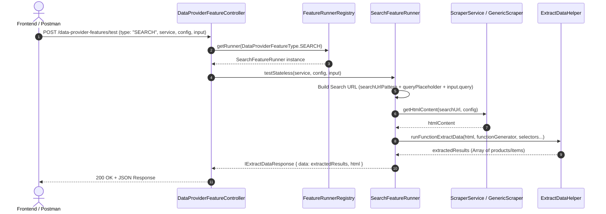

# Concept: Data Provider Search Feature Runner

## 1. Problem & Goal (Vấn đề & Mục tiêu)
- **Problem**: Hiện tại `DataProviderFeatureType` đã khai báo type `SEARCH`, tuy nhiên `FeatureRunnerRegistry` mới chỉ đăng ký `ScrapingFeatureRunner` (`type: SCRAPING`). Khi gọi API test/run tính năng với `type: "SEARCH"`, hệ thống ném ngoại lệ `RunnerNotFound(SEARCH)`. Ngoài ra, tính năng search yêu cầu cơ chế sinh Search URL động từ `searchUrlPattern`, `queryPlaceholder` kết hợp với từ khóa `input.query` trước khi cào và trích xuất dữ liệu.
- **Goal**: Xây dựng `SearchFeatureRunner` hoàn chỉnh, đăng ký vào `FeatureRunnerRegistry`, hỗ trợ cả hai chế độ `testStateless` (sandbox test) và `testContextual` (test feature đã lưu với query mẫu), trích xuất danh sách kết quả tìm kiếm thông qua `functionGenerator` (Cheerio / sandbox script).

---

## 2. Scope Boundaries (Ranh giới Phạm vi)

### In-Scope:
- **`SearchFeatureRunner`**: Cài đặt interface `IFeatureRunner` cho `DataProviderFeatureType.SEARCH`.
- **`ISearchTargetConfig` Interface / DTO**: Định nghĩa cấu trúc config cho feature Search gồm `searchUrlPattern`, `queryPlaceholder`, `resultSelector`, `mainContentSelector`, `functionGenerator`, `maxResults`, `isGetParentElement`, v.v.
- **URL Pattern Formatter / Builder**: Hỗ trợ build target URL từ `searchUrlPattern` + `queryPlaceholder` + `input.query` (hoặc fallback nhận trực tiếp `url` / `htmlContentString` khi test).
- **`FeatureRunnerRegistry` & Module Registration**: Đăng ký `SearchFeatureRunner` vào `FeatureRunnerRegistry` và `DataProviderModule`.
- **Stateless & Contextual Testing**:
  - `testStateless`: Nhận config động + input `{ query: "..." }` $\rightarrow$ fetch HTML qua scraper service chỉ định $\rightarrow$ trích xuất dữ liệu qua `ExtractDataHelper`.
  - `testContextual`: Dùng config lưu trong database của feature + input query (hoặc default test query) $\rightarrow$ crawl & validate.

### Explicit Out-of-Scope:
- Thay đổi cấu trúc database `data_provider_features` (tận dụng trường `config: JSONB` hiện tại).
- Crawl đệ quy phân trang nhiều trang (Pagination Multi-page Crawl Loop) trong 1 lần test request (chỉ lấy trang đầu hoặc áp dụng `maxResults`).
- Tự động sinh `functionGenerator` bằng AI trong scope của task này.

---

## 3. Proposed Solution & Core Mechanism (Giải pháp Đề xuất & Cơ chế)

### Kiến trúc & So sánh các Phương án (Options Comparison)

| Tiêu chí | Option 1: Dedicated `SearchFeatureRunner` (Khuyến nghị) | Option 2: Gộp chung vào `ScrapingFeatureRunner` | Option 3: Tách riêng `IDataProviderSearchService` Subsystem |
| :--- | :--- | :--- | :--- |
| **Mô tả** | Tạo mới `SearchFeatureRunner` độc lập, tái sử dụng `DATA_PROVIDER_SCRAPER_SERVICE_MAP` & `ExtractDataHelper`. | Thêm cờ `isSearch` / `type` vào `ScrapingFeatureRunner` hiện có. | Tạo riêng toàn bộ tầng Scraper Service mới chỉ dành cho Search (`IDataProviderSearchService`). |
| **Ưu điểm (Pros)** | Tuân thủ Open/Closed Principle (OCP), clean separation of concerns, dễ bảo trì và test riêng biệt. | Ít file mới, gom logic nhanh. | Mở rộng tối đa nếu search có luồng crawler/search engine API hoàn toàn khác scraping. |
| **Nhược điểm (Cons)**| Cần thêm runner class và đăng ký DI module. | Phá vỡ Single Responsibility Principle, runner bị phình to (god runner). | Over-engineering, duplicated boilerplate code với scraper services hiện tại. |
| **Độ phức tạp** | **Thấp - Trung bình (Standard)** | **Thấp** | **Cao** |

👉 **Lựa chọn Đề xuất**: **Option 1 (Dedicated `SearchFeatureRunner`)**.

---

### Core Mechanism & Data Flow



---

## 4. Input / Output Contracts

### Input Payload (`TestFeatureStatelessRequestDto`):
```json
{
  "type": "SEARCH",
  "service": "generic",
  "config": {
    "searchUrlPattern": "https://example.com/search?keyword={query}",
    "queryPlaceholder": "{query}",
    "mainContentSelector": "#product-grid",
    "resultSelector": "#product-card",
    "functionGenerator": "const searchData = (html) => { ... return results; };",
    "isGetParentElement": false,
    "maxResults": 20
  },
  "input": {
    "query": "ao-thun"
  }
}
```

### Output Response (`IExtractDataResponse`):
```json
{
  "data": [
    {
      "url": "https://example.com/item/123",
      "title": "Áo thun nam basic",
      "price": "150000",
      "currency": "VND",
      "imageUrl": "https://example.com/images/123.jpg",
      "relativeUrl": "/item/123"
    }
  ],
  "html": "<html>...</html>"
}
```

---

## 5. Critical Risks & Edge Cases (Rủi ro & Kịch bản Biên)

1. **URL Encoding & Placeholder Mismatch**:
   - *Risk*: `input.query` chứa ký tự đặc biệt, dấu tiếng Việt hoặc khoảng trắng (`áo thun nam`) làm gãy URL request.
   - *Mitigation*: Sử dụng `encodeURIComponent(query.trim())` khi thay thế vào pattern. Hỗ trợ cả placeholder tùy biến và fallback thay thế `${query}` / `{query}` / `{keyword}`.
2. **Missing Input Query**:
   - *Risk*: User không truyền `input.query` hoặc `input.url` khi test.
   - *Mitigation*: Validation trả về `BadRequestException('Search query or URL is required for SEARCH feature runner')`.
3. **Selector / Function Generator Syntax Error**:
   - *Risk*: Hàm `functionGenerator` lỗi cú pháp hoặc runtime error bên trong sandbox Cheerio.
   - *Mitigation*: Bọc `try-catch` an toàn trong `ExtractDataHelper`, trả về message lỗi chi tiết `Scraping validation failed: <message>`.
