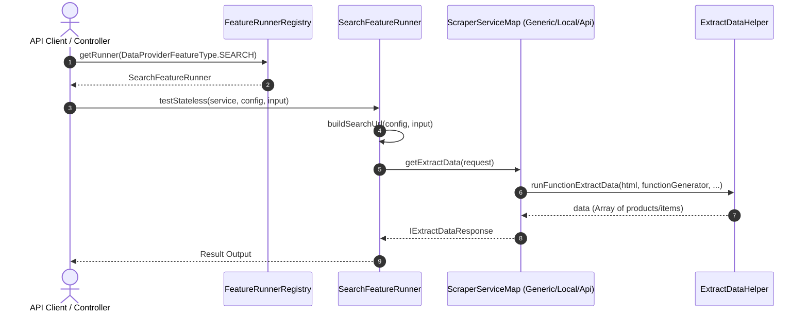

# Plan: Triển khai Search Feature Runner cho Data Provider

## Section 1. Current State (Hiện trạng & Phân tích Mã nguồn)

- **Cơ chế hiện tại**: `DataProviderFeatureType` đã định nghĩa enum `SEARCH`, nhưng trong `feature-runner.registry.ts` chỉ inject và map `ScrapingFeatureRunner` cho `type: SCRAPING`. Khi người dùng gọi endpoint `POST /data-provider-features/test` hoặc `POST /data-provider-features/:id/test` với feature type `SEARCH`, hệ thống ném ngoại lệ `AppException(DataProviderError.RunnerNotFound('SEARCH'))`.
- **Điểm nghẽn kỹ thuật (Technical Gap)**: Chưa có runner xử lý cấu hình đặc thù của Search: sinh Search URL động từ `searchUrlPattern`, `queryPlaceholder`, `input.query`, gửi request cào HTML qua Scraper Service (`generic`, `local`, `api`) và ủy quyền thực thi hàm bóc tách dữ liệu (`functionGenerator`) qua `ExtractDataHelper`.
- **Invariants bắt buộc bảo toàn**:
  - `ScrapingFeatureRunner` và các endpoint scraping hiện tại không bị ảnh hưởng (Zero Regression).
  - Không thay đổi schema database bảng `data_provider_features` (tận dụng trường polymorphic `config: jsonb`).
  - Chuẩn hóa lỗi thông qua `BadRequestException` và `AppException` theo đúng rules của hệ thống.

---

## Section 2. Detailed Design (Thiết kế Kỹ thuật Chi tiết)

### 2.1. Cấu trúc Hợp đồng Dữ liệu (`ISearchTargetConfig`)
Mở rộng từ `ITargetConfig`, bổ sung các trường chuyên biệt cho Search:
- `searchUrlPattern`: Pattern URL tìm kiếm (e.g. `https://example.com/search?q={query}` hoặc `https://gaigu6.fit/gai-goi/sai-gon`).
- `queryPlaceholder`: Ký tự đại diện cho từ khóa trong pattern (e.g. `{query}`, `${query}`, `{keyword}`, default: `{query}`).
- `resultSelector`: CSS selector cho từng item/card kết quả tìm kiếm (được dùng trong `functionGenerator`).
- `sampleQuery`: Từ khóa mẫu phục vụ kiểm tra tự động khi chuyển feature sang trạng thái `READY` qua `testContextual`.

### 2.2. Cơ chế sinh URL Tìm kiếm (Search URL Builder)
Phương thức `buildSearchUrl(config: ISearchTargetConfig, input?: any): string`:
1. Nếu `input?.url` đã được truyền trực tiếp, ưu tiên sử dụng `input.url`.
2. Lấy từ khóa: `query = input?.query || config.sampleQuery || ''`.
3. Nếu có pattern `searchUrlPattern`:
   - Xác định placeholder từ `config.queryPlaceholder`, fallback kiểm tra `{query}`, `${query}`, `{keyword}`, `${keyword}`.
   - Thay thế placeholder bằng `encodeURIComponent(query.trim())`.
   - Nếu pattern không chứa placeholder và `query` không rỗng: tự động append query param (ví dụ: `pattern.includes('?') ? '&q=...' : '?q=...'`).
4. Validate URL hợp lệ trước khi gửi sang Scraper Service.

### 2.3. Luồng Xử lý Runner (`SearchFeatureRunner`)
- **`testStateless(service, config, input)`**:
  - Resolve scraper service từ `DATA_PROVIDER_SCRAPER_SERVICE_MAP[service]`.
  - Nếu không có `input.htmlContentString`, tiến hành build Search URL từ `config` & `input`.
  - Ủy quyền cho `scraperService.getExtractData({ url, targetConfig: config, htmlContentString: input?.htmlContentString, dataContent: input?.dataContent })`.
  - Trả về `IExtractDataResponse` với danh sách items trích xuất được.
- **`testContextual(feature, input)`**:
  - Trích xuất `config` từ `feature.config as ISearchTargetConfig`.
  - Resolve scraper service từ `DATA_PROVIDER_SCRAPER_SERVICE_MAP[feature.service]`.
  - Build URL và gọi `scraperService.getExtractData(...)`. Nếu `result.error` ném `BadRequestException`.



---

## Section 3. Task Matrix & Dependency Graph

| Order | Status | Action | File Path | Target Symbols / AST Seams | Reused Existing Utilities / Helpers | Depends On | Fast Test Command |
| :---: | :---: | :---: | :--- | :--- | :--- | :--- | :--- |
| **1** | `[x]` | `[MODIFY]` | `src/modules/data-provider/interfaces/target-config.interface.ts` | `ISearchTargetConfig`, `ITargetConfig` | `src/modules/data-provider/interfaces/target-config.interface.ts` | `None` | `npm run build` |
| **2** | `[x]` | `[NEW]` | `src/modules/data-provider/runners/search-feature.runner.ts` | `SearchFeatureRunner`, `buildSearchUrl`, `testStateless`, `testContextual` | `DATA_PROVIDER_SCRAPER_SERVICE_MAP`, `ExtractDataHelper` | `Order 1` | `npm run build` |
| **3** | `[x]` | `[MODIFY]` | `src/modules/data-provider/runners/feature-runner.registry.ts` | `FeatureRunnerRegistry.constructor`, `FeatureRunnerRegistry.getRunner` | `SearchFeatureRunner`, `ScrapingFeatureRunner` | `Order 2` | `npm run build` |
| **4** | `[x]` | `[MODIFY]` | `src/modules/data-provider/data-provider.module.ts` | `DataProviderModule.providers` | `runners` array | `Order 3` | `npm run build` |
| **5** | `[x]` | `[NEW]` | `src/modules/data-provider/runners/_tests/search-feature.runner.spec.ts` | `SearchFeatureRunner.testStateless`, `SearchFeatureRunner.testContextual` | Direct Instantiation Mocking | `Order 4` | `npm run build` |
| **6** | `[x]` | `[NEW]` | `src/modules/data-provider/runners/_tests/feature-runner.registry.spec.ts` | `FeatureRunnerRegistry.getRunner` | Direct Instantiation Mocking | `Order 4` | `npm run build` |

---

## Section 4. Code Changes (Unified Diff)

### 1. `[MODIFY]` `src/modules/data-provider/interfaces/target-config.interface.ts`
> **Action**: Khai báo interface `ISearchTargetConfig` kế thừa từ `ITargetConfig` để định nghĩa rõ ràng các thuộc tính search URL pattern và selectors.

```diff
@@ line 32 @@
     cssEnabled?: boolean; // Có tải CSS hay không
 }
 
+export interface ISearchTargetConfig extends ITargetConfig {
+    searchUrlPattern?: string; // Pattern URL tìm kiếm (e.g. https://example.com/search?q={query})
+    queryPlaceholder?: string; // Placeholder thay thế query trong searchUrlPattern (e.g. {query})
+    resultSelector?: string; // Selector của từng thẻ sản phẩm/kết quả trong danh sách
+    sampleQuery?: string; // Query mẫu dùng để test khi kích hoạt feature
+}
+
 export interface IRunFunctionExtractData {
```

---

### 2. `[NEW]` `src/modules/data-provider/runners/search-feature.runner.ts`
> **Action**: Tạo mới `SearchFeatureRunner` cài đặt `IFeatureRunner<ISearchTargetConfig, any, IExtractDataResponse>` với cơ chế build search URL và delegate sang Scraper Service.

```typescript
import { BadRequestException, Inject, Injectable } from '@nestjs/common';

import { DATA_PROVIDER_SCRAPER_SERVICE_MAP } from '../constants/data-provider-scraper-service-map';
import { DataProviderFeatureEntity } from '../entities/data-provider-feature.entity';
import { IDataProviderScraperService, IExtractDataResponse, IFeatureRunner, ISearchTargetConfig } from '../interfaces';

@Injectable()
export class SearchFeatureRunner implements IFeatureRunner<ISearchTargetConfig, any, IExtractDataResponse | any> {
    constructor(
        @Inject(DATA_PROVIDER_SCRAPER_SERVICE_MAP)
        private readonly dataProviderScraperServiceMap: Record<string, IDataProviderScraperService>,
    ) {}

    public buildSearchUrl(config: ISearchTargetConfig, input?: any): string {
        if (input?.url) {
            return input.url;
        }

        const query = (input?.query || config?.sampleQuery || '').trim();
        const pattern = config?.searchUrlPattern?.trim();

        if (!pattern) {
            return '';
        }

        if (!query) {
            return pattern;
        }

        const placeholder = config?.queryPlaceholder || '{query}';
        const encodedQuery = encodeURIComponent(query);

        if (pattern.includes(placeholder)) {
            return pattern.split(placeholder).join(encodedQuery);
        }

        const commonPlaceholders = ['${query}', '{keyword}', '${keyword}', '{q}', '${q}'];
        for (const ph of commonPlaceholders) {
            if (pattern.includes(ph)) {
                return pattern.split(ph).join(encodedQuery);
            }
        }

        const separator = pattern.includes('?') ? '&' : '?';
        return `${pattern}${separator}q=${encodedQuery}`;
    }

    async testStateless(service: string, config: ISearchTargetConfig, input: any): Promise<IExtractDataResponse> {
        const { htmlContentString, dataContent } = input || {};
        const url = this.buildSearchUrl(config, input);

        if (!url && !dataContent && !htmlContentString) {
            throw new BadRequestException('Search query, searchUrlPattern, URL or Html content is required');
        }

        const scraperService = this.dataProviderScraperServiceMap[service];
        if (!scraperService) {
            throw new BadRequestException(`Scraper service '${service}' not found`);
        }

        return await scraperService.getExtractData({
            url,
            dataContent,
            targetConfig: config,
            htmlContentString,
        });
    }

    async testContextual(feature: DataProviderFeatureEntity, input?: any): Promise<any> {
        const config = (feature.config || {}) as ISearchTargetConfig;
        const { htmlContentString, dataContent } = input || {};
        const url = this.buildSearchUrl(config, input);

        if (!url && !dataContent && !htmlContentString) {
            throw new BadRequestException('Search query, searchUrlPattern, or item URL is required to test contextual search');
        }

        const scraperService = this.dataProviderScraperServiceMap[feature.service];
        if (!scraperService) {
            throw new BadRequestException(`Scraper service '${feature.service}' not found`);
        }

        const result = await scraperService.getExtractData({
            url,
            dataContent,
            targetConfig: config,
            htmlContentString,
        });

        if (result.error) {
            throw new BadRequestException(result.error || 'Search scraping validation failed');
        }

        return result;
    }
}
```

---

### 3. `[MODIFY]` `src/modules/data-provider/runners/feature-runner.registry.ts`
> **Action**: Inject `SearchFeatureRunner` vào `FeatureRunnerRegistry` và map với `DataProviderFeatureType.SEARCH`.

```diff
@@ line 7 @@
 import { IFeatureRunner } from '../interfaces';
 import { ScrapingFeatureRunner } from './scraping-feature.runner';
+import { SearchFeatureRunner } from './search-feature.runner';
 
 @Injectable()
 export class FeatureRunnerRegistry {
     private readonly runnerMap: Map<DataProviderFeatureType, IFeatureRunner>;
 
-    constructor(scrapingRunner: ScrapingFeatureRunner) {
-        this.runnerMap = new Map<DataProviderFeatureType, IFeatureRunner>([[DataProviderFeatureType.SCRAPING, scrapingRunner]]);
+    constructor(
+        scrapingRunner: ScrapingFeatureRunner,
+        searchRunner: SearchFeatureRunner,
+    ) {
+        this.runnerMap = new Map<DataProviderFeatureType, IFeatureRunner>([
+            [DataProviderFeatureType.SCRAPING, scrapingRunner],
+            [DataProviderFeatureType.SEARCH, searchRunner],
+        ]);
     }
 
     getRunner(type: DataProviderFeatureType): IFeatureRunner {
```

---

### 4. `[MODIFY]` `src/modules/data-provider/data-provider.module.ts`
> **Action**: Import `SearchFeatureRunner` và thêm vào danh sách providers/runners của module.

```diff
@@ line 32 @@
 import { ScrapingFeatureRunner } from './runners/scraping-feature.runner';
+import { SearchFeatureRunner } from './runners/search-feature.runner';
 import { ConfigVersionService } from './services/config-version.service';
@@ line 72 @@
-const runners = [ScrapingFeatureRunner, FeatureRunnerRegistry, DiscoveryRunner];
+const runners = [ScrapingFeatureRunner, SearchFeatureRunner, FeatureRunnerRegistry, DiscoveryRunner];
 const services = [
```

---

### 5. `[NEW]` `src/modules/data-provider/runners/_tests/search-feature.runner.spec.ts`
> **Action**: Thêm unit tests toàn diện cho `SearchFeatureRunner` bao gồm URL pattern builder, testStateless, testContextual và edge cases.

```typescript
import { BadRequestException } from '@nestjs/common';
import { Test, TestingModule } from '@nestjs/testing';

import { DATA_PROVIDER_SCRAPER_SERVICE_MAP } from '../../constants/data-provider-scraper-service-map';
import { DataProviderFeatureEntity } from '../../entities/data-provider-feature.entity';
import { ISearchTargetConfig } from '../../interfaces';
import { SearchFeatureRunner } from '../search-feature.runner';

describe('SearchFeatureRunner', () => {
    let runner: SearchFeatureRunner;
    const mockScraperService = {
        getExtractData: jest.fn(),
        scrapeItemData: jest.fn(),
        validateParserFunction: jest.fn(),
    };

    beforeEach(async () => {
        const module: TestingModule = await Test.createTestingModule({
            providers: [
                SearchFeatureRunner,
                {
                    provide: DATA_PROVIDER_SCRAPER_SERVICE_MAP,
                    useValue: {
                        generic: mockScraperService,
                    },
                },
            ],
        }).compile();

        runner = module.get<SearchFeatureRunner>(SearchFeatureRunner);
        jest.clearAllMocks();
    });

    describe('buildSearchUrl', () => {
        it('should return input.url if provided directly', () => {
            const url = runner.buildSearchUrl({} as ISearchTargetConfig, { url: 'https://example.com/custom' });
            expect(url).toBe('https://example.com/custom');
        });

        it('should replace queryPlaceholder with encoded query', () => {
            const config: ISearchTargetConfig = {
                functionGenerator: '',
                searchUrlPattern: 'https://example.com/search?keyword={query}',
                queryPlaceholder: '{query}',
            };
            const url = runner.buildSearchUrl(config, { query: 'áo thun' });
            expect(url).toBe('https://example.com/search?keyword=%C3%A1o%20thun');
        });

        it('should fallback to appending ?q= when pattern has no placeholder', () => {
            const config: ISearchTargetConfig = {
                functionGenerator: '',
                searchUrlPattern: 'https://example.com/search',
            };
            const url = runner.buildSearchUrl(config, { query: 'shoes' });
            expect(url).toBe('https://example.com/search?q=shoes');
        });
    });

    describe('testStateless', () => {
        it('should throw BadRequestException when no URL or content is resolvable', async () => {
            await expect(runner.testStateless('generic', {} as any, {})).rejects.toThrow(BadRequestException);
        });

        it('should call getExtractData on valid scraper service', async () => {
            mockScraperService.getExtractData.mockResolvedValue({ data: [{ title: 'Item 1' }] });

            const config: ISearchTargetConfig = {
                functionGenerator: '',
                searchUrlPattern: 'https://example.com/search?q={query}',
            };

            const result = await runner.testStateless('generic', config, { query: 'test' });
            expect(result).toEqual({ data: [{ title: 'Item 1' }] });
            expect(mockScraperService.getExtractData).toHaveBeenCalledWith({
                url: 'https://example.com/search?q=test',
                dataContent: undefined,
                targetConfig: config,
                htmlContentString: undefined,
            });
        });
    });

    describe('testContextual', () => {
        it('should throw BadRequestException if scraper service returns error', async () => {
            mockScraperService.getExtractData.mockResolvedValue({ error: 'Failed to fetch html' });

            const feature = {
                service: 'generic',
                config: { searchUrlPattern: 'https://example.com/search?q={query}' },
            } as DataProviderFeatureEntity;

            await expect(runner.testContextual(feature, { query: 'test' })).rejects.toThrow(BadRequestException);
        });
    });
});
```

---

### 6. `[NEW]` `src/modules/data-provider/runners/_tests/feature-runner.registry.spec.ts`
> **Action**: Thêm unit tests xác thực `FeatureRunnerRegistry` trả về đúng runner cho cả `SCRAPING` và `SEARCH`.

```typescript
import { Test, TestingModule } from '@nestjs/testing';

import { AppException } from '../../../../exceptions/app.exception';
import { DataProviderFeatureType } from '../../enums';
import { FeatureRunnerRegistry } from '../feature-runner.registry';
import { ScrapingFeatureRunner } from '../scraping-feature.runner';
import { SearchFeatureRunner } from '../search-feature.runner';

describe('FeatureRunnerRegistry', () => {
    let registry: FeatureRunnerRegistry;
    const mockScrapingRunner = {} as ScrapingFeatureRunner;
    const mockSearchRunner = {} as SearchFeatureRunner;

    beforeEach(async () => {
        const module: TestingModule = await Test.createTestingModule({
            providers: [
                FeatureRunnerRegistry,
                { provide: ScrapingFeatureRunner, useValue: mockScrapingRunner },
                { provide: SearchFeatureRunner, useValue: mockSearchRunner },
            ],
        }).compile();

        registry = module.get<FeatureRunnerRegistry>(FeatureRunnerRegistry);
    });

    it('should return ScrapingFeatureRunner for SCRAPING type', () => {
        expect(registry.getRunner(DataProviderFeatureType.SCRAPING)).toBe(mockScrapingRunner);
    });

    it('should return SearchFeatureRunner for SEARCH type', () => {
        expect(registry.getRunner(DataProviderFeatureType.SEARCH)).toBe(mockSearchRunner);
    });

    it('should throw AppException when runner is not found', () => {
        expect(() => registry.getRunner('INVALID' as any)).toThrow(AppException);
    });
});
```

---

## Section 5. Test Cases & Verification

### 5.1. Automated Tests
```bash
# Run runner unit tests
npm test -- search-feature.runner.spec.ts
npm test -- feature-runner.registry.spec.ts

# Run overall build validation
npm run build
```

### 5.2. Manual Checks (Stateless Test via Controller / Postman / cURL)
**Request**:
```http
POST /data-provider-features/test HTTP/1.1
Content-Type: application/json
Authorization: Bearer <token>

{
  "type": "SEARCH",
  "service": "generic",
  "config": {
    "searchUrlPattern": "https://example.com/search?q={query}",
    "queryPlaceholder": "{query}",
    "functionGenerator": "const searchData = (html) => { return [{ title: 'Item 1' }]; };",
    "mainContentSelector": "#product-grid",
    "resultSelector": "#product-card",
    "isGetParentElement": false
  },
  "input": {
    "query": "ao-thun"
  }
}
```

**Expected Response**:
- Status: `200 OK`
- Body: `{ data: [ ... ], html: "..." }`
- Không còn gặp lỗi `RunnerNotFound`.
