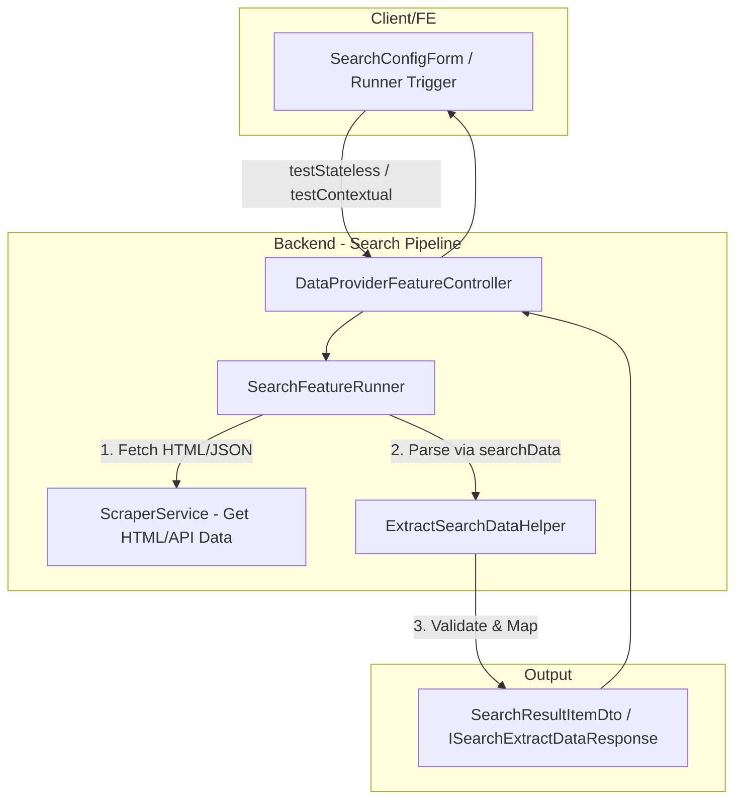

# Concept: Phân tách Cơ chế & DTO Trích xuất Dữ liệu giữa SEARCH và SCRAPING

## 1. Problem & Goal (Vấn đề & Mục tiêu)

### Problem (Vấn đề & Điểm nghẽn Hiện tại)
- **Bối cảnh & Điểm kích hoạt**: Khi chạy tính năng Tìm kiếm (`DataProviderFeatureType.SEARCH`), hệ thống đang tái sử dụng trực tiếp `GenericDataProviderScraperService` và `ExtractDataHelper` (`extract-data.helper.ts`).
- **Hiện tượng & Khiếm khuyết kỹ thuật**:
  1. **Contract Inconsistency**: `ExtractDataHelper.runFunctionExtractData` cưỡng chế thực thi hàm có tên `extractData(html)`. Trong khi đó, Frontend định nghĩa mẫu mặc định của tính năng Search là `searchData(html)` (`DEFAULT_SEARCH_FUNCTION_GENERATOR`), dẫn đến lỗi runtime `ReferenceError: extractData is not defined` hoặc phải đổi tên hàm trái tự nhiên.
  2. **Coupled DTO & Data Schema**: Return type của `ExtractDataHelper` và `IExtractDataResponse` đang bị gắn chặt vào `ScrapeItemDataResponseItemDto[]` (`{ id, url, mimeType, lastModified }` - schema phục vụ trích xuất tài nguyên/media đơn lẻ), trong khi kết quả của Search là danh sách sản phẩm/mục tìm kiếm (`ISearchResultItem[]` / `SearchResultItemDto[]` gồm `{ url, title, imageUrl, relativeUrl, ... }`).
  3. **Vi phạm Single Responsibility Principle (SRP)**: `ExtractDataHelper` phụ thuộc vào logic của Scraping (`mainContentSelector`, `isGetParentElement`, loại bỏ CSS/style của trang chi tiết), không tối ưu cho trang danh sách kết quả tìm kiếm vốn cần `resultSelector` và giữ cấu trúc list items.
- **Nguyên nhân cốt lõi (Root Cause)**: Thiết kế ban đầu gom chung toàn bộ logic trích xuất dữ liệu qua `IDataProviderScraperService` và `ExtractDataHelper` mà không phân tách abstraction layer giữa **Item Detail Scraping** và **Listing / Search Results Extraction**.
- **Tác động (Impact / Blast Radius)**: Gây lỗi khi validate/test search runner, sai lệch type contracts giữa Frontend và Backend, khó mở rộng các tính năng tìm kiếm nâng cao (phân trang, search API, lọc kết quả).

### Goal (Mục tiêu Kỹ thuật Cần đạt)
- **Mục tiêu cốt lõi**: Xây dựng cơ chế trích xuất dữ liệu và DTO độc lập, chuẩn hóa riêng cho `SEARCH`, tách rời hoàn toàn khỏi `SCRAPING`.
- **Tiêu chí nghiệm thu (Acceptance Criteria)**:
  - **Dedicated Search Helper / Extractor**: Cung cấp helper chuyên biệt (ví dụ `ExtractSearchDataHelper` hoặc hàm thực thi linh hoạt) hỗ trợ hàm thực thi của Search (hỗ trợ cả `searchData(html)` lẫn fallback `extractData(html)`).
  - **Dedicated Search DTOs & Interfaces**: Định nghĩa `SearchResultItemDto` / `ISearchResultItem` và response DTO riêng cho Search chứa các trường thông tin sản phẩm tìm kiếm (`url`, `title`, `imageUrl`, `relativeUrl`, `metadata?: Record<string, any>`).
  - **Decoupled Search Runner**: `SearchFeatureRunner` quản lý luồng fetch & parse riêng, không phụ thuộc vào `ScrapeItemDataResponseDto` của `GenericDataProviderScraperService`.
  - **Backward Compatibility**: Không làm ảnh hưởng hay break tính năng `SCRAPING` và `DISCOVERY` hiện có.

---

## 2. Scope Boundaries (Ranh giới Phạm vi)

- **In-Scope**:
  - Tạo DTO / Interfaces chuẩn cho kết quả Search (`SearchResultItemDto`, `ISearchExtractDataResponse`, `IRunSearchFunctionExtractData`).
  - Xây dựng hoặc tái cấu trúc helper trích xuất dữ liệu cho Search (`ExtractSearchDataHelper` hoặc mở rộng helper với generic/polymorphism) hỗ trợ hàm `searchData(html)`.
  - Cập nhật `SearchFeatureRunner` để sử dụng đúng Search Extraction pipeline và trả về Search DTOs.
  - Đồng bộ contracts giữa Backend và Frontend `SearchConfigForm` / runner validation endpoints.
  - Cập nhật unit tests cho `SearchFeatureRunner` và extraction helpers liên quan.

- **Explicit Out-of-Scope**:
  - Thay đổi kiến trúc lưu trữ database của `DataProviderFeatureEntity` (giữ nguyên JSON config `ISearchTargetConfig`).
  - Viết lại toàn bộ module `ScraperService` (Puppeteer / HTTP fetcher core).
  - Triển khai tính năng AI auto-generation cho script tìm kiếm (nằm ở milestone khác).

---

## 3. Proposed Solution & Core Mechanism (Giải pháp Đề xuất & Cơ chế)

### 3.1. So sánh các Phương án Kiến trúc (Solution Options)

| Tiêu chí | Option 1: Dedicated Search Helper & DTOs (Recommended) | Option 2: Generic Unified Engine (Generic Types) | Option 3: Inline Runner Execution |
| :--- | :--- | :--- | :--- |
| **Mô tả** | Tạo riêng `ExtractSearchDataHelper` + `SearchResultItemDto`, tách biệt `SearchFeatureRunner` khỏi `DataProviderScraperService`. | Giữ `ExtractDataHelper` nhưng chuyển sang Generic `<T>`, cho phép config tên entrypoint function (`searchData` vs `extractData`). | Chuyển toàn bộ logic chạy Function sandbox trực tiếp vào trong `SearchFeatureRunner`. |
| **Ưu điểm** | - Tuân thủ triệt để SRP & Clean Architecture.<br>- Dễ test độc lập.<br>- DTO rõ ràng, type-safe giữa FE & BE. | - Tái sử dụng được 1 class helper duy nhất.<br>- Ít file mới. | - Nhanh, gói gọn trong 1 file runner. |
| **Nhược điểm** | - Thêm 1 helper class và vài interface mới. | - Helper vẫn chứa logic rẽ nhánh phức tạp (`if (isSearch) ...`).<br>- Khó cô lập lỗi giữa các features. | - Vi phạm SRP, runner ôm đồm cả DOM parsing sandbox, khó mock test. |
| **Độ phức tạp** | **Vừa phải (Standard / Clean)** | **Thấp - Trung bình** | **Thấp nhưng Nợ Kỹ thuật cao** |
| **Đánh giá** | ⭐ **Khuyến nghị lựa chọn** | Cân nhắc nếu muốn tối giản số lượng file | Không khuyến nghị |

---

### 3.2. Core Mechanism (Option 1 - Khuyến nghị)



1. **`ExtractSearchDataHelper` Pipeline**:
   - Nhận payload: `{ htmlContent, functionGenerator, resultSelector, maxResults }`.
   - Sandbox Function hỗ trợ linh hoạt:
     ```javascript
     const runFn = new Function('cheerio', `
       return (html) => {
         ${functionString}
         if (typeof searchData === 'function') return searchData(html);
         if (typeof extractData === 'function') return extractData(html);
         throw new Error('Neither searchData nor extractData function is defined');
       }
     `)(cheerio);
     ```
   - Trả về danh sách `SearchResultItemDto[]` gồm các trường chuẩn hóa (`url`, `title`, `imageUrl`, `relativeUrl`, `metadata`).

2. **`SearchFeatureRunner` Workflow**:
   - Sử dụng `ScraperService` để lấy HTML nguồn theo `searchUrl` được build từ pattern và keyword.
   - Gọi trực tiếp `ExtractSearchDataHelper` thay vì đi qua `GenericDataProviderScraperService` (vốn chỉ dành cho `SCRAPING`).
   - Xử lý limit `maxResults` và format chuẩn response `ISearchExtractDataResponse`.

---

## 4. Critical Risks & Edge Cases (Rủi ro & Kịch bản Biên)

1. **Legacy Configs / Backward Compatibility**:
   - *Rủi ro*: Một số cấu hình Search cũ có thể đang viết hàm `extractData(html)` thay vì `searchData(html)`.
   - *Chiến lược xử lý*: Helper kiểm tra cả `typeof searchData === 'function'` và fallback về `typeof extractData === 'function'`.
2. **Selector Không Tìm Thấy Kết Quả (Empty Results)**:
   - *Rủi ro*: Function trả về mảng rỗng `[]` khi từ khóa không có sản phẩm.
   - *Chiến lược xử lý*: Phân biệt rõ giữa *Lỗi thực thi (Runtime Error / Syntax Error)* và *Kết quả rỗng hợp lệ (`[]`)* để không throw `BadRequestException` sai lệch.
3. **Malformed Output Item Structure**:
   - *Rủi ro*: Function trả về dữ liệu không đúng format object/array.
   - *Chiến lược xử lý*: Sanitize và validate đầu ra, lọc các item không có `url` hoặc parse lỗi.
