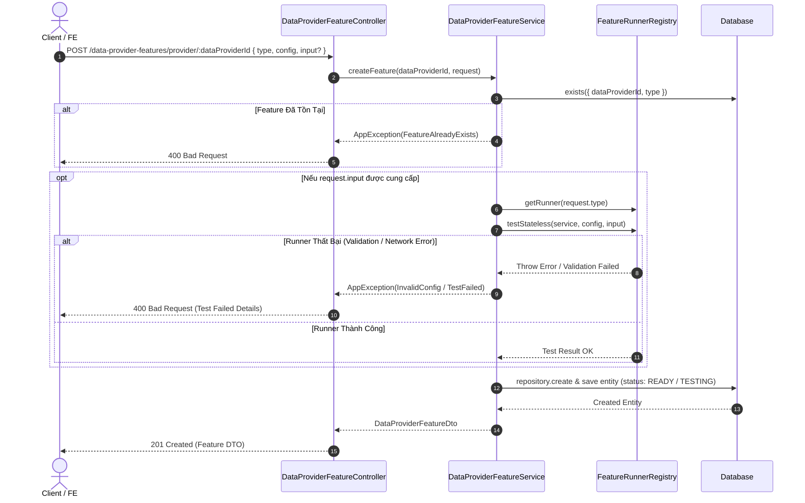

# Concept: Nâng Cấp Data Provider Feature Service & Controller

## 1. Problem & Goal (Vấn đề & Mục tiêu)

### Problem (Vấn đề & Điểm nghẽn Hiện tại)
- **Bối cảnh & Điểm kích hoạt**: 
  - Khi người dùng cấu hình một tính năng mới (Data Provider Feature như `SCRAPING`, `SEARCH`, `DISCOVERY`) và gửi request tạo feature (`POST /data-provider-features/...`), hệ thống hiện tại lưu trực tiếp cấu hình vào cơ sở dữ liệu mà không có bước chạy thử nghiệm (test sandbox/stateless) để xác thực tính hợp lệ của cấu hình với dữ liệu thực tế (`input`).
  - Khi thực hiện kiểm thử tính năng qua endpoint `POST /data-provider-features/test`, kết quả trả về có thể chứa hàng chục đến hàng trăm records, gây quá tải payload, chậm trễ phản hồi trên UI preview/sandbox và lãng phí băng thông.
  - Các route trong `DataProviderFeatureController` đang chứa tiền tố thừa `data-providers/` (ví dụ: `GET /data-provider-features/data-providers/:dataProviderId`), gây rườm rà và không đồng bộ với chuẩn RESTful API ngắn gọn của hệ thống.
- **Hiện tượng & Khiếm khuyết kỹ thuật**:
  - `CreateDataProviderFeatureRequestDto` và `DataProviderFeatureService.createFeature` thiếu trường `input?: Record<string, unknown>` để trigger test execution trước khi persist vào DB.
  - `testStateless` của `DataProviderFeatureController` (hoặc các runner tương ứng) trả về toàn bộ danh sách kết quả mà không có cơ chế slice/limit cho sandbox preview.
  - Path mapping trong `DataProviderFeatureController` bị thừa tiền tố `data-providers/` gây redundant URL structure.
- **Nguyên nhân cốt lõi (Root Cause)**:
  - Chưa tích hợp cơ chế pre-validation (chạy runner stateless với sample input) trong flow tạo feature.
  - Thiếu middleware/logic cắt ngắn (slice top 3) cho kết quả trả về trong context test/sandbox.
  - Routing path ban đầu được định nghĩa nguyên văn theo entity name thay vì tối ưu hóa resource identifier.
- **Tác động (Impact / Blast Radius)**:
  - User có thể tạo feature với cấu hình lỗi mà không hề hay biết cho tới khi job thực thi thất bại (tăng error rate, trip circuit breaker).
  - Tải trọng payload sandbox lớn làm chậm UI dev tool / scraper designer.
  - Route path thay đổi đòi hỏi cập nhật tương ứng ở Frontend endpoint (`only-one-fe/src/config/endpoint.ts`).

### Goal (Mục tiêu Kỹ thuật Cần đạt)
- **Mục tiêu cốt lõi**:
  - Cho phép người dùng truyền `input` tùy chọn khi gọi API tạo feature (`createFeature`). Nếu có `input`, hệ thống bắt buộc thực thi kiểm thử (`testStateless`) trước khi lưu; nếu kiểm thử không đạt hoặc lỗi cú pháp/logic thì reject ngay lập tức (fail-fast).
  - Chuẩn hóa kết quả trả về từ endpoint `testStateless` (và khi test trong `createFeature`): tự động giới hạn tối đa 3 kết quả mẫu (`slice(0, 3)`) trong mảng dữ liệu trích xuất (`data`).
  - Tinh gọn các route path trong `DataProviderFeatureController`, loại bỏ tiền tố thừa `data-providers`, đồng thời cập nhật đồng bộ các endpoint liên quan trên FE.
- **Tiêu chí nghiệm thu (Acceptance Criteria)**:
  - `CreateDataProviderFeatureRequestDto` bổ sung thuộc tính `@ObjectFieldOptional() input?: Record<string, unknown>`.
  - Trong `DataProviderFeatureService.createFeature`, nếu `request.input` tồn tại: gọi `runnerRegistry.getRunner(request.type).testStateless(...)` với `request.config` và `request.input`.
    - Nếu runner quăng lỗi / trả về thất bại: ném `AppException` / `BadRequestException` và hủy tạo feature.
    - Nếu runner thành công: tạo feature entity và có thể gán trạng thái khởi tạo phù hợp (`READY` hoặc `TESTING`).
  - Endpoint `POST /data-provider-features/test` (hoặc runner tương ứng) đảm bảo mảng `data` trong response chỉ chứa tối đa 3 items đầu tiên.
  - Đổi các route path trong `DataProviderFeatureController`:
    - `GET data-providers/:dataProviderId` $\rightarrow$ `GET provider/:dataProviderId`
    - `GET data-providers/:dataProviderId/:type` $\rightarrow$ `GET provider/:dataProviderId/:type`
    - `POST data-providers/:dataProviderId` $\rightarrow$ `POST provider/:dataProviderId`
  - Đồng bộ `API_ENDPOINT.DATA_PROVIDER_FEATURES` trong `only-one-fe/src/config/endpoint.ts`.

---

## 2. Scope Boundaries (Ranh giới Phạm vi)

- **In-Scope**:
  - Backend:
    - Cập nhật DTO `CreateDataProviderFeatureRequestDto` thêm trường `input`.
    - Cập nhật `DataProviderFeatureService.createFeature`: inject/sử dụng `FeatureRunnerRegistry` để test trước khi insert DB nếu có `input`.
    - Cập nhật `DataProviderFeatureController.testStateless` hoặc Runner logic để giới hạn kết quả trả về $\le 3$ items.
    - Refactor route path trong `DataProviderFeatureController` (bỏ tiền tố `data-providers`).
  - Frontend:
    - Cập nhật file `src/config/endpoint.ts` trong `only-one-fe` tương ứng với các route mới.
- **Explicit Out-of-Scope**:
  - Không thay đổi schema bảng `data_provider_features` trong Database (không lưu trường `input` vào DB).
  - Không thay đổi hành vi của contextual runner khi chạy production job scraping / discovery thực tế.
  - Không refactor các controller khác ngoài phạm vi `DataProviderFeatureController`.

---

## 3. Solution Options & Trade-offs (Các Phương án Giải pháp)

### Option 1: Inline Validation trong Service & Truncate tại Controller (Khuyến nghị)
- **Cơ chế**:
  - Trong `DataProviderFeatureService.createFeature`: nếu `request.input` có giá trị, gọi trực tiếp `runner.testStateless(request.service, request.config, request.input)`. Nếu thành công, set status = `READY` (hoặc `TESTING`), nếu thất bại thì throw error và không lưu entity.
  - Trong `DataProviderFeatureController.testStateless`: sau khi nhận response từ runner, nếu response có trường `data` dạng mảng thì gán `response.data = response.data.slice(0, 3)`.
  - Đổi route path sang dạng `provider/:dataProviderId` (vừa rõ ràng ngữ nghĩa providerId, vừa tránh xung đột với `:id`).
- **Ưu điểm**:
  - Đơn giản, tường minh, không làm ảnh hưởng đến các service crawler bên dưới khi cần lấy full kết quả cho mục đích khác.
  - Tiết kiệm thời gian xử lý, dễ viết unit test.
- **Nhược điểm**:
  - Vẫn tải full data trong crawler memory trước khi slice tại controller/runner. (Tuy nhiên với môi trường test 1 URL đơn lẻ, điều này hoàn toàn nhẹ và an toàn).

### Option 2: Runner-Level Truncation & Mandatory Pre-test
- **Cơ chế**:
  - Sửa trực tiếp bên trong từng Runner (`ScrapingFeatureRunner`, `SearchFeatureRunner`, `DiscoveryRunner`) để giới hạn `limit = 3` ngay khi thực thi extract.
  - Bắt buộc `input` là trường bắt buộc (mandatory) khi gọi `createFeature`.
- **Ưu điểm**:
  - Tiết kiệm tối đa parsing memory nếu trích xuất danh sách siêu lớn.
- **Nhược điểm**:
  - Breaking change nếu client muốn tạo feature dạng draft/unconfigured trước mà chưa có ngay URL test.
  - Can thiệp sâu vào code logic của từng runner cụ thể thay vì xử lý tập trung tại feature level.

$\rightarrow$ **Quyết định đề xuất**: Áp dụng **Option 1** vì tính linh hoạt (cho phép tạo draft nếu không truyền `input`, nhưng nếu truyền `input` thì tự động test & fail-fast nếu sai) và truncation tại controller/runner output level đảm bảo payload luôn gọn gàng ($\le 3$ items).

---

## 4. Proposed Solution & Core Mechanism (Giải pháp Đề xuất & Cơ chế)

### 4.1. Sequence Diagram: Luồng Tạo Feature có Pre-Test


### 4.2. Chi tiết Thay Đổi API Routing & Data Truncation

#### 1. Routing Path chuẩn hóa:
| Phương thức | Path Cũ | Path Mới | Ý nghĩa |
| :--- | :--- | :--- | :--- |
| `GET` | `/data-provider-features/data-providers/:dataProviderId` | `/data-provider-features/provider/:dataProviderId` | Lấy danh sách feature theo provider ID |
| `GET` | `/data-provider-features/data-providers/:dataProviderId/:type` | `/data-provider-features/provider/:dataProviderId/:type` | Lấy feature theo provider ID và type |
| `POST` | `/data-provider-features/data-providers/:dataProviderId` | `/data-provider-features/provider/:dataProviderId` | Tạo mới feature cho provider |
| `GET` | `/data-provider-features/:id` | `/data-provider-features/:id` | Giữ nguyên (lấy theo feature ID) |
| `PUT` | `/data-provider-features/:id` | `/data-provider-features/:id` | Giữ nguyên (update config) |
| `POST` | `/data-provider-features/test` | `/data-provider-features/test` | Test sandbox (stateless) |

#### 2. Giới hạn 3 kết quả trong `testStateless`:
```typescript
@Post({
    path: 'test',
    summary: 'Test feature stateless (sandbox)',
})
async testStateless(@Body() request: TestFeatureStatelessRequestDto): Promise<any> {
    const runner = this.runnerRegistry.getRunner(request.type);
    const result = await runner.testStateless(request.service || ScraperServiceEnum.GENERIC, request.config, request.input);
    if (result && Array.isArray(result.data)) {
        result.data = result.data.slice(0, 3);
    }
    return result;
}
```

---

## 5. Critical Risks & Edge Cases (Rủi ro & Kịch bản Biên)

1. **FE Route Mismatch**:
   - *Rủi ro*: Việc đổi path từ `data-providers/:id` sang `provider/:id` có thể làm hỏng các hook gọi API trên Frontend nếu không cập nhật đồng thời.
   - *Biện pháp*: Cập nhật ngay `API_ENDPOINT.DATA_PROVIDER_FEATURES` trong `only-one-fe/src/config/endpoint.ts`.
2. **Timeout khi Test trong lúc Create Feature**:
   - *Rủi ro*: Nếu `request.input` trỏ tới website chậm hoặc dynamic rendering mất nhiều thời gian, request `createFeature` có thể bị timeout.
   - *Biện pháp*: Runner đã có cấu hình timeout sẵn (default 10s). Bắt và format ngoại lệ rõ ràng để trả về `AppException` với mã lỗi và thông báo chi tiết.
3. **Format Data Output Không Nhất Quán Giữa Các Runner**:
   - *Rủi ro*: Một số runner có thể trả về object đơn lẻ thay vì mảng `data`.
   - *Biện pháp*: Kiểm tra kiểu an toàn `if (result && Array.isArray(result.data))` trước khi `slice(0, 3)`.
