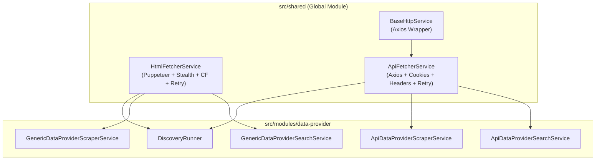

# Concept: Tách Biệt & Chuyển Dịch HtmlFetcherService và ApiFetcherService Về Shared Module

## 1. Problem & Goal (Vấn đề & Mục tiêu)

### Problem (Vấn đề & Điểm nghẽn Hiện tại)
- **Bối cảnh & Điểm kích hoạt**: Hiện tại, [scraper.service.ts](file:///Users/kiem/Sources/PERSONAL/only-one-be/src/modules/data-provider/services/scraper.service.ts) đang nằm cục bộ trong `src/modules/data-provider/services/` và ôm đồm 2 trách nhiệm hoàn toàn khác nhau:
  1. Quản lý lifecycle của Puppeteer Browser, stealth mode, bypass Cloudflare, wait selector để lấy mã nguồn HTML (`getHtmlContent`).
  2. Xử lý HTTP request bằng Axios/BaseHttpService với retry loop, cookies, custom headers, query params để lấy JSON data (`getApiContent`).
- **Hiện tượng & Khiếm khuyết kỹ thuật**:
  - Tên gọi `ScraperService` gây hiểu nhầm (tưởng chỉ cào HTML), nhưng thực chất chứa cả logic gọi API.
  - Các service con (`ApiDataProviderScraperService`, `ApiDataProviderSearchService`) phải inject `ScraperService` chỉ để dùng hàm `getApiContent`, tạo ra sự coupling không cần thiết với thư viện Puppeteer.
  - Tại [discovery.runner.ts](file:///Users/kiem/Sources/PERSONAL/only-one-be/src/modules/data-provider/runners/discovery.runner.ts), nhánh API (`runApiDiscovery`) lại đang gọi trực tiếp `BaseHttpService.get` ad-hoc thay vì tái sử dụng cơ chế retry, cookie, query params chuẩn hóa.
- **Nguyên nhân cốt lõi (Root Cause)**: Vi phạm Single Responsibility Principle (SRP) và đặt các service tiện ích có tính dùng chung (shared utilities) trong domain module thay vì tầng `src/shared`.
- **Tác động (Impact / Blast Radius)**:
  - Code phân tán, khó tái sử dụng cho các module khác (ví dụ `simulation` hay các module crawl trong tương lai).
  - Khó khăn trong việc viết unit test và mock các tầng network/browser độc lập.

### Goal (Mục tiêu Kỹ thuật Cần đạt)
- **Mục tiêu cốt lõi**:
  - Tách `ScraperService` thành 2 service chuyên trách:
    1. **`HtmlFetcherService`** (hoặc `WebScraperService`): Chuyên trách render/crawl HTML bằng Puppeteer (Stealth, Adblocker, Cloudflare, wait selector, retry).
    2. **`ApiFetcherService`**: Chuyên trách gửi HTTP API requests (Axios via `BaseHttpService` với retry loop, delay, cookies, headers, queryParams, timeout).
  - Di chuyển cả 2 service này về `src/shared/services/` và đăng ký vào `@Global()` [SharedModule](file:///Users/kiem/Sources/PERSONAL/only-one-be/src/shared/shared.module.ts).
  - Xóa bỏ `scraper.service.ts` cũ và cập nhật toàn bộ injection points trong module `data-provider`.
- **Tiêu chí nghiệm thu (Acceptance Criteria)**:
  - Tạo `src/shared/services/html-fetcher.service.ts` và `src/shared/services/api-fetcher.service.ts`.
  - Khai báo và export trong `SharedModule`.
  - Xóa `src/modules/data-provider/services/scraper.service.ts`.
  - Cập nhật dependency injection tại các callers:
    - `DiscoveryRunner`: inject `HtmlFetcherService` và `ApiFetcherService`.
    - `ApiDataProviderScraperService` & `ApiDataProviderSearchService`: inject `ApiFetcherService`.
    - `GenericDataProviderScraperService` & `GenericDataProviderSearchService` & `ScrapingDataService`: inject `HtmlFetcherService`.
  - Build TypeScript `npx tsc -p tsconfig.build.json --noEmit` và ESLint vượt qua 100% không lỗi.

## 2. Scope Boundaries (Ranh giới Phạm vi)
- **In-Scope**:
  - Tạo `src/shared/services/html-fetcher.service.ts` (kế thừa logic Puppeteer từ `scraper.service.ts`).
  - Tạo `src/shared/services/api-fetcher.service.ts` (kế thừa logic Axios API từ `scraper.service.ts`).
  - Cập nhật `src/shared/shared.module.ts`.
  - Refactor các callers trong `src/modules/data-provider/` (Runners, Services, Module).
  - Xóa `scraper.service.ts` cũ sau khi di chuyển và refactor hoàn tất.
- **Explicit Out-of-Scope**:
  - Không sửa đổi logic core của các Helpers (`ExtractDataHelper`, `ExtractSearchDataHelper`, `DiscoveryValidationHelper`).
  - Không thay đổi schema DB hay các enum (`ScraperServiceEnum` vẫn giữ nguyên giá trị `API`, `GENERIC`, `LOCAL`).
  - Không thay đổi hành vi nghiệp vụ của Puppeteer hay BaseHttpService.

## 3. Proposed Solution & Core Mechanism (Giải pháp Đề xuất & Cơ chế)

### Solution Comparison (So sánh Tên gọi & Kiến trúc)

| Tiêu chí | Phương án 1 (Recommended): `HtmlFetcherService` & `ApiFetcherService` | Phương án 2: `WebScraperService` & `ApiClientService` | Phương án 3: `BrowserCrawlerService` & `HttpFetcherService` |
| :--- | :--- | :--- | :--- |
| **Tên Service HTML** | `HtmlFetcherService` (`html-fetcher.service.ts`) | `WebScraperService` (`web-scraper.service.ts`) | `BrowserCrawlerService` (`browser-crawler.service.ts`) |
| **Tên Service API** | `ApiFetcherService` (`api-fetcher.service.ts`) | `ApiClientService` (`api-client.service.ts`) | `HttpFetcherService` (`http-fetcher.service.ts`) |
| **Ưu điểm** | - Thể hiện rõ mục đích hành động (Fetch HTML vs Fetch API). - Nhất quán về hậu tố `FetcherService`. - Phù hợp hoàn hảo với cả crawling, scraping và API ingestion. | - Tên gọi quen thuộc trong giới scraping. | - Nhấn mạnh nền tảng (Browser vs HTTP). |
| **Độ rõ nghĩa** | Rất cao | Cao | Trung bình |

---

### Core Mechanism & Phân chia Trách nhiệm

1. **`HtmlFetcherService` (`src/shared/services/html-fetcher.service.ts`)**:
   - Chuyên trách Puppeteer lifecycle (`getBrowser`, `handleCloudflare`, `configurePage`).
   - Phương thức chính: `getHtmlContent(url: string, targetConfig: ITargetConfig): Promise<IScraperResponse>`.
   - Quản lý `OnModuleDestroy` để đóng browser instance an toàn khi app shutdown.

2. **`ApiFetcherService` (`src/shared/services/api-fetcher.service.ts`)**:
   - Inject `BaseHttpService`.
   - Phương thức chính: `fetchApiContent(url: string, targetConfig: ITargetConfig, lastScrapedTimestamp?: Date): Promise<IScraperResponse>` (hoặc alias `getApiContent`).
   - Xử lý retry loop, cookies transformation, dynamic headers, query params injection.

3. **Tích hợp vào `SharedModule`**:
   - Thêm `HtmlFetcherService` và `ApiFetcherService` vào danh sách `providers` và `exports` của `SharedModule`.

## 4. Critical Risks & Edge Cases (Rủi ro & Kịch bản Biên)
- **Puppeteer Resource Leak**: Đảm bảo `HtmlFetcherService` giữ nguyên cơ chế `onModuleDestroy()` và `page.close()` trong retry loop / catch block để không bị treo zombie Chrome processes.
- **Shared Module Circular Dependency**: Cả 2 service trong `src/shared` chỉ phụ thuộc vào `BaseHttpService`, `LoggerService` và interfaces, tuyệt đối không import ngược entity hay service từ `src/modules/data-provider`.
- **TargetConfig Interface Location**: Đảm bảo `ITargetConfig` và `IScraperResponse` có thể được import an toàn mà không gây circular dependency (đặt trong `src/shared/interfaces/` hoặc export qua `src/modules/data-provider/interfaces/`).
