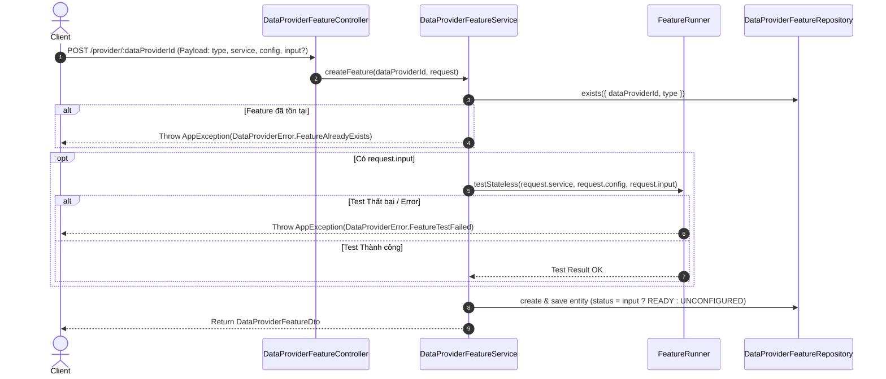
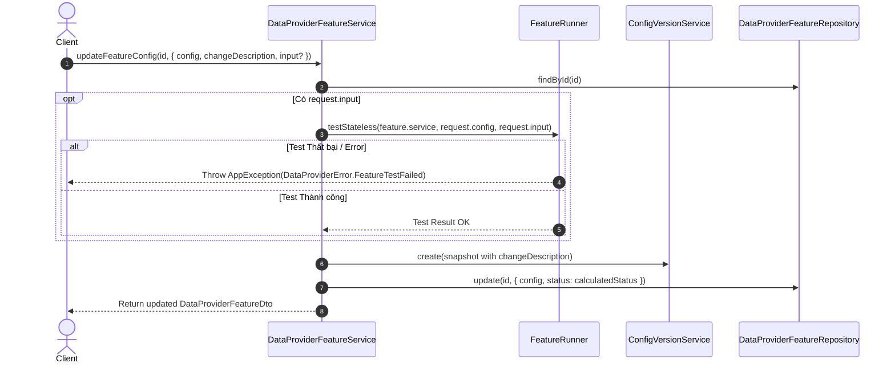
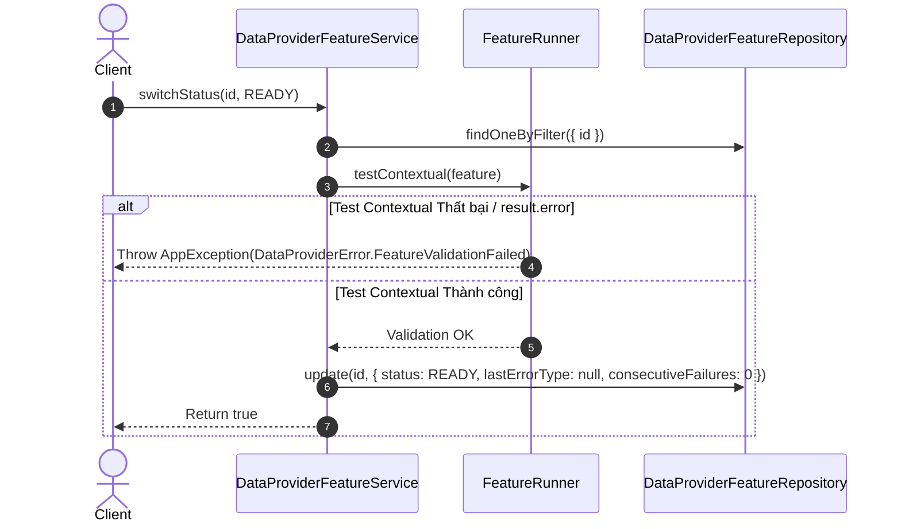

# Concept: Cải tiến Validation & Luồng Kiểm thử DTO/Service Data Provider Feature

## 1. Problem & Goal (Vấn đề & Mục tiêu)

### Problem (Vấn đề & Điểm nghẽn Hiện tại)
- **Bối cảnh & Điểm kích hoạt**: Các API quản lý `DataProviderFeature` (tạo mới `createFeature`, cập nhật cấu hình `updateFeatureConfig`, chuyển đổi trạng thái `switchStatus` và DTO liên quan).
- **Hiện tượng & Khiếm khuyết kỹ thuật**:
  1. Trong `CreateDataProviderFeatureRequestDto`, trường `service` hiện đang là optional (`@EnumFieldOptional`), dù đây là thông tin runtime bắt buộc để xác định scraper engine ngay từ đầu.
  2. Trong `UpdateFeatureConfigRequestDto`, trường `changeDescription` đang là optional dẫn đến việc lưu snapshot version thiếu lý do/mô tả thay đổi rõ ràng; đồng thời trường `service` vẫn có mặt trong payload update dù `service` là thuộc tính bất biến (immutable) không được phép chỉnh sửa sau khi tạo feature.
  3. `UpdateFeatureConfigRequestDto` chưa hỗ trợ trường `input`, khiến cho việc cập nhật cấu hình mới không thể test nhanh (sandbox validation) trước khi lưu.
  4. Trong `createFeature`, khi truyền `request.input`, runner gọi `testStateless` nhưng nếu runner trả về kết quả lỗi (chứa field `error`), hệ thống vẫn tiếp tục tạo feature và gán trạng thái `READY` thay vì dừng lại và báo lỗi.
  5. Trong `switchStatus` chuyển sang `READY`, phương thức gọi `runner.testContextual` nhưng cần đảm bảo chắc chắn rằng chỉ khi test thành công hoàn toàn thì mới thực hiện cập nhật status thành `READY` và reset failure counters.
  6. Các Runners (`ScrapingFeatureRunner`, `SearchFeatureRunner`) đang dùng hardcoded `BadRequestException` thay vì chuẩn hóa theo `AppException` và `DataProviderError` (IAppError).
- **Nguyên nhân cốt lõi (Root Cause)**:
  - DTO decorator chưa áp dụng strict validation rules (`@EnumField`, `@StringField`).
  - Thiếu kiểm tra điều kiện thành công (success assertion) đối với kết quả trả về từ `testStateless` / `testContextual` trước khi thực thi side effects (tạo record DB, tạo config version, update status).
  - Chưa quy hoạch đầy đủ các mã lỗi chuẩn (`IAppError`) trong `DataProviderError` cho các lỗi kiểm thử và validation runner.
- **Tác động (Impact / Blast Radius)**:
  - Dữ liệu config không hợp lệ có thể lọt vào database với trạng thái `READY`, gây lỗi runtime hàng loạt trong worker discovery / scraping.
  - Snapshot `ConfigVersion` bị thiếu metadata mô tả thay đổi.
  - Lỗi trả về client thiếu mã `code` chuẩn hóa và i18n support.

### Goal (Mục tiêu Kỹ thuật Cần đạt)
- **Mục tiêu cốt lõi**:
  - Chuẩn hóa validation rules cho Request DTOs: `service` bắt buộc khi tạo, `changeDescription` bắt buộc khi sửa, loại bỏ `service` khỏi payload cập nhật, bổ sung `input` optional vào update payload.
  - Đảm bảo tính toàn vẹn luồng kiểm thử: Chỉ commit DB / update status khi các bước test (`testStateless`, `testContextual`) hoàn toàn thành công (pass validation).
  - Chuẩn hóa toàn bộ lỗi trong Runner/Service sang `AppException` với các mã lỗi chuẩn trong `DataProviderError` (`IAppError`).
- **Tiêu chí nghiệm thu (Acceptance Criteria)**:
  - `CreateDataProviderFeatureRequestDto.service` là bắt buộc (`@EnumField`).
  - `UpdateFeatureConfigRequestDto.changeDescription` là bắt buộc (`@StringField`).
  - `UpdateFeatureConfigRequestDto.service` bị loại bỏ; thêm `input?: Record<string, unknown>` optional.
  - Khi gọi `createFeature` với `input`: nếu `testStateless` thất bại (trả về `error` hoặc ném lỗi), hệ thống ném `AppException` với mã lỗi chuẩn và không tạo entity.
  - Khi gọi `updateFeatureConfig` với `input`: nếu `testStateless` thất bại, hủy toàn bộ quá trình cập nhật (không tạo version snapshot, không update config) và ném `AppException`.
  - Khi gọi `switchStatus` sang `READY`: chỉ update status khi `testContextual` pass thành công.
  - Mọi ngoại lệ trong Runner (`ScrapingFeatureRunner`, `SearchFeatureRunner`) đều được chuẩn hóa sang `AppException(DataProviderError.*)`.

---

## 2. Scope Boundaries (Ranh giới Phạm vi)

- **In-Scope**:
  - Cập nhật DTO: `CreateDataProviderFeatureRequestDto`, `UpdateFeatureConfigRequestDto` trong `data-provider-feature-request.dto.ts`.
  - Khai báo các error codes chuẩn mới trong `DataProviderError` (`data-provider-error.ts`).
  - Chuẩn hóa Exception trong `ScrapingFeatureRunner` và `SearchFeatureRunner` sang `AppException(DataProviderError.*)`.
  - Cập nhật logic service: `createFeature`, `updateFeatureConfig`, `switchStatus` trong `data-provider-feature.service.ts`.
  - Cập nhật unit test liên quan trong backend `only-one-be`.
- **Explicit Out-of-Scope**:
  - Thay đổi schema database / TypeORM entity `DataProviderFeatureEntity`.
  - Chỉnh sửa logic của frontend forms (sẽ lập plan riêng ở FE nếu cần đồng bộ schema form).
  - Thay đổi cơ chế circuit breaker hoặc notification events.

---

## 3. Solution Options & Trade-offs (Giải pháp Kiến trúc)

### Option 1: Standardized AppException & Fail-Fast Exception-Driven Validation (Recommended)
- **Cơ chế**:
  - Mở rộng `DataProviderError` với các `IAppError` chuẩn: `MissingTestInput`, `MissingSearchTestInput`, `NoSampleItemFound`, `ScraperServiceNotFound(service)`, `SearchServiceNotFound(service)`, `FeatureTestFailed(error)`, `FeatureValidationFailed(error)`.
  - DTO decorators enforce validation ở tầng NestJS ValidationPipe (`@EnumField`, `@StringField`, loại bỏ `service` khỏi update DTO).
  - Tầng Runner (`ScrapingFeatureRunner`, `SearchFeatureRunner`): thay thế toàn bộ `BadRequestException` bằng `throw new AppException(DataProviderError.*)`. Trong `testStateless`: nếu kết quả trả về từ adapter có field `error`, ném `AppException(DataProviderError.FeatureTestFailed(result.error))`.
  - Trong `createFeature` & `updateFeatureConfig`: Khi có `input`, gọi `runner.testStateless(...)`. Vì runner áp dụng cơ chế fail-fast (ném `AppException`), luồng xử lý tự động ngắt nếu test không pass, ngăn chặn việc tạo entity / config snapshot không hợp lệ.
  - Trong `switchStatus(READY)`: `testContextual` ném `AppException` nếu validation không đạt `status === 'success'` hoặc có `error`, đảm bảo `super.update` chỉ chạy khi test thành công.
- **Ưu điểm**:
  - Tuân thủ 100% repository rules về centralized error handling với `IAppError` dictionary và `AllExceptionsFilter`.
  - Đồng nhất mã lỗi (`code`, `statusCode`, `message`, `params`) cho cả client REST API và frontend error display.
- **Nhược điểm / Trade-off**:
  - Cần update lại các mock/expectation trong unit test suites cho khớp với `AppException`.

---

## 4. Core Mechanism & Logic Flow (Cơ chế & Luồng Xử lý)

### 4.1. Luồng `createFeature` với Sandbox Input

### 4.2. Luồng `updateFeatureConfig` với Sandbox Input

### 4.3. Luồng `switchStatus(READY)`

---

## 5. Critical Risks & Edge Cases (Rủi ro & Kịch bản Biên)

1. **Scraper Service Network Timeout trong quá trình Create/Update**:
   - *Rủi ro*: Khi người dùng truyền `input` để verify trước khi save, nếu scraper engine bị timeout hoặc network lag, request tạo/sửa feature có thể bị chậm hoặc fail.
   - *Xử lý*: Giữ timeout hợp lý trên HTTP service client; nếu fail, request tạo/sửa bị reject an toàn qua `AppException` (không tạo dirty record).
2. **Error Translation & Consistency**:
   - *Rủi ro*: Client nhận các lỗi không đồng nhất format nếu còn sót `BadRequestException`.
   - *Xử lý*: Toàn bộ runner và service sử dụng thống nhất `AppException(DataProviderError.*)`.
