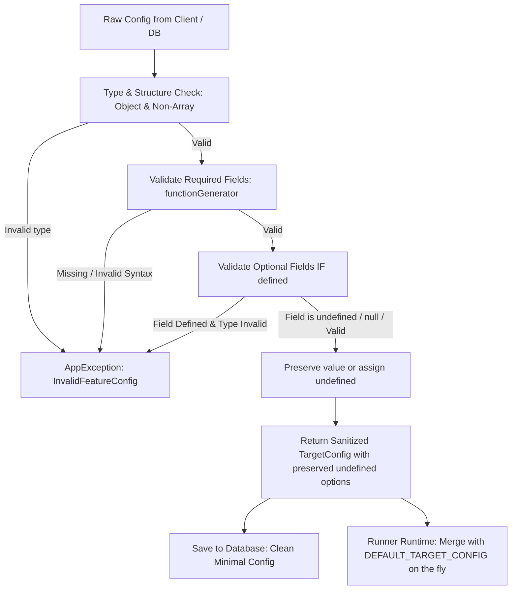

# Concept: Đồng bộ Giá trị Mặc định và Chuẩn hóa Validation TargetConfig giữa Backend & Frontend

## 1. Problem & Goal (Vấn đề & Mục tiêu)

### Problem (Vấn đề & Điểm nghẽn Hiện tại)
- **Bối cảnh & Điểm kích hoạt**: Khi người dùng cấu hình các tính năng (Scraping Feature, Search Feature) từ Frontend hoặc qua API, payload `config` (TargetConfig) được gửi lên Backend để lưu trữ và thực thi (Sandbox test hoặc Runner thực tế).
- **Hiện tượng & Khiếm khuyết kỹ thuật**:
  - `TargetConfigValidatorHelper` trên Backend hiện chỉ kiểm tra một số ít trường cơ bản (`functionGenerator`, `timeout`, `retryAttempts`, `retryDelay`, `waitForTimeout`, `cookies`, `headers`, `searchUrlPattern`, `queryPlaceholder`, `resultSelector`).
  - Thiếu validation cho các trường quan trọng khác: `maxResults`, `mainContentSelector`, `waitForSelector`, `userAgent`, `queryParams`, `firstQueryParams`, và các boolean flags (`isGetParentElement`, `stealthMode`, `cloudflareBypass`, `javascriptEnabled`, `imagesEnabled`, `cssEnabled`).
  - Backend hoàn toàn thiếu bộ hằng số giá trị mặc định (`DEFAULT_TARGET_CONFIG`, `DEFAULT_SEARCH_TARGET_CONFIG`) đồng bộ với Frontend (`FE constants.ts`), dẫn đến việc nếu client gửi payload khuyết trường hoặc test stateless với config tối giản, Backend Runner có thể nhận các giá trị `undefined` gây hành vi không nhất quán giữa UI và Server Runtime.
- **Nguyên nhân cốt lõi (Root Cause)**:
  - Chưa có module/hằng số dùng chung (Single Source of Truth) định nghĩa default config trên Backend.
  - `TargetConfigValidatorHelper` chưa thực hiện normalize / merge fallback default values khi validate.
- **Tác động (Impact / Blast Radius)**:
  - Dữ liệu config lưu trong database có thể bị phân mảnh (thiếu fields hoặc sai kiểu dữ liệu).
  - Runner khi chạy Chromium/Cheerio/API có thể hoạt động sai kỳ vọng (ví dụ `timeout` hoặc `maxResults` không có default fallback).

### Goal (Mục tiêu Kỹ thuật Cần đạt)
- **Mục tiêu cốt lõi**: Đồng bộ schema, default constants và validation logic của `TargetConfig` giữa Backend và Frontend; đảm bảo validation chặt chẽ nhưng **linh hoạt cho phép tất cả các trường optional được set về `undefined`** (không ép buộc fill dữ liệu thừa nếu không cần thiết).
- **Tiêu chí nghiệm thu (Acceptance Criteria)**:
  - **Hỗ trợ `undefined` cho Optional Fields**: Tất cả các trường optional (`mainContentSelector`, `waitForSelector`, `userAgent`, `queryParams`, `firstQueryParams`, `headers`, `cookies`, `searchUrlPattern`, `resultSelector`, `maxResults`, `retryAttempts`...) **đều hợp lệ khi mang giá trị `undefined`**. Validator chỉ thực hiện format & range validation khi giá trị trường đó `!== undefined`.
  - **Đồng bộ Constant**: Khai báo `DEFAULT_TARGET_CONFIG` và `DEFAULT_SEARCH_TARGET_CONFIG` trên Backend với các giá trị khớp 100% với Frontend (`maxResults: 10`, `timeout: 30000`, `retryDelay: 1000`, `retryAttempts: 3`, `waitForTimeout: 5000`, `javascriptEnabled: true`, `queryPlaceholder: '{query}'`...).
  - **Validation Toàn diện**: Mở rộng `TargetConfigValidatorHelper` để validate kiểu dữ liệu của tất cả các trường trong `IScrapingTargetConfig` và `ISearchTargetConfig`.
  - **Clean Config Sanitization**: Loại bỏ các key mang giá trị rỗng/vô nghĩa nếu client muốn reset về `undefined` (hoặc chuẩn hóa `null` -> `undefined` cho các trường optional).
  - **Bảo toàn Test Cases & Không phá vỡ API**: Không làm gián đoạn các tính năng hiện tại, pass toàn bộ unit test của runners.

## 2. Scope Boundaries (Ranh giới Phạm vi)
- **In-Scope**:
  - Tạo hằng số `DEFAULT_TARGET_CONFIG` và `DEFAULT_SEARCH_TARGET_CONFIG` tại `modules/data-provider/constants/data-provider-config.constant.ts`.
  - Refactor `TargetConfigValidatorHelper` để validate toàn diện tất cả các thuộc tính của `IScrapingTargetConfig` và `ISearchTargetConfig`.
  - Đảm bảo cơ chế validation của `TargetConfigValidatorHelper` tôn trọng `undefined` cho toàn bộ optional fields, không ép buộc gán giá trị mặc định vào DB nếu client chủ động muốn để `undefined`.
  - Cập nhật unit tests cho `TargetConfigValidatorHelper` và `FeatureRunner`.
- **Explicit Out-of-Scope**:
  - Không thay đổi cấu trúc database schema hay bảng `data_provider_features`.
  - Không thay đổi API contract của các endpoint (payload structure giữ nguyên).
  - Không refactor logic parsing của các Scraper Services (Cheerio, Puppeteer, API fetcher).

## 3. Proposed Solution & Core Mechanism (Giải pháp Đề xuất & Cơ chế)

### So sánh các Phương án Giải pháp (Solution Options)

| Tiêu chí | Phương án 1: Pure Validation (Chỉ Validate Khi Field Defined) | Phương án 2 (Recommended): Selective Validation + Explicit `undefined` Preservation | Phương án 3: Force Merge All Defaults vào DB Record |
| :--- | :--- | :--- | :--- |
| **Mô tả** | Chỉ validate type khi trường `!== undefined`. Giữ nguyên mọi trường optional ở dạng `undefined` nếu không truyền vào. | Validate chi tiết từng trường khi `!== undefined`. Trả về clean object bảo toàn các giá trị `undefined` cho optional fields; trong khi Runner runtime sẽ dùng `DEFAULT_TARGET_CONFIG` làm fallback an toàn khi thực thi. | Bắt buộc merge mọi field thiếu với `DEFAULT_TARGET_CONFIG` và lưu cả object đầy đủ xuống database. |
| **Ưu điểm** | Đơn giản, tôn trọng cấu trúc database gọn nhẹ. | **Tối ưu nhất**: DB chỉ lưu đúng các trường người dùng tùy biến (hoặc `undefined`), Runner runtime vẫn có fallback an toàn, không bị phình JSON hay mất dấu vết optional fields. | Dữ liệu DB đồng nhất 100% về số lượng key. |
| **Nhược điểm** | Thiếu bộ constant tham chiếu chung. | Cần tách bạch rõ: Config lưu trữ trong DB (giữ `undefined`) vs Config runtime đưa vào Runner (fallback defaults). | Không thể reset một trường optional về `undefined` (bị ghi đè bởi default value). |
| **Độ phức tạp** | Thấp (Low) | Trung bình (Medium - Linh hoạt & Chuẩn nhất) | Trung bình (Medium) |

### Chi tiết Cơ chế Thực thi (Option 2 - Recommended)



1. **Khai báo Constants (`data-provider-config.constant.ts`)**:
   ```typescript
   export const DEFAULT_TARGET_CONFIG: IScrapingTargetConfig = {
       maxResults: 10,
       retryDelay: 1000,
       retryAttempts: 3,
       timeout: 30000,
       waitForTimeout: 5000,
       isGetParentElement: false,
       stealthMode: false,
       cloudflareBypass: false,
       javascriptEnabled: true,
       imagesEnabled: false,
       cssEnabled: false,
   };

   export const DEFAULT_SEARCH_TARGET_CONFIG: ISearchTargetConfig = {
       ...DEFAULT_TARGET_CONFIG,
       queryPlaceholder: '{query}',
   };
   ```

2. **Validation & `undefined` Handling Rules trong `TargetConfigValidatorHelper`**:
   - `functionGenerator`: **Bắt buộc**, chuỗi không rỗng, cú pháp JS hợp lệ (`new Function(...)`).
   - **Các trường Number Optional** (`maxResults`, `retryAttempts`, `retryDelay`, `timeout`, `waitForTimeout`):
     - Nếu `undefined` hoặc `null` $\rightarrow$ cho phép và trả về `undefined`.
     - Nếu có giá trị $\rightarrow$ kiểm tra kiểu `number`, số nguyên/dương/không âm theo từng trường.
   - **Các trường Boolean Optional** (`isGetParentElement`, `stealthMode`, `cloudflareBypass`, `javascriptEnabled`, `imagesEnabled`, `cssEnabled`):
     - Nếu `undefined` hoặc `null` $\rightarrow$ cho phép và trả về `undefined`.
     - Nếu có giá trị $\rightarrow$ kiểm tra kiểu `boolean`.
   - **Các trường String Optional** (`mainContentSelector`, `waitForSelector`, `userAgent`, `queryParams`, `firstQueryParams`, `searchUrlPattern`, `queryPlaceholder`, `resultSelector`):
     - Nếu `undefined` hoặc `null` $\rightarrow$ cho phép và trả về `undefined`.
     - Nếu có giá trị $\rightarrow$ kiểm tra kiểu `string`.
   - **Headers / Cookies**:
     - Nếu `undefined` hoặc `null` $\rightarrow$ cho phép và trả về `undefined`.
     - Nếu có giá trị $\rightarrow$ validate cấu trúc mảng cookie / object headers.

## 4. Critical Risks & Edge Cases (Rủi ro & Kịch bản Biên)
- **Khả năng Reset trường về `undefined`**: Khi người dùng xóa một selector (ví dụ xóa `waitForSelector` trên form FE), payload gửi lên `{ waitForSelector: undefined }` hoặc `{ waitForSelector: '' }` phải được xử lý để lưu `undefined` xuống DB, không bị ép quay lại giá trị cũ hay default không mong muốn.
- **Null vs Undefined**: Client JSON serialize có thể biến `undefined` thành trường vắng mặt (omitted) hoặc gửi `null`. Helper cần đối xử `null` tương đương `undefined` đối với các optional fields để tránh crash.
- **Runner Runtime Fallback**: Runner (`ScrapingFeatureRunner`, `SearchFeatureRunner`) khi đọc `config` từ DB nếu gặp các trường `undefined` sẽ áp dụng `targetConfig.timeout ?? DEFAULT_TARGET_CONFIG.timeout` trong lúc chạy thực tế mà không làm biến đổi bản ghi trong DB.

