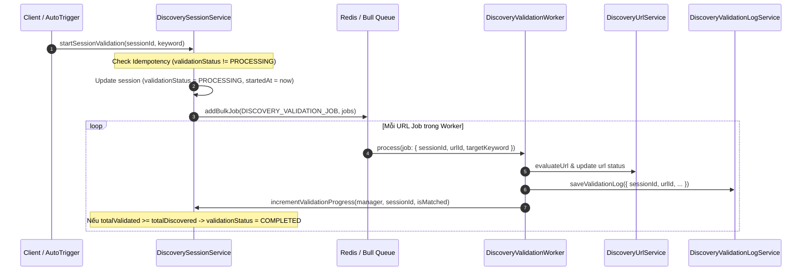

# Concept: Hợp nhất Validation Batch vào DiscoverySession & Loại bỏ DiscoveryValidationBatchEntity

## 1. Problem & Goal (Vấn đề & Mục tiêu)

### Problem (Vấn đề & Điểm nghẽn Hiện tại)
- **Bối cảnh & Điểm kích hoạt**: Khi quá trình cào hoàn tất hoặc khi người dùng kích hoạt xác thực từ giao diện (`POST /discovery-validations/:sessionId/validate`), hệ thống tạo một thực thể `DiscoveryValidationBatchEntity` riêng biệt.
- **Hiện tượng & Khiếm khuyết kỹ thuật**:
  - Tồn tại mối quan hệ 1-N dư thừa giữa `DiscoverySessionEntity` và `DiscoveryValidationBatchEntity`.
  - Dữ liệu tiến độ xác thực bị phân mảnh giữa 2 bảng (`discovery_sessions` lưu `totalValidated`, còn `discovery_validation_batches` lưu `processedUrls`, `matchedUrls`, `noMatchUrls`, `status`).
  - Gây phát sinh các bảng và service trung gian không cần thiết (`DiscoveryValidationBatchEntity`, `DiscoveryValidationBatchService`), phức tạp hóa query tìm latest batch và cờ `isLatestLog`.
- **Nguyên nhân cốt lõi (Root Cause)**: Thiết kế ban đầu tách rời Validation Batch như một thực thể độc lập nhiều vòng đời cho 1 session, trong khi thực tế mỗi Discovery Session chỉ có duy nhất 1 chu trình xác thực URL tương ứng với kết quả cào.
- **Tác động (Impact / Blast Radius)**: Dữ liệu phân mảnh, rủi ro race condition giữa các batch cùng session, code thừa thãi nhiều tầng abstraction.

### Goal (Mục tiêu Kỹ thuật Cần đạt)
- **Mục tiêu cốt lõi**: Hợp nhất toàn bộ trạng thái và chỉ số của Validation Batch trực tiếp vào `DiscoverySessionEntity`; xóa bỏ hoàn toàn bảng `discovery_validation_batches` và `DiscoveryValidationBatchService`.
- **Tiêu chí nghiệm thu (Acceptance Criteria)**:
  - `DiscoverySessionEntity` quản lý trực tiếp các chỉ số xác thực: `validationStatus`, `matchedUrls`, `noMatchUrls`, `validationStartedAt`, `validationCompletedAt`, `validationReasonCancelled`.
  - `IDiscoveryValidationJob` tinh gọn payload: `{ sessionId, urlId, targetKeyword }` (loại bỏ `batchId`).
  - Xóa bỏ entity `DiscoveryValidationBatchEntity`, DTO `DiscoveryValidationBatchDto`, service `DiscoveryValidationBatchService`.
  - `DiscoveryValidationLogEntity` liên kết trực tiếp với `DiscoverySessionEntity` qua `sessionId` (loại bỏ cột `validation_batch_id`).
  - Đảm bảo tính Idempotency: Khi session đang ở trạng thái `validationStatus = PROCESSING`, chặn các request kích hoạt xác thực trùng lặp.

---

## 2. Scope Boundaries (Ranh giới Phạm vi)

- **In-Scope**:
  - Cập nhật `DiscoverySessionEntity`, `DiscoverySessionDto` bổ sung các trường validation metrics.
  - Cập nhật `DiscoveryValidationLogEntity` loại bỏ quan hệ với Batch.
  - Cập nhật `IDiscoveryValidationJob` trong queue module.
  - Chuyển logic kích hoạt, hủy và cập nhật tiến độ validation trực tiếp vào `DiscoverySessionService`.
  - Cập nhật `DiscoveryValidationWorkerProcessor` để cập nhật tiến độ trực tiếp trên `DiscoverySessionEntity`.
  - Cập nhật `DiscoveryValidationController` và endpoint liên quan.
  - Xóa bỏ file `discovery-validation-batch.entity.ts`, `discovery-validation-batch.dto.ts`, `discovery-validation-batch.service.ts`.
- **Explicit Out-of-Scope**:
  - Không thay đổi thuật toán đánh giá khớp URL trong `DiscoveryValidationHelper`.
  - Không thay đổi luồng xử lý `revalidateDiscoveredUrl` hay `submitUserAction` của `DiscoveryUrlService`.
  - Không thay đổi cơ chế worker concurrency của Bull Queue.

---

## 3. Proposed Solution & Core Mechanism (Giải pháp Đề xuất & Cơ chế)

### 3.1. Cấu trúc Data Model Hợp nhất
```typescript
// DiscoverySessionEntity
@Column({ type: 'varchar', length: 20, default: ValidationBatchStatus.PENDING })
validationStatus: ValidationBatchStatus;

@Column({ type: 'integer', default: 0 })
matchedUrls: number;

@Column({ type: 'integer', default: 0 })
noMatchUrls: number;

@Column({ type: 'timestamptz', nullable: true })
validationStartedAt?: Date;

@Column({ type: 'timestamptz', nullable: true })
validationCompletedAt?: Date;

@Column({ type: 'text', nullable: true })
validationReasonCancelled?: string;
```

### 3.2. Workflow / Logic Flow


---

## 4. Critical Risks & Edge Cases (Rủi ro & Kịch bản Biên)

1. **Race Condition khi cập nhật tiến độ đồng thời**:
   - *Rủi ro*: Nhiều worker xử lý xong cùng lúc có thể gây ghi đè số lượng `totalValidated`, `matchedUrls`, `noMatchUrls`.
   - *Giải pháp*: Sử dụng atomic increment query trong TypeORM:
     ```typescript
     await manager
         .createQueryBuilder()
         .update(DiscoverySessionEntity)
         .set({
             totalValidated: () => 'total_validated + 1',
             matchedUrls: () => (isMatched ? 'matched_urls + 1' : 'matched_urls'),
             noMatchUrls: () => (!isMatched ? 'no_match_urls + 1' : 'no_match_urls'),
         })
         .where('id = :sessionId', { sessionId })
         .execute();
     ```
2. **Kích hoạt xác thực trùng lặp (Double Trigger)**:
   - *Rủi ro*: Người dùng click liên tiếp hoặc hệ thống autoValidate gọi cùng lúc với manual trigger.
   - *Giải pháp*: Check `session.validationStatus === ValidationBatchStatus.PROCESSING` và ném exception `ValidationAlreadyRunning`.
