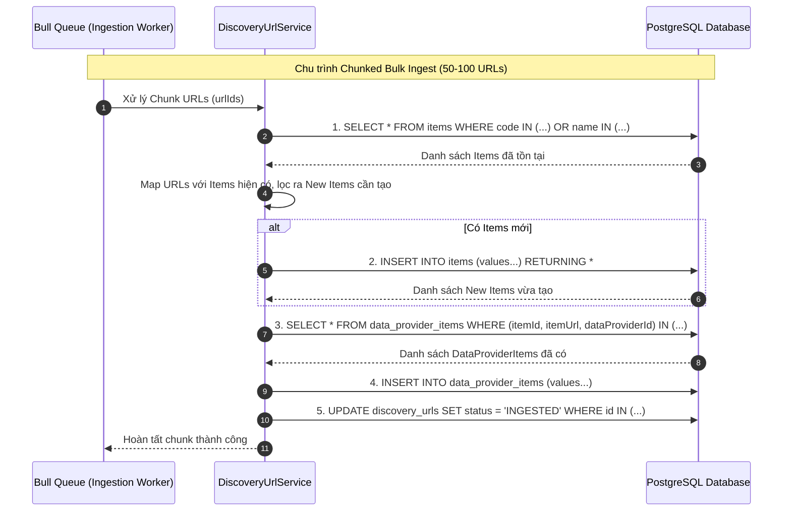

# Concept: Tối ưu hóa Truy vấn & Pipeline Ingest Discovery URL

## 1. Problem & Goal (Vấn đề & Mục tiêu)

### Problem (Vấn đề & Điểm nghẽn Hiện tại)
- **Bối cảnh & Điểm kích hoạt**: Khi thực hiện quá trình ingest URL từ Discovery Session vào hệ thống thông qua `DiscoveryUrlService.ingestDiscoveredUrl` hoặc xử lý background queue trong `DiscoveryIngestionWorkerProcessor`.
- **Hiện tượng & Khiếm khuyết kỹ thuật**: Với mỗi URL, hệ thống thực thi tuần tự từ 5 đến 7 truy vấn database I/O riêng biệt (`findOne` URL $\rightarrow$ `findOne` Item by code $\rightarrow$ `findOne` Item by name $\rightarrow$ `create` Item $\rightarrow$ `findOne` DataProviderItem $\rightarrow$ `create` DataProviderItem $\rightarrow$ `update` URL status). Trong kịch bản batch processing, số lượng query nhân lên theo hệ số $O(7N)$, làm tăng database roundtrip latency và chiếm dụng connection pool.
- **Nguyên nhân cốt lõi (Root Cause)**:
  - Triển khai theo mô hình *Check-Then-Act* phân mảnh, thiếu query kết hợp (`OR` condition) hoặc atomic upsert.
  - Phân rã batch thành các BullMQ jobs đơn lẻ (1 URL / job) thay vì xử lý theo chunk/batch, dẫn đến việc không tận dụng được bulk query/insert.
  - Tiềm ẩn rủi ro *Race Condition* khi nhiều worker concurrent xử lý các URL có cùng item code hoặc name.
- **Tác động (Impact / Blast Radius)**:
  - Hiệu năng hệ thống suy giảm mạnh khi ingest số lượng lớn URL (hàng nghìn records).
  - Tăng nguy cơ timeout hoặc nghẽn hàng đợi (queue backpressure).

### Goal (Mục tiêu Kỹ thuật Cần đạt)
- **Mục tiêu cốt lõi**: Giảm thiểu triệt để số lượng database queries cho cả luồng ingest đơn lẻ và luồng xử lý hàng loạt (batch ingestion), tăng throughput ingestion lên gấp nhiều lần và đảm bảo an toàn toàn vẹn dữ liệu.
- **Tiêu chí nghiệm thu (Acceptance Criteria)**:
  - **Single Ingest**: Giảm số query từ 5-7 queries xuống còn 2-3 queries cho mỗi URL đơn lẻ thông qua query kết hợp và logic tối ưu.
  - **Batch Ingest (Worker)**: Hỗ trợ xử lý theo chunks (50–100 URLs / job), gom các thao tác đọc và ghi thành bulk queries (`In(...)`, bulk insert/update), giảm số roundtrips xuống $O(5)$ queries cho toàn bộ chunk.
  - **Idempotency & Race-Condition Safe**: Đảm bảo an toàn khi xử lý trùng lặp mã sản phẩm/tên trong cùng batch hoặc giữa các concurrent workers.

---

## 2. Scope Boundaries (Ranh giới Phạm vi)

- **In-Scope**:
  - Tối ưu hóa hàm `ingestDiscoveredUrl` trong `DiscoveryUrlService` (gộp query tra cứu `Item` theo `code` và `name` trong 1 query `OR`).
  - Xây dựng phương thức bulk ingestion (`ingestDiscoveredUrlsChunk` hoặc xử lý bulk) để phục vụ cho các batch job.
  - Cập nhật payload và logic xử lý của `DiscoveryIngestionWorkerProcessor` để hỗ trợ xử lý theo batch/chunk.
  - Đảm bảo cơ chế fallback và backward-compatibility cho các lời gọi ingest đơn lẻ hiện tại.
- **Explicit Out-of-Scope**:
  - Không thay đổi logic thuật toán trích xuất mã định danh `extractCodeFromUrl`.
  - Không thay đổi cấu trúc bảng / migration database schema của `Item`, `DataProviderItem` và `DiscoveryUrl`.

---

## 3. Proposed Solution & Core Mechanism (Giải pháp Đề xuất & Cơ chế)

### Core Mechanism
Áp dụng mô hình **Dual-Layer Ingestion Optimization**:
1. **Layer 1 - Single Query Consolidation**: Tối ưu hóa `ingestDiscoveredUrl` bằng cách thay thế 2 query tuần tự tìm Item bằng 1 query với điều kiện `WHERE (code = :code OR name = :name)`, sau đó ưu tiên map theo `code` trước trong bộ nhớ (in-memory evaluation).
2. **Layer 2 - Chunked Bulk Pipeline**:
   - `batchIngest` phân chia danh sách URLs cần xử lý thành các chunk kích thước chuẩn (e.g. 50 URLs).
   - Đẩy chunk jobs vào Bull Queue `DISCOVERY_INGESTION_JOB`.
   - Worker xử lý từng chunk qua 5 bước bulk:
     1. Bulk trích xuất `codes` và `names` từ danh sách URLs.
     2. Bulk fetch `Item` hiện có với `In(codes)` và `In(names)`.
     3. Bulk insert các `Item` mới chưa tồn tại.
     4. Bulk query & insert các bản ghi `DataProviderItem`.
     5. Bulk update trạng thái của toàn bộ URL trong chunk thành `INGESTED`.

### Workflow / Logic Flow

---

## 4. Critical Risks & Edge Cases (Rủi ro & Kịch bản Biên)

- **Trùng lặp trong cùng một Chunk (In-chunk Duplication)**: Nhiều URL trong cùng 1 chunk có thể trỏ tới cùng 1 `code` hoặc `name`.
  - *Mitigation*: Thực hiện deduplication trong memory trước khi bulk insert `Item` để tránh unique constraint violation.
- **Partial Failure trong Chunk**: Một URL bị lỗi dữ liệu có thể làm fail toàn bộ chunk.
  - *Mitigation*: Sử dụng database transaction có kiểm soát hoặc cơ chế catch-and-fallback phân loại status (đánh dấu URL lỗi thành `FAILED`, các URL hợp lệ vẫn hoàn tất `INGESTED`).
- **Concurrent Chunk Collision**: Hai worker chạy 2 chunk khác nhau chứa cùng 1 Item mới.
  - *Mitigation*: Sử dụng cơ chế upsert (`INSERT ... ON CONFLICT DO NOTHING`) hoặc transaction retry strategy khi insert Item.
