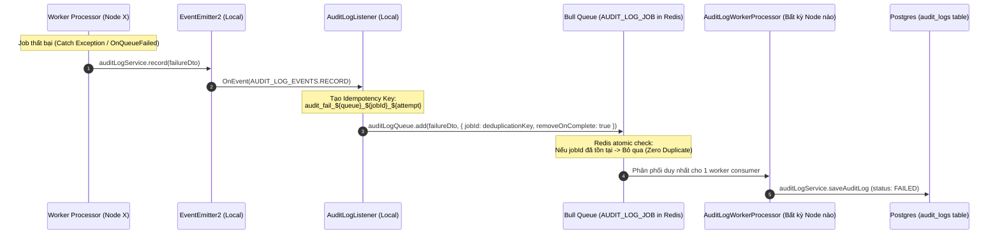

# Concept: Triển khai Event-Driven Failure Audit Log cho Worker Processors (Chống trùng lặp đa Node)

## 1. Problem & Goal (Vấn đề & Mục tiêu)

### Problem (Vấn đề & Điểm nghẽn Hiện tại)
- **Bối cảnh & Điểm kích hoạt**: Khi các Worker Processors (`ScrapingWorkerProcessor`, `DiscoverySearchWorkerProcessor`, `DiscoveryValidationWorkerProcessor`) xử lý các background jobs gặp lỗi kỹ thuật (timeout, CAPTCHA, parser fail, database connection error, rate limit...).
- **Hiện tượng & Khiếm khuyết kỹ thuật**: Lỗi hiện tại chỉ được ghi log cục bộ qua `LoggerService` (Winston/Console output). Không có bản ghi `AuditLogEntity` nào được tạo ra trong cơ sở dữ liệu để truy vết lịch sử thất bại, giám sát dashboard hoặc thống kê tỉ lệ lỗi worker.
- **Nguyên nhân cốt lõi (Root Cause)**: Các worker processors chưa tích hợp cơ chế dispatch sự kiện `audit.log.record` khi xảy ra exception hoặc khi job chuyển sang trạng thái thất bại (`OnQueueFailed` / `catch`).
- **Tác động & Thách thức đa Node (Impact & Multi-Node Challenge)**: 
  - Khó khăn trong việc hậu kiểm, điều tra nguyên nhân gián đoạn thu thập dữ liệu sản phẩm.
  - Khi triển khai hệ thống phân tán với nhiều worker nodes/instances (`WORKER_NODE_ENABLED=true` chạy trên nhiều server hoặc Kubernetes pods), việc phát sự kiện và retry của Bull Queue có nguy cơ gây ra **duplicate audit log records** (ghi đè hoặc nhân bản log lỗi trùng lặp cho cùng một job attempt).

### Goal (Mục tiêu Kỹ thuật Cần đạt)
- **Mục tiêu cốt lõi**: Xây dựng cơ chế tự động ghi nhận **Audit Log khi Job thất bại (`AuditStatus.FAILED`)** cho toàn bộ các worker processors trong hệ thống theo kiến trúc **Event-Driven**, đồng thời đảm bảo tính **Idempotency & Chống trùng lặp (Deduplication)** tuyệt đối trong môi trường đa node (multi-node / horizontal scaling).
- **Tiêu chí nghiệm thu (Acceptance Criteria)**:
  - Bắt toàn bộ lỗi (exceptions & queue failure events) tại 3 processors: `ScrapingWorkerProcessor`, `DiscoverySearchWorkerProcessor`, `DiscoveryValidationWorkerProcessor`.
  - Phát sự kiện `audit.log.record` qua `AuditLogService.record(...)` với đầy đủ metadata: `jobId`, `queueName`, `resourceId`, `attemptsMade`, `durationMs`, `errorMessage`, và stack trace tóm tắt.
  - Áp dụng cơ chế **Deterministic Bull JobId / Redis Idempotency Key** dựa trên `audit_fail:{queueName}:{jobId}:{attempt}` để ngăn chặn việc nhiều node cùng ghi lặp log cho 1 lần thất bại.
  - Không làm gián đoạn hoặc chặn (non-blocking) luồng xử lý chính của worker ngay cả khi việc ghi audit log gặp sự cố.

## 2. Scope Boundaries (Ranh giới Phạm vi)
- **In-Scope**:
  - Tích hợp phát sự kiện Failure Audit Log cho `ScrapingWorkerProcessor`, `DiscoverySearchWorkerProcessor`, `DiscoveryValidationWorkerProcessor`.
  - Bổ sung cấu trúc metadata chuẩn cho worker failures trong `RecordAuditLogDto`.
  - Cơ chế Deduplication / Idempotency Key trong `AuditLogListener` để bảo vệ hệ thống đa node.
  - Đảm bảo `AuditLogWorkerProcessor` xử lý và lưu trữ `AuditLogEntity` với `status = AuditStatus.FAILED`, `action = AuditAction.RUN_JOB`.
  - Unit tests cho failure audit logging tại các worker processors và listener.
- **Explicit Out-of-Scope**:
  - Không ghi audit log cho các job thành công (`AuditStatus.SUCCESS`) để tối ưu dung lượng DB và tránh nghẽn I/O (chỉ tập trung log lỗi/thất bại theo yêu cầu).
  - Không thay đổi nghiệp vụ cào dữ liệu, retry strategy hay cấu hình Bull queue hiện tại của từng processor.

## 3. Proposed Solution & Core Mechanism (Giải pháp Đề xuất & Cơ chế)

### So sánh các Phương án Kiến trúc (Architecture Options)

| Tiêu chí | Option 1: Inline Direct DB Save | Option 2: Pure EventEmitter (Không Deduplication) | Option 3: Event-Driven + Deterministic Bull JobId (Đề xuất) |
| :--- | :--- | :--- | :--- |
| **Cơ chế** | Worker gọi trực tiếp `AuditLogService.saveAuditLog()` trong catch block. | Worker emit event `audit.log.record`, listener đẩy job ngẫu nhiên vào queue. | Worker emit event, listener gán `jobId = audit_fail_{queue}_{jobId}_{attempt}` khi đẩy vào Bull Queue `AUDIT_LOG_JOB`. |
| **Độ trễ Worker** | Làm chậm worker vì phải chờ I/O DB đồng bộ. | Non-blocking, hoàn toàn bất đồng bộ. | Non-blocking, hoàn toàn bất đồng bộ. |
| **An toàn Đa Node** | Dễ bị race condition khi 2 node cùng xử lý/retry. | Dễ sinh Duplicate Logs khi retry hoặc phát trùng event. | **100% Idempotent**: Redis Bull Queue tự động từ chối duplicate jobId trên toàn cụm. |
| **Độ phức tạp** | Thấp | Rất thấp | Vừa phải, độ tin cậy tối đa. |
| **Đánh giá** | Không tối ưu hiệu năng | Tiềm ẩn lỗi duplicate log | **Tối ưu nhất (Khuyến nghị lựa chọn)** |

### Core Mechanism (Cơ chế Hoạt động Option 3)

### Chi tiết Dữ liệu Audit Log khi Worker Thất bại
- **`action`**: `AuditAction.RUN_JOB`
- **`status`**: `AuditStatus.FAILED`
- **`resource`**:
  - `ScrapingWorkerProcessor` $\rightarrow$ `AuditResource.CRAWLER_JOB`
  - `DiscoverySearchWorkerProcessor` $\rightarrow$ `AuditResource.DATA_PROVIDER` (hoặc `DISCOVERY_SESSION`)
  - `DiscoveryValidationWorkerProcessor` $\rightarrow$ `AuditResource.DISCOVERY_URL`
- **`resourceId`**: `scheduleJobEventId` / `sessionId` / `discoveryUrlId`
- **`errorMessage`**: Chuỗi thông báo lỗi (`error.message`)
- **`durationMs`**: Thời gian từ lúc bắt đầu xử lý đến lúc throw error (`Date.now() - startTime`)
- **`metadata`**: Chứa `{ queueName, jobId, attemptsMade, payload, stack: error.stack }`

## 4. Critical Risks & Edge Cases (Rủi ro & Kịch bản Biên)

| Kịch bản Biên (Edge Case) | Rủi ro Kỹ thuật | Giải pháp Xử lý |
| :--- | :--- | :--- |
| **Bull Retry nhiều lần** | Job bị fail 3 lần $\rightarrow$ có thể sinh ra 3 log trùng nếu không phân biệt attempt. | Key deduplication gắn liền với `job.attemptsMade`: `audit_fail_${queue}_${jobId}_${attemptsMade}` $\rightarrow$ ghi nhận chính xác từng lần fail mà không bị đè hay lặp. |
| **Event Loop Blocking** | Emit event làm chậm tiến trình xử lý worker tiếp theo. | `EventEmitter2` chạy non-blocking, listener đẩy job vào Redis với timeout ngắn. |
| **Redis Queue AUDIT_LOG_JOB bị đầy/lỗi** | Lỗi khi đẩy audit log làm crash worker chính. | Bọc `try/catch` an toàn trong `AuditLogListener` và `AuditLogService.record(...)` $\rightarrow$ ghi warning log, không throw làm ảnh hưởng worker job. |
| **Dữ liệu nhạy cảm trong error stack/payload** | Token, API keys trong error message bị lưu vào DB. | Tận dụng sẵn cơ chế `sanitizeData` trong `AuditLogService.saveAuditLog(...)` để làm sạch trước khi insert. |
