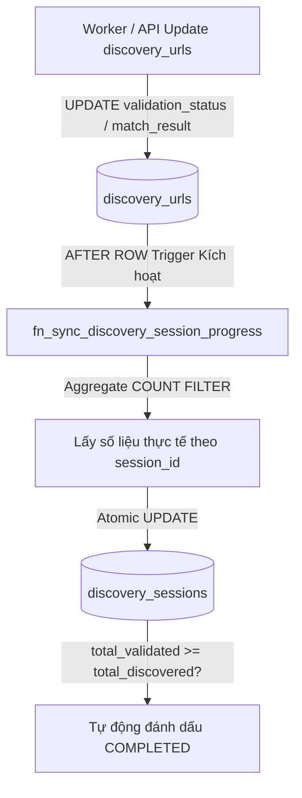

# Concept: Tự động Đồng bộ Tiến độ Discovery Session bằng PostgreSQL Trigger Function & Aggregation

## 1. Problem & Goal (Vấn đề & Mục tiêu)

### Problem (Vấn đề & Điểm nghẽn Hiện tại)
- **Bối cảnh & Điểm kích hoạt**: Khi worker xử lý validate từng URL thuộc `DiscoverySessionEntity`, hệ thống sử dụng phép cộng dồn tương đối (`total_validated + 1`, `matched_urls + 1`...).
- **Hiện tượng & Khiếm khuyết kỹ thuật**:
  - **Counter Drift (Lệch số đếm)**: Khi xảy ra retry job, worker crash giữa chừng, re-validation một URL nhiều lần, hoặc khi xóa/thêm URL thủ công, các con số đếm tăng dần (`+1`) bị lệch so với dữ liệu thực tế trong bảng `discovery_urls`.
  - **Logic rải rác & Dư thừa**: Tầng ứng dụng (NestJS) phải tự quản lý việc tăng counter, transaction lock và kiểm tra điều kiện hoàn thành session (`completeValidationIfFinished`).
- **Nguyên nhân cốt lõi (Root Cause)**: Phép cộng tăng dần (`+= 1`) là cơ chế *relative delta* không có tính tự phục hồi (*self-healing*), dễ mất đồng bộ khi có lỗi bất thường.
- **Tác động (Impact / Blast Radius)**: Báo cáo số lượng (`matchedUrls`, `noMatchUrls`, `totalValidated`) của session không phản ánh đúng 100% dữ liệu thực tế; trạng thái session có thể bị kẹt ở `PROCESSING` dù các URLs đã hoàn tất hoặc ngược lại.

### Goal (Mục tiêu Kỹ thuật Cần đạt)
- **Mục tiêu cốt lõi**: Chuyển đổi cơ chế cập nhật tiến độ session sang **PostgreSQL Trigger Function tự động tính toán tổng (Aggregate / COUNT & SUM)** trực tiếp từ bảng `discovery_urls`, đảm bảo tính chính xác tuyệt đối (*Single Source of Truth*).
- **Tiêu chí nghiệm thu (Acceptance Criteria)**:
  - Khi một bản ghi trong `discovery_urls` được `INSERT`, `UPDATE` (đổi `validation_status`, `match_result`), hoặc `DELETE`, Trigger Function tự động tính toán lại:
    - `total_discovered`: Tổng số URL thuộc session.
    - `total_validated`: Số URL có `validation_status = 'completed'`.
    - `matched_urls`: Số URL có `match_result IN ('exact_match', 'partial_match')`.
    - `no_match_urls`: Số URL có `match_result = 'no_match'`.
  - Tự động chuyển `validation_status` của `discovery_sessions` sang `COMPLETED` và cập nhật `validation_completed_at` khi `total_validated >= total_discovered` (với `total_discovered > 0`).
  - Tối ưu hóa hiệu năng câu query aggregate trong trigger bằng **Composite Partial Index** trên `discovery_urls(session_id, validation_status, match_result)`.
  - Loại bỏ hoàn toàn logic `incrementValidationProgress` và `completeValidationIfFinished` ở tầng NestJS code (`discovery-url.service.ts`).

---

## 2. Scope Boundaries (Ranh giới Phạm vi)

- **In-Scope**:
  - Tạo TypeORM migration chứa PostgreSQL Function & Trigger:
    - Function `fn_sync_discovery_session_progress()`.
    - Trigger `trg_sync_discovery_session_progress` trên bảng `discovery_urls` (`AFTER INSERT OR UPDATE OF validation_status, match_result OR DELETE`).
  - Tạo index hỗ trợ aggregate: `idx_discovery_urls_session_validation(session_id, validation_status, match_result)`.
  - Dọn dẹp mã nguồn NestJS: Xóa bỏ các hàm đếm thủ công trong `discovery-url.service.ts` và unit test tương ứng.
- **Explicit Out-of-Scope**:
  - Không thay đổi cấu trúc bảng `discovery_sessions` hoặc `discovery_urls` (giữ nguyên tên cột và kiểu dữ liệu).
  - Không thay đổi cơ chế enqueue Bull queue hay logic đánh giá `DiscoveryValidationHelper`.

---

## 3. Proposed Solution & Core Mechanism (Giải pháp Đề xuất & Cơ chế)

### Core Mechanism: PostgreSQL Trigger với Conditional Recalculation
Trigger function sẽ chỉ kích hoạt khi có sự thay đổi thực sự về trạng thái xác thực (`validation_status` hoặc `match_result`), sau đó thực hiện 1 câu lệnh `UPDATE` kèm `SELECT COUNT(...) FILTER (...)` atomic trên `discovery_sessions`.

```sql
CREATE OR REPLACE FUNCTION fn_sync_discovery_session_progress()
RETURNS TRIGGER AS $$
DECLARE
    v_session_id UUID;
    v_total_discovered INT;
    v_total_validated INT;
    v_matched_urls INT;
    v_no_match_urls INT;
BEGIN
    v_session_id := COALESCE(NEW.session_id, OLD.session_id);
    IF v_session_id IS NULL THEN
        RETURN NULL;
    END IF;

    -- Aggregate chính xác số liệu từ bảng discovery_urls
    SELECT 
        COUNT(*),
        COUNT(*) FILTER (WHERE validation_status = 'completed'),
        COUNT(*) FILTER (WHERE match_result IN ('exact_match', 'partial_match')),
        COUNT(*) FILTER (WHERE match_result = 'no_match')
    INTO 
        v_total_discovered,
        v_total_validated,
        v_matched_urls,
        v_no_match_urls
    FROM discovery_urls
    WHERE session_id = v_session_id;

    -- Cập nhật đồng bộ vào discovery_sessions
    UPDATE discovery_sessions
    SET 
        total_discovered = v_total_discovered,
        total_validated = v_total_validated,
        matched_urls = v_matched_urls,
        no_match_urls = v_no_match_urls,
        validation_status = CASE 
            WHEN validation_status = 'processing' AND v_total_validated >= v_total_discovered AND v_total_discovered > 0 THEN 'completed'
            ELSE validation_status 
        END,
        validation_completed_at = CASE 
            WHEN validation_status = 'processing' AND v_total_validated >= v_total_discovered AND v_total_discovered > 0 THEN NOW()
            ELSE validation_completed_at 
        END
    WHERE id = v_session_id;

    RETURN NULL;
END;
$$ LANGUAGE plpgsql;

CREATE TRIGGER trg_sync_discovery_session_progress
AFTER INSERT OR UPDATE OF validation_status, match_result OR DELETE
ON discovery_urls
FOR EACH ROW
EXECUTE FUNCTION fn_sync_discovery_session_progress();
```

### Workflow / Logic Flow


---

## 4. Critical Risks & Edge Cases (Rủi ro & Kịch bản Biên)

1. **Hiệu năng quét bảng khi session có lượng URL lớn ($N > 50,000$)**:
   - *Risk*: Câu lệnh `SELECT COUNT(*)` chạy trong mỗi row update có thể tốn CPU nếu không có index phù hợp.
   - *Mitigation*: Bắt buộc tạo Composite Index `(session_id, validation_status, match_result)` để Postgres thực hiện Index Only Scan cực nhanh (vài micro-giây).
2. **Row Lock Contention trên `discovery_sessions`**:
   - *Risk*: Nhiều worker threads cùng update các URLs của cùng 1 session sẽ đồng thời đợi lock dòng session đó.
   - *Mitigation*: Index Only Scan giúp thời gian giữ lock cực ngắn ($< 1ms$), loại bỏ nguy cơ deadlock.
3. **Session bị Cancelled**:
   - *Risk*: Trigger có thể vô tình ghi đè trạng thái `cancelled` thành `completed`.
   - *Mitigation*: Điều kiện `CASE WHEN validation_status = 'processing'` đảm bảo trigger không bao giờ ghi đè nếu session đang ở trạng thái `cancelled` hoặc `failed`.
