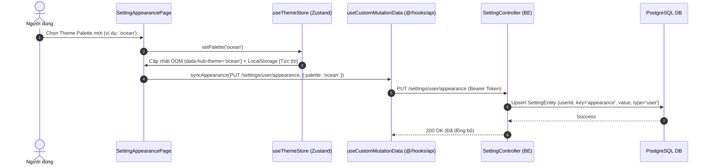

# Concept: Lưu trữ & Đồng bộ Cài đặt Giao diện (User Appearance Setting) xuống Backend

## 1. Problem & Goal (Vấn đề & Mục tiêu)

### Problem (Vấn đề & Điểm nghẽn Hiện tại)
- **Bối cảnh & Điểm kích hoạt**: Người dùng tùy biến tông màu giao diện (Theme Palette) tại trang Cài đặt Giao diện (`/setting/appearance`).
- **Hiện tượng & Khiếm khuyết kỹ thuật**: Trạng thái theme palette hiện tại chỉ được lưu cục bộ trong `window.localStorage` trên trình duyệt. Khi người dùng đăng nhập trên máy tính khác, đổi trình duyệt, hoặc xóa cache, cài đặt giao diện bị reset về mặc định (`HUB_THEME_PALETTE`).
- **Nguyên nhân cốt lõi (Root Cause)**: Chưa có kết nối giữa frontend Zustand theme store và module Backend `settings`. BE module `settings` hiện tại chỉ hỗ trợ `SettingType.GLOBAL` với cấu trúc CRUD chung theo `key`, chưa tối ưu hóa cho cài đặt cá nhân hóa của từng tài khoản (`User-specific Preference`).
- **Tác động (Impact / Blast Radius)**: Trải nghiệm người dùng (UX) bị gián đoạn, mất tính cá nhân hóa đa thiết bị; giới hạn khả năng mở rộng thêm các user preferences khác trong tương lai (ngôn ngữ, compact mode, default views).

### Goal (Mục tiêu Kỹ thuật Cần đạt)
- **Mục tiêu cốt lõi**: Mở rộng module Backend `settings` và nâng cấp Frontend Zustand Store `useThemeStore` (kết hợp các API hooks chuẩn `@/hooks/api`) để hỗ trợ lưu trữ, đồng bộ và tự động nạp cấu hình giao diện theo từng tài khoản (`User-specific`), đồng thời duy trì trải nghiệm hiển thị tức thì không bị giật (Zero FOUC - Flash of Unstyled Content).
- **Tiêu chí nghiệm thu (Acceptance Criteria)**:
  - **AC-1 (Optimistic UI & Non-blocking Sync)**: Khi người dùng đổi theme palette tại `/setting/appearance`, giao diện đổi màu ngay lập tức qua Zustand Store + LocalStorage, và tự động gọi API hook lưu xuống BE ngầm (với cơ chế debounce chống spam).
  - **AC-2 (Initial Load & Sync Flow)**: Khi người dùng đã đăng nhập mở ứng dụng, hệ thống tải nhanh theme từ `localStorage` để chống chớp giao diện (FOUC), sau đó revalidate/đồng bộ với dữ liệu từ BE qua Refine API hook.
  - **AC-3 (Fallback & Anonymous State)**: Khi người dùng chưa đăng nhập (hoặc mất kết nối mạng / lỗi API), hệ thống hoạt động bình thường với `localStorage` qua Zustand persist middleware mà không làm crash app hay chặn tương tác UI.
  - **AC-4 (Backend User Setting API)**: BE cung cấp endpoint lấy và cập nhật setting theo user authenticated (`GET /settings/user/:key` và `PUT /settings/user/:key` hoặc `upsert` tự động).

---

## 2. Scope Boundaries (Ranh giới Phạm vi)

- **In-Scope**:
  - **Backend (`only-one-be`)**:
    - Bổ sung `SettingType.USER = 'user'` vào enum `SettingType`.
    - Hỗ trợ lưu trữ setting gắn với `userId` (hoặc định danh user từ JWT payload qua `@User()`).
    - Viết endpoint `GET /settings/user/appearance` và `PUT /settings/user/appearance` (upsert theo `userId` + `key`).
  - **Frontend (`only-one-fe`)**:
    - Mở rộng Zustand Store `useThemeStore` quản lý `palette` (persist localStorage và áp dụng `data-hub-theme` trên DOM).
    - Loại bỏ `HubThemePaletteContext` để đơn giản hóa cây Provider.
    - Cập nhật hook `useSettingAppearancePage` sử dụng `useThemeStore` kết hợp API hook `useCustomMutationData` từ `@/hooks/api`.
    - Cơ chế đồng bộ theme khi session đăng nhập thay đổi hoặc khi khởi động ứng dụng qua Refine data layer.
- **Explicit Out-of-Scope**:
  - Quản trị viên can thiệp hoặc ép theme đồng loạt cho toàn bộ người dùng trong hệ thống (System Enforced Global Theme).
  - Tạo trang quản lý danh sách toàn bộ cài đặt hệ thống (General Setting Management Dashboard) - hoãn lại sang phase sau.
  - Tùy chỉnh màu sắc tùy ý (Custom Hex/RGB Color Picker) - hiện tại chỉ hỗ trợ các palette có sẵn trong `HUB_THEME_PALETTE_OPTIONS`.

---

## 3. Proposed Solution & Architecture (Giải pháp Đề xuất & Kiến trúc)

### So sánh các Phương án Kiến trúc (Solution Trade-offs)

| Tiêu chí | **Option 1: Mở rộng `settings` table hiện có (Khuyên dùng)** | **Option 2: Composite Key `user:{userId}:{key}`** | **Option 3: Tách bảng riêng `user_settings`** |
| :--- | :--- | :--- | :--- |
| **Mô tả** | Bổ sung cột `userId: string (nullable)` vào `SettingEntity` và thêm `SettingType.USER`. Hỗ trợ cả Global & User settings trên cùng 1 bảng. | Giữ nguyên bảng `settings`, lưu key dạng prefix `user:<uuid>:appearance`. | Tạo bảng mới `user_settings` riêng biệt hoàn toàn với `settings`. |
| **Ưu điểm** | Tái sử dụng toàn bộ hạ tầng CRUD, DTO, Repository của `SettingService`. Dễ mở rộng cho các setting cá nhân khác. | Không cần chỉnh sửa DB schema / migration. | Cách ly hoàn toàn dữ liệu global và user settings. |
| **Nhược điểm** | Cần cập nhật index hoặc unique constraint `(key, userId)`. | Khó truy vấn sạch, key dài, phụ thuộc convention chuỗi string. | Trùng lặp code CRUD, tạo thêm entity và module mới không cần thiết. |
| **Độ phức tạp** | **Thấp - Trung bình** (Clean & Tối ưu) | **Thấp** (Technical Debt cao) | **Trung bình - Cao** |

👉 **Lựa chọn**: **Option 1** – Tối ưu, tận dụng tối đa module `setting` sẵn có trên BE, bảo đảm tính mở rộng lâu dài và cấu trúc chuẩn Domain-Driven.

---

### UI Wireframe & State Matrix (Màn hình `/setting/appearance`)

```text
+-------------------------------------------------------------------------------+
|  Cài đặt > Giao diện                                                          |
+-------------------------------------------------------------------------------+
|  [Tông màu giao diện]                                                         |
|  Chọn palette cho nền app và các section. Tự động đồng bộ với tài khoản.     |
|                                                                               |
|  +-----------------------+  +-----------------------+  +--------------------+ |
|  | [===][===][===][===]  |  | [===][===][===][===]  |  | [===][===][===]... | |
|  | Mặc định          (v) |  | Tím Huyền Bí          |  | Xanh Đại Dương    | |
|  | Nền sáng thanh lịch   |  | Tông tím sang trọng   |  | Tông xanh mát      | |
|  +-----------------------+  +-----------------------+  +--------------------+ |
|                                                                               |
|  [Trạng thái đồng bộ]: (o) Đã lưu lên đám mây / [Icon loading nhỏ khi sync]  |
+-------------------------------------------------------------------------------+
```

#### UI State Handling Matrix
- **Initial / Cold Load**: Zustand persist nạp ngay giá trị từ `localStorage` và apply attribute DOM (chống giật FOUC). Khi user đăng nhập, app sync ngầm từ BE qua `useCustomData` và update Zustand store.
- **Palette Selection (Action)**:
  1. Trigger click -> `useThemeStore.setPalette(next)` -> State đổi tức thì (Optimistic UI), DOM & `localStorage` update ngay.
  2. Debounce -> Gọi `useCustomMutationData` (`PUT /settings/user/appearance` với payload `{ value: { palette: nextId } }`).
- **Error / Offline State**: Nếu API BE lỗi (mất mạng, 500), UI giữ nguyên màu đã chọn trong Zustand store và `localStorage`, hiển thị notification từ Refine mà không chặn tương tác người dùng.

---

### Core Data & Logic Flow



---

## 4. Critical Risks & Edge Cases (Rủi ro & Kịch bản Biên)

1. **Flash of Unstyled Content (FOUC)**:
   - *Rủi ro*: Nếu đợi API BE trả về mới gán theme, trang sẽ bị nhấp nháy màu trắng/mặc định mỗi khi F5 hoặc mở tab mới.
   - *Giải pháp*: Ưu tiên đọc `localStorage` đồng bộ ở tầng script/layout trước, sau đó đồng bộ ngầm với BE (SWR pattern).
2. **Spam Click & Race Condition**:
   - *Rủi ro*: Người dùng click liên tục vào nhiều palette khác nhau trong thời gian ngắn, dẫn đến nhiều request đồng thời gửi lên BE, request cũ có thể ghi đè request mới (Out-of-order response).
   - *Giải pháp*: Áp dụng debounce (300-500ms) kết hợp `AbortController` hủy request cũ trước khi gửi request mới.
3. **Session Switch / Logout**:
   - *Rủi ro*: User A đăng xuất, User B đăng nhập trên cùng trình duyệt nhưng vẫn bị dính theme của User A.
   - *Giải pháp*: Khi đăng nhập thành công, fetch lại user setting của User B và cập nhật đè `localStorage`. Khi đăng xuất, reset về theme mặc định của guest.
