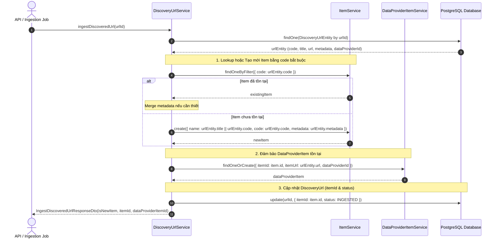

# Concept: Tái cấu trúc Schema DiscoveryUrl & Item, Thiết lập Quan hệ Trực tiếp và Tối ưu Hóa Luồng Ingest

## 1. Problem & Goal (Vấn đề & Mục tiêu)

### Problem (Vấn đề & Điểm nghẽn Hiện tại)

- **Bối cảnh & Điểm kích hoạt**: Trong quy trình Discovery và Ingestion của module `data-provider`, `DiscoveryUrlEntity` lưu trữ các URL được phát hiện qua crawling/search, sau đó được đưa vào hàm `ingestDiscoveredUrl` hoặc `ingestDiscoveredUrlsChunk` để chuyển đổi thành `ItemEntity` và `DataProviderItemEntity`.
- **Hiện tượng & Khiếm khuyết kỹ thuật**:
    - `DiscoveryUrlEntity` hiện chứa trường không còn sử dụng (`description`), nhưng lại thiếu trường mã định danh nghiệp vụ chuẩn `code` và trường linh hoạt `metadata`.
    - `DiscoveryUrlEntity` chưa có khóa ngoại / relationship liên kết trực tiếp tới `ItemEntity` (phải đi vòng qua `DataProviderItemEntity` hoặc URL mapping).
    - `ItemEntity` có trường `code` đang ở trạng thái `nullable: true`, khiến việc định danh và đối chiếu sản phẩm thiếu tính toàn vẹn dữ liệu (data integrity).
    - `ItemEntity` thiếu trường `metadata` (JSONB) để lưu trữ thông tin thuộc tính mở rộng được thu thập từ nguồn dữ liệu.
    - Logic hàm `ingestDiscoveredUrl` đang phải tự trích xuất `code` từ URL/Title runtime (`extractCodeFromUrl`) và thực hiện truy vấn đối chiếu phức tạp (fallback code OR name), trong khi `code` đáng lẽ đã được chuẩn hóa và gắn sẵn ngay từ khâu Discovery.
- **Nguyên nhân cốt lõi (Root Cause)**: Thiết kế schema giai đoạn đầu tách rời việc định danh item với discovery URL, cho phép nullable `code` và thiếu trường `metadata` đa dụng (dynamic key-value store), dẫn đến tầng service phải gánh logic suy diễn `code` không đồng bộ.
- **Tác động (Impact / Blast Radius)**:
    - Tăng nguy cơ trùng lặp hoặc sai lệch dữ liệu khi ingest.
    - Khó khăn trong việc truy vấn ngược từ `Item` xem nó được tạo / liên kết từ những `DiscoveryUrl` nào.
    - Schema không hỗ trợ lưu trữ metadata đa dạng từ các đối tác crawler khác nhau.

---

### Goal (Mục tiêu Kỹ thuật Cần đạt)

- **Mục tiêu cốt lõi**: Chuẩn hóa cấu trúc thực thể `DiscoveryUrlEntity` và `ItemEntity`, đảm bảo tính toàn vẹn của mã định danh `code`, bổ sung `metadata`, thiết lập liên kết quan hệ 1-N giữa `Item` và `DiscoveryUrl`, và tinh gọn logic của `ingestDiscoveredUrl` / `ingestDiscoveredUrlsChunk`.
- **Tiêu chí nghiệm thu (Acceptance Criteria)**:
    - **DiscoveryUrlEntity**:
        - Loại bỏ hoàn toàn trường `description`.
        - Bổ sung trường `code: string` (required, varchar/length phù hợp, indexed/unique phù hợp theo nghiệp vụ session/url).
        - Bổ sung trường `metadata?: Record<string, unknown>` (jsonb, nullable/default `{}`).
        - Bổ sung trường `itemId?: string` và relationship `@ManyToOne(() => ItemEntity, (item) => item.discoveryUrls)` (nullable trước khi ingest, populated sau khi ingest).
    - **ItemEntity**:
        - Cập nhật trường `code: string` thành bắt buộc (`nullable: false`, unique constraint).
        - Bổ sung trường `metadata?: Record<string, unknown>` (jsonb, default `{}`).
        - Bổ sung relationship `@OneToMany(() => DiscoveryUrlEntity, (d) => d.item)` liên kết tới `DiscoveryUrlEntity`.
    - **SearchResultItemDto**:
        - Bổ sung trường `code?: string`.
        - Loại bỏ trường `relativeUrl`.
        - Bổ sung trường `tags?: string[]`.
    - **DiscoveryUrlService (ingest logic)**:
        - Loại bỏ bước suy diễn `extractCodeFromUrl` bên trong `ingestDiscoveredUrl` vì `urlEntity.code` đã là trường bắt buộc có sẵn.
        - Tìm kiếm `Item` trực tiếp theo `urlEntity.code`. Nếu chưa tồn tại, tạo mới `Item` với `code: urlEntity.code`, `name: urlEntity.title || urlEntity.code`, và truyền `metadata` từ DiscoveryUrl sang Item.
        - Cập nhật `urlEntity.itemId = item.id` và chuyển trạng thái `status = DiscoveryUrlStatus.INGESTED`.
        - Đảm bảo tính nhất quán giữa cả `ingestDiscoveredUrl` (đơn lẻ) và `ingestDiscoveredUrlsChunk` (batch).

---

## 2. Scope Boundaries (Ranh giới Phạm vi)

### In-Scope

- Chỉnh sửa entity definitions (`discovery-url.entity.ts`, `item.entity.ts`).
- Cập nhật DTOs và Mappers tương ứng (`DiscoveryUrlDto`, `ItemDto`, `CreateItemDto`, `UpdateItemDto`, `SearchResultItemDto`, etc.).
- Cập nhật TypeORM migration / schema definition (nếu có migration script).
- Tái cấu trúc hàm `ingestDiscoveredUrl` và `ingestDiscoveredUrlsChunk` trong `discovery-url.service.ts`.
- Cập nhật các service/tests phụ thuộc liên quan đến `ItemService.create` (yêu cầu `code`) và `DiscoveryUrlService`.

### Explicit Out-of-Scope

- Thay đổi cấu trúc của `DataProviderItemEntity` hoặc `ScrapingDataEntity` (ngoài việc giữ nguyên tương thích liên kết hiện có).
- Thay đổi logic crawler của các `FeatureRunner` (sẽ cập nhật contract payload trả về `code` trong plan riêng nếu cần).
- Thay đổi giao diện Frontend hiển thị (chỉ focus Backend schema & ingestion service).

---

## 3. Solution Architecture & Options (Kiến trúc & Đánh giá Giải pháp)

### Đánh giá các phương án kiến trúc (Solution Options)

| Tiêu chí        | Option 1: Trực tiếp & Tối giản (Direct Ingestion)                                                                         | Option 2: Tiêu chuẩn Hóa & Metadata Merging (Recommended)                                                                                           | Option 3: Event-Driven SQS/EventBus Ingestion                                               |
| :-------------- | :------------------------------------------------------------------------------------------------------------------------ | :-------------------------------------------------------------------------------------------------------------------------------------------------- | :------------------------------------------------------------------------------------------ |
| **Mô tả**       | Cập nhật schema, `ingestDiscoveredUrl` tìm `Item` theo `code`, gán `metadata` thô, update `itemId` và `dataProviderItem`. | Cập nhật schema, tối ưu hóa cả single & chunk ingestion với chiến lược merge `metadata` thông minh, gán 2 chiều relationship và atomic transaction. | Tách rời ingestion thành asynchronous worker thông qua message queue / NestJS EventEmitter. |
| **Ưu điểm**     | - Đơn giản, triển khai nhanh. - Blast radius thấp.                                                                     | - Đảm bảo data integrity tối đa. - Hỗ trợ cả single và batch ingestion tốc độ cao. - Bảo toàn metadata từ DiscoveryUrl sang Item.             | - Phù hợp với scale cực lớn hàng triệu URL.                                                 |
| **Nhược điểm**  | - Xử lý metadata thô sơ, có thể ghi đè metadata đã có của Item.                                                           | - Cần test kỹ transactional rollback khi tạo đồng thời Item + DataProviderItem + Update DiscoveryUrl.                                               | - Quá phức tạp và over-engineering so với nhu cầu hiện tại.                                 |
| **Độ phức tạp** | Thấp ($\approx 1$ SP)                                                                                                     | Trung bình ($\approx 2$ SP)                                                                                                                         | Cao ($\approx 5$ SP)                                                                        |
| **Lựa chọn**    | ❌ Không linh hoạt                                                                                                        | ✅ **RECOMMENDED**                                                                                                                                  | ❌ Chưa cần thiết                                                                           |

---

### Chi tiết Luồng Xử Lý Đề Xuất (Core Mechanism - Option 2)

---

## 4. Critical Risks & Edge Cases (Rủi ro & Kịch bản Biên)

1. **Rủi ro Dữ liệu Cũ (Legacy Data Migration)**:
    - Các bản ghi `items` hoặc `discovery_urls` hiện tại có thể đang chứa `code = null`.
    - _Chiến lược_: Khi chạy migration, cần có script backfill `code` cho các bản ghi cũ (hoặc generate UUID/slug tạm thời) trước khi đặt ràng buộc `NOT NULL` và `UNIQUE`.
2. **Race Condition khi Ingest đồng thời (Concurrent Ingestion)**:
    - Hai DiscoveryUrl cùng `code` được ingest song song trong 2 worker có thể gây lỗi Duplicate Key trên bảng `items`.
    - _Chiến lược_: Sử dụng upsert hoặc bắt ngoại lệ `UniqueConstraintViolation` để fallback sang re-fetch existing item.
3. **Metadata Format & Size**:
    - `metadata` là `jsonb`, cần đảm bảo validation không cho phép payload quá lớn hoặc circular references trong DTO.
