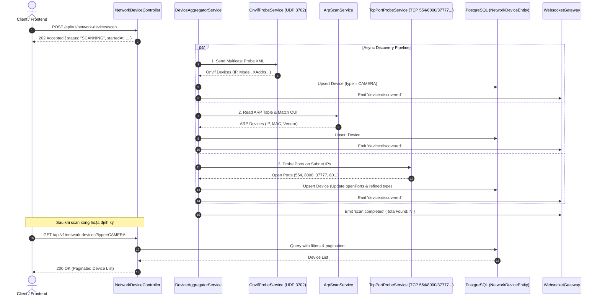

# Concept: Module Network Device Discovery (Phát hiện & Nhận diện Thiết bị Mạng LAN/Wi-Fi)

## 1. Problem & Goal (Vấn đề & Mục tiêu)

### Problem (Vấn đề & Điểm nghẽn Hiện tại)
- **Bối cảnh & Điểm kích hoạt**: Hệ thống NestJS backend cần quản lý, giám sát và kết nối tự động với các thiết bị trong mạng nội bộ (đặc biệt là IP Camera an ninh như Hikvision, Dahua, Ezviz, TP-Link/Tapo, Reolink...).
- **Hiện tượng & Khiếm khuyết kỹ thuật**: Hiện tại chưa có module nào hỗ trợ quét mạng nội bộ (LAN/Wi-Fi discovery). Việc thêm camera hoặc thiết bị ngoại vi đang phải thực hiện cấu hình thủ công từng IP, Port, RTSP stream URL dẫn đến trải nghiệm phức tạp, dễ sai sót khi IP bị thay đổi động qua DHCP.
- **Nguyên nhân cốt lõi (Root Cause)**: Thiếu các cơ chế Network Probing đa tầng (UDP Multicast ONVIF WS-Discovery, ARP table inspection, MAC OUI vendor matching, TCP port scanning) trong backend.
- **Tác động (Impact / Blast Radius)**: Người dùng phải tự tìm IP của thiết bị qua router hoặc tool bên thứ ba; backend không có cái nhìn tổng quan về topology và các thiết bị đang hoạt động trên subnet.

### Goal (Mục tiêu Kỹ thuật Cần đạt)
- **Mục tiêu cốt lõi**: Xây dựng module `network-device` (hoặc `network-scanner`) cung cấp khả năng tự động quét mạng LAN, phát hiện thiết bị, phân loại `DeviceType` (Camera, Router/AP, PC/Mobile, Smart IoT, Unknown), lưu bền vững vào Database và cung cấp REST API kèm WebSocket Realtime Stream.
- **Tiêu chí nghiệm thu (Acceptance Criteria)**:
  - **Endpoint REST**: `GET /api/v1/network-devices` hỗ trợ tìm kiếm, phân trang và lọc theo `type` (e.g. `type=CAMERA`).
  - **Endpoint Kích hoạt quét**: `POST /api/v1/network-devices/scan` kích hoạt tiến trình quét bất đồng bộ (Asynchronous Scan).
  - **Phương pháp 1 (ONVIF Probe)**: Phát gói tin SOAP XML WS-Discovery qua UDP Multicast (`239.255.255.250:3702`), parse kết quả lấy IP, XAddrs, Model, Manufacturer, Firmware.
  - **Phương pháp 2 (ARP Scan & OUI Lookup)**: Lấy bảng ARP nội bộ, chuẩn hoá MAC và tra cứu OUI Offline Database để xác định Vendor.
  - **Phương pháp 3 (TCP Port Probe)**: Quét các cổng đặc trưng (`554` RTSP, `8000` Hikvision, `37777` Dahua, `80`/`443` Web) với timeout ngắn (~300-500ms) có concurrency limiter (tránh nghẽn socket/I/O).
  - **Hợp nhất dữ liệu & Database Persistence**: Tự động gộp dữ liệu theo `ipAddress` và `macAddress`, upsert vào bảng `network_devices`.
  - **Realtime Stream**: Phát sự kiện qua WebSocket Gateway (`device:discovered`, `scan:started`, `scan:completed`) để UI nhận thiết bị ngay khi được phát hiện.

---

## 2. Scope Boundaries (Ranh giới Phạm vi)

### In-Scope
- **Module mới**: Tạo module `NetworkDeviceModule` tại `src/modules/network-device/` theo kiến trúc chuẩn NestJS.
- **Entity TypeORM**: Bảng `network_devices` (IP, MAC, DeviceType, Vendor, Model, FirmwareVersion, OpenPorts, OnvifMetadata, IsOnline, LastSeenAt).
- **Probing Services**:
  - `OnvifProbeService`: Quản lý UDP socket (`dgram`), multicast WS-Discovery XML, SOAP response XML parser.
  - `ArpScanService`: Quét danh sách IP/MAC từ hệ thống local (macOS/Linux compatible).
  - `OuiLookupService`: In-memory OUI registry / prefix map tra cứu nhanh 3 bytes đầu của MAC.
  - `TcpPortProbeService`: Kiểm tra trạng thái mở cổng với Socket timeout và batch concurrency.
  - `DeviceAggregatorService`: Tổng hợp kết quả từ 3 probes, suy luận `DeviceType` và xử lý upsert DB.
- **REST API & Controller**:
  - `POST /api/v1/network-devices/scan`: Trigger tiến trình quét nền.
  - `GET /api/v1/network-devices`: Danh sách thiết bị (Query: `search`, `type`, `page`, `limit`).
  - `GET /api/v1/network-devices/:id`: Chi tiết 1 thiết bị.
- **Realtime Integration**: Kết nối với `WebsocketGateway` sẵn có để emit event `device:discovered`.

### Explicit Out-of-Scope
- Chưa triển khai trực tiếp kết nối lấy RTSP video stream hoặc PTZ control (sẽ làm ở module chuyên dụng Streaming/Camera Management sau).
- Chưa hỗ trợ quét qua các subnet khác nhau ngoài dải IP của card mạng hiện tại (Multi-VLAN Routing Discovery).
- Chưa tích hợp cơ chế giải mã credential ONVIF (User/Password Authentication) - chỉ lấy thông tin công khai qua Probe ban đầu.

---

## 3. Proposed Solution & Core Mechanism (Giải pháp Đề xuất & Cơ chế)

### Kiến trúc Luồng Dữ liệu (Data & Logic Flow)



### Cơ chế Phân loại Thiết bị (`DeviceType` Classification Engine)

| Điều kiện nhận diện (Rules) | Phân loại (`DeviceType`) | Độ tin cậy (Confidence) |
| :--- | :--- | :--- |
| Trả lời gói tin ONVIF Probe XML | `CAMERA` | 100% (High) |
| Cổng `554` (RTSP) hoặc `8000` (Hikvision) hoặc `37777` (Dahua) mở | `CAMERA` | 95% (High) |
| MAC OUI khớp với Vendor Camera (Hikvision, Dahua, Ezviz, Reolink, IMOU) | `CAMERA` | 90% (High) |
| IP trùng với Default Gateway hoặc OUI khớp Vendor Router (Cisco, TP-Link Router, MikroTik, Ubiquiti) | `ROUTER_AP` | 85% (Medium) |
| Cổng `9100`, `515`, `631` mở hoặc OUI HP/Canon/Epson | `PRINTER` | 90% (High) |
| OUI khớp Apple, Samsung, Intel, Dell, Xiaomi... | `COMPUTER_PHONE` / `SMART_IOT` | 75% (Medium) |
| Không khớp bất kỳ luật nào ở trên | `UNKNOWN` | Fallback |

### Thiết kế Cơ sở Dữ liệu (`network_devices` Table Schema)

```typescript
@Entity('network_devices')
export class NetworkDeviceEntity extends BaseEntity {
  @Column({ type: 'varchar', length: 45, unique: true })
  ipAddress: string;

  @Column({ type: 'varchar', length: 17, nullable: true })
  macAddress?: string;

  @Column({
    type: 'enum',
    enum: DeviceType,
    default: DeviceType.UNKNOWN,
  })
  deviceType: DeviceType;

  @Column({ type: 'varchar', length: 100, nullable: true })
  vendor?: string;

  @Column({ type: 'varchar', length: 150, nullable: true })
  model?: string;

  @Column({ type: 'varchar', length: 100, nullable: true })
  firmwareVersion?: string;

  @Column({ type: 'jsonb', default: [] })
  openPorts: number[];

  @Column({ type: 'jsonb', nullable: true })
  onvifMetadata?: {
    xAddrs?: string[];
    types?: string;
    scopes?: string[];
    rawXml?: string;
  };

  @Column({ type: 'boolean', default: true })
  isOnline: boolean;

  @Column({ type: 'timestamp with time zone', default: () => 'CURRENT_TIMESTAMP' })
  lastSeenAt: Date;
}
```

---

## 4. Critical Risks & Edge Cases (Rủi ro & Kịch bản Biên)

1. **UDP Multicast Packet Loss & Firewall Blocking**:
   - *Rủi ro*: Một số router hoặc OS firewall chặn broadcast/multicast UDP 3702, khiến camera không phản hồi ONVIF Probe.
   - *Giải pháp*: Fallback qua TCP Port Probe (cổng 554/8000/37777) và ARP Scan OUI để đảm bảo vẫn nhận diện được camera ngay cả khi multicast bị tắt.
2. **Nghẽn Network I/O và Socket Leak khi quét dải IP Subnet lớn**:
   - *Rủi ro*: Quét đồng thời hàng trăm IP qua TCP port có thể gây cạn kiệt File Descriptors (Sockets) hoặc lag network.
   - *Giải pháp*: Sử dụng batching concurrency control (tối đa 25-50 sockets song song) kèm socket timeout nghiêm ngặt (300-500ms).
3. **Môi trường Container hóa (Docker Network)**:
   - *Rủi ro*: Khi chạy backend trong Docker container với network bridge mặc định, backend sẽ không thể nhận các gói UDP Multicast từ mạng LAN vật lý của Host.
   - *Giải pháp*: Cung cấp hướng dẫn cấu hình `network_mode: host` trong `docker-compose.yml` khi triển khai production/staging.
4. **Trùng lặp hoặc thay đổi IP do DHCP**:
   - *Rủi ro*: Thiết bị thay đổi IP khi hết hạn DHCP lease.
   - *Giải pháp*: Upsert kết hợp: nếu có `macAddress` thì đối chiếu theo MAC để cập nhật IP mới; nếu không có MAC thì dùng `ipAddress` làm primary lookup.
